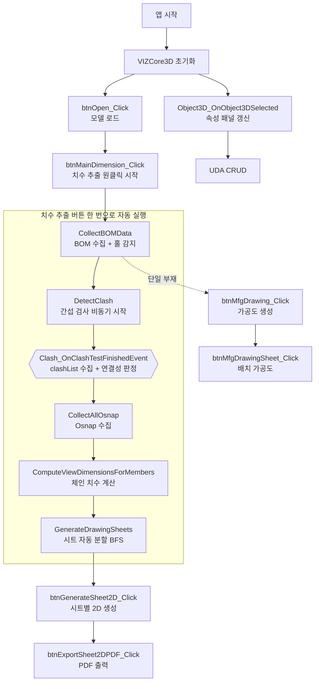

# End-to-End 파이프라인

A2Z-HYI 앱의 전형적인 사용 흐름입니다. 개별 단계의 상세는 링크된 기능 문서를 참고하세요.

---

## 전체 흐름

`btnMainDimension_Click`(치수 추출) 하나가 **BOM 수집 → 간섭 검사 → 연결성 판정 → Osnap 수집 → 체인 치수 → 시트 분할**까지 자동으로 이어갑니다.
간섭 검사가 Osnap·치수보다 **먼저** 수행되는 이유는, 연결성 판정(모든 visible 부재가 한 덩어리인지)을 Clash 결과로 하기 때문입니다 — 판정을 통과한 뒤에야 치수를 만듭니다.

> 단일 부재(검사 쌍 0개)이거나 SDK 예외로 Clash 이벤트가 발동하지 않으면, `btnMainDimension_Click`이 직접
> `CompleteMainDimensionPostClash(isSingleMember: true)`를 호출해 Osnap 이후 단계를 이어갑니다.

---

## 단계별 설명

| # | 단계 | 트리거 | 결과 상태 | 문서 |
|---|---|---|---|---|
| 1 | VIZCore3D 초기화 | 앱 시작 → 이벤트 | SDK 이벤트 핸들러 구독 완료 | [vizcore3d-initialized](./기능/BOM/VIZCore3D%20초기화.md) |
| 2 | 모델 로드 | btnOpen | `vizcore3d.Model.IsOpened = true` | [open-model](./기능/BOM/모델%20열기.md) |
| 3 | BOM 수집 | btnMainDimension → `CollectBOMData` | `bomList` 채워짐, 홀/슬롯 감지 | [collect-bom](./기능/BOM/BOM%20수집.md) |
| 4 | 간섭 검사 | btnMainDimension → `DetectClash` | 비동기 검사 시작 | [detect-clash](./기능/간섭검사/간섭검사%20실행.md) |
| 5 | 간섭 완료 콜백 + 연결성 판정 | Event | `clashList` 정렬·완성, 연결 성분 1개 확인 후 통과 | [clash-finished-event](./기능/간섭검사/간섭검사%20완료%20이벤트.md) |
| 6 | Osnap 수집 | `CompleteMainDimensionPostClash` | `osnapPointsWithNames` 채워짐 | [collect-osnap](./기능/2D도면/Osnap%20수집.md) |
| 7 | 체인 치수 | `CompleteMainDimensionPostClash` | `chainDimensionList` 생성 (3D 뷰에는 미표시) | [main-dimension](./기능/BOM/메인%20치수%20추출.md) |
| 8 | 시트 분할 | `GenerateDrawingSheets` | BFS로 `drawingSheets` 자동 생성 | [generate-sheets](./기능/도면시트/시트%20자동%20생성.md) |
| 9 | 시트별 2D | btnGenerateSheet2D | 2D 도면 렌더 | [generate-sheet-2d](./기능/도면시트/시트%202D%20렌더.md) |
| 10 | PDF 출력 | btnExportSheet2DPDF / btnExtractDrawingList | 벡터 PDF 파일 | [export-sheet-2d-pdf](./기능/도면시트/시트%20PDF%20출력.md) |

3~8단계는 `btnMainDimension_Click` 한 번으로 자동 실행됩니다. 같은 단계를 개별로 실행하는 버튼(`btnCollectBOM_Click`·`btnClashDetection_Click`·`btnCollectOsnap_Click`)도 그대로 남아 있어, 특정 단계만 다시 돌릴 때 사용합니다.

---

## 병렬/독립 흐름

- **속성 조회 / UDA 편집**: 모델 로드 이후 언제든 가능. [기능/부재속성/](./기능/부재속성/_인덱스.md)
- **가공도 생성**: BOM 수집 이후 단일 부재 선택으로 독립 실행. [기능/가공도/](./기능/가공도/_인덱스.md)
- **뷰 전환 (ISO/X/Y/Z)**: 모델 로드 이후 언제든 가능. [기능/글로벌뷰/](./기능/글로벌뷰/_인덱스.md)

---

## 공유 상태 (Form1 멤버)

| 필드 | 생성 단계 | 소비 단계 |
|---|---|---|
| `bomList` | BOM 수집 | 모든 도면 생성 기능 |
| `osnapPointsWithNames` | Osnap 수집 | 치수·풍선·보조선 |
| `chainDimensionList` | 체인 치수 | 2D/가공도 |
| `clashList` | 간섭 검사 | 시트 분할 BFS |
| `drawingSheets` | 시트 분할 | 시트별 2D·PDF |
| `balloonOverrides` | 2D 생성 중 | PDF 출력 |
| `xraySelectedNodeIndices` | 뷰 조작 | 글로벌 뷰 |
| `bodyToPartNameMap` | BOM 수집 | 성능 최적화 전반 |

---

## 변경 이력

| 날짜 | 변경 내용 |
|---|---|
| 2026-07-24 | 치수 추출 원클릭 파이프라인 순서를 코드 기준으로 정정. 기존 문서는 `BOM → Osnap → 치수 → 간섭 검사 → 시트 분할`로 적혀 있었으나 실제는 `BOM → 간섭 검사 → 연결성 판정 → Osnap → 치수 → 시트 분할`. 흐름도를 개별 버튼 나열에서 `btnMainDimension_Click` 내부 자동 실행 서브그래프로 재구성하고, 단계별 설명 표의 순서·트리거(내부 호출 메서드명)도 함께 정정. 단일 부재 경로 주석과 개별 실행 버튼 안내 추가 |
