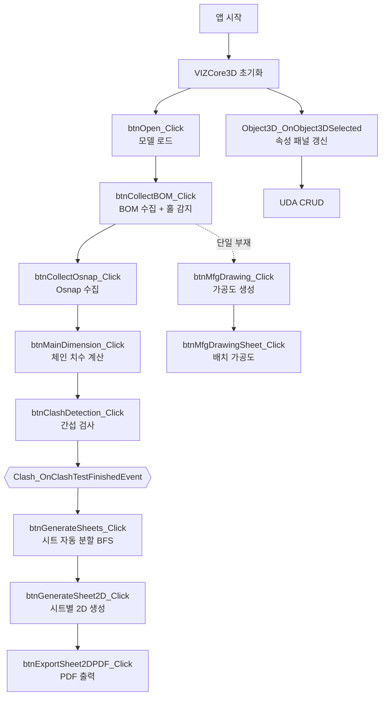

# End-to-End 파이프라인

A2Z-HYI 앱의 전형적인 사용 흐름입니다. 개별 단계의 상세는 링크된 기능 문서를 참고하세요.

---

## 전체 흐름

---

## 단계별 설명

| # | 단계 | 트리거 | 결과 상태 | 문서 |
|---|---|---|---|---|
| 1 | VIZCore3D 초기화 | 앱 시작 → 이벤트 | SDK 이벤트 핸들러 구독 완료 | [vizcore3d-initialized](./기능/BOM/VIZCore3D 초기화.md) |
| 2 | 모델 로드 | btnOpen | `vizcore3d.Model.IsOpened = true` | [open-model](./기능/BOM/모델 열기.md) |
| 3 | BOM 수집 | btnCollectBOM | `bomList` 채워짐, 홀/슬롯 감지 | [collect-bom](./기능/BOM/BOM 수집.md) |
| 4 | Osnap 수집 | btnCollectOsnap | `osnapPointsWithNames` 채워짐 | [collect-osnap](./기능/2D도면/Osnap 수집.md) |
| 5 | 체인 치수 | btnMainDimension | `chainDimensionList` 생성 | [main-dimension](./기능/BOM/메인 치수 추출.md) |
| 6 | 간섭 검사 | btnClashDetection | 비동기 검사 시작 | [detect-clash](./기능/간섭검사/간섭검사 실행.md) |
| 7 | 간섭 완료 콜백 | Event | `clashList` 정렬·완성 | [clash-finished-event](./기능/간섭검사/간섭검사 완료 이벤트.md) |
| 8 | 시트 분할 | btnGenerateSheets | BFS로 `drawingSheets` 생성 | [generate-sheets](./기능/도면시트/시트 자동 생성.md) |
| 9 | 시트별 2D | btnGenerateSheet2D | 2D 도면 렌더 | [generate-sheet-2d](./기능/도면시트/시트 2D 렌더.md) |
| 10 | PDF 출력 | btnExportSheet2DPDF / btnExportAllPDF | 벡터 PDF 파일 | [export-sheet-2d-pdf](./기능/도면시트/시트 PDF 출력.md) |

---

## 병렬/독립 흐름

- **속성 조회 / UDA 편집**: 모델 로드 이후 언제든 가능. [기능/부재속성/](./기능/부재속성/_인덱스.md)
- **가공도 생성**: BOM 수집 이후 단일 부재 선택으로 독립 실행. [기능/가공도/](./기능/가공도/_인덱스.md)
- **뷰 전환 (ISO/X/Y/Z)**: 모델 로드 이후 언제든 가능. [기능/글로벌뷰/](./기능/글로벌뷰/_인덱스.md)

---

## 공유 상태 (Form1 멤버)

| 필드 | 생성 단계 | 소비 단계 |
|---|---|---|
| `bomList` | BOM 수집 | 모든 도면 생성 기능 |
| `osnapPointsWithNames` | Osnap 수집 | 치수·풍선·보조선 |
| `chainDimensionList` | 체인 치수 | 2D/가공도 |
| `clashList` | 간섭 검사 | 시트 분할 BFS |
| `drawingSheets` | 시트 분할 | 시트별 2D·PDF |
| `balloonOverrides` | 2D 생성 중 | PDF 출력 |
| `xraySelectedNodeIndices` | 뷰 조작 | 글로벌 뷰 |
| `bodyToPartNameMap` | BOM 수집 | 성능 최적화 전반 |
