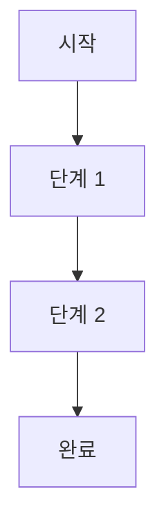

# 기능 이름

## 1. 개요
1~2문장으로 이 기능이 무엇을 하는지 요약.

## 2. 트리거
| 항목 | 값 |
|---|---|
| 유형 | User Action / Event Callback / Chained |
| 입력 | 예: `btnXxx` 버튼 클릭 / 이벤트 수신 / 다른 기능이 호출 |
| 위치 | 메인 폼 > {탭/패널 이름} |

## 3. 사전 조건
- [ ] 조건 1
- [ ] 조건 2

> 사전 조건 미충족 시 [§6 예외-EXX] 참조

## 4. 전체 동작 흐름 (Happy Path)

단계 5개 이상 또는 분기 2개 이상일 때만 Mermaid 사용 (규칙 R3).

| # | 단계 | 주체 | 설명 |
|---|---|---|---|
| 1 | ... | UI / Form1 / VIZCore3D / SDK 이벤트 | ... |
| 2 | ... | ... | ... |

> 구현 상세는 [코드 레퍼런스]({code_reference}) 참고

## 5. 주요 분기 처리

### [분기 A] 조건 이름
| 조건 | 처리 |
|---|---|
| 조건 A-1 | ... |
| 조건 A-2 | ... |

### [분기 B] 조건 이름
| 조건 | 처리 |
|---|---|
| ... | ... |

## 6. 예외 / 에러 처리

| ID | 조건 | 동작 | 사용자 피드백 | 결과 상태 |
|---|---|---|---|---|
| E01 | ... | 처리 중단 | MessageBox "..." | 상태 변화 없음 |
| E02 | ... | ... | ... | ... |

## 7. 상태 변화 (Before / After)

공유 필드(클래스 멤버)만 기록. 로컬 변수는 제외 (규칙 R4).

| 대상 | Before | After |
|---|---|---|
| `필드명` | 이전 값 | 이후 값 |

## 8. 후행 기능 (Chained)
이 기능 완료 후 호출 가능한 기능:
- [기능 이름](../{category}/{feature}.md)

## 9. 관련 링크
- 코드 구현: [{owner_module}]({code_reference})
- 용어집: [용어1](../../_glossary.md#용어1), [용어2](../../_glossary.md#용어2)
- 상위 파이프라인: [전체 파이프라인](../../_pipeline.md)

## 10. 변경 이력
| 날짜 | 변경 내용 | 작성자 |
|---|---|---|
| YYYY-MM-DD | 초안 작성 | — |
