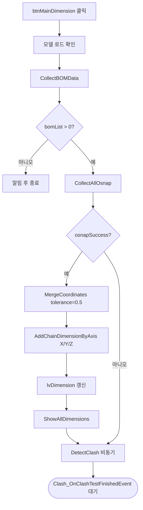

# 메인 체인 치수 추출 (자동 파이프라인)

## 1. 개요
**원클릭 통합 처리 버튼**: BOM 수집 → Osnap 수집 → X/Y/Z 체인 치수 계산 → 치수 표시 → Clash 검사를 순차로 실행한다. Clash 결과는 비동기이며 `Clash_OnClashTestFinishedEvent`에서 최종 요약 알림이 표시된다.

## 2. 트리거
| 항목 | 값 |
|---|---|
| 유형 | User Action |
| 입력 | `btnMainDimension` 버튼 클릭 |
| 위치 | 메인 폼 > 자동 처리 |

## 3. 사전 조건
- [ ] 3D 모델 로드됨 ([BOM-002](./open-model.md))

## 4. 전체 동작 흐름 (Happy Path)

| # | 단계 | 주체 | 설명 |
|---|---|---|---|
| 1 | 모델 확인 | Form1 | `vizcore3d.Model.IsOpen()` → [E01] |
| 2 | BOM 재수집 | Form1 | `CollectBOMData()` — 가시성 반영 위해 매번 재수집 |
| 3 | BOM 확인 | Form1 | `bomList.Count == 0` → [E02] |
| 4 | Osnap 수집 | Form1 | `CollectAllOsnap()` → bool |
| 5 | 좌표 병합 | Form1 | `MergeCoordinates(osnap, 0.5f)` — 0.5mm 허용오차 |
| 6 | 축별 체인 치수 | Form1 | X, Y, Z 각각 `AddChainDimensionByAxis()` |
| 7 | ListView 갱신 | UI | No/Axis/ViewName/Distance/Start/End 표시 |
| 8 | 치수 3D 표시 | SDK | `ShowAllDimensions()` → 축별 오프셋 적용 |
| 9 | Clash 검사 시작 | Form1 | `DetectClash()` (비동기) |
| 10 | 플래그 저장 | Form1 | `_autoProcessOsnapSuccess = osnapSuccess` |

> 최종 결과 요약 알림은 [Clash 완료 콜백](../clash/clash-finished-event.md)에서 표시됨

> 구현 상세는 [코드 레퍼런스](/docs/code-reference/form1-bom.md#btnMainDimension_Click) 참고

## 5. 주요 분기 처리

### [분기 A] Osnap 수집 성공 여부
| 조건 | 처리 |
|---|---|
| osnapSuccess && osnapPointsWithNames.Count > 0 | 치수 추출 진행 (Step 5~8) |
| 실패 | 치수 추출 건너뛰기, Clash만 실행 |

### [분기 B] 축별 가시성 (xraySelectedNodeIndices)
| 조건 | 처리 |
|---|---|
| xraySelectedNodeIndices.Count > 0 | 선택 부재만 대상 |
| 비어있음 | `FromIndex().Visible`로 필터, 없으면 전체 |

## 6. 예외 / 에러 처리

| ID | 조건 | 동작 | 사용자 피드백 | 결과 상태 |
|---|---|---|---|---|
| E01 | 모델 미로드 | return | MessageBox "먼저 파일을 열어주세요." | 상태 변화 없음 |
| E02 | `bomList.Count == 0` | return | MessageBox "BOM 데이터를 수집할 수 없습니다." | BOM 재수집만 시도됨 |
| E03 | 처리 중 예외 | catch | MessageBox "치수 추출 중 오류: {msg}" | 부분 반영 가능 |

## 7. 상태 변화 (Before / After)

| 대상 | Before | After |
|---|---|---|
| `bomList` | 이전 상태 | 재수집 완료 |
| `osnapPoints`, `osnapPointsWithNames` | 이전 | 현재 모델 Osnap (LINE/POINT만, CIRCLE 제외) |
| `chainDimensionList` | 이전 | X/Y/Z 축별 체인 치수, No 부여 |
| `_autoProcessOsnapSuccess` | 이전 | 현재 수집 성공 여부 |
| `clashList` | 이전 | (비동기 완료 후 갱신) |
| `lvDimension` | 이전 | 갱신된 치수 행 |
| SDK Measure 표시 | 이전 | 모든 치수 표시 중 |

## 8. 후행 기능 (Chained)
- [Clash 완료 콜백](../clash/clash-finished-event.md) — 자동 호출
- 이후 [시트 자동 분할](../drawing-sheets/generate-sheets.md) — Clash 결과 있으면 자동
- [축별 치수 필터](../dimensions/show-axis-x.md)

## 9. 관련 링크
- 코드 구현: [Form1.BOM.cs:L283](/docs/code-reference/form1-bom.md#btnMainDimension_Click)
- 용어집: [Osnap](../../_glossary.md#osnap-object-snap), [Chain Dimension](../../_glossary.md#chain-dimension-체인-치수)
- 상위 파이프라인: [전체 파이프라인](../../_pipeline.md)

## 10. 변경 이력
| 날짜 | 변경 내용 | 작성자 |
|---|---|---|
| 2026-04-13 | 초안 작성 | — |
