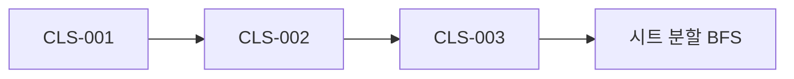

# Clash 기능

`Form1.Clash.cs` 소속. 3D 간섭 검사를 수행하고 결과를 PART 단위로 그룹화합니다.

## 기능 목록
| ID | 기능 | 트리거 | 유형 | 문서 |
|---|---|---|---|---|
| CLS-001 | BOM 정보 수집 (Clash용) | btnCollectBOMInfo_Click | User Action | [collect-bom-info](./collect-bom-info.md) |
| CLS-002 | 간섭 검사 실행 | btnClashDetection_Click | User Action | [detect-clash](./detect-clash.md) |
| CLS-003 | 간섭 검사 완료 콜백 | Clash_OnClashTestFinishedEvent | Event Callback | [clash-finished-event](./clash-finished-event.md) |

## 데이터 의존성

## 주요 생성 상태
- `clashList : List<ClashData>` (Z값 내림차순 정렬)
- `vizcore3d.Clash.Items`
