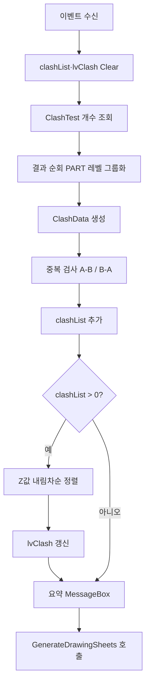

# 간섭 검사 완료 콜백

## 1. 개요
VIZCore3D가 모든 ClashTest 실행을 완료했을 때 호출된다. 결과를 수집·중복 제거·Z값 정렬하고, `clashList`를 완성한다. 결과가 있으면 **도면 시트 자동 분할(BFS)** 을 트리거한다.

## 2. 트리거
| 항목 | 값 |
|---|---|
| 유형 | Event Callback |
| 입력 | `vizcore3d.Clash.OnClashTestFinishedEvent` |
| 위치 | 앱 초기화 시 구독 ([BOM-001](../bom/vizcore3d-initialized.md)) |

## 3. 사전 조건
- [ ] `btnClashDetection_Click` 또는 `btnMainDimension_Click`에서 `DetectClash()` 실행됨
- [ ] `vizcore3d.Clash.ClashTestCount > 0`

## 4. 전체 동작 흐름 (Happy Path)

| # | 단계 | 주체 | 설명 |
|---|---|---|---|
| 1 | 결과 컨테이너 리셋 | Form1 | `clashList.Clear()`, `lvClash.Items.Clear()` |
| 2 | 테스트 순회 | Form1 | `for i in 0..ClashTestCount` |
| 3 | 결과 조회 | SDK | `GetResultItem(test, ResultGroupingOptions.PART)` |
| 4 | ClashData 생성 | Form1 | Index1/2, Name1/2, HotPoint.Z |
| 5 | 중복 검사 | Form1 | 양방향 (A-B, B-A) 체크 |
| 6 | 리스트 추가 | Form1 | 중복 아니면 `clashList.Add` |
| 7 | 정렬 | Form1 | `clashList.Sort((a,b) => b.ZValue.CompareTo(a.ZValue))` |
| 8 | ListView 표시 | UI | Name1 / Name2 / Z(F2) |
| 9 | 요약 알림 | UI | BOM/Osnap/치수/Clash 개수 통합 메시지 |
| 10 | 시트 자동 생성 | Form1 | `clashList.Count > 0`이면 `GenerateDrawingSheets()` |

> 구현 상세는 [코드 레퍼런스](/docs/code-reference/form1-clash.md#Clash_OnClashTestFinishedEvent) 참고

## 5. 주요 분기 처리

### [분기 A] 결과 존재 여부
| 조건 | 처리 |
|---|---|
| `clashList.Count > 0` | 정렬·표시·시트 자동 생성 |
| 비어있음 | "간섭 없음" 메시지만 표시, 시트 생성 건너뜀 |

### [분기 B] HotPoint 유효성
| 조건 | 처리 |
|---|---|
| `result.HotPoint != null` | ZValue 저장 |
| null | ZValue 기본값 0 |

### [분기 C] Osnap 수집 결과 반영
| 조건 | 처리 |
|---|---|
| `_autoProcessOsnapSuccess == false` | 요약 메시지에 "* Osnap 수집 실패" 추가 |
| true | 기본 요약만 |

## 6. 예외 / 에러 처리

| ID | 조건 | 동작 | 사용자 피드백 | 결과 상태 |
|---|---|---|---|---|
| E01 | `vizcore3d.Clash.Items[i] == null` | continue | 해당 테스트 건너뜀 | 일부 결과 유실 가능 |
| E02 | 처리 중 예외 | catch | MessageBox "간섭검사 결과 처리 중 오류: {msg}\nStack Trace: ..." | `clashList` 부분 채워짐 |

## 7. 상태 변화 (Before / After)

| 대상 | Before | After |
|---|---|---|
| `clashList` | 비어있음 | ClashData 리스트, Z값 내림차순 정렬 |
| `lvClash` | 비어있음 | 표시 |
| `drawingSheetList` | 이전 | (후행) `GenerateDrawingSheets()`에서 채워짐 |
| 요약 MessageBox | — | 표시됨 |

## 8. 후행 기능 (Chained)
- [시트 자동 분할](../drawing-sheets/generate-sheets.md) (내부 `GenerateDrawingSheets()` 호출)
- [LvClash 더블클릭](../drawing2d/lvclash-doubleclick.md) — 사용자가 결과 클릭 시
- [Clash 선택 시 치수 필터](../dimensions/lvclash-selected.md)

## 9. 관련 링크
- 코드 구현: [Form1.Clash.cs:L397](/docs/code-reference/form1-clash.md#Clash_OnClashTestFinishedEvent)
- 용어집: [Clash](../../_glossary.md#clash-간섭), [BFS 기반 시트 분할](../../_glossary.md#bfs-기반-시트-분할)

## 10. 변경 이력
| 날짜 | 변경 내용 | 작성자 |
|---|---|---|
| 2026-04-13 | 초안 작성 | — |
