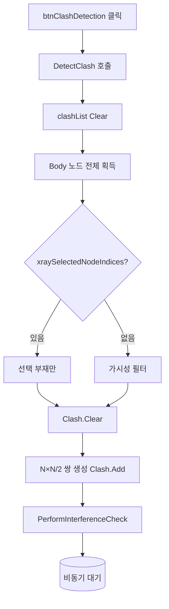

# 간섭 검사 실행

## 1. 개요
가시 Body 노드 쌍(N×N/2)을 생성하여 VIZCore3D ClashManager에 등록하고 **비동기 간섭 검사**를 시작한다. 결과는 `Clash_OnClashTestFinishedEvent`에서 수신한다.

## 2. 트리거
| 항목 | 값 |
|---|---|
| 유형 | User Action |
| 입력 | `btnClashDetection` 버튼 클릭 |
| 위치 | 메인 폼 > Clash 탭 |

## 3. 사전 조건
- [ ] 3D 모델 로드됨
- [ ] 가시 Body 노드 2개 이상

## 4. 전체 동작 흐름 (Happy Path)

| # | 단계 | 주체 | 설명 |
|---|---|---|---|
| 1 | 내부 위임 | Form1 | `DetectClash()` 호출 |
| 2 | 결과 리스트 초기화 | Form1 | `clashList.Clear()`, `lvClash.Items.Clear()` |
| 3 | Body 노드 획득 | SDK | `GetPartialNode(false, false, true)` |
| 4 | 대상 필터링 | Form1 | [분기 A] |
| 5 | ClashManager 초기화 | SDK | `vizcore3d.Clash.Clear()` |
| 6 | 쌍별 ClashTest 등록 | Form1 | i<j 모든 쌍에 ClashTest 생성 및 Add |
| 7 | 검사 파라미터 | Form1 | ClearanceValue=1.0, RangeValue=1.0, PenetrationTolerance=1.0 (단위 mm) |
| 8 | 비동기 시작 | SDK | `PerformInterferenceCheck()` → bool |
| 9 | 사용자 알림 | UI | MessageBox "간섭검사를 시작합니다..." |

> 완료 후 동작은 [Clash 완료 콜백](./clash-finished-event.md) 참고

> 구현 상세는 [코드 레퍼런스](/docs/code-reference/form1-clash.md#DetectClash) 참고

## 5. 주요 분기 처리

### [분기 A] 대상 부재 결정
| 조건 | 처리 |
|---|---|
| `xraySelectedNodeIndices.Count > 0` | 선택 부재만 대상 |
| 비어있음 | 가시 Body만 필터 (`FromIndex().Visible`) |
| 필터 결과 0개 | 전체 Body로 Fallback |

### [분기 B] PerformInterferenceCheck 결과
| 조건 | 처리 |
|---|---|
| true | 비동기 시작, 완료 이벤트 대기 |
| false | 즉시 실패 반환, E02 |

## 6. 예외 / 에러 처리

| ID | 조건 | 동작 | 사용자 피드백 | 결과 상태 |
|---|---|---|---|---|
| E01 | Body 노드 없음 | return false | MessageBox "로드된 모델이 없거나 간섭검사 시작에 실패..." | 상태 변화 없음 |
| E02 | 생성된 쌍 0개 | return false | 위와 동일 | ClashManager만 Clear됨 |
| E03 | `PerformInterferenceCheck()` 실패 | return false | 위와 동일 | ClashTest 등록 상태 유지 |
| E04 | 예외 throw | catch + Debug.WriteLine | (사용자에겐 E01~E03 메시지로 통합 표시) | 부분 등록 가능성 |

## 7. 상태 변화 (Before / After)

| 대상 | Before | After |
|---|---|---|
| `clashList` | 이전 결과 | 빈 리스트 (완료 콜백에서 채움) |
| `lvClash` | 이전 행 | 빈 상태 |
| `vizcore3d.Clash` | 이전 등록 | Clear 후 새 쌍 전체 등록 |
| `vizcore3d.Clash.ClashTestCount` | 이전 값 | N×(N-1)/2 (N=대상 노드 수) |

## 8. 후행 기능 (Chained)
- [Clash 완료 콜백](./clash-finished-event.md) — SDK가 비동기로 호출
- [시트 자동 분할](../drawing-sheets/generate-sheets.md) — 콜백에서 자동 트리거

## 9. 관련 링크
- 코드 구현: [Form1.Clash.cs:L381](/docs/code-reference/form1-clash.md#btnClashDetection_Click), [Form1.Clash.cs:L307 DetectClash](/docs/code-reference/form1-clash.md#DetectClash)
- 용어집: [Clash](../../_glossary.md#clash-간섭), [X-Ray 모드](../../_glossary.md#x-ray-모드)

## 10. 변경 이력
| 날짜 | 변경 내용 | 작성자 |
|---|---|---|
| 2026-04-13 | 초안 작성 | — |
