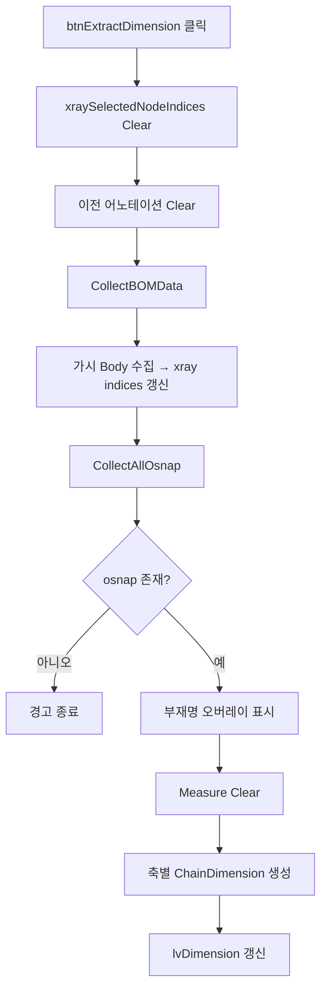

# 현재 뷰 기반 체인 치수 추출

## 1. 개요
현재 3D 뷰에 **보이는 부재만 기준**으로 BOM/Osnap/치수를 재수집한다. `xraySelectedNodeIndices`를 가시 Body로 갱신하고, 시트 선택 시 BaseMemberName을 부재명 오버레이로 표시한다.

## 2. 트리거
| 항목 | 값 |
|---|---|
| 유형 | User Action |
| 입력 | `btnExtractDimension` 클릭 |
| 위치 | 메인 폼 > 치수 탭 |

## 3. 사전 조건
- [ ] 3D 모델 로드됨
- [ ] 대상 부재가 뷰에 표시됨

## 4. 전체 동작 흐름 (Happy Path)

| # | 단계 | 주체 | 설명 |
|---|---|---|---|
| 1 | xray 초기화 | Form1 | `xraySelectedNodeIndices.Clear()` |
| 2 | 어노테이션 Clear | SDK | Note/Measure/ShapeDrawing |
| 3 | BOM 재수집 | Form1 | `CollectBOMData()` |
| 4 | 가시 Body 수집 | SDK | `GetPartialNode(false, false, true)` |
| 5 | xray indices 갱신 | Form1 | `FromIndex().Visible`인 노드만 추가 + Part 인덱스 포함 |
| 6 | Osnap 재수집 | Form1 | `CollectAllOsnap()` |
| 7 | Osnap 검증 | Form1 | 0개 → [E01] |
| 8 | 부재명 오버레이 | UI | 선택 시트의 BaseMemberName 또는 "" |
| 9 | 치수 빌드 | Form1 | X/Y/Z 축별 체인치수 추가 |

> 구현 상세는 [코드 레퍼런스](/docs/code-reference/form1-dimensions.md#btnExtractDimension_Click) 참고

## 5. 주요 분기 처리

### [분기 A] 시트 선택 상태
| 조건 | 처리 |
|---|---|
| 시트 선택 있음 | BaseMemberName으로 오버레이 표시 |
| 시트 선택 없음 | 빈 오버레이 |

## 6. 예외 / 에러 처리

| ID | 조건 | 동작 | 사용자 피드백 | 결과 상태 |
|---|---|---|---|---|
| E01 | Osnap 0개 | return | MessageBox "먼저 Osnap 좌표를 수집해주세요." | xray, BOM은 이미 갱신됨 |
| E02 | 처리 중 예외 | catch | 내부 로그 | 부분 반영 가능 |

## 7. 상태 변화 (Before / After)

| 대상 | Before | After |
|---|---|---|
| `xraySelectedNodeIndices` | 이전 | 현재 가시 Body + Part Index |
| `bomList` | 이전 | 재수집 |
| `osnapPointsWithNames` | 이전 | 재수집 |
| `chainDimensionList` | 이전 | 가시 부재 기준 재생성 |
| `lvDimension` | 이전 | 갱신 |
| `txtMemberNameOverlay` | 비표시/다른 이름 | 시트 BaseMemberName 표시 |

## 8. 후행 기능 (Chained)
- [선택 치수 표시](./show-selected.md)
- [설치도 치수 추출](../global-views/_index.md)

## 9. 관련 링크
- 코드 구현: [Form1.Dimensions.cs:L1735](/docs/code-reference/form1-dimensions.md#btnExtractDimension_Click)

## 10. 변경 이력
| 날짜 | 변경 내용 | 작성자 |
|---|---|---|
| 2026-04-13 | 초안 작성 | — |
| 2026-05-11 | **REQ-005: lvDimension 행 선택 → 3D 강조 + 카메라 fit** (사용자 요청). `ChainDimensionData.MemberIndices` 신규 필드 (Models.cs). `ExtractInstallationDimensions`는 `uniqueEntries[i].member.Index`로 정확히 채움 (인접 경계 2개, 전체 조립 2개). `ComputeViewDimensionsForMembers`는 `coordKeyToMembers` 좌표↔nodeIdx 사전 구축 후 결과 dim의 StartPoint/EndPoint 좌표로 lookup해 사후 채움. `LvDimension_SelectedIndexChanged` 핸들러 신규: `MemberIndices`를 `Object3D.Select` + `FlyToObject3d`. `_suppressDimSelChanged` 가드로 LvClash 자동 선택 흐름 시 카메라 안정 | Claude |
