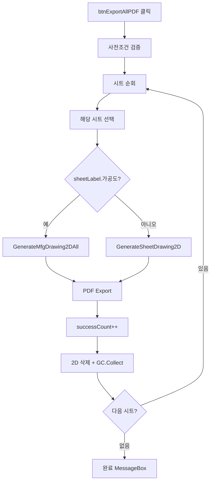

# 전체 시트 PDF 배치 내보내기

## 1. 개요
`lvDrawingSheet`의 모든 시트를 순회하며 2D 또는 가공도를 생성하고 각각 `c:\`에 PDF로 저장한다. **시트 간 메모리 정리(GC + Clear2DView)** 로직 포함.

## 2. 트리거
| 항목 | 값 |
|---|---|
| 유형 | User Action |
| 입력 | `btnExportAllPDF` 클릭 |
| 위치 | 메인 폼 > 도면 시트 탭 |

## 3. 사전 조건
- [ ] 3D 모델 로드됨
- [ ] `lvDrawingSheet.Items.Count > 0`

## 4. 전체 동작 흐름 (Happy Path)

| # | 단계 | 주체 | 설명 |
|---|---|---|---|
| 1 | 사전조건 검증 | Form1 | → [E01, E02] |
| 2 | 저장 디렉터리 | Form1 | `c:\` 고정 |
| 3 | 시트 순회 | Form1 | `for i = 0..Count` |
| 4 | 시트 선택 UI 동기화 | UI | 해당 행 Selected=true, `EnsureVisible`, `DoEvents` |
| 5 | 파일명 생성 | Form1 | `{SafeBaseName}_{SafeSheetLabel}_{HHmmss}.pdf` |
| 6 | 도면 생성 | Form1 | 가공도 vs 일반 시트 분기 |
| 7 | DoEvents + Sleep(200) | UI | 렌더 대기 |
| 8 | PDF Export | SDK | Unselect + `Export2PDFBy2DView` |
| 9 | 실패 시 | Form1 | `Debug.WriteLine` 후 계속 |
| 10 | 메모리 정리 | SDK | 2D Object/NonObject Delete, Canvas Remove |
| 11 | GC 강제 | Form1 | `GC.Collect()` x2 + `WaitForPendingFinalizers()` |
| 12 | 완료 알림 | UI | MessageBox "{totalCount}개 중 {successCount}개 저장됨\n저장 경로: c:\" |

## 5. 주요 분기 처리

### [분기 A] 시트 유형
| 조건 | 처리 |
|---|---|
| `sheetLabel.StartsWith("가공도")` | `GenerateMfgDrawing2DAll([sheet])` |
| 그 외 | `GenerateSheetDrawing2D(sheet)` |

### [분기 B] 시트 유효성
| 조건 | 처리 |
|---|---|
| `sheet == null` 또는 `MemberIndices.Count == 0` | `continue` |

## 6. 예외 / 에러 처리
| ID | 조건 | 동작 | 사용자 피드백 | 결과 상태 |
|---|---|---|---|---|
| E01 | 모델 미로드 | return | MessageBox "먼저 모델을 열어주세요." | 변화 없음 |
| E02 | 시트 목록 비어있음 | return | MessageBox "도면 시트가 없습니다. 먼저 '도면 생성'을 해주세요." | 변화 없음 |
| E03 | 특정 시트 PDF 실패 | catch + 계속 | Debug 로그 (UI 알림 없음) | 해당 시트 미저장, 나머지는 계속 |
| E04 | 전체 예외 | catch | MessageBox "ALL PDF 출력 중 오류: {msg}" | 부분 저장 |

## 7. 상태 변화
| 대상 | Before | After |
|---|---|---|
| 디스크 PDF | 없음 | N개 생성 (성공한 만큼) |
| `lvDrawingSheet` 선택 | 이전 | 마지막 시트 선택 |
| 2D 캔버스 | 이전 | 매 시트마다 리셋 |
| GC 메모리 | 이전 | 강제 수집됨 |

## 8. 후행 기능 (Chained)
- 저장된 PDF 확인 (탐색기)

## 9. 관련 링크
- 코드 구현: [Form1.DrawingSheets.cs:L847](/docs/code-reference/form1-drawing-sheets.md#btnExportAllPDF_Click)

## 10. 변경 이력
| 날짜 | 변경 내용 | 작성자 |
|---|---|---|
| 2026-04-13 | 초안 작성 | — |
