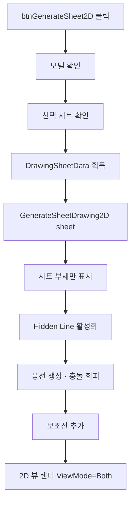

# 선택 시트 2D 도면 생성

## 1. 개요
사용자가 선택한 도면 시트(DrawingSheetData)를 기반으로 Hidden Line 모드 2D 도면을 생성한다. 내부적으로 `GenerateSheetDrawing2D(sheet)`를 호출하며, 이 함수는 `btnGenerate2D`와 **동일한 핵심 로직**을 공유한다.

## 2. 트리거
| 항목 | 값 |
|---|---|
| 유형 | User Action |
| 입력 | `btnGenerateSheet2D` 버튼 클릭 |
| 위치 | 메인 폼 > 도면 시트 탭 |

## 3. 사전 조건
- [ ] 3D 모델 로드됨
- [ ] 도면 시트 목록에서 하나 선택됨
- [ ] 선택 시트의 `MemberIndices.Count > 0`

## 4. 전체 동작 흐름 (Happy Path)

| # | 단계 | 주체 | 설명 |
|---|---|---|---|
| 1 | 모델 확인 | Form1 | `IsOpen()` → [E01] |
| 2 | 시트 선택 확인 | Form1 | `lvDrawingSheet.SelectedItems.Count == 0` → [E02] |
| 3 | 시트 데이터 추출 | Form1 | `Tag as DrawingSheetData` → [E03] |
| 4 | 위임 호출 | Form1 | `GenerateSheetDrawing2D(sheet)` |
| 5 | 부재 가시성 조정 | SDK | 시트 부재만 Show, 나머지 Hide |
| 6 | Hidden Line | SDK | `SetRenderMode(DASH_LINE)` |
| 7 | 풍선 배치 | Form1 | 번호 풍선 생성, `balloonOverrides`로 충돌 회피 |
| 8 | 보조선 추가 | Form1 | 풍선과 부재를 잇는 지시선 |
| 9 | 2D 뷰 전환 | SDK | `ViewMode = Both` |

> 구현 상세는 [코드 레퍼런스](/docs/code-reference/form1-drawing-sheets.md#GenerateSheetDrawing2D) 참고

## 5. 주요 분기 처리

### [분기 A] 풍선 위치 충돌
| 조건 | 처리 |
|---|---|
| 다른 풍선과 겹침 | `balloonOverrides` Dict에 오프셋 등록 후 재배치 |
| 겹침 없음 | 기본 위치 사용 |

### [분기 B] BOMInfo 재집계
| 조건 | 처리 |
|---|---|
| 시트에 포함된 부재 | `CollectBOMInfo(false, sheet)` 호출 → `lvDrawingBOMInfo` 재표시 |

## 6. 예외 / 에러 처리

| ID | 조건 | 동작 | 사용자 피드백 | 결과 상태 |
|---|---|---|---|---|
| E01 | 모델 미로드 | return | MessageBox "먼저 모델을 열어주세요." | 변화 없음 |
| E02 | 시트 미선택 | return | MessageBox "도면 시트를 선택해주세요." | 변화 없음 |
| E03 | `sheet == null` 또는 `MemberIndices.Count == 0` | return | MessageBox "유효한 시트 데이터가 없습니다." | 변화 없음 |
| E04 | 생성 중 예외 | catch (위임 함수 내부) | 부분 렌더링 + 로그 | 2D 캔버스 불완전 |

## 7. 상태 변화 (Before / After)

| 대상 | Before | After |
|---|---|---|
| `vizcore3d.ViewMode` | 3D 또는 이전 | `Both` |
| `vizcore3d.View.RenderMode` | SOLID | DASH_LINE |
| `vizcore3d.Object3D.Visible` | 모든 부재 | 시트 부재만 |
| `balloonOverrides` | 이전 | 현재 시트 기준 |
| `lvDrawingBOMInfo` | 이전 | 시트 부재 그룹 |
| 2D 캔버스 | 빈/이전 | 완성된 도면 |

## 8. 후행 기능 (Chained)
- [시트 PDF 내보내기](./export-sheet-2d-pdf.md)
- [가공도 생성](../mfg-drawing/mfg-drawing.md) (선택 부재 지정 후)

## 9. 관련 링크
- 코드 구현: [Form1.DrawingSheets.cs:L778](/docs/code-reference/form1-drawing-sheets.md#btnGenerateSheet2D_Click)
- 공통 함수: [Form1.DrawingSheets.cs#GenerateSheetDrawing2D](/docs/code-reference/form1-drawing-sheets.md#GenerateSheetDrawing2D)
- 용어집: [Hidden Line](../../_glossary.md#hidden-line-은선), [풍선](../../_glossary.md#풍선-balloon-note)

## 10. 변경 이력
| 날짜 | 변경 내용 | 작성자 |
|---|---|---|
| 2026-04-13 | 초안 작성 | — |
