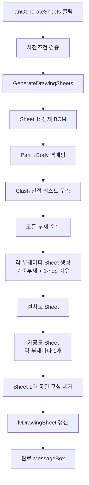

# 도면 시트 자동 분할 (BFS)

## 1. 개요
Clash 결과를 인접 리스트로 간주하고, 각 부재를 중심으로 **1-hop 이웃**(직접 Clash로 연결된 부재)을 묶어 시트를 만든다. Sheet 1 = 전체 BOM, Sheet 2~N = **각 부재가 기준부재로 등장하는 1-hop 그룹**, 그 다음 = 설치도(전체), 그 다음 = 각 부재별 가공도. 마지막 단계에서 Sheet 1과 구성이 동일한 일반 시트는 자동 제거.

## 2. 트리거
| 항목 | 값 |
|---|---|
| 유형 | User Action (또는 `Clash_OnClashTestFinishedEvent`에서 자동 호출) |
| 입력 | `btnGenerateSheets` 버튼 클릭 |
| 위치 | 메인 폼 > 도면 시트 탭 |

## 3. 사전 조건
- [ ] 3D 모델 로드됨
- [ ] `bomList.Count > 0`
- [ ] `clashList` — 비어 있어도 실행되나, 인접 리스트가 공백이라 일반 시트들이 모두 "자기 자신만 포함"하게 됨

## 4. 전체 동작 흐름 (Happy Path)



| # | 단계 | 주체 | 설명 |
|---|---|---|---|
| 1 | 사전조건 검증 | Form1 | 모델/BOM 확인 → [E01~E02] |
| 2 | 내부 호출 | Form1 | `GenerateDrawingSheets()` |
| 3 | Sheet 1 생성 | Form1 | 전체 BOM 부재 MemberIndices에 추가. BaseMemberName = 모델트리 선택 노드 → 파일명 → "전체" fallback |
| 4 | Part→Body 역매핑 | Form1 | `bodyToPartIndexMap`을 뒤집어 `partToBodyIndices[partIdx] = [bodyIdx…]` 구성 (Clash는 Part 기반, bomList는 Body 기반) |
| 5 | Clash 인접 리스트 | Form1 | `clashList` → `adjacencyByIndex[bodyA] = {bodyB, …}` 양방향 |
| 6 | Sheet 2~N 생성 (**모든 부재**) | Form1 | `bomList` 순서대로 순회. **모든 부재가 기준부재**로 등장하며, 포함부재 = 자기 자신 + 1-hop 이웃. `BaseMemberIndex ≥ 0`, `BaseMemberName = bom.Name` |
| 7 | 설치도 Sheet | Form1 | BFS로 모든 연결된 부재 + 독립 부재 모두 포함 (사실상 전체 BOM). `BaseMemberIndex = -2`, `BaseMemberName = "설치도"` |
| 8 | 가공도 Sheet | Form1 | `bomList`의 각 부재마다 독립 시트 1개 (개당 1부재). `BaseMemberIndex = -3`, `MfgDrawingNo` 순번 |
| 9 | Sheet 1 중복 제거 | Form1 | 일반 시트 중 Sheet 1과 구성 완전 동일한 시트 삭제 (설치도·가공도 제외) |
| 9.5 | **Sheet 1 기준 BOM 정보 자동 수집** (T-025) | Form1 | `drawingSheetList.Count > 0`일 때 `CollectBOMInfo(false, drawingSheetList[0])` 호출 — 치수추출 직후 사용자가 시트를 클릭하지 않아도 전체 BOM 테이블(`lvDrawingBOMInfo`)이 즉시 채워짐. visibility는 건드리지 않음 (시트 선택 이벤트와 달리 카메라·Show/Hide 스킵) |
| 10 | ListView 갱신 | UI | SheetNumber / 기준부재(item 번호) / 포함부재(item 번호 콤마) / 부재 수. **item 번호 = `bomList` 순서(i+1) = ISO 풍선 번호 = BOM 정보 탭 No.** (T-014). Sheet 1은 "전체", 설치도는 "설치도", 가공도는 기준부재를 단일 번호로 표기하고 포함부재 컬럼은 공란 |
| 11 | 완료 알림 | UI | MessageBox "도면 시트 {N}개가 생성되었습니다." |

> 구현 상세는 [코드 레퍼런스](/docs/code-reference/form1-drawing-sheets.md#GenerateDrawingSheets) 참고

## 5. 주요 분기 처리

### [분기 A] 호출 경로
| 조건 | 처리 |
|---|---|
| 사용자가 직접 `btnGenerateSheets` 클릭 | 사전조건 검증 + 완료 MessageBox |
| `Clash_OnClashTestFinishedEvent`에서 호출 | 사전조건 스킵(이미 충족), MessageBox 생략 |

### [분기 B] 부재 시트 구성
| 조건 | 처리 |
|---|---|
| 부재가 `adjacencyByIndex`에 있음 (Clash 연결 有) | Sheet 생성 + **자기 자신 + 1-hop 이웃** 포함 |
| 부재가 `adjacencyByIndex`에 없음 (Clash 없는 독립 부재) | Sheet 생성 + **자기 자신만** 포함 (이웃 없음) |

### [분기 C] Sheet 1 중복 제거 (단계 9)
| 조건 | 처리 |
|---|---|
| 일반 시트(`BaseMemberIndex ≥ 0`)의 MemberIndices가 Sheet 1과 완전 동일 | 시트 삭제 |
| 설치도(-2) / 가공도(-3) | 제거 대상 제외 |

## 6. 예외 / 에러 처리

| ID | 조건 | 동작 | 사용자 피드백 | 결과 상태 |
|---|---|---|---|---|
| E01 | 모델 미로드 | return | MessageBox "먼저 모델을 열어주세요." | 변화 없음 |
| E02 | `bomList.Count == 0` | return | MessageBox "BOM 데이터가 없습니다." | 변화 없음 |

> `clashList`가 비어 있어도 실행되지만, 인접 리스트가 없어 일반 시트들이 자기 자신 1개만 포함하게 되고 단계 9의 중복 제거가 많이 발동될 수 있음.

## 7. 상태 변화 (Before / After)

| 대상 | Before | After |
|---|---|---|
| `drawingSheetList` | 이전 시트 | 순서: **Sheet 1 (전체) → 일반 시트 (모든 부재, 단계 9 중복 제거 적용) → 설치도 → 가공도 (bomList 개수)** |
| `lvDrawingSheet` | 이전 행 | 각 시트가 한 행. 도면번호 / 기준부재(**item 번호**) / 포함부재(**item 번호 콤마, 오름차순**) / 부재수 컬럼. Sheet 1 → "전체/전체", 설치도 → "설치도/{전체 item 번호}", 가공도 → "{item 번호}/공란" |

### 시트 수 공식
```
총 시트 = 1(Sheet1) + N_일반 + 1(설치도) + bomList.Count(가공도) − Sheet1_동일_제거
```
- `N_일반 ≤ bomList.Count` (일반 시트는 모든 부재가 각자 기준이 되어 최대 `bomList.Count`개까지 생성)
- Sheet 1과 동일 구성 제거 덕분에 작은 모델에선 일반 시트가 전부 사라질 수도 있음

## 8. 후행 기능 (Chained)
- [시트 선택 시 X-Ray 표시](./lv-sheet-selected.md)
- [시트별 2D 생성](./generate-sheet-2d.md)
- [시트 PDF 내보내기](./export-sheet-2d-pdf.md)
- [전체 PDF 배치 출력](./export-all-pdf.md)

## 9. 관련 링크
- 코드 구현: [Form1.DrawingSheets.cs:L398](/docs/code-reference/form1-drawing-sheets.md#btnGenerateSheets_Click)
- 용어집: [BFS 기반 시트 분할](../../_glossary.md#bfs-기반-시트-분할), [Drawing Sheet](../../_glossary.md#drawing-sheet-도면-시트)

## 10. 변경 이력
| 날짜 | 변경 내용 | 작성자 |
|---|---|---|
| 2026-04-13 | 초안 작성 | — |
| 2026-04-21 | T-015: 시트 생성 로직 재설계 — `appearedAsIncluded` 스킵 로직 제거. 이전엔 "포함부재로 등장한 부재는 기준부재가 될 수 없음"이라 1-2-3-4 연쇄 Clash 시 Sheet 2~3 두 개만 생성되던 문제. 이제 모든 부재가 각자 기준부재 시트를 가짐 (4개 생성, 단계 9 중복 제거로 과잉 자동 정리). 흐름도·단계표·분기·상태 섹션 전면 갱신 | Claude |
| 2026-04-21 | T-014: `lvDrawingSheet` 기준부재/포함부재 컬럼을 부재 이름 대신 **item 번호**(= `bomList` 순서 i+1 = ISO 풍선 번호 = BOM 정보 탭 No.)로 표시. Sheet 1은 "전체", 설치도는 "설치도", 가공도는 `MemberIndices[0]`의 번호를 기준부재 셀에 표기하고 포함부재는 공란 유지. 생성 로직은 변경 없음(표시 전용) | Claude |
| 2026-04-22 | T-025: ListView 갱신 직전에 `CollectBOMInfo(false, drawingSheetList[0])` 호출 추가 — 치수추출 완료 직후 Sheet 1(전체) 기준 BOM 정보가 `lvDrawingBOMInfo`에 즉시 표시됨. 시트 선택 이벤트와 달리 visibility·카메라는 건드리지 않음. try/catch로 감싸 실패 시 DiagLog만 기록. 단계 9.5 추가 | Claude |
