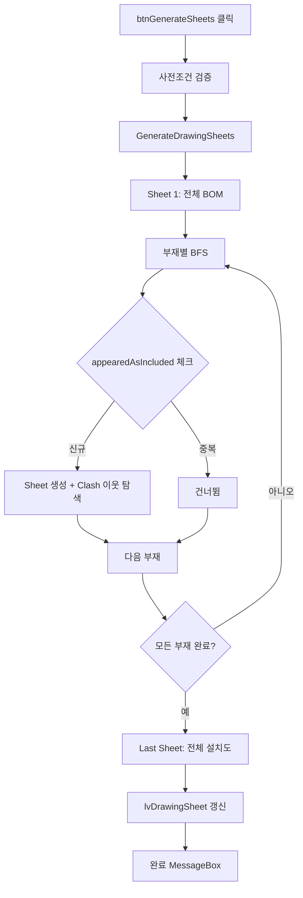

# 도면 시트 자동 분할 (BFS)

## 1. 개요
Clash 결과를 인접 리스트로 간주하고, 각 부재를 중심으로 **BFS 트래버설**하여 연결된 부재들을 하나의 시트로 묶는다. Sheet 1 = 전체 BOM, Sheet 2~N = 부재별 연결 집합, 마지막 Sheet = 전체 설치도.

## 2. 트리거
| 항목 | 값 |
|---|---|
| 유형 | User Action (또는 `Clash_OnClashTestFinishedEvent`에서 자동 호출) |
| 입력 | `btnGenerateSheets` 버튼 클릭 |
| 위치 | 메인 폼 > 도면 시트 탭 |

## 3. 사전 조건
- [ ] 3D 모델 로드됨
- [ ] `bomList.Count > 0`
- [ ] `clashList.Count > 0`

## 4. 전체 동작 흐름 (Happy Path)

| # | 단계 | 주체 | 설명 |
|---|---|---|---|
| 1 | 사전조건 검증 | Form1 | 모델/BOM/Clash 확인 → [E01~E03] |
| 2 | 내부 호출 | Form1 | `GenerateDrawingSheets()` |
| 3 | Sheet 1 생성 | Form1 | 전체 BOM 부재 MemberIndices에 추가 |
| 4 | 인접 리스트 구축 | Form1 | clashList → Dictionary<int, HashSet<int>> |
| 5 | BFS 트래버설 | Form1 | 각 BOM 부재 시작점으로, Clash 이웃 포함 |
| 6 | 중복 방지 | Form1 | `appearedAsIncluded` HashSet 관리 |
| 7 | 마지막 Sheet | Form1 | 전체 설치도 추가 (BFS 전역 트래버설) |
| 8 | ListView 갱신 | UI | SheetNumber / BaseMember / 부재 수 표시 |
| 9 | 완료 알림 | UI | MessageBox "도면 시트 {N}개가 생성되었습니다." |

> 구현 상세는 [코드 레퍼런스](/docs/code-reference/form1-drawing-sheets.md#GenerateDrawingSheets) 참고

## 5. 주요 분기 처리

### [분기 A] 호출 경로
| 조건 | 처리 |
|---|---|
| 사용자가 직접 클릭 | 사전조건 검증 + 완료 MessageBox |
| `Clash_OnClashTestFinishedEvent`에서 호출 | 사전조건 스킵(이미 충족), MessageBox 생략 |

### [분기 B] 부재 BFS 시 중복
| 조건 | 처리 |
|---|---|
| 이미 `appearedAsIncluded`에 있음 | 신규 Sheet 생성하지 않음 |
| 신규 부재 | Sheet 생성 + 이웃 포함 |

## 6. 예외 / 에러 처리

| ID | 조건 | 동작 | 사용자 피드백 | 결과 상태 |
|---|---|---|---|---|
| E01 | 모델 미로드 | return | MessageBox "먼저 모델을 열어주세요." | 변화 없음 |
| E02 | `bomList.Count == 0` | return | MessageBox "BOM 데이터가 없습니다." | 변화 없음 |
| E03 | `clashList.Count == 0` | return | MessageBox "Clash 데이터가 없습니다. 먼저 Clash 검사를 수행..." | 변화 없음 |

## 7. 상태 변화 (Before / After)

| 대상 | Before | After |
|---|---|---|
| `drawingSheetList` | 이전 시트 | 새 시트 N개 (Sheet1=전체, Sheet2~N-1=BFS 그룹, SheetN=전체설치도) |
| `lvDrawingSheet` | 이전 행 | 시트 행 갱신 |

## 8. 후행 기능 (Chained)
- [시트 선택 시 X-Ray 표시](./lv-sheet-selected.md)
- [시트별 2D 생성](./generate-sheet-2d.md)
- [시트 PDF 내보내기](./export-sheet-2d-pdf.md)
- [전체 PDF 배치 출력](./export-all-pdf.md)

## 9. 관련 링크
- 코드 구현: [Form1.DrawingSheets.cs:L398](/docs/code-reference/form1-drawing-sheets.md#btnGenerateSheets_Click)
- 용어집: [BFS 기반 시트 분할](../../_glossary.md#bfs-기반-시트-분할), [Drawing Sheet](../../_glossary.md#drawing-sheet-도면-시트)

## 10. 변경 이력
| 날짜 | 변경 내용 | 작성자 |
|---|---|---|
| 2026-04-13 | 초안 작성 | — |
