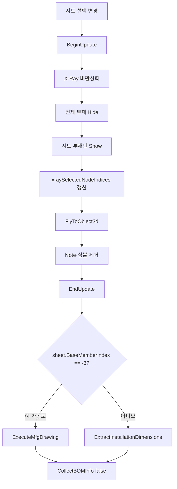

# 도면 시트 선택 시 X-Ray 표시

## 1. 개요
`lvDrawingSheet` 선택이 변경되면 해당 시트 부재만 표시하고, 시트 유형에 따라 **가공도 실행** 또는 **설치도 치수 추출**로 분기한다. 종료 시 BOM 정보도 자동 재집계.

## 2. 트리거
| 항목 | 값 |
|---|---|
| 유형 | Event Callback |
| 입력 | `lvDrawingSheet.SelectedIndexChanged` |
| 위치 | 메인 폼 > 도면 시트 리스트 |

## 3. 사전 조건
- [ ] 도면 시트 목록 채워짐 ([SHT-001](./generate-sheets.md))

## 4. 전체 동작 흐름 (Happy Path)

| # | 단계 | 주체 | 설명 |
|---|---|---|---|
| 1 | 선택 확인 | Form1 | 없으면 return |
| 2 | BeginUpdate | SDK | — |
| 3 | X-Ray 해제 | SDK | `XRay.Enable = false` + Clear |
| 4 | 전체 부재 Hide | SDK | `bomList`의 모든 Index를 `Show(false)` |
| 5 | 시트 부재 Show | SDK | `Show(sheet.MemberIndices, true)` |
| 6 | 실루엣 유지 | SDK | Green |
| 7 | xray 인덱스 저장 | Form1 | 글로벌 뷰 버튼용 |
| 8 | 카메라 이동 | SDK | `FlyToObject3d(MemberIndices, 1.2f)` |
| 9 | 심볼/풍선 제거 | SDK | `Clash.ClearResultSymbol()`, `Review.Note.Clear()` |
| 10 | **기준부재 선택상태** (T-022) | SDK | `Object3D.Select(DESELECT_ALL)` → 기준부재 하나만 `Select(indices, true, false)` → 3D View에서 빨간색 하이라이트. Sheet 1(-1)·설치도(-2)는 생략, 가공도(-3)는 `MemberIndices[0]`, Sheet 2+는 `BaseMemberIndex` |
| 11 | EndUpdate | SDK | — |
| 12 | 치수 분기 | Form1 | [분기 A] |
| 13 | BOM 정보 재집계 | Form1 | `CollectBOMInfo(false)` — 알람 없음 |

## 5. 주요 분기 처리

### [분기 A] 시트 유형
| 조건 | 처리 |
|---|---|
| `sheet.BaseMemberIndex == -3` (가공도) | `ExecuteMfgDrawing(sheet.MemberIndices[0])` |
| 그 외 (일반/설치도) | `ExtractInstallationDimensions(sheet.MemberIndices)` |

## 6. 예외 / 에러 처리
| ID | 조건 | 동작 | 사용자 피드백 | 결과 상태 |
|---|---|---|---|---|
| E01 | 예외 | catch | Debug.WriteLine만 | 부분 표시 가능 |

## 7. 상태 변화
| 대상 | Before | After |
|---|---|---|
| 부재 가시성 | 전체 또는 이전 | 시트 부재만 |
| `xraySelectedNodeIndices` | 이전 | `sheet.MemberIndices` 복제 |
| `chainDimensionList` | 이전 | 시트 기준 재계산 |
| `lvDimension` | 이전 | 재표시 |
| `lvDrawingBOMInfo` | 이전 | 시트 기준 그룹 |
| 카메라 | 이전 | 시트 부재 확대 |
| **3D View 선택상태** (T-022) | 이전 선택 | **기준부재만 빨간 하이라이트** (Sheet 1·설치도는 선택 없음) |
| `selectedAttributeNodeIndex` | 이전 | 기준부재 인덱스 (연쇄: `Object3D_OnObject3DSelected` → `UpdateAttributeTable`) |

## 8. 후행 기능 (Chained)
- [시트 ISO/축 뷰](./drawing-iso.md)
- [시트 2D 생성](./generate-sheet-2d.md)

## 9. 관련 링크
- 코드 구현: [Form1.DrawingSheets.cs:L425](/docs/code-reference/form1-drawing-sheets.md#LvDrawingSheet_SelectedIndexChanged)

## 10. 변경 이력
| 날짜 | 변경 내용 | 작성자 |
|---|---|---|
| 2026-04-13 | 초안 작성 | — |
| 2026-04-22 | T-022: 시트의 "기준부재"를 3D View에서 `Object3D.Select`로 빨간 하이라이트. `DESELECT_ALL` 선행으로 이전 선택 누적 방지. 가공도(`MemberIndices[0]`) / Sheet 2+(`BaseMemberIndex`) 구분, Sheet 1·설치도는 생략. 단계 10 추가, 상태 변화 2행 추가 | Claude |
