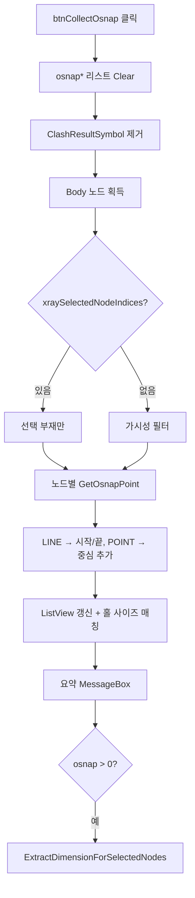

# 모든 Osnap 수집

## 1. 개요
가시(또는 X-Ray 선택) 부재 전체의 Osnap 포인트(LINE/POINT만, CIRCLE·SURFACE는 제외)를 수집하고, 수집 후 자동으로 치수 추출까지 수행한다.

## 2. 트리거
| 항목 | 값 |
|---|---|
| 유형 | User Action |
| 입력 | `btnCollectOsnap` 버튼 클릭 |
| 위치 | 메인 폼 > Osnap 탭 |

## 3. 사전 조건
- [ ] 3D 모델 로드됨

## 4. 전체 동작 흐름 (Happy Path)

| # | 단계 | 주체 | 설명 |
|---|---|---|---|
| 1 | 리스트 Clear | Form1 | `osnapPoints`, `osnapPointsWithNames` |
| 2 | Body 노드 획득 | SDK | `GetPartialNode(false, false, true)` → [E01] |
| 3 | 필터링 | Form1 | xray 선택 or 가시성 or 전체 Fallback |
| 4 | 노드별 Osnap 조회 | SDK | `GetOsnapPoint(nodeIndex)` |
| 5 | Kind별 추가 | Form1 | LINE(Start/End), POINT(Center), CIRCLE/SURFACE 스킵 |
| 6 | ListView 갱신 | UI | #/노드명/X/Y/Z/HoleSize/SlotHoleSize |
| 7 | 홀 사이즈 매칭 | Form1 | `GetHoleOrSlotForPoint(bom, x, y, z)` |
| 8 | 요약 알림 | UI | MessageBox (LINE/CIRCLE/POINT/SURFACE 개수) |
| 9 | 자동 치수 추출 | Form1 | `ExtractDimensionForSelectedNodes()` |

## 5. 주요 분기 처리

### [분기 A] 대상 부재
| 조건 | 처리 |
|---|---|
| `xraySelectedNodeIndices.Count > 0` | 선택 부재만, `isFilteredMode=true` |
| 비어있음 | `FromIndex().Visible` 필터 |
| 필터 결과 0개 | 전체 Fallback |

### [분기 B] OsnapKind 처리
| Kind | 처리 |
|---|---|
| LINE | Start, End 좌표 추가 |
| POINT | Center 좌표 추가 |
| CIRCLE | 스킵 (곡면) |
| SURFACE | 스킵 (표면) |

## 6. 예외 / 에러 처리
| ID | 조건 | 동작 | 사용자 피드백 | 결과 상태 |
|---|---|---|---|---|
| E01 | Body 노드 없음 | return | MessageBox "로드된 Body 노드가 없습니다." | Clear 상태 |
| E02 | 처리 중 예외 | catch | MessageBox "Osnap 수집 중 오류: {msg}\nStack Trace: ..." | 부분 수집 |

## 7. 상태 변화 (Before / After)
| 대상 | Before | After |
|---|---|---|
| `osnapPoints` | 이전 | 수집 결과 |
| `osnapPointsWithNames` | 이전 | 수집 결과 (노드명 포함) |
| `lvOsnap` | 이전 | 재구성 |
| `chainDimensionList` | 이전 | 후행 함수로 재계산 |

## 8. 후행 기능 (Chained)
- 자동: `ExtractDimensionForSelectedNodes()`
- 수동: [선택 Osnap 풍선 표시](./osnap-show-selected.md)

## 9. 관련 링크
- 코드 구현: [Form1.Drawing2D.cs:L179](/docs/code-reference/form1-drawing2d.md#btnCollectOsnap_Click)
- 용어집: [Osnap](../../_glossary.md#osnap-object-snap)

## 10. 변경 이력
| 날짜 | 변경 내용 | 작성자 |
|---|---|---|
| 2026-04-13 | 초안 작성 | — |
| 2026-05-11 | **REQ-003: lvOsnap 컬럼 6개로 축소** (사용자 요청). 이전 7개 (No/부재이름/X/Y/Z/홀사이즈/슬롯홀) → 6개 (**No/축/부재이름/X/Y/Z**). 홀사이즈/슬롯홀 컬럼 제거, **축** 컬럼 신규 추가. LINE osnap은 start→end 벡터 최대 성분으로 축 추정("X"/"Y"/"Z"), POINT/수동은 빈 문자열. 데이터 모델: `osnapPointsWithNames` 튜플 `(Vertex3D, string)` → `(Vertex3D, string, string axis)` 확장. `MergeCoordinates` 시그니처 패스스루. `nodeOsnapPts`(`_lastCollectedNodeOsnapMap`)는 영향 차단 위해 2원소 유지. 헬퍼 `EstimateOsnapLineAxis(dynamic, dynamic)` 신설 | Claude |
| 2026-05-11 | **REQ-004: lvOsnap 행 선택 → 3D 강조 + 카메라 fit** (사용자 요청). BOM 행 선택(T-021) 패턴 복제. `LvOsnap_SelectedIndexChanged` 신규: 선택 행의 부재이름 → bomList 매핑 → `Object3D.Color.RestoreColorAll` + `Object3D.Select(indices)` + `View.FlyToObject3d(indices, 1.2f)`. 다중 선택 지원. `_suppressOsnapSelChanged` 가드로 `LvClash_SelectedIndexChanged`의 `SelectRelatedOsnapItems` 연쇄 트리거 방지 (카메라 흔들림 회피) | Claude |
