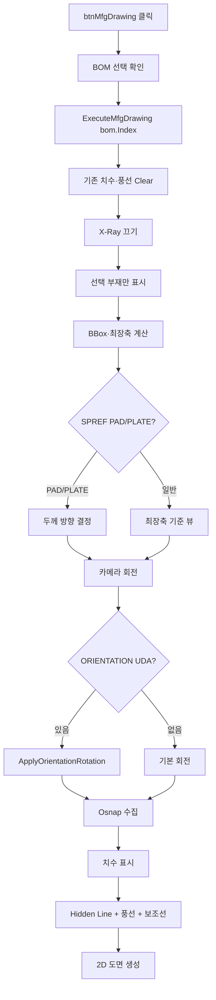

# 선택 부재 가공도 생성

## 1. 개요
BOM 리스트에서 선택한 단일 부재의 **가공용 상세 도면**을 생성한다. 최장축이 좌우가 되도록 카메라를 회전하고, PAD/PLATE 판별 + ORIENTATION UDA 기반 추가 회전 후 Osnap 수집·치수·풍선·Hidden Line 2D 도면을 만든다.

## 2. 트리거
| 항목 | 값 |
|---|---|
| 유형 | User Action |
| 입력 | `btnMfgDrawing` 버튼 클릭 |
| 위치 | 메인 폼 > 가공도 탭 |

## 3. 사전 조건
- [ ] 3D 모델 로드됨
- [ ] `bomList` 채워짐
- [ ] `lvBOM`에서 부재 1개 선택

## 4. 전체 동작 흐름 (Happy Path)

| # | 단계 | 주체 | 설명 |
|---|---|---|---|
| 1 | BOM 선택 확인 | Form1 | `SelectedItems.Count == 0` → [E01] |
| 2 | BOMData 추출 | Form1 | `Tag as BOMData` → [E02] |
| 3 | 가공도 위임 | Form1 | `ExecuteMfgDrawing(bom.Index)` |
| 4 | 이전 주석 제거 | SDK | Measure/ShapeDrawing/Note Clear |
| 5 | X-Ray 해제 | SDK | `View.XRay.Enable = false` |
| 6 | 대상 부재만 표시 | SDK | 전체 Hide → 선택 부재 Show |
| 7 | 최장축 계산 | Form1 | BBox 차원 비교 |
| 8 | PAD/PLATE 판별 | Form1 | SPREF UDA 파싱 → [분기 A] |
| 9 | 뷰 방향 결정 | Form1 | 최장축이 가로, 두께가 Z+ 방향 |
| 10 | 카메라 배치 | SDK | `View.SetCameraDirection(...)` |
| 11 | ORIENTATION 회전 | Form1 | UDA 있으면 `ApplyOrientationRotation` |
| 12 | Osnap 수집 | SDK | `GetOsnapPoint(nodeIndex)` |
| 13 | 치수 생성 | SDK | `Review.Measure.*` + 스타일 |
| 14 | 2D 렌더 | SDK | Hidden Line + 풍선 + 보조선 |

> 구현 상세는 [코드 레퍼런스](/docs/code-reference/form1-mfg-drawing.md#ExecuteMfgDrawing) 참고

## 5. 주요 분기 처리

### [분기 A] PAD / PLATE 판별
| 조건 | 처리 |
|---|---|
| SPREF UDA에 "PAD" 또는 "PLATE" 포함 | 두께 방향을 별도 판정하여 정면뷰 설정 |
| 그 외 (일반 부재) | 최장축=X, 차장축=Y 관례로 뷰 설정 |

### [분기 B] ORIENTATION UDA
| 조건 | 처리 |
|---|---|
| UDA에 `ORIENTATION` 키 존재 + 파싱 성공 | 축별 각도 적용 |
| 키 없음 또는 파싱 실패 | 기본 회전만 |

### [분기 C] Osnap 수집 실패
| 조건 | 처리 |
|---|---|
| `GetOsnapPoint` 반환 null/0 | 치수 없이 도면만 생성 |
| 성공 | 치수 자동 배치 |

## 6. 예외 / 에러 처리

| ID | 조건 | 동작 | 사용자 피드백 | 결과 상태 |
|---|---|---|---|---|
| E01 | BOM 미선택 | return | MessageBox "BOM 리스트에서 부재를 선택하세요." | 변화 없음 |
| E02 | `bom == null` | 조용히 return | — | 변화 없음 |
| E03 | `bom.Index`가 `bomList`에 없음 | 조용히 return | — | 변화 없음 |
| E04 | 가공도 생성 중 예외 | catch | (내부 로그) | 부분 렌더링 — 사용자는 `RestoreAllPartsVisibility()` 필요 |

### [복구] 부분 렌더링 발생 시
BOM을 더블클릭하거나 글로벌 뷰 버튼을 누르면 내부에서 `RestoreAllPartsVisibility()`가 호출되어 전체 부재 가시성이 복구된다.

## 7. 상태 변화 (Before / After)

| 대상 | Before | After |
|---|---|---|
| `vizcore3d.Object3D.Visible` | 전체 | 선택 부재만 |
| `vizcore3d.View.XRay.Enable` | true/false | false |
| `vizcore3d.Review.Measure` | 이전 치수 | Clear 후 가공도용 치수 |
| `vizcore3d.ShapeDrawing` | 이전 보조선 | Clear 후 새 보조선 |
| `vizcore3d.Review.Note` | 이전 풍선 | Clear 후 새 풍선 |
| `vizcore3d.ViewMode` | 이전 | `Both` |
| `vizcore3d.View.RenderMode` | SOLID | DASH_LINE |
| 카메라 | 이전 위치 | 최장축 기준 정면 |

## 8. 후행 기능 (Chained)
- [PDF 내보내기](../drawing2d/export-pdf.md)
- [전체 배치 가공도](./mfg-drawing-sheet.md)
- BOM 더블클릭 → [전체 복원](../drawing2d/lvbom-doubleclick.md)

## 9. 관련 링크
- 코드 구현: [Form1.MfgDrawing.cs:L19](/docs/code-reference/form1-mfg-drawing.md#btnMfgDrawing_Click), [ExecuteMfgDrawing](/docs/code-reference/form1-mfg-drawing.md#ExecuteMfgDrawing)
- 용어집: [MfgDrawing](../../_glossary.md#mfgdrawing-가공도-manufacturing-drawing), [PAD / PLATE](../../_glossary.md#pad--plate), [UDA](../../_glossary.md#uda-user-defined-attribute)

## 10. 변경 이력
| 날짜 | 변경 내용 | 작성자 |
|---|---|---|
| 2026-04-13 | 초안 작성 | — |
