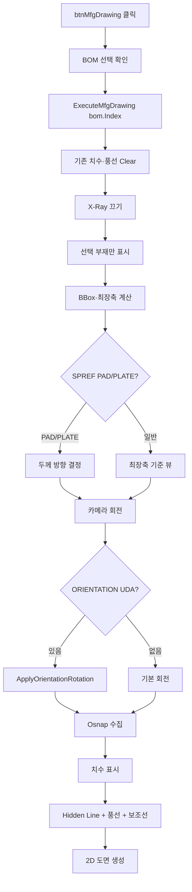

# 선택 부재 가공도 생성

## 1. 개요
BOM 리스트에서 선택한 단일 부재의 **가공용 상세 도면**을 생성한다. 최장축이 좌우가 되도록 카메라를 회전하고, PAD/PLATE 판별 + ORIENTATION UDA 기반 추가 회전 후 Osnap 수집·치수·풍선·Hidden Line 2D 도면을 만든다.

## 2. 트리거
| 항목 | 값 |
|---|---|
| 유형 | User Action |
| 입력 | `btnMfgDrawing` 버튼 클릭 |
| 위치 | 메인 폼 > 가공도 탭 |

## 3. 사전 조건
- [ ] 3D 모델 로드됨
- [ ] `bomList` 채워짐
- [ ] `lvBOM`에서 부재 1개 선택

## 4. 전체 동작 흐름 (Happy Path)

| # | 단계 | 주체 | 설명 |
|---|---|---|---|
| 1 | BOM 선택 확인 | Form1 | `SelectedItems.Count == 0` → [E01] |
| 2 | BOMData 추출 | Form1 | `Tag as BOMData` → [E02] |
| 3 | 가공도 위임 | Form1 | `ExecuteMfgDrawing(bom.Index)` |
| 4 | 이전 주석 제거 | SDK | Measure/ShapeDrawing/Note Clear |
| 5 | X-Ray 해제 | SDK | `View.XRay.Enable = false` |
| 6 | 대상 부재만 표시 | SDK | 전체 Hide → 선택 부재 Show |
| 7 | 최장축 계산 | Form1 | BBox 차원 비교 |
| 8 | PAD/PLATE 판별 | Form1 | SPREF UDA 파싱 → [분기 A] |
| 9 | 뷰 방향 결정 | Form1 | 최장축이 가로, 두께가 Z+ 방향 |
| 10 | 카메라 배치 | SDK | `View.SetCameraDirection(...)` |
| 11 | ORIENTATION 회전 | Form1 | UDA 있으면 `ApplyOrientationRotation` |
| 12 | Osnap 수집 | SDK | `GetOsnapPoint(nodeIndex)` |
| 13 | 치수 생성 | SDK | `Review.Measure.*` + 스타일 |
| 14 | 2D 렌더 | SDK | Hidden Line + 풍선 + 보조선 |

> 구현 상세는 [코드 레퍼런스](/docs/code-reference/form1-mfg-drawing.md#ExecuteMfgDrawing) 참고

## 5. 주요 분기 처리

### [분기 A] PAD / PLATE 판별
| 조건 | 처리 |
|---|---|
| SPREF UDA에 "PAD" 또는 "PLATE" 포함 | 두께 방향을 별도 판정하여 정면뷰 설정 |
| 그 외 (일반 부재) | 최장축=X, 차장축=Y 관례로 뷰 설정 |

### [분기 B] ORIENTATION UDA
| 조건 | 처리 |
|---|---|
| UDA에 `ORIENTATION` 키 존재 + 파싱 성공 | 축별 각도 적용 |
| 키 없음 또는 파싱 실패 | 기본 회전만 |

### [분기 C] Osnap 수집 실패
| 조건 | 처리 |
|---|---|
| `GetOsnapPoint` 반환 null/0 | 치수 없이 도면만 생성 |
| 성공 | 치수 자동 배치 |

## 6. 예외 / 에러 처리

| ID | 조건 | 동작 | 사용자 피드백 | 결과 상태 |
|---|---|---|---|---|
| E01 | BOM 미선택 | return | MessageBox "BOM 리스트에서 부재를 선택하세요." | 변화 없음 |
| E02 | `bom == null` | 조용히 return | — | 변화 없음 |
| E03 | `bom.Index`가 `bomList`에 없음 | 조용히 return | — | 변화 없음 |
| E04 | 가공도 생성 중 예외 | catch | (내부 로그) | 부분 렌더링 — 사용자는 `RestoreAllPartsVisibility()` 필요 |

### [복구] 부분 렌더링 발생 시
BOM을 더블클릭하거나 글로벌 뷰 버튼을 누르면 내부에서 `RestoreAllPartsVisibility()`가 호출되어 전체 부재 가시성이 복구된다.

## 7. 상태 변화 (Before / After)

| 대상 | Before | After |
|---|---|---|
| `vizcore3d.Object3D.Visible` | 전체 | 선택 부재만 |
| `vizcore3d.View.XRay.Enable` | true/false | false |
| `vizcore3d.Review.Measure` | 이전 치수 | Clear 후 가공도용 치수 |
| `vizcore3d.ShapeDrawing` | 이전 보조선 | Clear 후 새 보조선 |
| `vizcore3d.Review.Note` | 이전 풍선 | Clear 후 새 풍선 |
| `vizcore3d.ViewMode` | 이전 | `Both` |
| `vizcore3d.View.RenderMode` | 이전 모드 | **SMOOTH (실선)** — T-031 (2026-04-22) 이전에는 DASH_LINE(은선). 사용자 피드백 "가공도 눌렀을 때 은선 처리 안되게" 반영. 2D 캡처 내부(L820·L1582)는 여전히 DASH_LINE 유지 |
| 카메라 | 이전 위치 | 최장축 기준 정면 |

## 8. 후행 기능 (Chained)
- [PDF 내보내기](../drawing2d/export-pdf.md)
- [전체 배치 가공도](./mfg-drawing-sheet.md)
- BOM 더블클릭 → [전체 복원](../drawing2d/lvbom-doubleclick.md)

## 9. 관련 링크
- 코드 구현: [Form1.MfgDrawing.cs:L19](/docs/code-reference/form1-mfg-drawing.md#btnMfgDrawing_Click), [ExecuteMfgDrawing](/docs/code-reference/form1-mfg-drawing.md#ExecuteMfgDrawing)
- 용어집: [MfgDrawing](../../_glossary.md#mfgdrawing-가공도-manufacturing-drawing), [PAD / PLATE](../../_glossary.md#pad--plate), [UDA](../../_glossary.md#uda-user-defined-attribute)

## 10. 변경 이력
| 날짜 | 변경 내용 | 작성자 |
|---|---|---|
| 2026-04-13 | 초안 작성 | — |
| 2026-04-22 | T-031: 가공도 시트 선택 시 3D 뷰 은선 처리(DASH_LINE) → 실선(SMOOTH)으로 변경. [Form1.MfgDrawing.cs L142](../../../A2Z/Form1.MfgDrawing.cs)의 `SetRenderMode(DASH_LINE)` → `SetRenderMode(SMOOTH)` 교체. 2D 캡처·PDF 출력 내부 경로(L820, L1582)는 은선 유지 (2D 도면의 내부 상세용). 상태 변화 표 갱신 | Claude |
| 2026-04-22 | T-036: `ExecuteMfgDrawing` 진입부 `Object3D.Select(DESELECT_ALL)` 추가 — 이전 시트/BOM 선택 잔존 해제. 말미 `DiagLog T-036 MfgDrawing bom=... sizeXYZ=... longestAxis=... isPadOrPlate=... viewDir=...` 추가 — 사용자가 "최장축이 가로로 배치 안 되는 경우" 재현 시 분석용. Z 최장축 90° 회전과 L215 180° 회전이 합쳐져 270° 되는 케이스 의심 | Claude |
| 2026-04-23 | T-036 수정: 사용자 실기 "Z 최장축인데 세로로 배치" 확정 → **Z 최장축일 땐 use180 180° 회전 스킵**. L215 `if (use1803d && longestAxis != "Z")` 가드 추가. 뒤에 이어지는 L532 90° 회전이 온전히 작용해 Z축이 수평으로 배치됨. Z 최장축 + use180 조합의 "수직 뒤집기" 효과는 잃지만 가로 배치 복구가 우선. 재현 데이터 더 확보되면 정교화 예정 | Claude |
| 2026-04-23 | T-036 재해석·원복: 사용자 재보고 "45도 대각 ISO 뷰 느낌"은 Z 최장축 세로 문제가 아닌 **카메라 방향 자체가 ISO로 잔존**하는 문제였음. 원인은 [LvDrawingSheet_SelectedIndexChanged](../drawing-sheets/lv-sheet-selected.md) 공통부의 `FlyToObject3d` 호출이 이전 카메라 방향(예: 글로벌 ISO 누적)을 유지한 채 이동만 하는 것. 가공도 시트 분기 앞에서 `FlyToObject3d` 스킵으로 해결(상세는 lv-sheet-selected.md T-036 이력). 본 함수의 **L215 180° 스킵 가드는 원복** — ISO 원인과 무관하며 수직 뒤집기 기능이 본래 의도였음. `use1803d`는 여전히 블록 바깥 스코프로 승격 유지 (DiagLog 가시성) | Claude |
| 2026-04-23 | T-036 후속: 사용자 "카메라 재조정/fit 과정 중 갑자기 세로로 변함" 관찰 — **중간 카메라 단계가 화면에 실시간 노출**되는 현상. 2가지 보강: (1) 함수 전체를 `BeginUpdate/EndUpdate`로 감싸 중간 깜빡임 차단 (finally에서 해제 보장), (2) Z 최장축 90° 회전 직후 `FitToView` 호출 누락 → 추가. 최종 상태만 화면에 반영돼 "가로→세로 깜빡" 제거. 최종 결과가 여전히 세로라면 `DiagLog T-036 MfgDrawing` 값 분석 필요 | Claude |
| 2026-04-23 | T-036 재수정 (직전 커밋 부분 되돌림): 사용자 DiagLog 공유 결과 **"누르는 순간 가로 → 0.5초 뒤 FitToView로 세로로 변함"** 확정. **직전 커밋에서 추가한 Z90 직후 `FitToView`가 바로 그 리셋의 주범**이었음. 원본 주석(`LockZAxis false 유지 — true로 복원하면 렌더링 엔진이 회전을 리셋`)이 경고한 현상이 FitToView에도 동일 적용. 제거. `BeginUpdate/EndUpdate` 감싸기는 그대로 유지 (중간 깜빡임 차단 역할). 추가 "FitToView 호출 금지" 주석 경고 강화 | Claude |
| 2026-04-23 | **T-036 3차**: 내부 `FitToView` 제거만으로는 해결 안 됐다는 사용자 재보고 (여전히 외부 경로에서 리셋). `sdk-verifier`로 `LockZAxis`(= 키보드 회전용, 무관) vs **`GetCameraData()` / `SetCameraData(data, animation)`**(스냅샷·복원) 구분. Z 90° 회전 직후 `_mfgDrawingCameraSnapshot = vizcore3d.View.GetCameraData()` 저장 → `LvDrawingSheet_SelectedIndexChanged` 말미에서 `SetCameraData(snapshot, false)`로 **사후 복원**. 외부에서 어떤 `FitToView`가 리셋해도 핸들러 말미에 확실히 가로 상태로 되돌림. non-Z 케이스에선 null로 리셋해 오염 방지 | Claude |
| 2026-04-24 | **T-036 4차 (1단계)**: 사용자 DiagLog 공유 결과 **Y 최장축 부재(longestAxis=Y, R180Applied=True)가 여전히 세로로 출력**됨을 확정. 정상 동작하는 Z 케이스와 비교해 두 가지 차이 발견 → 동일하게 보강: **(1)** `if (use1803d)` 블록 내 `vizcore3d.View.RotateCameraByScreenAxis(0, 0, 180)` 직후의 **`FitToView()` 제거** — 3차에서 Z90에 적용한 "회전 직후 FitToView 호출 절대 금지" 교훈을 R180에도 동일 적용 (동일 메커니즘으로 ScreenAxisRotation 회전이 리셋됨). **(2)** 카메라 스냅샷 저장 조건을 `longestAxis == "Z"`에서 **`longestAxis == "Z" \|\| use1803d \|\| isMinusCamera3d`** 로 확장 — 회전·MoveCamera가 적용된 모든 케이스에서 외부 카메라 조작 방어 | Claude |
| 2026-04-24 | **T-036 4차 (2단계)**: 1단계 적용 후 사용자 재테스트 결과 **"첫 1~2번 클릭은 세로, 이후 클릭은 가로"** 패턴 확정 (click-order 의존). 클릭 순서 8/9/10/11 → 8,9 세로, 10,11 가로. 이전 실패도 같은 패턴(클릭 10/11/8/9 → 10,11 세로, 8,9 가로)이었음을 재해석. 원인 추정: **`GetCameraData()`가 `BeginUpdate` 스코프 내부에서 호출돼 ScreenAxisRotation 회전이 commit 전 상태로 캡처됨**. 첫 호출은 SDK 내부 상태 미정착이라 더 취약, 후속 호출은 자연스럽게 commit 완료 상태에서 캡처됨. **수정**: 스냅샷 캡처 로직을 try/finally 밖, **EndUpdate 호출 직후로 이동**. `shouldSnapshotMfgCamera` 플래그를 함수 진입부에 선언, try 블록 안에서 결정. EndUpdate 후 `Application.DoEvents()`로 렌더링 파이프라인이 회전을 완전 적용할 시간 확보한 다음 `GetCameraData()` 호출. 비회전 케이스는 여전히 null | Claude |
| 2026-04-24 | **T-036 4차 (3단계, 근본 해결)**: 2단계 적용 후 동일 패턴 재발 (Z 케이스 모두 세로). `sdk-verifier`로 CameraData 명세 재확인 → **`CameraData`는 `Matrix`/`Depth`/`Zoom`/`RotatePivot`/`ModelCenter`만 포함하며 ScreenAxisRotation은 별도 상태로 관리됨** (XML L2552-2606). 즉 `SetCameraData(snapshot)`만으로는 화면축 회전이 절대 복원되지 않음. **수정 (3가지)**: (1) Form1.cs에 `_mfgDrawingZ90Applied` / `_mfgDrawingR180Applied` bool 필드 신설. (2) ExecuteMfgDrawing에서 `_mfgDrawingZ90Applied = (longestAxis == "Z")`, `_mfgDrawingR180Applied = use1803d`로 추적. (3) [LvDrawingSheet_SelectedIndexChanged](../drawing-sheets/lv-sheet-selected.md) 복원 블록에서 `SetCameraData` 직후 `Application.DoEvents()` + 플래그 기반 `RotateCameraByScreenAxis(0,0,90)` / `(0,0,180)` 재호출. DiagLog도 `Z90=True/False R180=True/False` 추가해 재현 시 진단 강화 | Claude |
| 2026-04-24 | **T-036 4차 (4단계, 시각 정돈)**: 3단계로 회전은 정상 동작하나 사용자가 "카메라 먼저 이동 → 그 뒤 가로 회전되는 2단계 시각 전환" 보고. 원인은 `lv-sheet-selected.md` 복원 블록의 SetCameraData / DoEvents / Rotate가 각각 paint 트리거. ExecuteMfgDrawing 본체는 변경 없음 — 복원 블록만 BeginUpdate/EndUpdate로 감싸 한 번에 적용 (자세한 내용은 [lv-sheet-selected.md](../drawing-sheets/lv-sheet-selected.md) 변경 이력 참조) | Claude |
| 2026-04-24 | **T-036 4차 (5단계, SetCameraData 제거)**: 4단계 적용 후에도 첫 클릭 Z 케이스 2단계 시각 잔존. 가설은 SetCameraData가 ScreenAxisRotation을 동기적으로 리셋하며 BeginUpdate를 우회해 paint 트리거. ExecuteMfgDrawing 이후 외부 카메라 이동 경로가 모두 제거됐다는 점(1차 FlyToObject3d 스킵, 4차 1단계 R180 FitToView 제거)에 근거해 SetCameraData 호출 자체를 제거. ExecuteMfgDrawing 본체 변경 없음 — `_mfgDrawingZ90Applied`/`_mfgDrawingR180Applied` 플래그 추적과 `_mfgDrawingCameraSnapshot` 필드는 그대로 유지 (snapshot은 현재 미사용, 향후 외부 카메라 변경 재발 시 재활성화 대비) | Claude |
| 2026-05-02 | **T-046**: 가공도 보조선 LineType을 `DASHED_DOUBLEDOTTED`(이중쇄선) → `SOLID`(가는 실선)로 변경 — 회사 doc "긴급상 10" + 사용자 확장 ("모든 보조선"). 적용 위치: 메인 보조선([Form1.MfgDrawing.cs:1542](../../../A2Z/Form1.MfgDrawing.cs)) + EA 두 번째 뷰 보조선([Form1.MfgDrawing.cs:1900](../../../A2Z/Form1.MfgDrawing.cs)). 토글 패턴(`SOLID`로 복원하던 호출)도 단일 SOLID 호출로 단순화. **추가**: 보조선 시작점이 모델 표면에서 1mm 떨어지게 gap 적용 — `DrawDimension` 단일 지점 변경으로 가공도(메인/본문/EA) + 일반 시트 + 글로벌 X/Y/Z + 치수추출 4경로 자동 적용. 통합 사양: [dimension-extension-line.md](../../technical-notes/dimension-extension-line.md). gap 값(`ExtensionLineGap = 1.0f`)은 [Form1.Dimensions.cs](../../../A2Z/Form1.Dimensions.cs) 한 줄로 조정 가능 | Claude |
