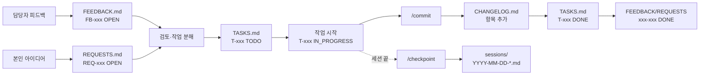

# 개발 현황 추적 (`docs/tracking/`)

이 폴더는 개발·피드백·완료 이력을 **파일 4개(+세션 폴더)로 분리 관리**합니다. 각 파일의 책임이 명확해 담당자와 개발자 모두 읽기 쉬움.

---

## ⚠ 상태 관리 출처 — GitHub 이슈 (2026-07-28 전환)

**개발 항목의 진행 상태는 GitHub 이슈가 정본입니다.** 상태를 바꿀 때는 이슈의 `상태:` 라벨과 제목 접두사를 갱신하십시오(제목 접두사는 `.github/workflows/issue-title-status.yml`이 라벨과 동기화).

| 출처 | 역할 | 갱신 |
|---|---|---|
| **GitHub 이슈** | **진행 상태 정본** — 상태 라벨 · 도면 라벨 · `생산 필수` | 작업할 때마다 |
| `2D 자동 제작도 개발 현황.xlsx` | **읽기 전용 스냅샷** (기준일 2026-07-26) | **갱신하지 않음** |
| [데이터 매핑 기준](../기술%20노트/데이터%20매핑%20기준.md) | UDA·API 출처 계약 (요구사항·UDA 시트 이관) | 배선이 바뀔 때 |
| [개발현황-보고.html](../장표/개발현황-보고.html) | 경영 보고용 집계 장표 | 보고 시점마다 |

**Excel을 지우지 않고 남겨둔 이유** — 관리 항목 85행 전부가 이슈로 연결돼 있고 판정 컬럼·날짜도 이슈 본문에 이관됐지만, `완료 확인일` 기준의 시점 분석(출장 전후 등)은 GitHub만으로 재현할 수 없습니다. 모든 이슈가 2026-07-21 이후에 생성됐기 때문입니다. 감사 추적용으로 보관합니다.

**연결 정보 위치** — 이슈 본문 `<!-- excel-meta -->` 58행 + 이 폴더 `tasks/*.md`의 `GitHub issue #N · Excel No.M` 표기 27행. `scripts/backfill_issues.py`가 양쪽을 읽어 판정합니다.

---

## 파일별 역할

| 파일 | 역할 | 주 작성자 | 상태 체계 |
|---|---|---|---|
| [FEEDBACK.md](./FEEDBACK.md) | **입력(외부)** — 담당자 피드백 원문 보존 | Claude가 사용자로부터 전달받아 기록 | `OPEN` / `IN_REVIEW` / `ACCEPTED` / `REJECTED` / `DONE` |
| [REQUESTS.md](./REQUESTS.md) | **입력(내부)** — 본인 수정 요청 + 결정 맥락 | Claude가 사용자 아이디어를 기록 | `OPEN` / `IN_REVIEW` / `ACCEPTED` / `REJECTED` / `DONE` |
| [TASKS.md](./TASKS.md) (인덱스) + [tasks/](./tasks/) | **처리** — 실행 가능한 작업 단위로 분해. 2026-07-22부터 상태별 파일(`tasks/{TODO,IN_PROGRESS,BLOCKED,DONE}.md`)로 분리, `TASKS.md`는 인덱스 | 개발자 + Claude | `TODO` / `IN_PROGRESS` / `BLOCKED` / `DONE` |
| [CHANGELOG.md](./CHANGELOG.md) | **출력** — 커밋/릴리즈 완료 이력 (날짜 역순) | Claude가 `/commit` 시 자동 추가 | — |
| [sessions/](./sessions/) | **맥락** — 세션별 "무엇을 왜 했는지" + 이어갈 지점 | Claude가 `/checkpoint` 시 저장 | — |

---

## ID 체계

상호 참조를 위해 **3자리 시리얼 + 접두어**를 사용합니다:

| 접두어 | 용도 | 예시 |
|---|---|---|
| `FB-` | FEEDBACK 항목 (담당자) | `FB-001`, `FB-002` |
| `REQ-` | REQUESTS 항목 (본인) | `REQ-001`, `REQ-015` |
| `T-` | TASK 항목 | `T-001`, `T-034` |

- 시리얼은 파일 내부에서 순차 증가. 삭제해도 번호 재사용 금지.
- TASK가 FEEDBACK/REQUESTS에서 유래하면 `T-034 (from FB-012)` 또는 `T-034 (from REQ-007)` 형식으로 명시.
- CHANGELOG에 기록할 때도 관련 ID를 함께 적음.

---

## 워크플로우

---

## 담당자에게 공유하는 방법

| 상황 | 추천 방법 |
|---|---|
| GitHub 접근 가능 | 저장소 `docs/tracking/` 링크 공유 (렌더링된 마크다운 그대로 읽힘) |
| GitHub 접근 어려움 | 주요 파일 3개(FEEDBACK/TASKS/CHANGELOG)를 주기적으로 PDF·출력물로 공유 |
| 피드백 수신 채널 | 개발자가 음성/메신저로 받은 내용을 `FEEDBACK.md`에 원문 기록 |
