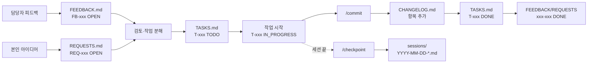

# 개발 현황 추적 (`docs/tracking/`)

이 폴더는 개발·피드백·완료 이력을 **파일 4개(+세션 폴더)로 분리 관리**합니다. 각 파일의 책임이 명확해 담당자와 개발자 모두 읽기 쉬움.

---

## 파일별 역할

| 파일 | 역할 | 주 작성자 | 상태 체계 |
|---|---|---|---|
| [FEEDBACK.md](./FEEDBACK.md) | **입력(외부)** — 담당자 피드백 원문 보존 | Claude가 사용자로부터 전달받아 기록 | `OPEN` / `IN_REVIEW` / `ACCEPTED` / `REJECTED` / `DONE` |
| [REQUESTS.md](./REQUESTS.md) | **입력(내부)** — 본인 수정 요청 + 결정 맥락 | Claude가 사용자 아이디어를 기록 | `OPEN` / `IN_REVIEW` / `ACCEPTED` / `REJECTED` / `DONE` |
| [TASKS.md](./TASKS.md) | **처리** — 실행 가능한 작업 단위로 분해 | 개발자 + Claude | `TODO` / `IN_PROGRESS` / `BLOCKED` / `DONE` |
| [CHANGELOG.md](./CHANGELOG.md) | **출력** — 커밋/릴리즈 완료 이력 (날짜 역순) | Claude가 `/commit` 시 자동 추가 | — |
| [sessions/](./sessions/) | **맥락** — 세션별 "무엇을 왜 했는지" + 이어갈 지점 | Claude가 `/checkpoint` 시 저장 | — |

---

## ID 체계

상호 참조를 위해 **3자리 시리얼 + 접두어**를 사용합니다:

| 접두어 | 용도 | 예시 |
|---|---|---|
| `FB-` | FEEDBACK 항목 (담당자) | `FB-001`, `FB-002` |
| `REQ-` | REQUESTS 항목 (본인) | `REQ-001`, `REQ-015` |
| `T-` | TASK 항목 | `T-001`, `T-034` |

- 시리얼은 파일 내부에서 순차 증가. 삭제해도 번호 재사용 금지.
- TASK가 FEEDBACK/REQUESTS에서 유래하면 `T-034 (from FB-012)` 또는 `T-034 (from REQ-007)` 형식으로 명시.
- CHANGELOG에 기록할 때도 관련 ID를 함께 적음.

---

## 워크플로우

---

## 담당자에게 공유하는 방법

| 상황 | 추천 방법 |
|---|---|
| GitHub 접근 가능 | 저장소 `docs/tracking/` 링크 공유 (렌더링된 마크다운 그대로 읽힘) |
| GitHub 접근 어려움 | 주요 파일 3개(FEEDBACK/TASKS/CHANGELOG)를 주기적으로 PDF·출력물로 공유 |
| 피드백 수신 채널 | 개발자가 음성/메신저로 받은 내용을 `FEEDBACK.md`에 원문 기록 |
