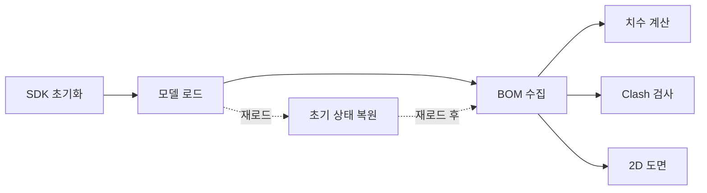

# BOM 기능

`Form1.BOM.cs` 소속. 3D 모델에서 부재 목록(BOM)을 추출하고 UDA/홀 정보를 수집합니다.

## 기능 목록
| ID | 기능 | 트리거 | 유형 | 문서 |
|---|---|---|---|---|
| BOM-001 | VIZCore3D 초기화 완료 | Vizcore3d_OnInitializedVIZCore3D | Event Callback | [vizcore3d-initialized](./VIZCore3D%20초기화.md) |
| BOM-002 | 모델 파일 열기 | btnOpen_Click | User Action | [open-model](./모델%20열기.md) |
| BOM-003 | BOM 수집 (홀 감지 포함) | btnCollectBOM_Click | User Action | [collect-bom](./BOM%20수집.md) |
| BOM-004 | 메인 체인 치수 계산 | btnMainDimension_Click | User Action | [main-dimension](./메인%20치수%20추출.md) |
| BOM-005 | 초기 상태로 복원 (모델 재로드) | btnResetToInitial_Click | User Action | [reset-to-initial](./초기화.md) |

## 데이터 의존성

## 주요 생성 상태
- `bomList : List<BOMData>`
- `bodyToPartNameMap`, `bodyToPartIndexMap`
- `bomInfoNodeGroupMap`
- `chainDimensionList : List<ChainDimensionData>`
