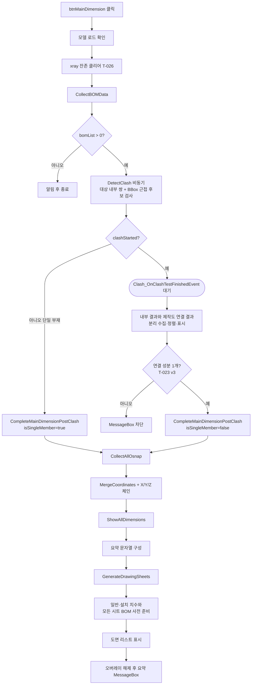
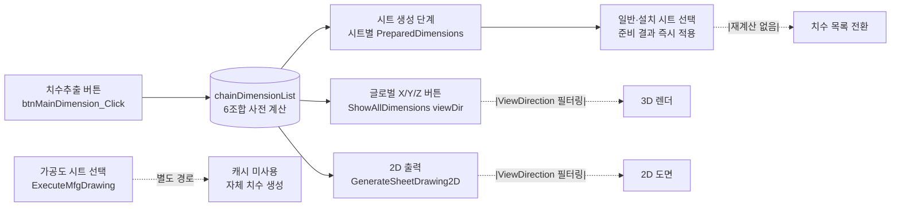

# 메인 체인 치수 추출 (자동 파이프라인)

## 1. 개요
**원클릭 통합 처리 버튼**: BOM 수집 → **Clash 검사 → 연결성 판정** → Osnap 수집 → X/Y/Z 체인 치수 계산 → 시트 생성 → **모든 시트 조회 데이터 준비** → 목록 표시. Clash가 먼저 수행되고 **모든 부재가 한 덩어리로 연결되어 있어야** Osnap·치수 파이프라인이 이어진다.

> **T-029 이후**: 본 버튼은 `chainDimensionList`·`lvDimension` 데이터만 채우고 **3D 뷰에 치수선은 그리지 않는다**. 실제 3D 뷰 치수 렌더링은 사용자가 글로벌 X/Y/Z 뷰 버튼(`ApplyGlobalView`)을 눌러 `ShowAllDimensions(viewDirection)`이 호출될 때 수행. 치수·시트가 실제로 만들어지는 시점은 `Clash_OnClashTestFinishedEvent`(비동기).

## 2. 트리거
| 항목 | 값 |
|---|---|
| 유형 | User Action |
| 입력 | `btnMainDimension` 버튼 클릭 |
| 위치 | 메인 폼 > 자동 처리 |

## 3. 사전 조건
- [ ] 3D 모델 로드됨 ([BOM-002](./모델 열기.md))
- [ ] **모든 visible 부재가 Clash 인접 그래프 기준 한 덩어리로 연결** (T-023 v3) — 떨어진 부재가 하나라도 있으면 [E03] 차단. 판정은 Clash 결과가 나온 뒤 `Clash_OnClashTestFinishedEvent`에서 수행

## 4. 전체 동작 흐름 (Happy Path)

### `btnMainDimension_Click` (동기, Clash 시작까지)
| # | 단계 | 주체 | 설명 |
|---|---|---|---|
| 1 | 모델 확인 | Form1 | `vizcore3d.Model.IsOpen()` → [E01] |
| 2 | **xray 잔존 클리어** (T-026) | Form1 | `xraySelectedNodeIndices.Clear()` — 이전 시트 선택 잔존으로 "이전 부재 기준" 결과가 반복되던 버그 방지 |
| 3 | **오버레이 표시** (T-018) | UI | `ShowBusyOverlay("BOM 수집 중...")` |
| 4 | BOM 재수집 | Form1 | `CollectBOMData()` — 가시성 반영 위해 매번 재수집 |
| 5 | BOM 확인 | Form1 | `bomList.Count == 0` → [E02] (오버레이 해제 후 return) |
| 6 | Clash 시작 | Form1 | `ShowBusyOverlay("간섭검사 실행 중...")` → `DetectClash(includeOutsideNeighbors: true)`. 대상 내부 쌍은 연결성 판정에 사용. 제작도 연결 부재는 전체 Body Bounding Box 캐시에서 3mm 근접 후보만 선별한 뒤 별도 그룹 Clash로 산출 |
| 7 | 단일 부재 fallback (T-024) | Form1 | `!clashStarted` → `CompleteMainDimensionPostClash(isSingleMember: true, clashTestCount: 0)` 직접 호출. Clash 이벤트 미발동이지만 연결 성분 1개로 간주하고 나머지 파이프라인 수행 |
| 8 | 진입 종료 | Form1 | 오버레이는 유지. 실제 치수·시트 생성은 `Clash_OnClashTestFinishedEvent`가 맡음 |

### `Clash_OnClashTestFinishedEvent` (비동기, 판정 + 후속 파이프라인)
| # | 단계 | 주체 | 설명 |
|---|---|---|---|
| 9 | Clash 결과 수집 | Form1 | `ClashTest` 순회 → `GetResultItem(PART)`. 대상 내부 결과는 `clashList`, 제작도 연결 결과는 전용 리스트·Part 집합으로 분리. `lvClash`에는 연결 결과를 `[연결]` 접두어로 함께 표시 |
| 10 | **연결성 판정** (T-023 v3) | Form1 | `IsSingleConnectedComponent(out componentCount)` — Clash 인접 그래프 BFS로 연결 성분 수 계산. ≠ 1이면 [E03] 차단 |
| 11 | `CompleteMainDimensionPostClash` 호출 | Form1 | `isSingleMember=false`, `clashTestCount=testCount` 전달 |

### `CompleteMainDimensionPostClash` (공용, 판정 통과 이후)
| # | 단계 | 주체 | 설명 |
|---|---|---|---|
| 12 | Osnap 수집 | Form1 | `ShowBusyOverlay("Osnap 수집 중...")` → `CollectAllOsnap()` → `_autoProcessOsnapSuccess` 저장 (`osnapPointsWithNames`·`lvOsnap` + **T-032**: 부재별 맵 `_lastCollectedNodeOsnapMap`도 같이 채움) |
| 13 | **치수 계산 통합** (T-028 + T-032 최적화) | Form1 | `ShowBusyOverlay("치수 계산 중...")` → visible 부재 목록 산출 → `ComputeViewDimensionsForMembers(visibleMembers, null, 0.5f, _lastCollectedNodeOsnapMap)` 호출. **`_lastCollectedNodeOsnapMap` 전달로 GetOsnapPoint 중복 호출 제거** (T-032). 3뷰 × 2축 = 6조합 치수 생성 + 중복 제거. 2D 출력·글로벌 X/Y/Z·시트 선택 자동 모두 이 공용 헬퍼 재사용. `Stopwatch`로 소요 시간 측정, `DiagLog T-032 치수 계산: visibleMembers=N osnapMapNodes=K chain=M ComputeViewDimensionsForMembers=Xms` |
| 14 | `lvDimension` 갱신 | UI | 번호·축·뷰이름·거리·좌표 표시 |
| 14.5 | **3D 뷰 정리** (T-029) | SDK | `Review.Measure.Clear()` + `ShapeDrawing.Clear()` — 이전 렌더 잔존 제거. **3D 뷰 치수선은 그리지 않음**. 사용자가 글로벌 X/Y/Z 뷰 버튼 눌러야 `ShowAllDimensions(viewDir)`가 `chainDimensionList`에서 해당 뷰 필터링해 렌더링 |
| 15 | ListView 갱신 | UI | No/Axis/ViewName/Distance/Start/End |
| 16 | 치수 3D 표시 | SDK | `ShowAllDimensions()` |
| 17 | 요약 MessageBox | UI | BOM/Osnap/치수/Clash 개수 통합 (단일 부재 시 "간섭검사 건너뜀") |
| 18 | 시트 생성·조회 준비 | Form1 | `GenerateDrawingSheets()` — 시트 구성을 만든 뒤 일반·설치 시트 치수와 모든 시트 BOM을 사전 준비. Sheet 1은 단계 13 결과를 재사용하고 준비 완료 후 목록 표시 |
| 19 | 오버레이 해제 | UI | `finally { HideBusyOverlay(); }` — 정상·예외 모두 |

> 최종 결과 요약 알림은 [Clash 완료 콜백](../간섭검사/간섭검사 완료 이벤트.md)에서 표시됨

> 구현 상세는 [코드 레퍼런스](../../code-reference/form1-bom.md#btnMainDimension_Click) 참고

## 5. 주요 분기 처리

### [분기 A] Osnap 수집 성공 여부
| 조건 | 처리 |
|---|---|
| osnapSuccess && osnapPointsWithNames.Count > 0 | 치수 추출 진행 (Step 5~8) |
| 실패 | 치수 추출 건너뛰기, Clash만 실행 |

### [분기 B] 축별 가시성 (xraySelectedNodeIndices)
| 조건 | 처리 |
|---|---|
| xraySelectedNodeIndices.Count > 0 | 선택 부재만 대상 |
| 비어있음 | `FromIndex().Visible`로 필터, 없으면 전체 |

### [분기 C] Clash 시작 성공 여부 (T-024)
| 조건 | 처리 |
|---|---|
| `clashStarted == true` | `Clash_OnClashTestFinishedEvent`가 비동기로 결과 수집 → **연결성 판정** → 통과 시 `CompleteMainDimensionPostClash(false, testCount)` |
| `clashStarted == false` (단일 부재, 쌍 0개, SDK 예외) | 본 핸들러에서 즉시 `CompleteMainDimensionPostClash(true, 0)` 호출 — 단일 부재는 연결 성분 1개로 간주, 판정 생략 |

### [분기 D] 연결성 판정 (T-023 v3)
| 조건 | 처리 |
|---|---|
| `IsSingleConnectedComponent(out n)` true (n == 1) | Osnap·치수·시트 생성 계속 |
| false (n ≥ 2) | MessageBox "서로 연결되지 않은 부재 그룹 N개 발견" → return. 치수도 시트도 만들지 않음 |

> 판정 기준: `clashList`의 Part 쌍을 Body 기반 양방향 인접 리스트로 구축 → BFS로 연결 성분 수 계산. `bomList.Count == 1`은 항상 통과.

## 6. 예외 / 에러 처리

| ID | 조건 | 동작 | 사용자 피드백 | 결과 상태 |
|---|---|---|---|---|
| E01 | 모델 미로드 | return | MessageBox "먼저 파일을 열어주세요." | 상태 변화 없음 |
| E02 | `bomList.Count == 0` | return | MessageBox "BOM 데이터를 수집할 수 없습니다." | BOM 재수집만 시도됨 |
| E03 | **연결 성분 ≥ 2** (T-023 v3) | `Clash_OnClashTestFinishedEvent`에서 return | MessageBox "치수 추출은 모든 부재가 하나의 덩어리로 연결되어 있을 때만 가능합니다. 현재: 서로 연결되지 않은 부재 그룹 N개 발견. 해결: 떨어진 부재를 숨기거나 한 덩어리만 선택" | Osnap·치수·시트 모두 **미생성**. `DiagLog`에 `BLOCKED components=N (T-023 v3)` |
| E04 | 처리 중 예외 | catch | MessageBox "치수 추출 중 오류: {msg}" | 부분 반영 가능 |

## 7. 상태 변화 (Before / After)

| 대상 | Before | After |
|---|---|---|
| `bomList` | 이전 상태 | 재수집 완료 |
| `osnapPoints`, `osnapPointsWithNames` | 이전 | 현재 모델 Osnap (LINE/POINT만, CIRCLE 제외) |
| `chainDimensionList` | 이전 | 6조합 치수 + 중복 제거 (T-028) |
| `_autoProcessOsnapSuccess` | 이전 | 현재 수집 성공 여부 |
| `clashList` | 이전 | 비동기 완료 후 대상 내부 간섭만 저장. 연결성 판정도 이 목록만 사용 |
| 제작도 연결 결과 | 이전 | Bounding Box 근접 후보의 정밀 Clash 결과를 전용 리스트·Part 집합에 저장. 2D 제작도 점선 대상과 `lvClash`의 `[연결]` 행에 사용 |
| `lvDimension` | 이전 | 갱신된 치수 행 |
| **3D 뷰 치수(`Review.Measure`)** (T-029) | 이전 렌더 | **비어 있음**. 글로벌 뷰 버튼 클릭 시 `ShowAllDimensions(viewDir)`이 렌더 |

## 7.5. 치수 캐시 라이프사이클 (T-049)

회사 doc "긴급중 3" 의문 — *"치수 추출 후 3D View창에 치수 표기 안되게 처리 했는데 치수가 저장되어 있는건지 어떻게 되는건지 치수추출 버튼 누르면 앞뒤로 무슨 로직이 돌아가는지"* — 에 대한 정리.

### 7.5.1. 캐시의 정체

`chainDimensionList` (Form1.cs 멤버) 가 **단일 진실 공급원**. 본 버튼이 BOM 수집 → 연결성 판정 → Osnap 수집 후 `ComputeViewDimensionsForMembers(visibleMembers, viewDirection: null)` 한 번 호출로 **3뷰 × 2축 = 6조합 치수**를 사전 계산해 이 리스트에 적재. 이후 **모든 사용 경로는 이 리스트를 읽기만 함** (재계산 없음).

각 `ChainDimensionData`는 [`Models.cs:9~49`](../../../A2Z/Models.cs)에 정의되며, 핵심 필드:
- `Axis` (`X`/`Y`/`Z`) — 치수가 측정하는 축
- `ViewDirection` (`X`/`Y`/`Z` 또는 콤마 구분 `"X,Y"`) — 이 치수가 보이는 뷰 (T-028에서 도입)
- `StartPoint`/`EndPoint` — 3D 좌표
- `Distance` / `IsTotal` / `Priority` / `IsVisible`

### 7.5.2. 4경로 + 캐시 흐름

### 7.5.3. 경로별 사용 양상

| 경로 | 캐시 사용 방식 | 재계산 여부 |
|---|---|---|
| **치수추출 버튼** (`CompleteMainDimensionPostClash`) | 6조합 신규 작성 → `chainDimensionList`에 저장. 3D 뷰는 `Measure.Clear()` + `ShapeDrawing.Clear()`만 (T-029) | 신규 계산 (1회) |
| **글로벌 X/Y/Z 버튼** (`ApplyGlobalView` → `ShowAllDimensions(viewDirection)`) | `chainDimensionList`에서 `ViewDirection.Contains(viewDirection)` 항목 필터링해 `Review.Measure`로 렌더. 추가 계산 없음 | 없음 |
| **2D 출력** (`GenerateSheetDrawing2D` → `ShowAllDimensions("X" 등, forDrawing2D=true)`) | 위와 동일한 필터링 + 2D 변환 (`Add2DMeasureFrom3DMeasure`) | 없음 |
| **일반·설치 시트 선택** (`LvDrawingSheet_SelectedIndexChanged`, `BaseMemberIndex >= 0` 또는 `-1`/`-2`) | 목록 표시 전에 저장한 `PreparedDimensions`를 `chainDimensionList`·`lvDimension`에 적용. Sheet 1은 최초 계산 결과 재사용 | **클릭 시 없음** |
| **가공도 시트 선택** (`-3`, `ExecuteMfgDrawing`) | **별도 경로** — 단일 부재 기준 자체 치수 생성 (`mfgDimensions` 임시 리스트). `chainDimensionList`와 무관 | 별도 |

### 7.5.4. 사용자 시각으로

1. **치수추출 버튼 클릭** → 3D 뷰는 깨끗 (T-029). `lvDimension`에 결과 행만 표시. `chainDimensionList`에 6조합 저장
2. **글로벌 X 버튼 클릭** → `chainDimensionList`에서 X 뷰 항목 필터링해 3D 뷰에 렌더. **재계산 없음** — 즉시 표시
3. **2D 출력 버튼** → `chainDimensionList` 그대로 사용해 2D 도면 생성. 캐시 덕분에 빠름
4. **일반·설치 시트 선택** → 준비된 시트 치수로 `chainDimensionList`만 전환. 첫 클릭도 재계산하지 않으며 이후 글로벌 X/Y/Z는 선택 시트 기준으로 작동

### 7.5.5. T-032 성능 최적화 연계 → E1 (2026-05-18) 4경로 완성

**T-032 (2026-04-22) 1차 적용**: 치수추출 버튼 경로(`CompleteMainDimensionPostClash`)에서만 `_lastCollectedNodeOsnapMap` 재사용. 다른 3경로(시트 선택·2D 출력 legacy·2D 출력 Excel)는 `null` 전달로 시트마다 재수집.

**E1 (2026-05-18) 4경로 전체 적용**:
- 호출자 3곳(`Form1.DrawingSheets.cs` L614·L1363·L1698) 모두 `_lastCollectedNodeOsnapMap` 전달
- 본체(`ComputeViewDimensionsForMembers`)에 **하이브리드 fallback** 보강:
  - 캐시 hit 부재: `GetOsnapPoint` 호출 없이 즉시 재사용
  - 캐시 miss 부재(예: STRU 전환 후 다른 부재 집합): 그 부재만 `GetOsnapPoint`로 보충
- 결과: 캐시 신선도 무관하게 모든 부재 커버 보장 + 시트당 1~3초 단축 (캐시 hit 비율에 비례)
- `DiagLog "E1 Osnap cache: hit=N miss=M members=K preBuilt=L"`로 효과 측정 가능
- 2026-07-21부터 일반·설치 시트 결과를 목록 표시 전에 `DrawingSheetData.PreparedDimensions`에 저장하므로 시트 클릭 경로에서는 이 엔진을 다시 호출하지 않음

---

## 8. 후행 기능 (Chained)
- [Clash 완료 콜백](../간섭검사/간섭검사 완료 이벤트.md) — 자동 호출
- 이후 [시트 자동 분할](../도면시트/시트 자동 생성.md) — Clash 결과 있으면 자동
- [축별 치수 필터](../치수/X축 치수 표시.md)

## 9. 관련 링크
- 코드 구현: [Form1.BOM.cs:L283](../../code-reference/form1-bom.md#btnMainDimension_Click)
- 용어집: [Osnap](../../_glossary.md#osnap-object-snap), [Chain Dimension](../../_glossary.md#chain-dimension-체인-치수)
- 상위 파이프라인: [전체 파이프라인](../../_pipeline.md)

## 10. 변경 이력
| 날짜 | 변경 내용 | 작성자 |
|---|---|---|
| 2026-07-21 | 도면 리스트 첫 클릭 지연 제거: `GenerateDrawingSheets`가 목록 표시 전에 일반·설치 시트 치수와 모든 시트 BOM을 준비. Sheet 1 치수는 본 핸들러의 기존 결과를 재사용하고 시트 선택은 준비 결과만 적용하도록 치수 캐시 라이프사이클 갱신 | Codex |
| 2026-07-21 | 제작도 연결 탐색을 `모델 전체 정밀 Clash`에서 `전체 Body BBox 1회 캐시 → 3mm 근접 후보 → 후보만 전용 Clash`로 변경. 결과는 내부 연결성 `clashList`와 분리하고 `lvClash`에 `[연결]` 행으로 표시 | Codex |
| 2026-07-21 | 제작도 주변 점선 데이터 확보를 위해 `DetectClash(includeOutsideNeighbors: true)`로 전환. 현재 BOM 대상 내부 쌍 검사에 `대상 vs 모델 나머지 Part` 그룹 검사 1건을 추가하며, 외부 Part 결과는 제작도 점선 산출에만 쓰고 BOM 연결성 판정에는 포함하지 않음 | Codex |
| 2026-04-13 | 초안 작성 | — |
| 2026-04-22 | T-018: 3D 뷰어 중앙 "처리 중..." 오버레이 라벨 추가 — BOM 수집 → Osnap → 치수 계산 → Clash 시작의 각 단계 진입 시 라벨 메시지 갱신. 공통 헬퍼 `ShowBusyOverlay`/`HideBusyOverlay`는 [Form1.cs](../../code-reference/form1-bom.md)에 신설. 핸들러는 try/finally로 감싸 예외 시에도 오버레이 해제 보장. 5초 공백 UX 문제 해결 | Claude |
| 2026-04-22 | T-024: `DetectClash()` 반환값을 받아 **`clashStarted == false`일 때 fallback 경로** 추가 — 단일 부재(쌍 0개)·SDK 예외는 `Clash_OnClashTestFinishedEvent` 미발동이므로 `GenerateDrawingSheets()` + 요약 MessageBox를 직접 호출해 시트 목록 미갱신 버그 해결. 단계표 10→13 재번호, 분기 C 신설 | Claude |
| 2026-04-22 | T-023: 단일 부재 가드 추가 — `IsOpen` 확인 직후 `GetPartialNode` + `FromFilter(SELECTED_TOP)`로 visible·selected 카운트 계산, 둘 다 ≠ 1이면 MessageBox 후 return. 사전 조건에 항목 추가, 단계 1.5 추가, E03 신설, 기존 E03은 E04로 재번호 | Claude |
| 2026-04-22 | T-023 재설계 — 사용자 의도는 "부재 개수"가 아니라 "STRU(UDA 상위 단위) 1개"로 판정. 기존 visible/selected==1 가드 **제거**. 새 `FindAncestorByUda` + `CheckSingleStruCondition` 헬퍼를 [Form1.BOM.cs 하단 주석 블록](../../code-reference/form1-bom.md)에 완성 형태로 보존(UDA 키·값 확정 시 `/* */` 해제만으로 활성화). 분기 D 추가, E03·E04 재정렬, 단계 1.5 "비활성" 표기. 사용자 매뉴얼의 에러 ③도 원복 | Claude |
| 2026-04-22 | T-026: 진입부에 `xraySelectedNodeIndices.Clear()` 추가 — 이전 시트 선택이 `CollectBOMData` X-Ray 필터(L591)에 계속 반영되어 "1개 부재 기준" 결과가 반복되던 잔존 상태 버그. 로그 근거: `btnMainDimension ENTER xray=1 ... EXIT chain=32`가 부재 1개 띄웠을 때와 동일 재현. 단계 1.3 추가 | Claude |
| 2026-04-22 | **T-023 v3 재재설계** — "STRU 단위"에서 **"Clash 기반 물리적 연결성 1덩어리"** 로 변경. 사용자 결정(정확성 우선). STRU 주석 블록 2개 제거. 파이프라인 순서 재배치 — Osnap/치수 로직을 `btnMainDimension_Click`에서 **`CompleteMainDimensionPostClash`** 공용 메서드로 분리하고, `Clash_OnClashTestFinishedEvent`에서 `IsSingleConnectedComponent` 판정 후 호출. 단일 부재(clashStarted=false)는 판정 생략하고 Post 메서드 직접 호출(T-024와 통합). 흐름도·단계표(3섹션)·분기 C·D·E03·E04·last_updated 모두 갱신 | Claude |
| 2026-04-22 | T-027: 치수 계산 단계(13) 직후 `FilterOsnapByViewDimensionUsage` 호출 추가(단계 13.5) — 도면 뷰×치수축 6개 조합의 1차 필터 endpoint 합집합만 `AddChainDimensionByAxis` 입력으로 사용. 3D 뷰 체인 치수 개수 감소(필터 전/후 DiagLog 기록). osnap 원본 리스트는 보존해 다른 기능(제작도·가공도) 영향 없음. 방식: (a) 체인 치수만 / β (endpoint 합집합 1회 산출 후 축별 1벌) | Claude |
| 2026-04-22 | **T-028**: 4경로(치수추출·글로벌 X/Y/Z·2D 출력·시트 선택 자동) 치수 엔진 통합. 2D 출력 엔진(`nodeOsnapMap` + `FilterOsnapForDimAxis` + `AddChainDimensionByAxis(viewDirection)`)을 `ComputeViewDimensionsForMembers` 공용 헬퍼로 추출. 본 핸들러는 단계 13에서 visible 부재를 이 헬퍼에 넘겨 3뷰 × 2축 = 6조합 치수를 한 번에 생성(중복 제거 + `ViewDirection` 콤마 누적). T-027 `FilterOsnapByViewDimensionUsage` 제거. `ShowAllDimensions` 내부 분기 ①②③ 제거되어 표시 전용으로 단순화. 단계표 12·13·14 재번호 | Claude |
| 2026-04-22 | **T-029**: 치수추출 버튼 완료 직후 `ShowAllDimensions()` 호출 **제거**. 대신 `Review.Measure.Clear()` + `ShapeDrawing.Clear()`로 이전 렌더 잔존 정리. 3D 뷰는 "치수선 없는 깨끗한 상태"로 종료되고, 사용자가 글로벌 X/Y/Z 뷰 버튼을 눌러야 실제 치수선이 그려짐. 단계 14.5 추가, 상태 변화에 `Review.Measure` 행 갱신 | Claude |
| 2026-04-22 | **T-032**: `CollectAllOsnap` 내부에 **부재별 Osnap 맵**(`_lastCollectedNodeOsnapMap`) 병행 구축. `ComputeViewDimensionsForMembers`에 `preBuiltNodeOsnapMap` 파라미터 추가해 치수추출 버튼 경로에서 `GetOsnapPoint` 중복 호출 제거. `Stopwatch`로 소요 시간 측정, `DiagLog T-032` 기록. 시트 선택 자동 경로(다른 부재 집합)는 null 전달해 내부 재구축 유지. 단계 12·13 재기술 | Claude |
| 2026-04-22 | **T-033**: `CompleteMainDimensionPostClash` 후반 순서 재배치 — 기존 `MessageBox → GenerateDrawingSheets → finally HideBusyOverlay` → 신 `GenerateDrawingSheets → HideBusyOverlay → MessageBox`. 팝업 뜰 때 오버레이 잔존 + 팝업 닫힌 후 시트 생성 중 오버레이 2초 더 떠있던 UX 문제 해결. finally의 HideBusyOverlay는 예외 안전망으로 유지 | Claude |
| 2026-05-02 | **T-049**: Section 7.5 "치수 캐시 라이프사이클" 신설 — 회사 doc "긴급중 3" 의문(*"치수추출 버튼 누르면 앞뒤로 무슨 로직이 돌아가는지"*)에 대한 답변 정리. `chainDimensionList`를 단일 진실 공급원으로, 4경로(치수추출 / 글로벌 X/Y/Z / 2D 출력 / 일반 시트 / 가공도) + 캐시 사용 양상을 mermaid + 표로 명시. 사용자 시각 단계별 흐름 + T-032 성능 최적화 연계 포함. 코드 변경은 없으며 회사 답변용 docs 보강 | Claude |
| 2026-05-06 | **T-058**: `ShowAllDimensions`에서 `AlignDistanceTextPosition = 0 → 2` (보조선 바깥 배치). 회사 doc "개발 요청 — 상 5" 사양 반영, 좁은 치수에서 텍스트가 보조선 사이를 침범하는 문제 회피. SDK 글로벌 옵션이라 모든 치수 일괄 적용. 통합 사양: [docs/기술 노트/치수 텍스트 위치.md](../../기술 노트/치수 텍스트 위치.md) | Claude |
