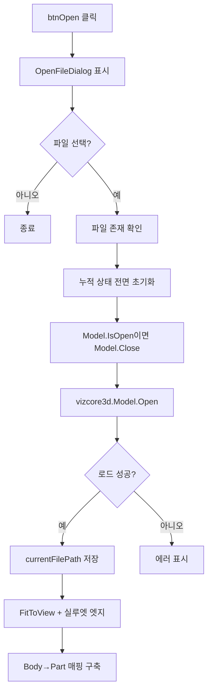

# 모델 파일 열기

## 1. 개요
사용자가 3D 모델 파일(.vizx/.viz)을 선택하여 VIZCore3D에 로드한다. 로드 전 **모든 누적 상태를 초기화**하여 깨끗한 시작 상태를 보장한다.

## 2. 트리거
| 항목 | 값 |
|---|---|
| 유형 | User Action |
| 입력 | `btnOpen` 버튼 클릭 |
| 위치 | 메인 툴바 |

## 3. 사전 조건
- [ ] VIZCore3D 초기화 완료 ([BOM-001](./VIZCore3D 초기화.md))
- [ ] 라이선스 유효

## 4. 전체 동작 흐름 (Happy Path)

| # | 단계 | 주체 | 설명 |
|---|---|---|---|
| 1 | 파일 선택 | UI | `OpenFileDialog` 표시, 확장자 필터 `.vizx;.viz` |
| 2 | 파일 존재 확인 | Form1 | `File.Exists` → [E01] |
| 3 | 누적 상태 초기화 | Form1 | [§7 상태 변화] 참조 — bomList/clashList/osnap* 등 전부 Clear |
| 4 | SDK 내부 정리 | SDK | `Review.Measure.Clear()`, `ShapeDrawing.Clear()`, `Review.Note.Clear()` |
| 5 | **모델 Close (중복 열림 방지)** | SDK | `IsOpen()`이면 `Model.Close()`. 사용자가 동일 파일을 재선택한 경우 이 단계가 없으면 `Model.Open`이 false를 반환 |
| 6 | 모델 로드 | SDK | `vizcore3d.Model.Open(path)` → bool 반환 |
| 7 | 성공 처리 | Form1 | `currentFilePath = path`, `FitToView()` |
| 8 | 실루엣 엣지 | SDK | `View.SilhouetteEdge = true`, 색상 Green |
| 9 | Body→Part 매핑 | Form1 | `BuildBodyToPartNameMap()` 호출 |

> 구현 상세는 [코드 레퍼런스](../../code-reference/form1-bom.md#btnOpen_Click) 참고

## 5. 주요 분기 처리

### [분기 A] 파일 다이얼로그 결과
| 조건 | 처리 |
|---|---|
| `DialogResult.OK` | Step 2로 진행 |
| 그 외 (취소/닫기) | 조용히 종료, 상태 변화 없음 |

### [분기 B] 모델 로드 결과
| 조건 | 처리 |
|---|---|
| `Model.Open` == true | 후속 초기화 진행 |
| `Model.Open` == false | [E02] |

## 6. 예외 / 에러 처리

| ID | 조건 | 동작 | 사용자 피드백 | 결과 상태 |
|---|---|---|---|---|
| E01 | 파일이 존재하지 않음 | return | MessageBox "선택한 파일이 존재하지 않습니다." | 상태 변화 없음 |
| E02 | `Model.Open` 실패 | 처리 중단 | MessageBox "파일 열기 실패 ... 라이선스나 파일 형식 확인" | **초기화는 이미 수행됨** → 빈 상태 |
| E03 | 예외 throw | catch 흡수 | MessageBox "파일 열기 중 예외 발생: {msg}" | 부분 초기화 상태 |

> ⚠️ E02/E03 발생 시 상태가 "모델 없음 + 빈 리스트"가 되어, 이전 모델 정보는 이미 잃은 상태. 사용자는 재로드 필요.

## 7. 상태 변화 (Before / After)

### Form1 공유 필드 (모두 초기화)
| 대상 | Before | After |
|---|---|---|
| `bomList` | 이전 모델 데이터 | 빈 리스트 |
| `clashList` | 이전 결과 | 빈 리스트 |
| `osnapPoints` | 이전 데이터 | 빈 리스트 |
| `osnapPointsWithNames` | 이전 데이터 | 빈 리스트 |
| `chainDimensionList` | 이전 치수 | 빈 리스트 |
| `xraySelectedNodeIndices` | 이전 선택 | 빈 리스트 |
| `drawingSheetList` | 이전 시트 | 빈 리스트 |
| `bodyToPartNameMap` | 이전 매핑 | 로드 후 재구축 |
| `_autoProcessOsnapSuccess` | 이전 값 | false |
| `currentFilePath` | 이전 경로 | 새 파일 경로 |

### SDK 상태
| 대상 | Before | After |
|---|---|---|
| `vizcore3d.Model` | 이전 모델 또는 미로드 | 새 모델 로드됨 |
| `vizcore3d.View.SilhouetteEdge` | false | true (Green) |
| `View.Measure / ShapeDrawing / Note` | 이전 주석 | 모두 Clear |

### UI 상태
- `lvBOM`, `lvClash`, `lvDrawingSheet`, `lvOsnap`, `lvDimension` 모두 Clear

## 8. 후행 기능 (Chained)
- [BOM 수집](./BOM 수집.md)
- [메인 치수 추출](./메인 치수 추출.md)
- [글로벌 뷰 전환](../글로벌뷰/_인덱스.md)
- [속성 조회](../부재속성/객체 선택 이벤트.md)

## 9. 관련 링크
- 코드 구현: [Form1.BOM.cs:L209](../../code-reference/form1-bom.md#btnOpen_Click)
- 용어집: [VIZCore3D](../../_glossary.md#vizcore3d), [.vizx / .viz](../../_glossary.md#vizx-viz)
- 상위 파이프라인: [전체 파이프라인](../../_pipeline.md)

## 10. 변경 이력
| 날짜 | 변경 내용 | 작성자 |
|---|---|---|
| 2026-04-13 | 초안 작성 | — |
| 2026-04-20 | 같은 파일 재선택 시 Open 실패 방지 — `Model.Open` 전 `Model.Close()` 호출 추가 (VIZCore3D SDK 공식 패턴, T-008 파생) | Claude |
