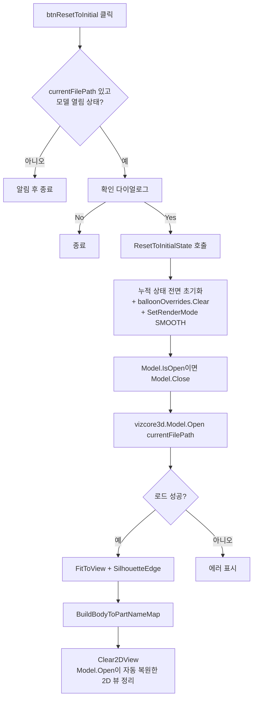

# 초기 상태로 복원 (모델 재로드)

## 1. 개요
현재 로드된 파일을 **동일 경로로 재로드**하여 모든 누적 작업 상태(치수/풍선/시트/X-Ray 선택/수동 풍선 조정 등)를 처음 모델을 열었을 때의 상태로 되돌린다. 파일 선택 다이얼로그는 뜨지 않으며 `currentFilePath`를 재사용한다.

## 2. 트리거
| 항목 | 값 |
|---|---|
| 유형 | User Action |
| 입력 | `btnResetToInitial` 버튼 클릭 |
| 위치 | 3D 뷰어 상단 `panelGlobalViewButtons` (ISO 버튼 왼쪽, 회색) |

## 3. 사전 조건
- [ ] 이미 모델 파일이 한 번 열려 있음 (`currentFilePath` 비어있지 않음)
- [ ] `vizcore3d.Model.IsOpen() == true`
- [ ] VIZCore3D 라이선스 유효

## 4. 전체 동작 흐름 (Happy Path)

| # | 단계 | 주체 | 설명 |
|---|---|---|---|
| 1 | 가드 체크 | Form1 | `currentFilePath` 비었거나 `Model.IsOpen()==false`면 [E01] |
| 2 | 확인 다이얼로그 | UI | Yes/No. No면 조용히 종료 |
| 3 | 누적 상태 초기화 | Form1 | [§7] 참조 — List/Dict 9종 + UI ListView **6종** + SDK Clear **3종 + RenderMode=SMOOTH** |
| 4 | **모델 Close (중복 열림 방지)** | SDK | `IsOpen()`이면 `Model.Close()`. 이 단계가 없으면 같은 경로 재Open 시 false 반환 (VIZCore3D.NET.xml 공식 예제 패턴) |
| 5 | 모델 재로드 | SDK | `vizcore3d.Model.Open(currentFilePath)` → bool |
| 6 | 뷰 세팅 | SDK | `FitToView()`, `SilhouetteEdge=true`, 색상 Green |
| 7 | Body→Part 매핑 | Form1 | `BuildBodyToPartNameMap()` 재구축 |
| 8 | **2D 캔버스 정리** | Form1 | `Clear2DView()` — `Model.Open`이 2D 뷰를 자동 복원하므로 Open **성공 이후**에 호출해야 실제로 비어진 상태로 남음 |

> 구현 상세는 [코드 레퍼런스](../../code-reference/form1-bom.md#btnResetToInitial_Click) 참고

## 5. 주요 분기 처리

### [분기 A] 가드 체크
| 조건 | 처리 |
|---|---|
| `currentFilePath` 비어있음 OR `Model.IsOpen()==false` | MessageBox "먼저 파일을 열어주세요." → return |
| 모델 정상 로드 상태 | 다음 단계 |

### [분기 B] 확인 다이얼로그
| 조건 | 처리 |
|---|---|
| `DialogResult.Yes` | `ResetToInitialState()` 진행 |
| `DialogResult.No` / 창 닫기 | 조용히 종료, 상태 변화 없음 |

### [분기 C] 재로드 결과
| 조건 | 처리 |
|---|---|
| `Model.Open` == true | FitToView + SilhouetteEdge + BuildBodyToPartNameMap |
| `Model.Open` == false | [E02] — **초기화는 이미 수행됨** → 빈 상태 |

## 6. 예외 / 에러 처리

| ID | 조건 | 동작 | 사용자 피드백 | 결과 상태 |
|---|---|---|---|---|
| E01 | 파일이 열려있지 않음 | return | MessageBox "먼저 파일을 열어주세요." | 상태 변화 없음 |
| E02 | `Model.Open` 실패 | 처리 중단 | MessageBox "파일 재로드에 실패했습니다. 파일을 다시 열어주세요." | **초기화는 이미 수행됨** → 빈 상태 |
| E03 | 예외 throw | catch 흡수 | MessageBox "초기화 중 예외 발생: {msg}" | 부분 초기화 상태 |

> ⚠️ E02/E03 발생 시 이전 상태로 돌아가지 않음. 사용자는 `파일 열기`로 재로드 필요.

## 7. 상태 변화 (Before / After)

### Form1 공유 필드 (모두 초기화)
| 대상 | Before | After |
|---|---|---|
| `bomList` | 작업 중 BOM | 빈 리스트 (재로드 후 재수집 필요) |
| `clashList` | 이전 Clash 결과 | 빈 리스트 |
| `osnapPoints` / `osnapPointsWithNames` | 이전 Osnap | 빈 리스트 |
| `chainDimensionList` | 이전 치수 | 빈 리스트 |
| `xraySelectedNodeIndices` | X-Ray 선택 상태 | 빈 리스트 |
| `drawingSheetList` | 도면 시트 | 빈 리스트 |
| `bodyToPartNameMap` | 이전 매핑 | 재구축됨 |
| `balloonOverrides` | 풍선 수동 조정 이력 | **빈 Dict** (btnOpen 대비 추가된 항목) |
| `_autoProcessOsnapSuccess` | 이전 값 | false |
| `currentFilePath` | **유지** (재로드에 사용) | 동일 |

### SDK 상태
| 대상 | Before | After |
|---|---|---|
| `vizcore3d.Model` | 이전 모델 (작업 누적) | 동일 경로 재로드 → 새 모델 상태 |
| `vizcore3d.View.SilhouetteEdge` | true (대부분) | true (Green) |
| `vizcore3d.Review.Measure / ShapeDrawing / Note` | 이전 주석 | 모두 Clear |
| `vizcore3d.View.XRay` | 사용자 조작 반영 | Model.Open으로 리셋됨 |
| `vizcore3d.View.RenderMode` | 글로벌뷰/가공도/시트 작업 후 `DASH_LINE`로 남음 | **`SMOOTH`** 로 복귀 (T-009) |
| `vizcore3d.Drawing2D` 캔버스 | 이전 2D 도면 잔존 가능 | **`Clear2DView()` 호출로 정리** (T-009, Model.Open 성공 직후 실행) |

### UI 상태
- `lvBOM`, `lvClash`, `lvDrawingSheet`, `lvOsnap`, `lvDimension`, **`lvDrawingBOMInfo`** 모두 Clear

## 8. 후행 기능 (Chained)
재로드 후 사용자가 처음부터 다시 진행:
- [BOM 수집](./BOM 수집.md)
- [메인 치수 추출](./메인 치수 추출.md)
- [글로벌 뷰 전환](../글로벌뷰/_인덱스.md)

## 9. 관련 링크
- 코드 구현: [Form1.BOM.cs](../../code-reference/form1-bom.md#btnResetToInitial_Click)
- 대비 참고: [모델 파일 열기](./모델 열기.md) (초기화 블록이 거의 동일하되 파일 다이얼로그 포함)
- 배경 기록: [FEEDBACK/REQUESTS 없음 — 개발자 판단으로 추가된 편의 기능]

## 10. 설계 결정 요약
- **재로드 방식 선택 이유**: `Model.Open` 한 번으로 XRay/가시성/색상/선택 등 SDK 내부 상태가 깔끔하게 초기화됨. 수동으로 `XRay.Enable=false`, `RestoreAllPartsVisibility()`, `Color.RestoreColorAll()` 등을 일일이 호출하는 것보다 안전.
- **`balloonOverrides` 포함 이유**: `btnOpen_Click`은 이를 Clear하지 않는데, 이는 사실상 누락. 새 초기화 버튼에서는 명시적으로 비워 풍선 수동 조정 이력이 남지 않도록 함.
- **파일 다이얼로그 제외 이유**: "같은 모델을 다시 처음 상태로"가 목적이므로 파일 선택을 다시 받지 않음.

## 11. 변경 이력
| 날짜 | 변경 내용 | 작성자 |
|---|---|---|
| 2026-04-20 | 초안 작성 (T-008) | Claude |
| 2026-04-20 | 재로드 실패 버그 수정 — `Model.Open` 전 `Model.Close()` 호출 (VIZCore3D SDK 공식 패턴) | Claude |
| 2026-04-20 | 누락 항목 3종 보강 (T-009): `lvDrawingBOMInfo.Items.Clear()`, `View.SetRenderMode(SMOOTH)`, `Clear2DView()` 추가 | Claude |
| 2026-04-20 | T-009 후속: `Clear2DView()`를 `Model.Open` 성공 이후로 이동 (SDK가 Open 시 2D 뷰 자동 복원하는 이슈 발견 — 반복 번쩍임 4회 해결) | Claude |
