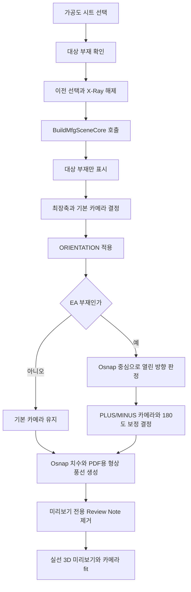

# 가공도 시트 3D 미리보기

## 1. 개요

옛 작업·데이터 탭의 단일 `가공도 출력` 버튼은 제거됐다. 현재 `ExecuteMfgDrawing`은 도면 시트 목록에서 가공도 시트를 선택했을 때 3D 미리보기를 만드는 내부 함수로 사용한다.

미리보기는 단일 뷰이며, PDF 출력에서만 EA 부재를 상하 2뷰로 배치한다. Hole, SlotHole, EarthBoss 형상 풍선은 3D 미리보기에서 숨기고 PDF 출력에만 남긴다.

## 2. 흐름

## 3. EA 카메라 보정

1. `SPREF` ITEM이 `EA`로 시작하면 앵글 부재로 판정한다.
2. 현재 뷰에 투영되는 Osnap 중심과 BBox 중심의 차이로 열린 방향을 계산한다.
3. 열린 방향에 따라 같은 축의 PLUS/MINUS 카메라를 선택한다.
4. 필요한 경우 화면축 180도 회전을 예약한다.
5. 최장축이 Z이면 화면축 90도 회전도 적용한다.

이 보정은 미리보기의 단일 뷰와 PDF 위쪽 뷰가 같은 방향을 사용하도록 한다.

## 4. 치수 생성

- Osnap 종류는 LINE 시작/끝점과 POINT 중심점만 사용한다.
- CIRCLE Osnap은 홀 주변 치수 폭주를 막기 위해 제외한다.
- 카메라 반대쪽 15% 깊이 영역의 Osnap은 뒷면으로 보고 제외한다.
- **osnap 4점 선별 — 제작도와 동일 알고리즘(`FilterOsnapForDimAxis`)** (2026-06-23 통일). 체인 치수 생성 *전에*, 보는 뷰에서 **가로축 max/min + 세로축 max/min 4 극점**만 남기고 중복·깊이 겹침을 제거한다. BuildMfgSceneCore가 단일 부재 `nodeOsnapMap`을 만들어 가시 2축 각각에 대해 `FilterOsnapForDimAxis`를 호출하고, 결과를 합쳐 `MergeCoordinates`가 중복을 흡수한다. 제작도와 **같은 알고리즘 하나로 통일** → EA ㄱ단면의 중간 station 폭주·치수 겹침이 원천 제거된다. 홀 중앙점 등은 추후 이 집합에 더하기만 하면 된다. (이전의 가공도 전용 외곽 선별 `FilterMfgOsnapForView`는 같은 축·다른 깊이 station을 못 합쳐 중간 치수가 살아남는 문제로 폐지.)
- 화면에 보이는 두 축별로 체인 치수와 전체 치수를 만든다.
- **보조선 오프셋**(치수선이 모델에서 떨어진 거리) = 종이(캔버스) 절대 기준 **1단 9mm·전체 18mm**로, 제작도(1단 7.5·전체 15mm)와 **독립**이다. 공용 헬퍼 `ComputeCanvasAbsoluteOffsets`에 가공도 전용 상수(`MfgCanvasBaseOff`/`MfgCanvasLvlSp` = 9/9)를 넘겨 적용하며, 캡처 후 확정된 **실측 배율(newScale) 역산**이라 부재 크기와 무관하게 종이에선 일정하다. (2026-06-23 도입 시 2/4mm → 4/8 → 6/12(2026-07-01) → 9/18mm — 세로 치수 텍스트-모델 밀착 해소 1.5배, 제작도와 동일 배율, 2026-07-06.)
- **보조선 시작 gap**(osnap에서 보조선이 떨어져 시작하는 거리)도 종이 절대 기준 **2mm**(`MfgCanvasExtGap`, 실측 배율 역산)다. 옛 모델좌표 고정 10mm는 부재·축척마다 종이 gap이 들쭉날쭉해 폐기 — 오프셋과 기준 통일 (2026-07-03). 제작도는 모델좌표 10mm(`ExtensionLineGap`) 유지.
- `FilterMfgDimensions`로 결과 치수를 한 번 더 솎는다 — 위 4점 선별이 1단계(osnap), 이것이 2단계(치수, 안전망). 4점이라 치수가 이미 최소라 대개 통과만 한다. 현재는 제작도 알고리즘(`ApplySmartFiltering`)을 가공도 전용 파라미터(축당 최대 8개, 텍스트 겹침 25mm 회피)로 차용하며, 겹치는 치수는 2단 분배·전체 치수는 항상 표시한다. **규칙·파라미터는 제작도와 독립**이라 가공도 고유 규칙을 따로 발전시킬 수 있다.
- PDF의 EA 첫 번째 뷰에서는 최장축 치수를 생략하고 두 번째 뷰로 분리한다.

## 5. 상태 변화

| 대상 | 결과 |
|---|---|
| 가시성 | 선택한 가공도 부재만 표시 |
| X-Ray | 해제 |
| RenderMode | `SMOOTH` |
| 치수/보조선 | 대상 부재 기준으로 새로 생성 |
| 형상 풍선 | 3D 미리보기에서는 제거. PDF에는 Hole, SlotHole, `PURPOSE=EBOS`인 EarthBoss 유지 |
| 카메라 | 최장축, ORIENTATION, EA 열린 방향 기준 |

`BuildMfgSceneCore`는 PDF와 공유하므로 형상 풍선을 생성한다. 미리보기 전용 `ExecuteMfgDrawing`이 코어 호출 직후 `Review.Note.Clear()`를 실행해 화면에서만 제거한다. PDF 행 렌더링은 이 함수를 거치지 않으므로 풍선의 2D 변환과 출력이 유지된다.

원형 부재 반지름 풍선과 ISO 부재번호 풍선은 가공도에서 생성하지 않는다. 위 세 형상 풍선은 가공도 PDF 전용이며 일반 X/Y/Z 뷰와 제작도에도 표시하지 않는다.

## 6. 변경 이력

| 날짜 | 변경 내용 | 작성자 |
|---|---|---|
| 2026-07-22 | 관련: T-077 (가공도 3D 미리보기 풍선 제거) — 공통 코어의 형상 풍선 생성은 유지하고 미리보기 어댑터에서만 Review Note를 제거해 PDF 풍선은 보존 | Codex |
| 2026-04-13 | 옛 단일 가공도 버튼 흐름 문서화 | — |
| 2026-05-23 | 단일 버튼 제거, 시트 선택 미리보기 내부 함수로 유지 | Claude |
| 2026-06-15 | 관련: T-048 (EA 가공도 T자형 출력 수정) — EA 판정과 카메라 열린 방향 보정을 다시 활성화 | Codex |
| 2026-06-15 | 관련: T-044, T-047 — 형상 풍선을 Hole, SlotHole, EarthBoss로 제한하고 가공도에서만 표시 | Codex |
| 2026-06-15 | 가공도 치수에 제작도와 동일한 점 선별(`ApplySmartFiltering`, 축당 8개·겹침 회피·2단 분배) 적용 — 이전엔 선별 없이 전체 추출 | Claude |
| 2026-06-15 | 가공도 선별을 전용 진입점(`FilterMfgDimensions` + 전용 파라미터)으로 분리 — 제작도와 규칙 독립, 가공도 고유 규칙 발전 여지 | Claude |
| 2026-06-15 | 가공도 홀/슬롯홀 풍선을 `GetNodeHoleInfo` API 추출로 전환 (가공도 한정, 제작도·BOM표는 `bom.Holes` 유지). CIRCLE 정확·슬롯 잠정 매핑(실측 중) | Claude |
| 2026-06-23 | 관련: T-065 (가공도 osnap 뷰 선별) — 체인 치수 전 `FilterMfgOsnapForView` 추가. 카메라 화면 평면 외곽선 위의 점만 남겨(열·행 극점) 깊이·뒷면 투영점 제거. 사용자 사양 "그 뷰의 외곽 osnap만" | Claude |
| 2026-06-23 | 관련: T-070 (제작도 4점 통합) — `FilterMfgOsnapForView` 폐지, 제작도와 동일한 `FilterOsnapForDimAxis`(가로/세로축 max·min 4극점)로 통일. 같은 축·다른 깊이 station을 못 합쳐 EA 중간 치수가 폭주·겹치던 문제 원천 해소. 사용자 사양 "제작도 알고리즘 그대로" | Claude |
| 2026-06-23 | 관련: T-066 (가공도 보조선 축소) — 보조선 오프셋을 가공도 전용으로 분리해 종이 기준 1단 2·전체 4mm로 축소(제작도 5/10 유지). `ComputeCanvasAbsoluteOffsets` 파라미터화 + `MfgCanvasBaseOff`/`MfgCanvasLvlSp`. 사용자 사양 "가공도만, 많이" | Claude |
| 2026-07-03 | 보조선 오프셋 문서 수치 현행화(2/4 → 6/12mm, 2026-07-01 확대분 반영) + 실측 배율(newScale) 역산 기준 명시 | Claude |
| 2026-07-03 | 보조선 시작 gap을 종이 절대 2mm(`MfgCanvasExtGap`, 실측 배율 역산)로 통일 — 옛 모델좌표 고정 10mm 폐기(부재·축척마다 종이 gap 불일치). 제작도는 10mm 유지 | Claude |
| 2026-07-06 | 보조선 오프셋 1.5배 확대 (6/12 → 9/18mm) — 세로 치수 텍스트(치수선 왼쪽 표준)가 좁은 틈에 끼어 모델에 밀착해 보이는 문제. 가로·세로 통일 확대, 제작도(5/10→7.5/15)와 동일 배율 | Claude |
