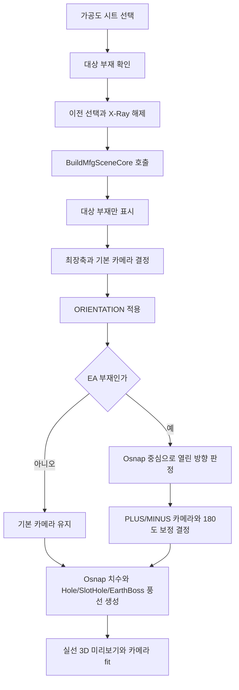

# 가공도 시트 3D 미리보기

## 1. 개요

옛 작업·데이터 탭의 단일 `가공도 출력` 버튼은 제거됐다. 현재 `ExecuteMfgDrawing`은 도면 시트 목록에서 가공도 시트를 선택했을 때 3D 미리보기를 만드는 내부 함수로 사용한다.

미리보기는 단일 뷰이며, PDF 출력에서만 EA 부재를 상하 2뷰로 배치한다.

## 2. 흐름

## 3. EA 카메라 보정

1. `SPREF` ITEM이 `EA`로 시작하면 앵글 부재로 판정한다.
2. 현재 뷰에 투영되는 Osnap 중심과 BBox 중심의 차이로 열린 방향을 계산한다.
3. 열린 방향에 따라 같은 축의 PLUS/MINUS 카메라를 선택한다.
4. 필요한 경우 화면축 180도 회전을 예약한다.
5. 최장축이 Z이면 화면축 90도 회전도 적용한다.

이 보정은 미리보기의 단일 뷰와 PDF 위쪽 뷰가 같은 방향을 사용하도록 한다.

## 4. 치수 생성

- Osnap 종류는 LINE 시작/끝점과 POINT 중심점만 사용한다.
- CIRCLE Osnap은 홀 주변 치수 폭주를 막기 위해 제외한다.
- 카메라 반대쪽 15% 깊이 영역의 Osnap은 뒷면으로 보고 제외한다.
- 화면에 보이는 두 축별로 체인 치수와 전체 치수를 만든다.
- 제작도와 동일하게 점을 선별한다 — `ApplySmartFiltering`으로 축당 최대 8개, 텍스트 겹침(25mm) 회피, 우선순위 정렬. 겹치는 치수는 2단으로 분배하고 전체 치수는 항상 표시한다. (이전에는 선별 없이 병합 후 모든 Osnap 점을 뽑았다.)
- PDF의 EA 첫 번째 뷰에서는 최장축 치수를 생략하고 두 번째 뷰로 분리한다.

## 5. 상태 변화

| 대상 | 결과 |
|---|---|
| 가시성 | 선택한 가공도 부재만 표시 |
| X-Ray | 해제 |
| RenderMode | `SMOOTH` |
| 치수/풍선/보조선 | 대상 부재 기준으로 새로 생성 |
| 형상 풍선 | Hole, SlotHole, `PURPOSE=EBOS`인 EarthBoss만 표시 |
| 카메라 | 최장축, ORIENTATION, EA 열린 방향 기준 |

원형 부재 반지름 풍선과 ISO 부재번호 풍선은 가공도 미리보기에서 생성하지 않는다. 형상 풍선은 가공도 전용이며 일반 X/Y/Z 뷰와 제작도에는 표시하지 않는다.

## 6. 변경 이력

| 날짜 | 변경 내용 | 작성자 |
|---|---|---|
| 2026-04-13 | 옛 단일 가공도 버튼 흐름 문서화 | — |
| 2026-05-23 | 단일 버튼 제거, 시트 선택 미리보기 내부 함수로 유지 | Claude |
| 2026-06-15 | 관련: T-048 (EA 가공도 T자형 출력 수정) — EA 판정과 카메라 열린 방향 보정을 다시 활성화 | Codex |
| 2026-06-15 | 관련: T-044, T-047 — 형상 풍선을 Hole, SlotHole, EarthBoss로 제한하고 가공도에서만 표시 | Codex |
| 2026-06-15 | 가공도 치수에 제작도와 동일한 점 선별(`ApplySmartFiltering`, 축당 8개·겹침 회피·2단 분배) 적용 — 이전엔 선별 없이 전체 추출 | Claude |
