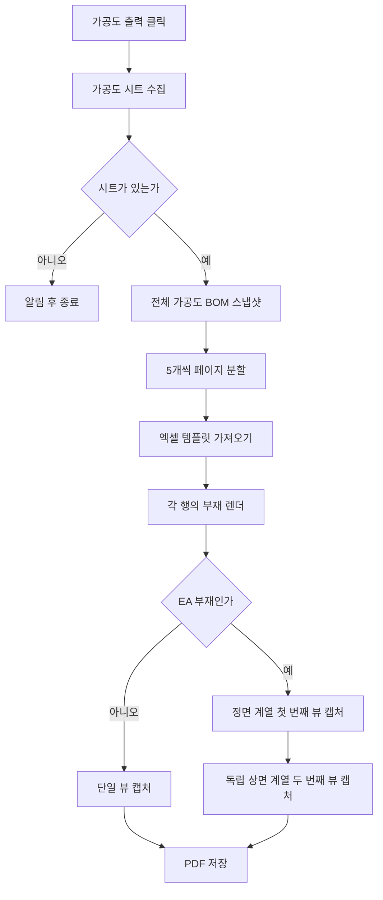

# 가공도 시트 PDF 출력

## 1. 개요

도면정보 탭의 `가공도 출력` 버튼은 시트 목록의 모든 가공도 부재를 모아 엑셀 템플릿에 배치하고 PDF로 저장한다.

- 템플릿: `사용자템플릿_엑셀_가공도.xlsx`
- 페이지당 부재: 최대 5개
- 저장 위치: 실행 파일 하위 `Drawings`
- 일반 부재: 한 행에 단일 뷰
- EA 앵글 부재: 한 행을 위·아래로 나눈 2개 뷰

## 2. 전체 흐름

## 3. 행 렌더링

### 일반 부재

1. 대상 부재만 표시한다.
2. BBox 최장축과 PAD/PLATE 여부로 기본 카메라를 정한다.
3. `ORIENTATION` UDA 회전을 적용한다.
4. LINE/POINT Osnap을 수집하고 뒷면 Osnap을 제외한다.
5. 화면에 보이는 두 축의 체인 치수와 전체 치수를 만든다.
6. 은선 모델, 보조선, 풍선, 치수를 View 영역 중앙에 맞춰 2D로 변환한다.

### EA 앵글 부재

EA 판정은 `SPREF`에서 `/`를 제거하고 `:` 앞 ITEM 문자열이 `EA`로 시작하는지 확인한다.

#### 첫 번째 뷰

- Osnap 중심과 BBox 중심을 비교해 앵글의 열린 방향을 판정한다.
- 필요하면 PLUS 카메라를 MINUS 카메라로 바꾼다.
- 열린 방향을 맞추기 위한 180도 회전을 적용한다.
- 최장축 치수는 두 번째 뷰에 맡기고, 나머지 축 치수와 풍선을 표시한다.

#### 두 번째 뷰

- 첫 번째 뷰의 화면축 회전을 원복한 뒤 별도 카메라에서 새로 만든다.
- 최장축이 Z이면 `X_MINUS` 뷰에 화면축 90도 회전을 적용한다.
- 그 외에는 `Z_MINUS` 상면 뷰를 사용한다.
- 과거 T자형 출력을 만들던 추가 정렬 회전은 적용하지 않는다.
- 최장축의 체인 치수와 전체 치수만 표시한다.

두 번째 뷰 캡처가 실패하면 불완전한 2D 객체를 삭제하고 첫 번째 뷰는 유지한다.

## 4. 예외 처리

| 조건 | 처리 |
|---|---|
| 가공도 시트 없음 | 경고 후 종료 |
| 엑셀 템플릿 없음 | PDF를 만들지 않고 오류 표시 |
| BOM 15행 초과 | 16번째 이후 BOM 표 미표시 경고 |
| 특정 행 렌더 실패 | 해당 행을 실패 처리하고 나머지 행 계속 |
| 페이지의 모든 행 실패 | 해당 페이지 PDF 저장 생략 |
| Shape/Note/Measure 변환 실패 | 경고 로그 후 가능한 객체로 PDF 계속 생성 |

출력 종료 시 시트 목록 활성 상태, BOM 표, 출력 전 선택 시트의 부재 가시성을 복원한다.

## 5. 관련 코드

- `btnMfgDrawingSheet_Click`: 가공도 시트 수집과 결과 메시지
- `GenerateMfgDrawingManual`: 페이지 분할, 템플릿 입력, PDF 저장
- `RenderMfgRowToViewArea`: 일반/EA 행 분기
- `BuildMfgSceneCore`: 기본 카메라, Osnap, 치수, 풍선 생성
- `BuildEaSecondaryScene`: EA 아래쪽 뷰와 최장축 치수 생성
- `CaptureMfgSceneToViewArea`: 3D 장면을 지정 View 영역에 2D로 배치

## 6. 변경 이력

| 날짜 | 변경 내용 | 작성자 |
|---|---|---|
| 2026-04-13 | 초안 작성 | — |
| 2026-05-23 | 엑셀 템플릿 기반 수동 PDF 출력으로 재배선 | Claude |
| 2026-06-15 | 관련: T-048 (EA 가공도 T자형 출력 수정) — EA 상하 2뷰, 최장축 치수 분리, 독립 두 번째 카메라 복원 | Codex |
