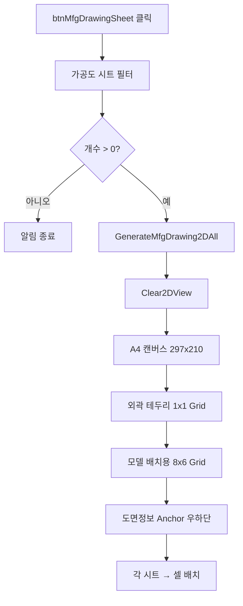

# 가공도 시트 배치 2D 출력

## 1. 개요
`lvDrawingSheet`에서 라벨이 "가공도"로 시작하는 모든 시트를 수집하여 **A4 한 장의 8×3 그리드**에 일괄 배치 출력한다. `GenerateMfgDrawing2DAll`로 위임.

## 2. 트리거
| 항목 | 값 |
|---|---|
| 유형 | User Action |
| 입력 | `btnMfgDrawingSheet` 클릭 |
| 위치 | 메인 폼 > 가공도 탭 |

## 3. 사전 조건
- [ ] `lvDrawingSheet`에 "가공도_" 접두어 시트가 1개 이상 존재

## 4. 전체 동작 흐름 (Happy Path)

| # | 단계 | 주체 | 설명 |
|---|---|---|---|
| 1 | 가공도 시트 필터 | Form1 | `lvi.Text.StartsWith("가공도")` + `MemberIndices.Count > 0` |
| 2 | 개수 검증 | Form1 | 0개면 [E01] |
| 3 | 위임 호출 | Form1 | `GenerateMfgDrawing2DAll(mfgSheets)` |
| 4 | 애니메이션 끔 | SDK | `View.EnableAnimation = false` |
| 5 | 3D 어노테이션 Clear | SDK | Note/Measure/ShapeDrawing |
| 6 | 2D 완전 초기화 | Form1 | `Clear2DView()` (Model3D ↔ Both 토글 + 2회 삭제) |
| 7 | SplitContainer 폭 조정 | UI | 좌측 2D 패널 20% |
| 8 | A4 캔버스 | SDK | `SetCanvasSize(297, 210)` |
| 9 | 외곽 테두리 | SDK | `GridStructure 1x1` + Margins 10 |
| 10 | 모델 그리드 | SDK | `GridStructure 8x6`, 라벨+모델 칼럼 |
| 11 | 도면정보 테이블 | SDK | TemplateTable 5x4, Anchor Right/Bottom |
| 12 | 라인 두께 설정 | SDK | Model=2.0f, Measure=0.3f, Text=5f |
| 13 | 셀 배치 | Form1 | 열 우선, 2~7행만 사용, 최대 18개 |

## 5. 주요 분기 처리

### [분기 A] 시트 초과 수량
| 조건 | 처리 |
|---|---|
| `mfgSheets.Count > 18` | 앞에서부터 18개만 배치 |
| 이하 | 모두 배치 |

### [분기 B] 셀 그룹 할당
라벨 칼럼(1, 3, 5)과 모델 칼럼(2, 4, 6) 쌍으로 3 그룹 → 6행씩 18슬롯.

## 6. 예외 / 에러 처리
| ID | 조건 | 동작 | 사용자 피드백 | 결과 상태 |
|---|---|---|---|---|
| E01 | 가공도 시트 0개 | return | MessageBox "가공도 시트가 없습니다." | 변화 없음 |
| E02 | 처리 중 예외 | catch (GenerateMfgDrawing2DAll 내부) | 내부 로그 | 부분 렌더링 |

## 7. 상태 변화
| 대상 | Before | After |
|---|---|---|
| `vizcore3d.ViewMode` | 이전 | `Both` |
| 2D 캔버스 | 이전 | A4 297x210 + 8x6 Grid + 테두리 |
| 도면 정보 테이블 | 이전 | 5x4 Anchor 테이블 |
| `View.EnableAnimation` | true | false |
| `Review.*` | 이전 | 모두 Clear |

## 8. 후행 기능 (Chained)
- [선택 시트 PDF](../도면시트/시트 PDF 출력.md)
- [전체 PDF 배치](../도면시트/전체 PDF 출력.md)

## 9. 관련 링크
- 코드 구현: [Form1.MfgDrawing.cs:L548](../../code-reference/form1-mfg-drawing.md#btnMfgDrawingSheet_Click), [GenerateMfgDrawing2DAll](../../code-reference/form1-mfg-drawing.md#GenerateMfgDrawing2DAll)

## 10. 변경 이력
| 날짜 | 변경 내용 | 작성자 |
|---|---|---|
| 2026-04-13 | 초안 작성 | — |
| 2026-05-14 | **T-064 (도면리스트 뽑기 검증)** — 가공도 4종 변경: (1) **그리드 8행 → 5행** (`gridRows 8→5`, `usableRowEnd 7→5`, `rowsPerCol 6→4`) — 한 페이지 부재 18→12로 각 셀 면적 확대. (2) **PDF 풍선 비활성화** (`RenderMfgViewForDrawing` L1717 `noteIds.Clear()` 추가 / EA 신규뷰 L2094 `eaNoteIds.Clear()` 추가) — 풍선 복귀 시 두 Clear() 줄 주석. (3) **치수 텍스트 크기 5mm → 8mm** (`Set2DViewCreateObjectItemMeasureTextHeight`) — 풍선 비활성화에 따른 가독성 보강. (4) **홀 Osnap 제외** — `GetOsnapPoint` 결과에서 `OsnapKind.CIRCLE` 케이스 별도 break, POINT/LINE만 치수 추출. 홀이 많은 부재의 치수 폭주 회피. 2경로 동일 패턴 (ExecuteMfgDrawing + RenderMfgViewForDrawing) | Claude |
