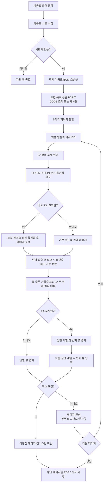

# 가공도 시트 PDF 출력

## 1. 개요

도면정보 탭의 `가공도 출력` 버튼은 시트 목록의 모든 가공도 부재를 모아 엑셀 템플릿에 배치하고 **PDF 한 개로** 저장한다. 페이지가 몇 장이든 파일은 항상 한 개다 (2026-07-28, #119).

- 템플릿: `가공도_도면_1.xlsx` (제작도와 동일 A4 그리드, 세로 5칸 뷰 + 부재명 5칸 + BOM 25행)
- 페이지당 부재: 최대 5개
- 저장 위치: 실행 파일 하위 `Drawings`
- 일반 부재: 한 행에 단일 뷰
- EA 앵글 부재: 한 행을 위·아래로 나눈 2개 뷰

이 버튼은 **수동 단일 출력**이다. **도면 일괄 출력**(`btnExtractDrawingList` → STRU별 `ProcessSingleStruFull`)에서도 같은 `GenerateMfgDrawingManual`을 호출해 제작/조립/설치도와 함께 가공도를 생성한다. 두 경로 모두 처리 오버레이의 **취소** 버튼을 사용하며 페이지·템플릿·각 행의 주/보조 뷰·최종 렌더·PDF 저장 전후에 요청을 확인한다. 실행 중인 SDK 단일 호출은 강제 중단하지 않고 반환 직후 멈춘다. 미완성 페이지는 정리하되 이미 저장한 페이지 PDF와 개수는 유지한다.

## 2. 전체 흐름

`가공도 출력` 버튼으로 직접 실행하면 이 함수가 누적의 주인이 되어 마지막에 저장한다. `도면 일괄 출력`이 불러 쓰면 이미 열린 누적에 페이지만 이어붙이고 저장은 그쪽에 넘긴다 — 그래서 일반 도면과 가공도가 한 파일에 들어간다.

엑셀 템플릿을 가져온 직후 `RemoveEmptyTemplateBorders`가 내용 없는 공백 셀(미기재 BOM 행 등)의 괘선을 지운다. 전역 동작이라 `data`에 키를 넣느냐로 칸을 선별한다 — 값이 있으면(`""`·`" "` 포함) 치환되어 `{Input}`이 남지 않고, `{Input}`이 만든 TextBox가 있어야 SDK가 괘선을 지운다(벤더 안내 2026-07-27, 선초기화 루프 제거). 따라서 BOM(1~20행=4~163·21~25행=201~240)·Note(164)·Rev 위 4행(170~193)·미기재 부재명(241~245)은 키를 넣지 않아 괘선이 제거되고, PAINT/DP/TAG(165~169)는 값이 있을 때만 채운다. **REV 표 첫 기재행(194~199 = REV./DATE/DESCRIPTION/DRAWN/CHECKED/APPROVED)은 2026-07-28부터 공통 헬퍼 `FillRevisionTable`이 6칸 전부 채운다** — REV.=`0`, DATE=출력일 `yyyy-mm-dd`, 나머지는 아직 값이 없어 공백 1칸으로 괘선만 남긴다. 다중 페이지도 같은 값이다. 부재명은 REV 표(195~199)와 번호가 겹쳐 REV 칸으로 새던 것을 `Input_241~245`로 분리했다(#32).

PAINT CODE는 제작도·조립도·설치도 출력과 같은 `DrawingSheetData.PaintCode` 공용 캐시를 사용한다. 아직 조회하지 않았다면 가공도 출력 시작 시 BOM 첫 부재에서 부모 방향으로 최대 10단계를 탐색해 키 이름에 `PNT`가 포함된 STRU UDA의 첫 비어 있지 않은 값을 한 번만 확정하고, 같은 도면 목록 전체와 모든 가공도 페이지의 `{Input_166}`에 재사용한다. 복수 후보 키·값은 `[PAINT CODE]` 로그에 남기며, 값이 없으면 `Input_166`의 초기 공백을 유지해 괘선을 보존한다.

## 3. 행 렌더링

### 일반 부재

1. 대상 부재만 표시한다.
2. `ORIENTATION` UDA를 우선해 1도 초과를 `틀어짐`으로 판정하고 `[참조축판정]` 로그를 남긴다. ORIENTATION이 비었거나 파싱되지 않을 때만 LINE Osnap 5도 방향군의 길이 합 주축을 폴백 판정으로 사용하며, 두 결과는 진단 로그에 함께 기록한다.
3. BBox 최장축과 PAD/PLATE 여부로 기본 카메라를 정한다.
4. `ORIENTATION` 각도가 1도를 초과하면 원문의 로컬 축 방향을 직교 X/Y/Z 프레임으로 만들고, 부재 BBox 중심에 SDK ReferenceAxis를 생성·활성화한다. 카메라는 이 참조축 기준의 X/Y/Z 정면 뷰로 전환한다. 정상 부재는 기존 월드축 카메라를 유지하고, 참조축 API 실패 시 기존 ORIENTATION 화면 회전으로 복귀한다.
5. 임시 캡처로 실제 투영 크기를 재어, 세로로 잡히면 화면축 90도 회전으로 가로로 눕힌다(`ProbeAndRollLandscape`). Hole/SlotHole/EarthBoss는 이 시점까지 Review Note로 만들지 않고 뷰별 대기 목록으로만 유지한다.
6. LINE/POINT Osnap을 수집하고 뒷면 Osnap을 제외한다 — 단면만 출력하므로 뒷면 점은 극점이어도 치수화하지 않는다.
7. 가로(길이) 축은 체인+전체 2단, 세로(폭) 축은 체인 1단만 치수를 만든다(전체 치수 중복 생략).
8. 모델 캡처 후 확정된 실측 배율로 보조선·치수를 그린다(`DrawMfgDimsAtScale`) — 보조선 오프셋(9/18mm)·시작 gap(2mm) 모두 종이 기준 일정, 2단 치수 텍스트는 치수선 방향으로 종이 2.5mm 이동한다. 참조축을 사용한 부재만 같은 로컬 X/Y/Z 단위 벡터를 `AddCustomDistanceUserAxis`에 넘겨 모델·치수선·텍스트·보조선 방향을 일치시킨다. 벡터는 호출 전에 정규화하며 SDK 호출 실패 또는 유효하지 않은 거리는 기존 `AddCustomAxisDistance` 월드축 경로로 자동 복귀한다.
9. 풍선 수와 같은 화면 위·아래 쪽의 치수 외곽을 종이 절대값으로 먼저 계산해 View 슬롯에 예약한다. 예약값은 치수선 오프셋, 치수 문자 10mm, 자동 정렬 여백 3mm, 첫 풍선 간격 6mm, 풍선 글자 6mm와 추가 행당 8mm를 합산한다. 모델은 남은 높이에 맞춰 축소하고 풍선 반대쪽으로 이동하되, 주석이 많아도 슬롯 높이의 35%는 모델 영역으로 보존한다. EA는 첫 번째·두 번째 풍선 목록 중 더 많은 행 수와 가능한 최대 3단 치수 외곽을 한 번 계산해 두 슬롯에 공통 적용한다. 따라서 한쪽 풍선 목록이 비어도 두 뷰의 모델 fit 높이는 같으며, 실제 풍선 위치는 각 뷰의 실제 치수 외곽을 기준으로 따로 계산한다.
10. 확정된 `newScale`로 현재 뷰의 풍선을 생성한다(`AddMfgPendingNotesAtScale`). 오른쪽 치수처럼 풍선 방향과 다른 쪽의 치수는 위·아래 풍선 여백에 넣지 않는다. 여러 풍선은 종이 8mm 행 간격으로 바깥쪽에 쌓고, 풍선 글자 높이 6mm와 치수 글자 높이 10mm는 2D 종이 절대 설정이라 배율로 다시 나누지 않는다.
11. 풍선·치수·보조선과 단면 모델을 2D로 변환한다. 각 캡처 직전에 3D Note를 비우고 그 뷰의 대기 목록만 생성해 EA 첫 번째·두 번째 뷰가 섞이지 않게 한다.

`Review.Measure.Clear()`는 SDK에서 활성 참조축까지 삭제하므로 측정·보조선 초기화는 참조축 생성 전에만 수행한다. 캡처가 끝나면 `ReferenceAxis.Reset()` 후 참조축 리뷰를 삭제한다. 다음 행과 EA 두 번째 뷰는 새 참조축을 생성해 상태 누적을 막는다.

### EA 앵글 부재

EA 판정은 `SPREF`에서 `/`를 제거하고 `:` 앞 ITEM 문자열이 `EA`로 시작하는지 확인한다.

#### 첫 번째 뷰

- Osnap 중심과 BBox 중심을 비교해 앵글의 열린 방향을 판정한다.
- 필요하면 PLUS 카메라를 MINUS 카메라로 바꾼다.
- 열린 방향을 맞추기 위한 180도 회전을 적용한다.
- 최장축 치수는 두 번째 뷰에 맡기고, 나머지 축 치수를 표시한다.
- EarthBoss는 부재 전체 용도 라벨이므로 부재당 한 번, 첫 번째 뷰에 표시한다.
- Hole/SlotHole은 관통 방향이 첫 번째 뷰에서 더 정면으로 보일 때만 이 뷰의 목록에 들어간다.

#### 두 번째 뷰

- 별도 카메라에서 새로 만든다. 기울어진 부재는 첫 번째 뷰의 참조축을 Reset/Delete한 뒤 같은 로컬 프레임으로 두 번째 뷰 전용 참조축을 다시 생성한다.
- 최장축이 Z이면 `X_PLUS`(반대쪽) 뷰를 쓰고, 가로화는 임시 캡처 실측(`ProbeAndRollLandscape`)이 수행한다.
- 그 외에는 `Z_MINUS` 상면 뷰를 사용한다.
- 과거 T자형 출력을 만들던 추가 정렬 회전은 적용하지 않는다.
- 길이(최장축) 치수는 위 슬롯일 때만 체인+전체 2단으로 그리고, 폭(높이) 치수는 체인 1단만 화면 오른쪽에 추가한다.
- Hole/SlotHole은 첫 번째 뷰와 독립적으로 배정한다. 첫 번째 목록이 비어 있고 두 번째 목록에만 풍선이 있는 경우도 정상 출력한다.
- 두 번째 캡처는 첫 번째 뷰의 3D Note를 지운 뒤 두 번째 목록만 생성하므로 풍선이 중복되지 않는다.

#### 두 뷰 상하 배치와 미러

- 앵글의 접힘 모서리(두 플랜지가 만나는 변)가 페어의 **가운데**를 향하도록 두 뷰의 상하 순서를 자동으로 정한다. 최장축(길이) 치수는 위쪽 뷰가 그린다.
- 두 번째 뷰의 모서리 방향이 어긋나면 그 뷰를 상하로 미러한다. 모델은 SDK 2D 미러(`SetSelected3DMirrorBy2DView`)로 뒤집고, 치수·보조선 매핑은 SDK 미러가 함께 처리하므로 별도 좌표 반전은 하지 않는다.
- 두 뷰는 `SharedAnnotationBudgetCanvas`에 저장한 같은 주석 예약 높이를 사용한다. 풍선이 한쪽 뷰에만 있더라도 풍선이 없는 뷰만 더 크게 확대되지 않는다.

두 번째 뷰 캡처가 실패하면 불완전한 2D 객체를 삭제하고 첫 번째 뷰는 유지한다.

> 이 EA 두 뷰 배치(가로화·상하 스왑·미러)는 사내 실기 출력으로 검증 중인 동작이다.

## 4. 풍선 정책

가공도에서 생성하는 형상 풍선은 다음 세 종류로 제한한다.

| 종류 | 판정 데이터 | 표시 |
|---|---|---|
| Hole | `GetNodeHoleInfo` 결과 | 같은 지름끼리 묶어 `Ø지름`, 여러 개면 개수 병기 |
| SlotHole | `GetNodeHoleInfo` 결과 | 반지름, 폭, 길이, 깊이와 개수 병기 |
| EarthBoss | UDA `PURPOSE=EBOS` | `EarthBoss` |

원형 부재의 반지름 풍선과 ISO 부재번호 풍선은 가공도에서 생성하지 않는다. 위 세 형상 풍선은 일반 X/Y/Z 뷰와 제작도에는 표시하지 않는다.

`GetNodeHoleInfo`의 `ThicknessCenterTo - ThicknessCenterFrom`을 우선 관통축으로 사용한다. 원형 홀은 이 값이 없을 때 `CircleCenter` 중 가장 먼 두 점의 차이를 사용하고, 그마저 없으면 `AxisZ`와 `AxisX × AxisY`가 평행한 경우에만 SDK 로컬축을 사용한다. 슬롯의 `CircleCenter`는 장축일 수 있고 `Size`는 방향 계약이 없어 축 추정에 쓰지 않는다. EA에서는 관통축과 첫 번째·두 번째 뷰의 실제 깊이축 `abs(dot)`을 비교해 더 정면으로 보이는 뷰에 먼저 배정한 뒤, 해당 뷰 안에서만 규격별 그룹과 개수를 만든다. ORIENTATION 부재는 월드축이 아니라 `ReferenceAxisX/Y/Z` 깊이축으로 비교한다. 축을 확정하지 못한 항목은 누락하지 않고 첫 번째 뷰에 둔다.

첫 번째 뷰·두 번째 뷰는 각각 독립된 풍선 목록을 가진다. 따라서 첫 번째만 있음, 두 번째만 있음, 양쪽 모두 있음, 양쪽 모두 없음의 네 상태를 모두 허용한다. EarthBoss는 국소 형상이 아니므로 이 배정에서 제외하고 부재당 한 번만 첫 번째 뷰에 둔다.

도면번호 목록에서 여는 3D 미리보기는 대기 중인 형상 노트를 생성하지 않는다. PDF 행 렌더링만 각 뷰의 모델 캡처와 실측 배율 확정 뒤 대기 노트를 생성하므로 세 형상 풍선의 2D 변환과 PDF 출력은 유지된다.

## 5. 예외 처리

| 조건 | 처리 |
|---|---|
| 가공도 시트 없음 | 경고 후 종료 |
| 엑셀 템플릿 없음 | PDF를 만들지 않고 오류 표시 |
| BOM 25행 초과 | 26번째 이후 BOM 표 미표시 경고 |
| 특정 행 렌더 실패 | 해당 행을 실패 처리하고 나머지 행 계속 |
| 페이지의 모든 행 실패 | 해당 페이지를 PDF에 넣지 않음 |
| 사용자 취소 | 현재 SDK 호출 뒤 행/뷰 체크포인트에서 중단, 미완성 페이지 캔버스만 버림, **그때까지 완성된 페이지는 PDF로 저장**, 페이지 수와 중단 위치 안내 |
| Shape/Note/Measure 변환 실패 | 경고 로그 후 가능한 객체로 PDF 계속 생성 |
| 참조축 생성·활성화 실패 | 오류 로그 후 기존 ORIENTATION 화면 회전 카메라로 자동 복귀 |

출력 종료 시 시트 목록 활성 상태, BOM 표, 출력 전 선택 시트의 부재 가시성을 복원한다.

## 6. 관련 코드

- `btnMfgDrawingSheet_Click`: 가공도 시트 수집과 결과 메시지
- `GenerateMfgDrawingManual`: 페이지 분할, 템플릿 입력, 페이지 누적과 묶음 PDF 저장
- `RenderMfgRowToViewArea`: 일반/EA 행 분기
- `BuildMfgSceneCore`: 기본 카메라, Osnap, 치수·형상 풍선 후보 수집, 홀 관통축 기반 EA 뷰별 배정, 두 뷰 스왑 판정. Osnap은 도면 리스트 뽑기 때 채운 부재별 캐시를 우선 사용(hit면 `GetOsnapPoint` ~0.8초 생략, miss면 직접 추출 폴백 — 2026-07-22). 캐시도 동일 규칙(LINE 양끝+POINT, CIRCLE 제외)이라 결과 동일
- `TryBuildMfgOrientationReferenceFrame` / `ActivateMfgReferenceAxis`: ORIENTATION에서 직교 로컬 프레임을 만들고 ReferenceAxis 생성·활성화 후 로컬축 기준 카메라 적용
- `ClearMfgViewAnnotations` / `ReleaseActiveMfgReferenceAxis`: 측정 초기화 전에 활성 참조축을 Reset/Delete하고 행·뷰 사이 상태를 격리
- `DetectMfgAxis` / `LogMfgAxisDetection`: ORIENTATION을 우선 판정하고, 값이 없을 때만 LINE Osnap 방향군의 길이 합을 폴백으로 사용한다. 월드축 편차·단일 최장선·ORIENTATION·최종 판정 출처를 함께 기록한다
- `BuildEaSecondaryScene`: EA 아래쪽 뷰와 최장축 치수, 상하 미러 판정
- `ProbeAndRollLandscape`: 임시 캡처 실측으로 세로→가로 90도 회전
- `TryResolveMfgHoleThroughAxis` / `BuildMfgPendingNotes`: SDK 홀 축 후보를 검증하고 EA 두 뷰에 독립 배정한 뒤 뷰별로 규격·개수를 그룹화
- `AddMfgPendingNotesAtScale`: 확정된 `newScale`, 실제 카메라 화면축, 같은 쪽 치수선·문자 외곽으로 현재 뷰의 풍선 거리·행 간격을 종이 절대값으로 생성
- `DrawMfgDimsAtScale`: 캡처 후 실측 배율로 보조선·치수를 그리고 풍선과 같은 화면 위·아래 쪽의 치수 오프셋만 풍선 배치와 공유한다. 기울어진 부재는 ORIENTATION 기반 로컬 축의 UserAxis 측정을 우선하고 정상 부재와 실패 폴백은 기존 월드축 측정을 유지한다
- `CaptureMfgSceneToViewArea`: 주석 영역을 먼저 예약해 모델을 축소·이동한 뒤 3D 장면과 주석을 지정 View 영역에 2D로 배치
- `ExecuteMfgDrawing`: 도면번호 리스트 클릭 시 3D 미리보기. 장면 구성(부재 격리·카메라 방향)은 BeginUpdate 안에서, **카메라 프레이밍(FitToView)과 Z90/R180 회전은 EndUpdate 후(커밋된 상태)** 수행 — BeginUpdate 중 MoveCamera 직후 FlyToObject3d는 줌을 못 잡는 퇴화 프레임(camZoom=0)이 됨을 실측으로 확인해 교체 (2026-07-22 fit 수정 2차). 화면축 회전은 상대(누적)라 진입부에서 직전 회전 총량(`_mfgPreviewNetRoll`)을 원복 후 이번 회전을 1회만 적용

## 7. 변경 이력

| 날짜 | 변경 내용 | 작성자 |
|---|---|---|
| 2026-07-28 | **가공도 전체를 PDF 1개로 묶기** (관련: GitHub issue #119). 페이지마다 캔버스를 비우고 저장하던 것을 캔버스를 덧붙여 쌓았다가 마지막에 한 번 저장하도록 변경. 파일명 `가공도_{모델명}_{시각}.pdf`. 취소해도 완성된 페이지는 저장하며, 실패한 페이지는 그 캔버스만 버려 PDF에 끼지 않게 함. `도면 일괄 출력`이 부를 때는 저장을 넘기고 페이지만 이어붙임. 페이지별 파일명을 만들던 `MakeUniquePdfPath` 제거 | Claude |
| 2026-07-28 | **표제부 REV 표 첫 기재행 채우기** (관련: GitHub #64 REV 표 채우기 로직). `BuildMfgPageData`가 제작도와 같은 공통 헬퍼 `FillRevisionTable`(`Form1.ExcelTemplate.cs`)을 호출해 `Input_194~199`에 REV.=`0`·DATE=출력일을 넣고 나머지 4칸은 공백 1칸으로 괘선만 보존. 다중 페이지 동일 값. 검증용 `RunMfgCameraSignProbe`의 부재명 잔재 `data[195]`도 `data[241]`로 정리 | Claude |
| 2026-07-24 | 관련: T-091, GitHub issue #51 — 수동 가공도 출력에도 공용 취소 오버레이를 연결하고 페이지·템플릿·행별 장면·주/보조 뷰·최종 렌더·PDF 저장 전후 체크포인트를 추가. 취소 결과에 저장 완료 PDF 수와 중단 위치를 표시하고 미완성 페이지 Canvas를 정리 | Codex |
| 2026-07-24 | 관련: T-089 (가공도 EA 두 뷰 배율 회귀 수정), GitHub issue #46 — 첫 번째·두 번째 풍선 목록의 최대 행 수와 가능한 최대 치수 외곽으로 `SharedAnnotationBudgetCanvas`를 한 번 계산해 두 뷰의 모델 fit에 공통 적용. 한쪽 목록이 0건이어도 같은 높이를 예약하며 실제 풍선 위치 계산은 뷰별 치수 외곽을 유지 | Codex |
| 2026-07-24 | 관련: T-089 (가공도 풍선 종이 절대 정규화·EA 뷰별 독립 배정), GitHub issue #46 — 모델 span 비례 4분면 풍선 경로를 제거하고, Hole/SlotHole을 관통축과 실제 뷰 깊이축으로 먼저 배정한 뒤 뷰별 그룹화. 각 캡처의 실측 `newScale`로 치수 외곽→풍선 6mm·풍선 행 8mm를 역산하고, 같은 쪽 치수 문자 여백까지 포함한 주석 영역을 모델 fit 전에 예약. 2D 글자 6mm·치수 글자 10mm는 고정 유지하며 EarthBoss는 첫 번째 뷰에 한 번만 표시 | Codex |
| 2026-07-23 | 관련: T-086 (가공도 홀·슬롯 최종 화면 하단 배치), GitHub issue #39 — `BuildMfgSceneCore`에서 Hole/SlotHole을 즉시 생성하지 않고 `PendingHoleNotes`로 수집한 뒤 `ProbeAndRollLandscape` 완료 후 생성하도록 순서를 변경. ORIENTATION ReferenceAxis 로컬축과 폴백 화면 roll, 추가 90도 가로화를 합친 최종 화면 기저로 모델 하단·홀 수평 위치를 계산해 세로 부재의 홀 표시가 왼쪽으로 돌아가던 문제를 수정. 정상 무회전 부재는 기존 축·하단 공식과 동일 | Codex |
| 2026-07-23 | STRU 일괄 출력에서 가공도 페이지 시작 전 `Application.DoEvents`와 선택적 취소 콜백을 확인. 이미 저장한 페이지 PDF는 집계하고 다음 페이지부터 중단하며 수동 출력 경로는 기존 동작 유지 | Codex |
| 2026-07-23 | **일괄 출력에 가공도 포함** (#35) — `ProcessSingleStruFull` Step 8의 옛 hard skip(개수만 세고 로그) 제거, 수동 경로와 동일한 `GenerateMfgDrawingManual(mfgSheets, struSubDir, struName, struNode.Index)` 호출로 실제 생성·저장. `SuccessPdfs`를 `pdfCount`에 합산, STRU별 폴더 저장, 오류·템플릿 누락은 로그 후 다음 STRU 진행. 확인 팝업 "4종(제작/조립/설치/가공)" 안내와 실제 산출 일치. 여러 STRU 연속 생성이라 #3(가공도 크래시) 핵심 검증 시나리오 — 사내 실기 대기 | Claude |
| 2026-07-23 | **부재명 태그 241~245 분리, REV 표 195~199 복원** (#32) — 부재명이 REV 표(195~199)와 번호 충돌해 REV 칸으로 새던 문제. 부재명을 `Input_241~245`(BOM 240 다음)로 옮기고, REV 표 첫 기재행 194~199를 제작도와 동일하게 복원(`" "` 괘선 보존). 200+ 크래시 해소(API 배포) 후 가능. 템플릿 COM 재태그(E7~E47→241~245, AX44~BO44→195~199) + `BuildMfgPageData` `data[241+i]`·초기화 `k=1..245`(194~199는 `" "`) | Claude |
| 2026-07-23 | SDK 1.0.26.723의 Input 200+ 수정에 맞춰 가공도 BOM을 25행으로 확장하고 Input 201~240을 사용 | Codex |
| 2026-07-23 | 관련: T-079 (기울어진 가공도 부재 축 정렬) — 화면 roll로 세워지지 않던 부재에 ORIENTATION 기반 ReferenceAxis 카메라를 적용. 측정 Clear 전 생성 금지, 뷰별 Reset/Delete, EA 2차 참조축 재생성, 실패 시 기존 회전 폴백을 추가하고 UserAxis 치수와 같은 로컬 프레임을 공유 | Codex |
| 2026-07-23 | 관련: T-079 (기울어진 가공도 부재 축 정렬) — 실기 4건에서 정확했던 ORIENTATION을 틀어짐 우선 판정으로 확정하고, 1도 초과 부재의 치수·보조선만 정규화한 로컬 축 `AddCustomDistanceUserAxis`로 생성. SDK 실패 시 기존 월드축 치수로 폴백하며 정상 부재 경로는 유지. PDF 렌더 방향은 사내 실기 확인 대기 | Codex |
| 2026-07-23 | 관련: T-082 (모든 도면 PAINT CODE 공용값) — 제작도·조립도·설치도와 동일한 도면 목록 공용 캐시를 사용하고 모든 가공도 페이지 `Input_166`에 같은 값을 적용 | Codex |
| 2026-07-23 | 관련: T-082 (PAINT CODE STRU PNT 표시) — 가공도 첫 부재에서 PNT 포함 UDA를 출력당 1회 조회·캐시해 모든 페이지 `Input_166`에 표시. 복수 후보 로그와 미존재 공백·괘선 유지 | Codex |
| 2026-07-22 | 관련: T-079 (기울어진 가공도 부재 참조축 판정) — 행별 LINE Osnap 5도 군집·길이 합 주축·월드축 편차 1도 판정과 단일 최장선/ORIENTATION 비교 로그 추가. 실제 ReferenceAxis·카메라·치수·PDF 동작은 무변경 | Codex |
| 2026-07-22 | 관련: T-077 (가공도 3D 미리보기 풍선 제거) — 3D 미리보기와 달리 PDF 행 렌더링은 공통 코어의 Hole/SlotHole/EarthBoss 풍선을 계속 2D 변환·출력함을 명시 | Codex |
| 2026-07-22 | **미리보기 클릭 지연 2차 — SPREF/ORIENTATION UDA 캐시** (Osnap 캐시 후에도 1.5~3.8초). 로그 실측: 진입→Osnap 1.2초가 부재 공통 병목 = `GetSprefValue`/`GetUdaValue`가 매번 `UDA.Keys` + 부모 10단계 트리 walk를 도는데, 한 부재당 5회(PAD·EA 판정 각 1 + ORIENTATION 3) 반복. SPREF·ORIENTATION은 세션 불변이라 `_udaValueCache`((노드,키)→값)로 캐시 — 두 헬퍼를 감싸 walk 로직은 불변, 도면 리스트 추출 시 osnap 맵과 함께 초기화 | Claude |
| 2026-07-22 | **미리보기 클릭 지연 단축 — Osnap 캐시 재사용** (사용자 보고: 클릭당 0.5~1초). 로그 실측 병목 = `BuildMfgSceneCore`의 `GetOsnapPoint` ~0.8초. 도면 리스트 뽑기 때 채운 부재별 Osnap 맵(제작도 치수와 동일 캐시)을 hit 시 재사용, 점 복사(캐시 오염 방지)+이름 재태깅으로 결과 동일 보장, miss는 기존 직행 폴백. 공통 코어라 가공도 PDF 경로도 동일 단축 | Claude |
| 2026-07-22 | **fit 수정 2차 — 프레이밍을 EndUpdate 후 FitToView로 교체** (사용자 보고: 회전 수정 후에도 전 부재가 극단 확대). `[MfgCam]` 단계별 계측으로 원인 확정 — BeginUpdate(화면 갱신 중단) 안에서 MoveCamera로 방향 전환 직후 FlyToObject3d를 부르면 회전 피벗만 부재로 이동하고 camZoom=0·depth 미갱신(퇴화 프레임) → 부재 위 한 점을 극단 확대. 조치: FlyToObject3d 삭제, EndUpdate 후 `FitToView()`(격리된 부재=보이는 모델 화면 맞춤) + Z90/R180 회전도 커밋 후 적용. 진단 로그 `[MfgCam]`는 검증 후 제거 예정 | Claude |
| 2026-07-22 | **도면번호 리스트 클릭 시 카메라 fit 틀어짐 수정** (사용자 보고: 가공도만 카메라가 딴 데 가거나 너무 가까이). 원인 = 화면축 회전이 상대(누적)인데 미리보기가 되돌리지 않음 + 시트선택 후처리가 `ExecuteMfgDrawing`의 Z90/R180을 한 번 더 걸어 이중 적용. 조치: ① 후처리 회전 재적용 블록 제거(이중 해소) ② `ExecuteMfgDrawing` 진입부에서 직전 회전 총량(`_mfgPreviewNetRoll`)을 MoveCamera 앞에서 음수 원복(누적 차단, PDF 경로의 `-primRoll` 패턴과 동일). 제작도·조립도는 회전 미사용이라 무영향 | Claude |
| 2026-04-13 | 초안 작성 | — |
| 2026-05-23 | 엑셀 템플릿 기반 수동 PDF 출력으로 재배선 | Claude |
| 2026-06-15 | 관련: T-048 (EA 가공도 T자형 출력 수정) — EA 상하 2뷰, 최장축 치수 분리, 독립 두 번째 카메라 복원 | Codex |
| 2026-06-15 | 관련: T-044, T-047 — 가공도 풍선을 Hole, SlotHole, EarthBoss 세 종류로 제한하고 일반 뷰·제작도에서는 비표시 | Codex |
| 2026-07-03 | 관련: T-073 (가공도 EA 치수 배치) — EA 두 뷰 가로화(`ProbeAndRollLandscape`), 접힘 모서리 기준 상하 스왑, 2차 뷰 미러, 실측 배율 보조선·치수(`DrawMfgDimsAtScale`), 텍스트 SDK 자동 정렬 위임 반영. 사내 실기 검증 중 | Claude |
| 2026-07-03 | 사용자 사양 3건 — ① 세로(폭) 치수 1단만(전체 치수 생략) ② 은선 캡처 폐지, 단면만 출력(`Create2DViewObjectWithModelAtCanvasOrigin` 전환, DASH_LINE 렌더모드 제거) ③ 뒷면 osnap 극점 복원 예외 폐지(단면 osnap만 치수화) | Claude |
| 2026-07-03 | 보조선 시작 gap을 종이 절대 2mm(`MfgCanvasExtGap`, 실측 배율 역산)로 통일 — 옛 모델좌표 10mm는 부재·축척마다 종이 gap 불일치. 제작도 무영향 | Claude |
| 2026-07-06 | 작은 치수 단 승격 (사용자 사양) — 텍스트가 안 들어가는 작은 체인 치수(뷰 최대/26, max>100mm)는 `DrawMfgDimsAtScale`에서 치수선째 위 단(Level 1)으로 승격, 그 경우 전체 치수는 3단(off2)으로. 제작도와 동일 규칙 | Claude |
| 2026-07-06 | 보조선 오프셋 1.5배 확대 (6/12 → 9/18mm) — 세로 치수 텍스트-모델 밀착 해소, 제작도(7.5/15)와 동일 배율 | Claude |
| 2026-07-06 | 2단(Level 1) 치수 텍스트 슬라이드 종이 5mm (`MfgLvl2TextSlideCanvas`) — 가로(길이축) 치수=화면 오른쪽(`MfgHeightToRight`)/세로(폭) 치수=화면 위(`MfgAxisUpPositive`), 제작도와 동일 사양 | Claude |
| 2026-07-21 | 제작도·가공도 공통으로 2단 치수 텍스트 슬라이드를 종이 5mm에서 2.5mm로 절반 축소 | Codex |
| 2026-07-12 | **신 템플릿(가공도_도면_1.xlsx) 전환 — 부재명 슬롯 + BOM 20행** (사용자 사양). ① 템플릿 경로를 `사용자템플릿_엑셀_가공도.xlsx` → `가공도_도면_1.xlsx`(제작도 복제·재구획). ② `BuildMfgPageData` 슬롯 재편: 부재명 `Input_5~9` → `Input_200~204`(각 뷰 왼쪽, 뷰와 세로 정렬), BOM `Input_10~129`(15행) → `Input_4~163`(20행, 제작도와 동일 열별 20연속), 선초기화 1..129→1..204. ③ BOM 한도 15→20(경고·expected 포함). ④ `Set2DViewTemplateMark(Logo.png)` 1회 등록 — 신 템플릿 `{Image}`(CONTRACTOR 로고) 슬롯 미치환 방지. BOM 스냅샷은 이미 전체 부재(`lvDrawingBOMInfo`)라 "전체 BOM" 요구는 한도 확대만으로 충족. 사내 실기 검증 대기 | Claude |
| 2026-07-12 | **템플릿 적용을 JSON 사전변환으로 (출력 멈춤 해소)** — 신 템플릿 6만 셀로 페이지마다 `ImportExcelWithData`가 수십 초. 페이지 루프·카메라 프로브를 `TryApplyTemplateFromJson`(세션 1회 변환 + 태그 치환 + `ApplyTemplateFromJson`) 우선 + `ImportExcelWithData` 자동 폴백으로 교체(헬퍼는 `Form1.ExcelTemplate.cs` 공용, 제작도와 공유). 중복된 임시 JSON PoC(`MfgTemplateJsonPocEnabled`) OFF. 페이지 루프라 2페이지째부터 엑셀 파싱 없이 빠름. 사내 검증 대기 | Claude |
| 2026-07-19 | **JSON 사전변환 제거 + 소형 템플릿 확정** — JSON 폐기(변환 290초·태그 미보존), openpyxl 저장본 네이티브 크래시 확정으로 사용자가 엑셀 손수 재제작한 소형 템플릿(~4천 셀)만 사용. 페이지 루프·카메라 프로브 모두 `ImportExcelWithData` 직행(수백 ms), `RunTemplateJsonPoc`·진단 스위치 제거. 템플릿 수정은 엑셀에서만 | Claude |
| 2026-07-20 | **북쪽 화살표 배치 추가** (사용자 요청 "가공도도 똑같이"). ① 템플릿: 제작도 복제로 딸려온 북쪽 화살표 `{View_5}`(AT3)가 부재 5번 칸과 중복 → `{View_8}` 재번호(엑셀 COM). ② 코드: 페이지 루프에서 `View_8`=N 화살표·`View_7`=ISO 화살표를 `PlaceImageInTemplateArea`(제작도와 동일 캘리브레이션 공용)로 매 페이지 배치, 슬롯 없으면 생략. ③ `EnsureViewAreasCache`에 중복 태그 방어(첫 위치 사용+경고) — 중복 시 ToDictionary 예외로 출력 전체가 죽던 잠재 크래시 차단 | Claude |
| 2026-07-20 | **⚠ View_8 금지 발견 — N 화살표 View_6으로 재배정**. View_8 태그가 있으면 템플릿 import는 겉보기 성공하나 직후 모델 캡처가 `AccessViolation`(메모리 손상)으로 사망 — 새 제작도(최대 View_7)는 정상, View_8 첫 도입된 가공도만 사망, 잔여영역 정리로도 재현 → SDK가 View 번호 7까지만 지원하는 것으로 추정(벤더 확인 요청 후보). 조치: 가공도 CLIENT 예약 `{View_6}`(AW49, 코드 미사용) 태그 삭제 + N 화살표 `{View_8}`(AT3) → `{View_6}` 재번호(엑셀 COM), 코드 View_8→View_6. **템플릿 규칙: View 번호는 1~7만 사용** | Claude |
| 2026-07-20 | **카메라 ± 검증 프로브 OFF** (`MfgCameraSignProbeEnabled=false`) — 템플릿 규칙(View≤7·Input≤199·중복 0) 정리 후에도 프로브 캡처 지점 AccessViolation 지속 → 크래시 격리 위해 비활성. 본 페이지 루프 통과 여부로 "프로브 고유 시퀀스 vs 캡처 API 자체"를 판별. 캡처 진입 로그 `[Capture]`/`[Orient] 캡처 직전` 추가 (AccessViolation은 catch 불가라 위치 특정은 로그로만 가능) | Claude |
| 2026-07-21 | **괘선 제거 3차 — 칸별 정책 확정** — Note(164)·Rev 위 4행(170~193)도 제거 대상으로 전환, 보존은 PAINT/DP/TAG(165~169)와 REV. 칸(194)만. 템플릿 Note 라벨 COM 제거 (제작도와 동일 사양) | Claude |
| 2026-07-21 | **괘선 제거 2차 — 비-BOM 슬롯(164~194) 공백 위장** — 전역 제거가 다른 빈 Input 칸 괘선까지 지워(제작도 실기 확인) `BuildMfgPageData` 선초기화를 선별 초기값으로 변경. BOM(4~163)·부재명(195~199)은 빈 문자열 유지 | Claude |
| 2026-07-21 | **빈 칸 괘선 제거** — 페이지 루프 `ImportExcelWithData` 직후 `RemoveEmptyTemplateBorders(0.1f, RowAndColumn)`(SDK 1.0.26.716) 호출, 미기재 BOM 행 등 공백 셀 테두리 제거 (제작도와 동일 패턴) | Claude |
| 2026-07-21 | **격리 동결 — 벤더 수정 대기** (사용자 결정). 9단계 최종 매트릭스: 코드 무죄(제작도 코드도 재제작 템플릿에서 사망), 파일 혈통 무죄(깨끗한 재제작본도 사망), 부재명 병합 무죄(T-A: 빼도 사망) → **가공도 레이아웃 구성(밴드 병합 등) × 신 SDK 캡처의 조합 버그**로 좁혀진 상태에서 벤더 수정 대기. 부재명 병합·태그는 완성 설계 상태로 복원. 임시 상태 유지 중: 카메라 프로브 OFF·DASH_LINE 캡처·BeginUpdate 해제·선렌더 — 벤더 픽스 후 일괄 재검증·정리 예정. 크래시 유발 구본은 스크래치 백업 보존 | Claude |
| 2026-07-21 | **로고 {Image_3} 통합** — 제작도와 동일 (AW53 태그 교체, mfgImageMapping·probeImageMapping Key 3 추가, Set2DViewTemplateMark 제거) | Claude |
| 2026-07-21 | **BeginUpdate 포장 임시 해제 (격리 8단계)** — 선렌더 추가 후에도 재발, 신규 로그로 사망 호출 = `Create2DViewObjectWithModelHiddenLineAtCanvasOrigin` 자체로 확정 (`RenderMode OK`까지 출력). 남은 전역 상태 차이: 가공도만 출력 전체가 `BeginUpdate`(화면 갱신 중단) 스코프 안에서 캡처 — 제작도는 스코프 밖. 외곽 Begin/EndUpdate 쌍 임시 주석 (P3 #2 화면 번쩍임 일시 재발 감수, 판정 후 재구성) | Claude |
| 2026-07-21 | **캔버스 선렌더 추가 (격리 7단계)** — 재제작(깨끗한 혈통) 템플릿으로도 같은 지점 재발 → 6단계 판정 재검토. 두 흐름 시퀀스 정밀 대조 결과 남은 유일한 차이 = 제작도는 import 직후 `Drawing2D.Render()` 후 캡처, 가공도는 render 없이 곧바로 캡처. 페이지 루프에 import·View 캐시 직후 `Drawing2D.Render()` 삽입(제작도 검증 시퀀스 정합). `[Orient]`에 RenderMode 완료 로그 추가 — 사망 호출(SetRenderMode vs Create2DViewObject) 정밀 특정용 | Claude |
| 2026-07-21 | **⚠ 판정: 템플릿 파일 유죄 — 제작도 기반 재제작 (격리 6단계 종결)**. Fly·DoEvents 제거 후에도 재발 → 교차 실험(정상 완주하는 제작도 흐름으로 가공도 템플릿을 렌더)에서 **제작도 코드도 동일 크래시** → 가공도_도면_1.xlsx 파일 자체가 원인 확정 (태그·번호·병합 규칙 검사로는 안 잡히는 내부 차이 — 편집 이력 누적 추정). 조치: 크래시 유발 파일은 벤더 증거로 백업 후, **검증된 제작도_도면_1.xlsx를 복사해 가공도 레이아웃만 COM 재구성** — 중앙부 정리(쿼드런트·캡션 해제), 밴드 5칸(T7:AG11 등)+부재명 5칸(E7:R11 등) 병합·태그, Rev행 중복 태그 제거, CLIENT View_6 태그 제거, 하단 좌표띠 복원. 검증: View 1~5·Image 1~2·Input 1~199 각 1회 | Claude |
| 2026-07-21 | **캡처 직전 FlyToObject3d·DoEvents 제거 (격리 5단계)** — 제작도와 100% 동일한 캡처 조합(DASH+은선 API)으로도 같은 지점(`[Orient]` 임시 캡처) AccessViolation 재발(7/21 08:20 로그) → API·렌더모드 완전 소거. 남은 차이 중 최우선 용의 = 캡처 직전 시퀀스: `ProbeAndRollLandscape`의 Fly 2곳(진입·roll 후)과 호출부 `DoEvents` 2곳(1차·2차 뷰) 제거. W/H 판정은 직교 투영 비율이라 Fly(프레이밍)와 무관, 배치는 캡처 후 Rescale/MoveObjectTo가 담당 → 기능 영향 없음. 카메라 방향 설정(BuildMfgSceneCore)은 유지 | Claude |
| 2026-07-20 | **캡처 렌더모드 HLR → DASH_LINE (격리 4단계)** — HLR 모드 우회 exe(16:08)로도 같은 지점(`[Orient]` 가로화 임시 캡처) AccessViolation 재발(16:28 로그) → 'HLR 모드 + 은선 캡처' 조합도 사망 판정. 제작도가 완주로 검증한 조합(DASH_LINE + 은선 캡처)과 100% 동일하게 맞춤. ⚠ 은선이 점선으로 보일 수 있음 — 안정화 우선, '단면만' 사양은 벤더 수정(은선 없는 캡처 크래시 2건 문의) 후 복원 예정 | Claude |
| 2026-07-20 | **북쪽 화살표를 {Image_N} 태그로 전환** (SDK 1.0.26.716, 제작도와 동일). 템플릿: `{View_6}`(AT3)→`{Image_1}`, `{View_7}`(C3)→`{Image_2}`. 코드: 페이지 루프·카메라 프로브 `ImportExcelWithData` 3인자 + `mfgImageMapping`, View 기반 수동 배치 블록 제거. 가공도 View 태그는 부재 칸 1~5만 남음 | Claude |
| 2026-07-20 | **⚠ 캡처 API 우회 — 은선 API + 은선제거(HLR) 렌더모드로 전환**. 프로브 OFF 후 격리 최종 확정: 사망 지점 = `[Orient]` 임시 캡처의 `Create2DViewObjectWithModelAtCanvasOrigin`(은선 없는 캡처). 조합 매트릭스 — 은선 없는 API+구 템플릿=정상 / 은선 API+신 템플릿=정상(제작도 수십 회) / **은선 없는 API+신 템플릿=AccessViolation**(SDK 내부 버그, 벤더 문의 후보). 조치: 본 캡처·가로화 임시 캡처 모두 `Create2DViewObjectWithModelHiddenLineAtCanvasOrigin` + `SetRenderMode(HIDDEN_LINE_REMOVAL)` — HLR이 은선을 제거하므로 "단면만" 사양 유지 기대(첫 PDF에서 점선 은선 유무 확인 필요) | Claude |
| 2026-07-20 | **⚠ Input 200 이상 금지 — 부재명 195~199로 재배정**. View_6 재번호 후에도 동일 크래시 → 남은 격리 변수 = Input 200~204(부재명, 가공도에만 존재). 모든 사례가 "Input ≤199=정상 / ≥200=사망"으로 갈림(제작도 199 정상·구 가공도 129 정상) → View와 같은 SDK 내부 고정 배열 한계 추정. 조치: 가공도에서 항상 빈칸인 Rev 표 마지막 행 태그 `{Input_195~199}`(AX43~BO43) 삭제(칸·선은 유지, 시각 동일) + 부재명 `{Input_200~204}`(E7~E47) → `{Input_195~199}` 재번호(엑셀 COM), 코드 부재명 195+i·선초기화 1..199. **템플릿 규칙: Input 번호는 1~199만 사용** | Claude |
