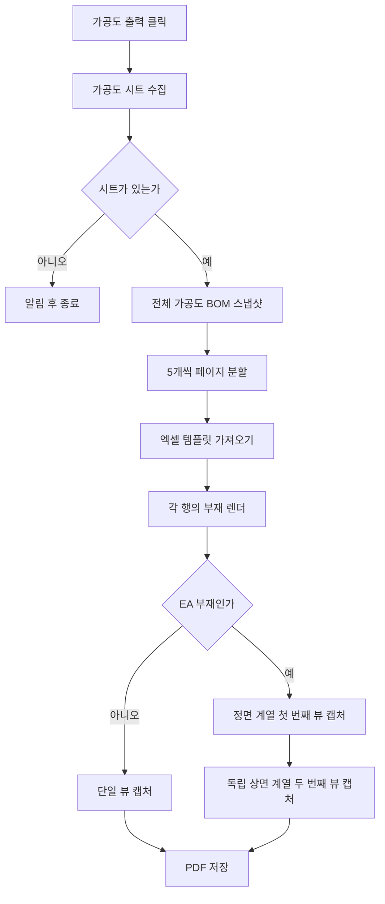

# 가공도 시트 PDF 출력

## 1. 개요

도면정보 탭의 `가공도 출력` 버튼은 시트 목록의 모든 가공도 부재를 모아 엑셀 템플릿에 배치하고 PDF로 저장한다.

- 템플릿: `가공도_도면_1.xlsx` (2026-07-12 전환 — 제작도와 동일 A4 그리드, 세로 5칸 뷰 + 부재명 5칸 + BOM 20행)
- 페이지당 부재: 최대 5개
- 저장 위치: 실행 파일 하위 `Drawings`
- 일반 부재: 한 행에 단일 뷰
- EA 앵글 부재: 한 행을 위·아래로 나눈 2개 뷰

## 2. 전체 흐름

엑셀 템플릿을 가져온 직후 `RemoveEmptyTemplateBorders`(SDK 1.0.26.716, tol 0.1f·RowAndColumn)가 내용 없는 공백 셀(미기재 BOM 행 등)의 괘선을 지운다 — 제작도와 동일 패턴 (2026-07-21). 전역 동작이라 남길 칸(PAINT/DP/TAG 165~169·Rev 첫 기재행 REV. 칸 194)만 공백(`" "`)으로 위장 보호하고, BOM(4~163)·Note(164)·Rev 위 4행(170~193)·부재명(195~199)은 빈칸으로 둬 괘선이 제거되게 한다. Note 정적 라벨은 템플릿에서 제거됨(제작도와 동일 사양).

## 3. 행 렌더링

### 일반 부재

1. 대상 부재만 표시한다.
2. BBox 최장축과 PAD/PLATE 여부로 기본 카메라를 정한다.
3. `ORIENTATION` UDA 회전을 적용한다.
4. 임시 캡처로 실제 투영 크기를 재어, 세로로 잡히면 화면축 90도 회전으로 가로로 눕힌다(`ProbeAndRollLandscape`).
5. LINE/POINT Osnap을 수집하고 뒷면 Osnap을 제외한다 — 단면만 출력하므로 뒷면 점은 극점이어도 치수화하지 않는다.
6. 가로(길이) 축은 체인+전체 2단, 세로(폭) 축은 체인 1단만 치수를 만든다(전체 치수 중복 생략).
7. 모델 캡처 후 확정된 실측 배율로 보조선·치수를 그린다(`DrawMfgDimsAtScale`) — 보조선 오프셋(9/18mm)·시작 gap(2mm) 모두 종이 기준 일정, 치수 텍스트는 SDK 자동 정렬.
8. Hole, SlotHole, EarthBoss 풍선과 단면 모델(은선 없음 — 은선 캡처 API + 은선제거(HLR) 렌더모드 조합)을 View 영역 중앙에 맞춰 2D로 변환한다.

### EA 앵글 부재

EA 판정은 `SPREF`에서 `/`를 제거하고 `:` 앞 ITEM 문자열이 `EA`로 시작하는지 확인한다.

#### 첫 번째 뷰

- Osnap 중심과 BBox 중심을 비교해 앵글의 열린 방향을 판정한다.
- 필요하면 PLUS 카메라를 MINUS 카메라로 바꾼다.
- 열린 방향을 맞추기 위한 180도 회전을 적용한다.
- 최장축 치수는 두 번째 뷰에 맡기고, 나머지 축 치수와 Hole/SlotHole/EarthBoss 풍선을 표시한다.

#### 두 번째 뷰

- 별도 카메라에서 절대 방향으로 새로 만든다(첫 번째 뷰 회전은 원복 불필요 — `MoveCamera`가 직교 프레임을 다시 잡음).
- 최장축이 Z이면 `X_PLUS`(반대쪽) 뷰를 쓰고, 가로화는 임시 캡처 실측(`ProbeAndRollLandscape`)이 수행한다.
- 그 외에는 `Z_MINUS` 상면 뷰를 사용한다.
- 과거 T자형 출력을 만들던 추가 정렬 회전은 적용하지 않는다.
- 길이(최장축) 치수는 위 슬롯일 때만 체인+전체 2단으로 그리고, 폭(높이) 치수는 체인 1단만 화면 오른쪽에 추가한다.
- 형상 풍선은 첫 번째 뷰에서만 표시하고 두 번째 뷰에서는 다시 생성하지 않는다.

#### 두 뷰 상하 배치와 미러

- 앵글의 접힘 모서리(두 플랜지가 만나는 변)가 페어의 **가운데**를 향하도록 두 뷰의 상하 순서를 자동으로 정한다. 최장축(길이) 치수는 위쪽 뷰가 그린다.
- 두 번째 뷰의 모서리 방향이 어긋나면 그 뷰를 상하로 미러한다. 모델은 SDK 2D 미러(`SetSelected3DMirrorBy2DView`)로 뒤집고, 치수·보조선 매핑은 SDK 미러가 함께 처리하므로 별도 좌표 반전은 하지 않는다.

두 번째 뷰 캡처가 실패하면 불완전한 2D 객체를 삭제하고 첫 번째 뷰는 유지한다.

> 이 EA 두 뷰 배치(가로화·상하 스왑·미러)는 사내 실기 출력으로 검증 중인 동작이다.

## 4. 풍선 정책

가공도에서 생성하는 형상 풍선은 다음 세 종류로 제한한다.

| 종류 | 판정 데이터 | 표시 |
|---|---|---|
| Hole | `BOMData.Holes` | 같은 지름끼리 묶어 `Ø지름`, 여러 개면 개수 병기 |
| SlotHole | `BOMData.SlotHoles` | 반지름, 폭, 길이, 깊이와 개수 병기 |
| EarthBoss | UDA `PURPOSE=EBOS` | `EarthBoss` |

원형 부재의 반지름 풍선과 ISO 부재번호 풍선은 가공도에서 생성하지 않는다. 위 세 형상 풍선은 일반 X/Y/Z 뷰와 제작도에는 표시하지 않는다.

## 5. 예외 처리

| 조건 | 처리 |
|---|---|
| 가공도 시트 없음 | 경고 후 종료 |
| 엑셀 템플릿 없음 | PDF를 만들지 않고 오류 표시 |
| BOM 20행 초과 | 21번째 이후 BOM 표 미표시 경고 |
| 특정 행 렌더 실패 | 해당 행을 실패 처리하고 나머지 행 계속 |
| 페이지의 모든 행 실패 | 해당 페이지 PDF 저장 생략 |
| Shape/Note/Measure 변환 실패 | 경고 로그 후 가능한 객체로 PDF 계속 생성 |

출력 종료 시 시트 목록 활성 상태, BOM 표, 출력 전 선택 시트의 부재 가시성을 복원한다.

## 6. 관련 코드

- `btnMfgDrawingSheet_Click`: 가공도 시트 수집과 결과 메시지
- `GenerateMfgDrawingManual`: 페이지 분할, 템플릿 입력, PDF 저장
- `RenderMfgRowToViewArea`: 일반/EA 행 분기
- `BuildMfgSceneCore`: 기본 카메라, Osnap, 치수 수집, 풍선 생성, 두 뷰 스왑 판정
- `BuildEaSecondaryScene`: EA 아래쪽 뷰와 최장축 치수, 상하 미러 판정
- `ProbeAndRollLandscape`: 임시 캡처 실측으로 세로→가로 90도 회전
- `DrawMfgDimsAtScale`: 캡처 후 실측 배율로 보조선·치수 그리기
- `CaptureMfgSceneToViewArea`: 3D 장면을 지정 View 영역에 2D로 배치

## 7. 변경 이력

| 날짜 | 변경 내용 | 작성자 |
|---|---|---|
| 2026-04-13 | 초안 작성 | — |
| 2026-05-23 | 엑셀 템플릿 기반 수동 PDF 출력으로 재배선 | Claude |
| 2026-06-15 | 관련: T-048 (EA 가공도 T자형 출력 수정) — EA 상하 2뷰, 최장축 치수 분리, 독립 두 번째 카메라 복원 | Codex |
| 2026-06-15 | 관련: T-044, T-047 — 가공도 풍선을 Hole, SlotHole, EarthBoss 세 종류로 제한하고 일반 뷰·제작도에서는 비표시 | Codex |
| 2026-07-03 | 관련: T-073 (가공도 EA 치수 배치) — EA 두 뷰 가로화(`ProbeAndRollLandscape`), 접힘 모서리 기준 상하 스왑, 2차 뷰 미러, 실측 배율 보조선·치수(`DrawMfgDimsAtScale`), 텍스트 SDK 자동 정렬 위임 반영. 사내 실기 검증 중 | Claude |
| 2026-07-03 | 사용자 사양 3건 — ① 세로(폭) 치수 1단만(전체 치수 생략) ② 은선 캡처 폐지, 단면만 출력(`Create2DViewObjectWithModelAtCanvasOrigin` 전환, DASH_LINE 렌더모드 제거) ③ 뒷면 osnap 극점 복원 예외 폐지(단면 osnap만 치수화) | Claude |
| 2026-07-03 | 보조선 시작 gap을 종이 절대 2mm(`MfgCanvasExtGap`, 실측 배율 역산)로 통일 — 옛 모델좌표 10mm는 부재·축척마다 종이 gap 불일치. 제작도 무영향 | Claude |
| 2026-07-06 | 작은 치수 단 승격 (사용자 사양) — 텍스트가 안 들어가는 작은 체인 치수(뷰 최대/26, max>100mm)는 `DrawMfgDimsAtScale`에서 치수선째 위 단(Level 1)으로 승격, 그 경우 전체 치수는 3단(off2)으로. 제작도와 동일 규칙 | Claude |
| 2026-07-06 | 보조선 오프셋 1.5배 확대 (6/12 → 9/18mm) — 세로 치수 텍스트-모델 밀착 해소, 제작도(7.5/15)와 동일 배율 | Claude |
| 2026-07-06 | 2단(Level 1) 치수 텍스트 슬라이드 종이 5mm (`MfgLvl2TextSlideCanvas`) — 가로(길이축) 치수=화면 오른쪽(`MfgHeightToRight`)/세로(폭) 치수=화면 위(`MfgAxisUpPositive`), 제작도와 동일 사양 | Claude |
| 2026-07-12 | **신 템플릿(가공도_도면_1.xlsx) 전환 — 부재명 슬롯 + BOM 20행** (사용자 사양). ① 템플릿 경로를 `사용자템플릿_엑셀_가공도.xlsx` → `가공도_도면_1.xlsx`(제작도 복제·재구획). ② `BuildMfgPageData` 슬롯 재편: 부재명 `Input_5~9` → `Input_200~204`(각 뷰 왼쪽, 뷰와 세로 정렬), BOM `Input_10~129`(15행) → `Input_4~163`(20행, 제작도와 동일 열별 20연속), 선초기화 1..129→1..204. ③ BOM 한도 15→20(경고·expected 포함). ④ `Set2DViewTemplateMark(Logo.png)` 1회 등록 — 신 템플릿 `{Image}`(CONTRACTOR 로고) 슬롯 미치환 방지. BOM 스냅샷은 이미 전체 부재(`lvDrawingBOMInfo`)라 "전체 BOM" 요구는 한도 확대만으로 충족. 사내 실기 검증 대기 | Claude |
| 2026-07-12 | **템플릿 적용을 JSON 사전변환으로 (출력 멈춤 해소)** — 신 템플릿 6만 셀로 페이지마다 `ImportExcelWithData`가 수십 초. 페이지 루프·카메라 프로브를 `TryApplyTemplateFromJson`(세션 1회 변환 + 태그 치환 + `ApplyTemplateFromJson`) 우선 + `ImportExcelWithData` 자동 폴백으로 교체(헬퍼는 `Form1.ExcelTemplate.cs` 공용, 제작도와 공유). 중복된 임시 JSON PoC(`MfgTemplateJsonPocEnabled`) OFF. 페이지 루프라 2페이지째부터 엑셀 파싱 없이 빠름. 사내 검증 대기 | Claude |
| 2026-07-19 | **JSON 사전변환 제거 + 소형 템플릿 확정** — JSON 폐기(변환 290초·태그 미보존), openpyxl 저장본 네이티브 크래시 확정으로 사용자가 엑셀 손수 재제작한 소형 템플릿(~4천 셀)만 사용. 페이지 루프·카메라 프로브 모두 `ImportExcelWithData` 직행(수백 ms), `RunTemplateJsonPoc`·진단 스위치 제거. 템플릿 수정은 엑셀에서만 | Claude |
| 2026-07-20 | **북쪽 화살표 배치 추가** (사용자 요청 "가공도도 똑같이"). ① 템플릿: 제작도 복제로 딸려온 북쪽 화살표 `{View_5}`(AT3)가 부재 5번 칸과 중복 → `{View_8}` 재번호(엑셀 COM). ② 코드: 페이지 루프에서 `View_8`=N 화살표·`View_7`=ISO 화살표를 `PlaceImageInTemplateArea`(제작도와 동일 캘리브레이션 공용)로 매 페이지 배치, 슬롯 없으면 생략. ③ `EnsureViewAreasCache`에 중복 태그 방어(첫 위치 사용+경고) — 중복 시 ToDictionary 예외로 출력 전체가 죽던 잠재 크래시 차단 | Claude |
| 2026-07-20 | **⚠ View_8 금지 발견 — N 화살표 View_6으로 재배정**. View_8 태그가 있으면 템플릿 import는 겉보기 성공하나 직후 모델 캡처가 `AccessViolation`(메모리 손상)으로 사망 — 새 제작도(최대 View_7)는 정상, View_8 첫 도입된 가공도만 사망, 잔여영역 정리로도 재현 → SDK가 View 번호 7까지만 지원하는 것으로 추정(벤더 확인 요청 후보). 조치: 가공도 CLIENT 예약 `{View_6}`(AW49, 코드 미사용) 태그 삭제 + N 화살표 `{View_8}`(AT3) → `{View_6}` 재번호(엑셀 COM), 코드 View_8→View_6. **템플릿 규칙: View 번호는 1~7만 사용** | Claude |
| 2026-07-20 | **카메라 ± 검증 프로브 OFF** (`MfgCameraSignProbeEnabled=false`) — 템플릿 규칙(View≤7·Input≤199·중복 0) 정리 후에도 프로브 캡처 지점 AccessViolation 지속 → 크래시 격리 위해 비활성. 본 페이지 루프 통과 여부로 "프로브 고유 시퀀스 vs 캡처 API 자체"를 판별. 캡처 진입 로그 `[Capture]`/`[Orient] 캡처 직전` 추가 (AccessViolation은 catch 불가라 위치 특정은 로그로만 가능) | Claude |
| 2026-07-21 | **괘선 제거 3차 — 칸별 정책 확정** — Note(164)·Rev 위 4행(170~193)도 제거 대상으로 전환, 보존은 PAINT/DP/TAG(165~169)와 REV. 칸(194)만. 템플릿 Note 라벨 COM 제거 (제작도와 동일 사양) | Claude |
| 2026-07-21 | **괘선 제거 2차 — 비-BOM 슬롯(164~194) 공백 위장** — 전역 제거가 다른 빈 Input 칸 괘선까지 지워(제작도 실기 확인) `BuildMfgPageData` 선초기화를 선별 초기값으로 변경. BOM(4~163)·부재명(195~199)은 빈 문자열 유지 | Claude |
| 2026-07-21 | **빈 칸 괘선 제거** — 페이지 루프 `ImportExcelWithData` 직후 `RemoveEmptyTemplateBorders(0.1f, RowAndColumn)`(SDK 1.0.26.716) 호출, 미기재 BOM 행 등 공백 셀 테두리 제거 (제작도와 동일 패턴) | Claude |
| 2026-07-21 | **격리 동결 — 벤더 수정 대기** (사용자 결정). 9단계 최종 매트릭스: 코드 무죄(제작도 코드도 재제작 템플릿에서 사망), 파일 혈통 무죄(깨끗한 재제작본도 사망), 부재명 병합 무죄(T-A: 빼도 사망) → **가공도 레이아웃 구성(밴드 병합 등) × 신 SDK 캡처의 조합 버그**로 좁혀진 상태에서 벤더 수정 대기. 부재명 병합·태그는 완성 설계 상태로 복원. 임시 상태 유지 중: 카메라 프로브 OFF·DASH_LINE 캡처·BeginUpdate 해제·선렌더 — 벤더 픽스 후 일괄 재검증·정리 예정. 크래시 유발 구본은 스크래치 백업 보존 | Claude |
| 2026-07-21 | **로고 {Image_3} 통합** — 제작도와 동일 (AW53 태그 교체, mfgImageMapping·probeImageMapping Key 3 추가, Set2DViewTemplateMark 제거) | Claude |
| 2026-07-21 | **BeginUpdate 포장 임시 해제 (격리 8단계)** — 선렌더 추가 후에도 재발, 신규 로그로 사망 호출 = `Create2DViewObjectWithModelHiddenLineAtCanvasOrigin` 자체로 확정 (`RenderMode OK`까지 출력). 남은 전역 상태 차이: 가공도만 출력 전체가 `BeginUpdate`(화면 갱신 중단) 스코프 안에서 캡처 — 제작도는 스코프 밖. 외곽 Begin/EndUpdate 쌍 임시 주석 (P3 #2 화면 번쩍임 일시 재발 감수, 판정 후 재구성) | Claude |
| 2026-07-21 | **캔버스 선렌더 추가 (격리 7단계)** — 재제작(깨끗한 혈통) 템플릿으로도 같은 지점 재발 → 6단계 판정 재검토. 두 흐름 시퀀스 정밀 대조 결과 남은 유일한 차이 = 제작도는 import 직후 `Drawing2D.Render()` 후 캡처, 가공도는 render 없이 곧바로 캡처. 페이지 루프에 import·View 캐시 직후 `Drawing2D.Render()` 삽입(제작도 검증 시퀀스 정합). `[Orient]`에 RenderMode 완료 로그 추가 — 사망 호출(SetRenderMode vs Create2DViewObject) 정밀 특정용 | Claude |
| 2026-07-21 | **⚠ 판정: 템플릿 파일 유죄 — 제작도 기반 재제작 (격리 6단계 종결)**. Fly·DoEvents 제거 후에도 재발 → 교차 실험(정상 완주하는 제작도 흐름으로 가공도 템플릿을 렌더)에서 **제작도 코드도 동일 크래시** → 가공도_도면_1.xlsx 파일 자체가 원인 확정 (태그·번호·병합 규칙 검사로는 안 잡히는 내부 차이 — 편집 이력 누적 추정). 조치: 크래시 유발 파일은 벤더 증거로 백업 후, **검증된 제작도_도면_1.xlsx를 복사해 가공도 레이아웃만 COM 재구성** — 중앙부 정리(쿼드런트·캡션 해제), 밴드 5칸(T7:AG11 등)+부재명 5칸(E7:R11 등) 병합·태그, Rev행 중복 태그 제거, CLIENT View_6 태그 제거, 하단 좌표띠 복원. 검증: View 1~5·Image 1~2·Input 1~199 각 1회 | Claude |
| 2026-07-21 | **캡처 직전 FlyToObject3d·DoEvents 제거 (격리 5단계)** — 제작도와 100% 동일한 캡처 조합(DASH+은선 API)으로도 같은 지점(`[Orient]` 임시 캡처) AccessViolation 재발(7/21 08:20 로그) → API·렌더모드 완전 소거. 남은 차이 중 최우선 용의 = 캡처 직전 시퀀스: `ProbeAndRollLandscape`의 Fly 2곳(진입·roll 후)과 호출부 `DoEvents` 2곳(1차·2차 뷰) 제거. W/H 판정은 직교 투영 비율이라 Fly(프레이밍)와 무관, 배치는 캡처 후 Rescale/MoveObjectTo가 담당 → 기능 영향 없음. 카메라 방향 설정(BuildMfgSceneCore)은 유지 | Claude |
| 2026-07-20 | **캡처 렌더모드 HLR → DASH_LINE (격리 4단계)** — HLR 모드 우회 exe(16:08)로도 같은 지점(`[Orient]` 가로화 임시 캡처) AccessViolation 재발(16:28 로그) → 'HLR 모드 + 은선 캡처' 조합도 사망 판정. 제작도가 완주로 검증한 조합(DASH_LINE + 은선 캡처)과 100% 동일하게 맞춤. ⚠ 은선이 점선으로 보일 수 있음 — 안정화 우선, '단면만' 사양은 벤더 수정(은선 없는 캡처 크래시 2건 문의) 후 복원 예정 | Claude |
| 2026-07-20 | **북쪽 화살표를 {Image_N} 태그로 전환** (SDK 1.0.26.716, 제작도와 동일). 템플릿: `{View_6}`(AT3)→`{Image_1}`, `{View_7}`(C3)→`{Image_2}`. 코드: 페이지 루프·카메라 프로브 `ImportExcelWithData` 3인자 + `mfgImageMapping`, View 기반 수동 배치 블록 제거. 가공도 View 태그는 부재 칸 1~5만 남음 | Claude |
| 2026-07-20 | **⚠ 캡처 API 우회 — 은선 API + 은선제거(HLR) 렌더모드로 전환**. 프로브 OFF 후 격리 최종 확정: 사망 지점 = `[Orient]` 임시 캡처의 `Create2DViewObjectWithModelAtCanvasOrigin`(은선 없는 캡처). 조합 매트릭스 — 은선 없는 API+구 템플릿=정상 / 은선 API+신 템플릿=정상(제작도 수십 회) / **은선 없는 API+신 템플릿=AccessViolation**(SDK 내부 버그, 벤더 문의 후보). 조치: 본 캡처·가로화 임시 캡처 모두 `Create2DViewObjectWithModelHiddenLineAtCanvasOrigin` + `SetRenderMode(HIDDEN_LINE_REMOVAL)` — HLR이 은선을 제거하므로 "단면만" 사양 유지 기대(첫 PDF에서 점선 은선 유무 확인 필요) | Claude |
| 2026-07-20 | **⚠ Input 200 이상 금지 — 부재명 195~199로 재배정**. View_6 재번호 후에도 동일 크래시 → 남은 격리 변수 = Input 200~204(부재명, 가공도에만 존재). 모든 사례가 "Input ≤199=정상 / ≥200=사망"으로 갈림(제작도 199 정상·구 가공도 129 정상) → View와 같은 SDK 내부 고정 배열 한계 추정. 조치: 가공도에서 항상 빈칸인 Rev 표 마지막 행 태그 `{Input_195~199}`(AX43~BO43) 삭제(칸·선은 유지, 시각 동일) + 부재명 `{Input_200~204}`(E7~E47) → `{Input_195~199}` 재번호(엑셀 COM), 코드 부재명 195+i·선초기화 1..199. **템플릿 규칙: Input 번호는 1~199만 사용** | Claude |
