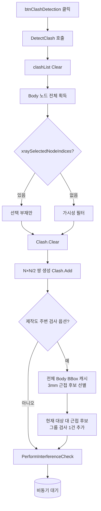

# 간섭 검사 실행

## 1. 개요
대상 Body 노드 쌍(N×N/2)을 생성하여 VIZCore3D ClashManager에 등록하고 **비동기 간섭 검사**를 시작한다. 자동 치수·도면 출력 경로에서는 제작도 연결 부재 확보를 위해 모델 전체 Body의 Bounding Box를 캐시하고, 대상과 3mm 이내로 겹치는 근접 후보만 선별해 `대상 vs 근접 후보` 그룹 검사 1건을 추가한다. 결과는 `Clash_OnClashTestFinishedEvent`에서 수신한다.

## 2. 트리거
| 항목 | 값 |
|---|---|
| 유형 | User Action |
| 입력 | `btnClashDetection` 버튼 클릭 |
| 위치 | 메인 폼 > Clash 탭 |

## 3. 사전 조건
- [ ] 3D 모델 로드됨
- [ ] 가시 Body 노드 2개 이상

## 4. 전체 동작 흐름 (Happy Path)

| # | 단계 | 주체 | 설명 |
|---|---|---|---|
| 1 | 내부 위임 | Form1 | 수동 간섭검사는 `DetectClash()`, 자동 치수·도면 출력은 `DetectClash(includeOutsideNeighbors: true)` 호출 |
| 2 | 결과 리스트 초기화 | Form1 | 내부 연결성용 `clashList`, 제작도 연결용 전용 리스트·Part 집합, `lvClash`를 각각 Clear |
| 3 | Body 노드 획득 | SDK | `GetPartialNode(false, false, true)` |
| 4 | 대상 필터링 | Form1 | [분기 A] |
| 5 | ClashManager 초기화 | SDK | `vizcore3d.Clash.Clear()` |
| 6 | 쌍별 ClashTest 등록 | Form1 | i<j 모든 쌍에 ClashTest 생성 및 Add |
| 7 | 제작도 연결 후보 선별 | Form1 | 옵션이 켜지면 모델 Body별 Bounding Box·실제 부모 Part를 첫 실행에 캐시. 대상 통합 BBox와 개별 BBox를 차례로 비교해 3mm 이내 근접 후보만 남김. 같은 Part는 제외 |
| 8 | 제작도 연결 검사 | Form1 | `대상 vs 근접 후보` 그룹 검사 1건 추가. 숨겨진 후보도 `VisibleOnly=false`로 검사하고 결과는 내부 연결성 목록과 분리 저장 |
| 9 | 검사 파라미터 | Form1 | ClearanceValue=3.0, RangeValue=3.0, PenetrationTolerance=1.0 (단위 mm) |
| 10 | 비동기 시작 | SDK | `PerformInterferenceCheck()` → bool |
| 11 | 사용자 알림 | UI | MessageBox "간섭검사를 시작합니다..." |

> 완료 후 동작은 [Clash 완료 콜백](./간섭검사 완료 이벤트.md) 참고

> 구현 상세는 [코드 레퍼런스](../../code-reference/form1-clash.md#DetectClash) 참고

## 5. 주요 분기 처리

### [분기 A] 대상 부재 결정
| 조건 | 처리 |
|---|---|
| `xraySelectedNodeIndices.Count > 0` | 선택 부재만 대상 |
| 비어있음 | 가시 Body만 필터 (`FromIndex().Visible`) |
| 필터 결과 0개 | 전체 Body로 Fallback |

### [분기 B] PerformInterferenceCheck 결과
| 조건 | 처리 |
|---|---|
| true | 비동기 시작, 완료 이벤트 대기 |
| false | 즉시 실패 반환, E02 |

### [분기 C] 제작도 주변 부재 그룹 검사
| 조건 | 처리 |
|---|---|
| `includeOutsideNeighbors == true` | 모델 전체를 정밀검사하지 않고, 캐시된 Bounding Box가 대상과 3mm 이내인 Body만 상대 그룹으로 등록한다. 자동 치수 추출과 STRU 자동 출력 경로가 사용한다. |
| `false` | 기존 대상 내부 쌍 검사만 수행한다. 수동 간섭검사 버튼이 사용한다. |
| 근접 후보가 없음 | 추가 검사 없이 기존 대상 내부 쌍 검사만 수행하며 제작도 연결 목록은 빈 상태로 유지한다. |

## 6. 예외 / 에러 처리

| ID | 조건 | 동작 | 사용자 피드백 | 결과 상태 |
|---|---|---|---|---|
| E01 | Body 노드 없음 | return false | MessageBox "로드된 모델이 없거나 간섭검사 시작에 실패..." | 상태 변화 없음 |
| E02 | 생성된 쌍 0개 | return false | 위와 동일 | ClashManager만 Clear됨 |
| E03 | `PerformInterferenceCheck()` 실패 | return false | 위와 동일 | ClashTest 등록 상태 유지 |
| E04 | 예외 throw | catch + Debug.WriteLine | (사용자에겐 E01~E03 메시지로 통합 표시) | 부분 등록 가능성 |

## 7. 상태 변화 (Before / After)

| 대상 | Before | After |
|---|---|---|
| `clashList` | 이전 결과 | 빈 리스트 (완료 콜백에서 채움) |
| 제작도 연결 결과 | 이전 결과 | 전용 결과 리스트·Part 집합 Clear 후 완료 콜백에서 별도 채움 |
| Body Bounding Box 캐시 | 미생성 또는 기존 모델 캐시 | 첫 자동 검사에서 1회 생성 후 같은 모델에서 재사용. 모델 재로드 시 Clear |
| `lvClash` | 이전 행 | 빈 상태 |
| `vizcore3d.Clash` | 이전 등록 | Clear 후 새 쌍 전체 등록 |
| `vizcore3d.Clash.ClashTestCount` | 이전 값 | N×(N-1)/2 + 제작도 주변 그룹 검사 최대 1건 |

## 8. 후행 기능 (Chained)
- [Clash 완료 콜백](./간섭검사 완료 이벤트.md) — SDK가 비동기로 호출
- [시트 자동 분할](../도면시트/시트 자동 생성.md) — 콜백에서 자동 트리거

## 9. 관련 링크
- 코드 구현: [간섭검사 버튼](../../code-reference/form1-clash.md#btnClashDetection_Click), [DetectClash](../../code-reference/form1-clash.md#DetectClash)
- 용어집: [Clash](../../_glossary.md#clash-간섭), [X-Ray 모드](../../_glossary.md#x-ray-모드)

## 10. 변경 이력
| 날짜 | 변경 내용 | 작성자 |
|---|---|---|
| 2026-07-21 | 제작 대상 대 모델 전체 정밀검사를 폐기하고 2단계 탐색으로 변경. 모델 Body Bounding Box·실제 부모 Part를 1회 캐시 → 대상과 3mm 이내 근접 후보 선별 → 후보만 전용 그룹 Clash. 같은 모델에서는 캐시 재사용 | Codex |
| 2026-07-21 | 제작도 주변 부재가 기존 가시 대상 내부 간섭 결과에 없어 점선 대상이 0개가 되던 문제 수정. 자동 치수·도면 출력 경로에서 `현재 대상 vs 모델 나머지 Part` 그룹 검사 1건을 추가하고, 수동 간섭검사 버튼은 기존 범위를 유지 | Codex |
| 2026-04-13 | 초안 작성 | — |
