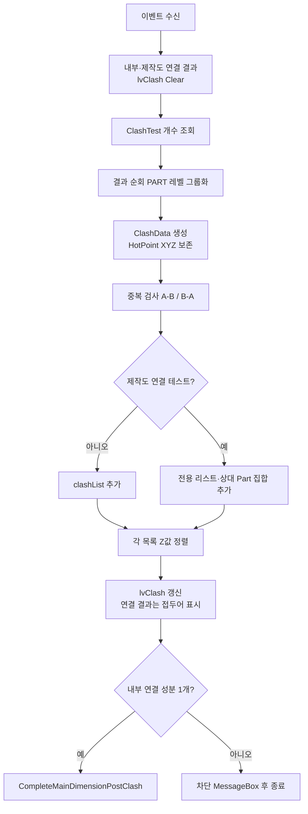

# 간섭 검사 완료 콜백

## 1. 개요
VIZCore3D가 모든 ClashTest 실행을 완료했을 때 호출된다. 대상 내부 결과와 제작도 연결 부재 결과를 테스트 이름으로 구분해 각각 중복 제거·정렬한다. 대상 내부 결과만 `clashList`에 저장해 연결성 판정에 사용하고, 제작도 연결 결과는 전용 리스트·Part 집합에 저장해 `lvClash`의 `[연결]` 행과 제작도 ISO 점선 대상에 사용한다. Clash의 `HotPoint`는 X/Y/Z 전체를 보존해 제작도에서 연결 어셈블리 이름을 실제 접촉점에 표시할 때 사용한다. 연결성 판정을 통과할 때만 `CompleteMainDimensionPostClash`(Osnap → 치수 → 요약 → 시트)를 호출한다.

## 2. 트리거
| 항목 | 값 |
|---|---|
| 유형 | Event Callback |
| 입력 | `vizcore3d.Clash.OnClashTestFinishedEvent` |
| 위치 | 앱 초기화 시 구독 ([BOM-001](../BOM/VIZCore3D 초기화.md)) |

## 3. 사전 조건
- [ ] `btnClashDetection_Click` 또는 `btnMainDimension_Click`에서 `DetectClash()` 실행됨
- [ ] `vizcore3d.Clash.ClashTestCount > 0`

## 4. 전체 동작 흐름 (Happy Path)

| # | 단계 | 주체 | 설명 |
|---|---|---|---|
| 1 | 결과 컨테이너 리셋 | Form1 | `clashList`, 제작도 연결 전용 리스트·Part 집합, `lvClash`를 각각 Clear |
| 2 | 테스트 순회 | Form1 | `for i in 0..ClashTestCount` |
| 3 | 결과 조회 | SDK | `GetResultItem(test, ResultGroupingOptions.PART)` |
| 4 | ClashData 생성 | Form1 | Index1/2, Name1/2, HotPoint X/Y/Z와 유효 여부. XYZ는 제작도 연결 이름의 월드 좌표 투영에 사용 |
| 5 | 중복 검사 | Form1 | 양방향 (A-B, B-A) 체크 |
| 6 | 결과 분리 | Form1 | 일반 테스트는 `clashList`, 이름이 `제작도_근접후보_간섭검사`인 테스트는 전용 연결 리스트로 저장 |
| 7 | 연결 Part 산출 | Form1 | 결과 A/B 중 제작 대상 Part가 아닌 반대쪽 Part 인덱스를 전용 HashSet에 추가 |
| 8 | 정렬·ListView 표시 | UI | 두 목록을 각각 Z값 내림차순 정렬. 제작도 연결 행은 첫 열에 `[연결]` 접두어를 붙여 표시 |
| 9 | **연결성 판정** (T-023 v3) | Form1 | `IsSingleConnectedComponent(out componentCount)` — Clash 인접 그래프(Part→Body 역매핑) BFS로 연결 성분 수 계산. ≠ 1이면 MessageBox + return (Osnap·치수·시트 모두 미생성) |
| 10 | 후속 파이프라인 호출 | Form1 | 판정 통과 시 `CompleteMainDimensionPostClash(isSingleMember: false, clashTestCount: testCount)` — Osnap 수집 → 체인 치수 → 요약 MessageBox → `GenerateDrawingSheets()`(+ Sheet 1 BOM 자동 수집) → 오버레이 해제 |

> 구현 상세는 [코드 레퍼런스](../../code-reference/form1-clash.md#Clash_OnClashTestFinishedEvent) 참고

## 5. 주요 분기 처리

### [분기 A] 결과 존재 여부
| 조건 | 처리 |
|---|---|
| `clashList.Count > 0` | 정렬·`lvClash` 표시 + 연결성 판정 진행 |
| 비어있음 | 내부 연결성 행은 없으며, 제작도 연결 결과가 있으면 `[연결]` 행만 표시. 연결 성분은 부재 개수 그대로 → `bomList.Count > 1`이면 [E03] 차단 |

제작도 연결 전용 결과는 `clashList`의 존재 여부와 별개다. 원본 결과 개수, 상대 Part 개수, 최대 50개 부재명을 진단 로그에 남긴다.

### [분기 B] 연결성 (T-023 v3 — 핵심)
| 조건 | 처리 |
|---|---|
| `componentCount == 1` | `CompleteMainDimensionPostClash(false, testCount)` 호출 → Osnap·치수·요약·시트 |
| `componentCount ≥ 2` | MessageBox "연결되지 않은 부재 그룹 N개 발견" + `DiagLog BLOCKED components=N` + `HideBusyOverlay` + return. Osnap·치수·시트 모두 **미생성** |

> 본 경로는 "Clash가 실제로 돌았을 때"만 호출. **Clash 시작 자체가 실패**(단일 부재 등 쌍 0개) 시는 본 콜백이 아예 호출되지 않고 [`btnMainDimension_Click`의 fallback](../BOM/메인 치수 추출.md) 경로가 `CompleteMainDimensionPostClash(true, 0)`을 직접 호출해 같은 Post 메서드를 탄다 (판정은 스킵, 연결 성분 1개로 간주).

### [분기 B] HotPoint 유효성
| 조건 | 처리 |
|---|---|
| `result.HotPoint != null` | X/Y/Z와 `HasHotPoint=true` 저장. Z는 목록 정렬, XYZ는 제작도 연결 이름 지시점에 사용 |
| null | 좌표 기본값 0, `HasHotPoint=false`. 제작도 연결 이름 후보에서 제외 |

### [분기 C] Osnap 수집 결과 반영
| 조건 | 처리 |
|---|---|
| `_autoProcessOsnapSuccess == false` | 요약 메시지에 "* Osnap 수집 실패" 추가 |
| true | 기본 요약만 |

## 6. 예외 / 에러 처리

| ID | 조건 | 동작 | 사용자 피드백 | 결과 상태 |
|---|---|---|---|---|
| E01 | `vizcore3d.Clash.Items[i] == null` | continue | 해당 테스트 건너뜀 | 일부 결과 유실 가능 |
| E02 | 처리 중 예외 | catch | `HideBusyOverlay` + MessageBox "간섭검사 결과 처리 중 오류: {msg}\nStack Trace: ..." | `clashList` 부분 채워짐, 오버레이 안전 해제 |
| E03 | **연결 성분 ≥ 2** (T-023 v3) | return | MessageBox "치수 추출은 모든 부재가 하나의 덩어리로 연결되어 있을 때만 가능합니다. 현재: 연결되지 않은 부재 그룹 N개 발견" | Osnap·치수·시트 모두 **미생성**. `DiagLog`에 `BLOCKED components=N (T-023 v3)` |

## 7. 상태 변화 (Before / After)

| 대상 | Before | After (판정 통과) | After (판정 실패) |
|---|---|---|---|
| `clashList` | 비어있음 | ClashData 리스트, Z값 내림차순 정렬 | 동일 |
| 제작도 연결 결과 | 비어있음 | HotPoint XYZ를 포함한 근접 후보 ClashData와 상대 Part 인덱스 집합 | 동일 |
| `lvClash` | 비어있음 | 내부 간섭 + `[연결]` 제작도 연결 행 표시 | 표시됨 (판정 전 이미 채움) |
| `osnapPoints*` / `chainDimensionList` | 이전 | 재계산 | **그대로** |
| `drawingSheetList` | 이전 | `GenerateDrawingSheets()` 결과 | **그대로** |
| 요약 MessageBox | — | 표시 (Post 메서드) | **미표시** (차단 MessageBox로 대체) |
| 오버레이 | 유지 중 | Post 메서드 finally에서 해제 | 즉시 해제 + 차단 MessageBox |

## 8. 후행 기능 (Chained)
- [시트 자동 분할](../도면시트/시트 자동 생성.md) (내부 `GenerateDrawingSheets()` 호출)
- [LvClash 더블클릭](../2D도면/간섭 목록 더블클릭.md) — 사용자가 결과 클릭 시
- [Clash 선택 시 치수 필터](../치수/Clash 선택 시 치수 필터.md)

## 9. 관련 링크
- 코드 구현: [Clash_OnClashTestFinishedEvent](../../code-reference/form1-clash.md#Clash_OnClashTestFinishedEvent)
- 용어집: [Clash](../../_glossary.md#clash-간섭), [BFS 기반 시트 분할](../../_glossary.md#bfs-기반-시트-분할)

## 10. 변경 이력
| 날짜 | 변경 내용 | 작성자 |
|---|---|---|
| 2026-07-21 | 제작도 연결 이름 표시를 위해 ClashData에 HotPoint X/Y/Z와 유효 여부를 저장. Z 정렬은 유지하고 XYZ 전체를 2D 월드 좌표 노트의 지시점으로 제공 | Codex |
| 2026-07-21 | 제작도 연결 테스트 결과를 내부 연결성 `clashList`와 분리. 상대 Part 인덱스를 전용 집합에 저장하고 `lvClash`에는 `[연결]` 접두어로 표시하며 원본 결과·Part 수·부재명을 진단 로그에 기록 | Codex |
| 2026-04-13 | 초안 작성 | — |
| 2026-04-22 | T-024: `clashList.Count > 0` 분기 제거 → `GenerateDrawingSheets()`를 **항상** 호출. 간섭 없는 다중 부재도 Sheet 1/설치도/가공도 생성되도록 보장. 단일 부재 케이스의 Clash 시작 실패는 본 콜백 미발동이라 `btnMainDimension_Click` fallback이 담당 (참조 링크 추가) | Claude |
| 2026-04-22 | **T-023 v3 대폭 확장** — 본 콜백이 `btnMainDimension` 파이프라인의 중심 분기점으로 승격. 단계 9 연결성 판정 + 단계 10 `CompleteMainDimensionPostClash` 호출로 변경. 분기 B(연결성)·E03(차단)·상태 변화 2열 추가. 사용자 의도: 떨어진 부재가 있으면 치수추출 무의미 → 원천 차단 | Claude |
