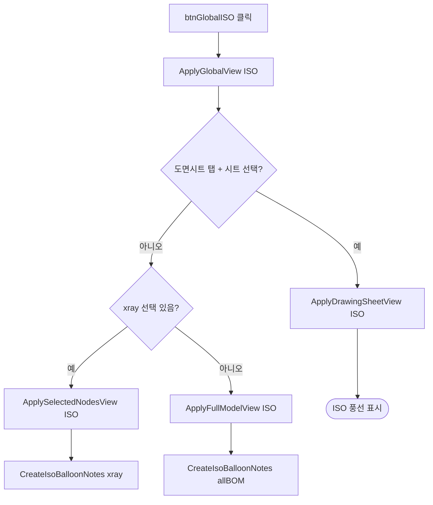

# 글로벌 ISO 뷰

## 1. 개요
현재 탭/선택 상태에 따라 적절한 ISO(등각) 뷰를 적용한다. 공용 함수 `ApplyGlobalView("ISO")`를 호출하며 시트 선택/X-Ray 선택/전체 모델 3가지 경로로 자동 분기.

## 2. 트리거
| 항목 | 값 |
|---|---|
| 유형 | User Action |
| 입력 | `btnGlobalISO` 클릭 |
| 위치 | 메인 툴바 (전역) |

## 3. 사전 조건
- [ ] 3D 모델 로드됨

## 4. 전체 동작 흐름

| # | 단계 | 주체 | 설명 |
|---|---|---|---|
| 1 | 공용 호출 | Form1 | `ApplyGlobalView("ISO")` |
| 2 | 상태 판정 | Form1 | 시트 탭 > xray > 전체 순 우선순위 |
| 3 | 해당 뷰 적용 | Form1 | 3개 내부 함수 중 하나 실행 |

## 5. 주요 분기 처리

### [분기 A] 뷰 적용 경로
| 조건 | 처리 |
|---|---|
| `SelectedTab == tabPageDrawing` + 시트 선택 | `ApplyDrawingSheetView("ISO")` |
| `xraySelectedNodeIndices.Count > 0` | `ApplySelectedNodesView("ISO")` |
| 그 외 | `ApplyFullModelView("ISO")` |

### [분기 B] 풍선 대상 (ISO 전용)
| 경로 | 풍선 대상 |
|---|---|
| Drawing sheet | `sheet.MemberIndices` |
| Selected nodes | `xraySelectedNodeIndices` |
| Full model | 전체 `bomList` |

## 6. 예외 / 에러 처리
| ID | 조건 | 동작 | 사용자 피드백 | 결과 상태 |
|---|---|---|---|---|
| E01 | 예외 | catch | MessageBox "뷰 전환 중 오류: {msg}" | 부분 전환 가능 |

## 7. 상태 변화
| 대상 | Before | After |
|---|---|---|
| 카메라 | 이전 | `ISO_PLUS` |
| RenderMode | 이전 | **`SMOOTH`** (T-034, 2026-04-22 이전에는 `DASH_LINE`) |
| **Object3D 선택상태** | 이전 빨간 하이라이트 | **DESELECT_ALL** (T-035) — 글로벌 뷰는 전체 관찰 모드라 이전 시트/BOM 선택 잔존 제거 |
| `Review.Note` | 이전 | ISO 풍선 |
| `xraySelectedNodeIndices` | 이전 | 경로별 상이 (FullModel는 Clear) |
| `XRay.Enable` | 이전 | Selected경로만 true, FullModel경로는 false |

## 8. 후행 기능 (Chained)
- [풍선 위치 조정](../치수/풍선%20위치%20조정.md)
- [X/Y/Z 축 뷰](./글로벌%20X축.md)

## 9. 관련 링크
- 코드 구현: [Form1.GlobalViews.cs:L17](../../code-reference/form1-global-views.md#btnGlobalISO_Click)

## 10. 변경 이력
| 날짜 | 변경 내용 | 작성자 |
|---|---|---|
| 2026-04-13 | 초안 작성 | — |
| 2026-04-22 | T-034: `ApplyFullModelView`·`ApplySelectedNodesView`의 `SetRenderMode(DASH_LINE)` → `SMOOTH` 실선 모드로 교체. 부재가 은선 처리 없이 잘 보이도록. `ApplyDrawingSheetView`(시트 선택 경로)는 그대로 | Claude |
| 2026-04-22 | T-035: 두 경로 시작에 `Object3D.Select(DESELECT_ALL)` 추가. 글로벌 뷰 버튼 클릭 시 이전 시트/BOM 선택으로 남은 빨간 하이라이트 제거 | Claude |
| 2026-04-23 | T-034 후속: **`ApplyDrawingSheetView`(Form1.DrawingSheets.cs)** 내부 2곳(L702 ISO 분기·L735 X/Y/Z 분기) `SetRenderMode(DASH_LINE)` → `SMOOTH`도 교체. 사용자 시나리오 "BOM 테이블 선택 → 글로벌 ISO/X/Y/Z" 경로에서 은선 복귀되던 문제 해결 (이 경로가 `ApplyGlobalView`의 `tabPageDrawing + 시트 선택` 분기 통과해 `ApplyDrawingSheetView`로 진입). 2D 캡처용 DASH_LINE(L1433)은 유지 | Claude |
