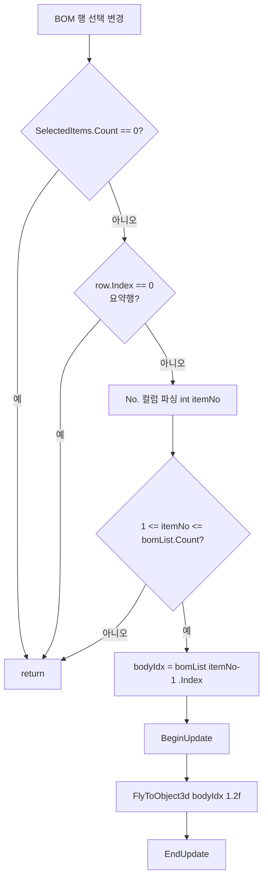

# BOM 정보 행 선택 시 부재 카메라 fit

## 1. 개요
`lvDrawingBOMInfo`(도면정보 탭의 BOM 테이블)에서 한 행을 선택하면 해당 부재로 카메라를 이동·확대한다. 시트 선택과 달리 **가시성(visibility)은 건드리지 않고 카메라만** 움직여 현재 시트 맥락을 유지한다.

## 2. 트리거
| 항목 | 값 |
|---|---|
| 유형 | Event Callback |
| 입력 | `lvDrawingBOMInfo.SelectedIndexChanged` |
| 위치 | 메인 폼 > 도면정보 탭 > BOM 테이블 |

## 3. 사전 조건
- [ ] `bomList.Count > 0`
- [ ] `lvDrawingBOMInfo`에 행이 채워져 있음 (시트 선택 → `CollectBOMInfo` 수행 후)

## 4. 전체 동작 흐름 (Happy Path)

| # | 단계 | 주체 | 설명 |
|---|---|---|---|
| 1 | 선택 확인 | Form1 | `SelectedItems.Count == 0`이면 return |
| 2 | 요약행 스킵 | Form1 | Row 0은 No. 컬럼이 공란(Support&Seat 요약) — return |
| 3 | No. 파싱 | Form1 | `row.SubItems[0].Text` → `int itemNo` (`TryParse` 실패 시 return) |
| 4 | 범위 검사 | Form1 | `itemNo < 1 || itemNo > bomList.Count` → return |
| 5 | Body 인덱스 조회 | Form1 | `bomList[itemNo - 1].Index` (No = bomList 순서 i+1, CollectBOMInfo 매핑과 일치) |
| 6 | **선택상태 하이라이트** (T-022) | SDK | `Object3D.Select(DESELECT_ALL)` → `Object3D.Select({bodyIdx}, true, false)` → 3D View 빨간색. 기존 선택이 있으면 해제 후 단일 부재만 강조 |
| 7 | 카메라 fit | SDK | `vizcore3d.View.FlyToObject3d(new List<int>{bodyIdx}, 1.2f)` — margin 1.2 |

> 시트 선택 핸들러와 달리 `Object3D.Show`·`Clear`·`ClearResultSymbol`을 호출하지 않는다. visibility는 현재 시트 그대로, 카메라+선택상태만 단일 부재로 이동.

## 5. 주요 분기 처리

### [분기 A] 선택 해제·요약행
| 조건 | 처리 |
|---|---|
| 선택 항목 없음 | return |
| 요약행(Row 0) | return |
| No. 파싱 실패 또는 범위 초과 | return (조용히) |

## 6. 예외 / 에러 처리
| ID | 조건 | 동작 | 사용자 피드백 | 결과 상태 |
|---|---|---|---|---|
| E01 | `FlyToObject3d` 실패 등 SDK 예외 | catch | `DiagLog`만 기록 | 카메라 변화 없음 |

## 7. 상태 변화
| 대상 | Before | After |
|---|---|---|
| 부재 가시성 | 현재 시트 상태 | **그대로 유지** |
| 카메라 | 이전 위치 | 선택 부재 확대 |
| **3D View 선택상태** (T-022) | 이전 선택 | **단일 부재 빨간 하이라이트** |
| `selectedAttributeNodeIndex` | 이전 | 선택 부재 인덱스 (연쇄: `Object3D_OnObject3DSelected` → 속성 탭 자동 갱신) |
| `xraySelectedNodeIndices` | 이전 | **그대로 유지** |
| `chainDimensionList` | 이전 | **그대로 유지** |

## 8. 후행 기능 (Chained)
없음 — 순수 카메라 이동.

## 9. 관련 링크
- 선행: [도면 시트 선택](./시트 선택.md) (BOM 정보 테이블을 채움)
- BOM 수집: [Form1.Clash.cs `CollectBOMInfo`](../../code-reference/form1-clash.md#CollectBOMInfo)
- SDK: `VIZCore3D.NET.Manager.ViewManager.FlyToObject3d(List<int>, float)`

## 10. 변경 이력
| 날짜 | 변경 내용 | 작성자 |
|---|---|---|
| 2026-04-21 | 초안 작성 — T-021 BOM 행 선택 카메라 fit 기능 신설 | Claude |
| 2026-04-22 | T-022: `Object3D.Select` 호출로 3D View 빨간 하이라이트 동기화. `DESELECT_ALL` 선행으로 이전 선택 해제, `pivot=false`로 회전 피봇 간섭 방지. 단계 6(선택상태) 추가, 상태 변화 2행 추가 | Claude |
