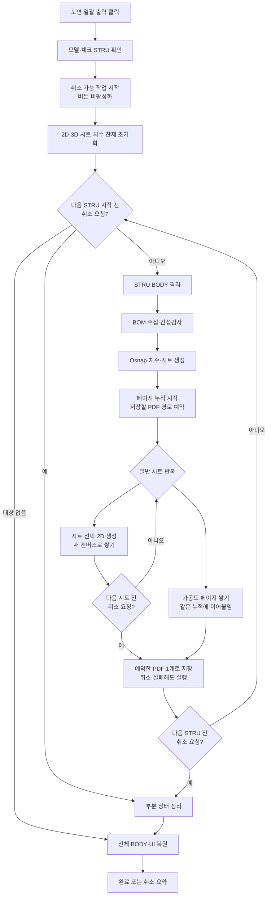

# STRU 도면 일괄 출력

## 1. 개요

체크한 STRU를 순서대로 격리하고 제작도·조립도·설치도·가공도를 **STRU당 PDF 한 개**로 묶어 각 STRU 폴더에 저장한다. 처리 오버레이의 **취소** 버튼을 누르면 현재 실행 중인 SDK 호출은 정상 완료하고, BOM 부재·일반 도면 뷰·가공도 행/뷰 사이의 가장 가까운 안전 체크포인트에서 중단한다.

도면 4종을 한 파일에 담되 **STRU끼리는 파일을 나눈다.** STRU 하나가 별개의 도면 묶음이라 한 파일에 섞으면 전달할 때 다시 갈라야 하기 때문이다. STRU를 하나만 체크하면 결과는 파일 한 개다.

페이지 순서는 도면 목록에 보이는 순서를 따른다 — 제작도 → 조립도 → 설치도 → 가공도.

## 2. 트리거와 사전 조건

| 항목 | 값 |
|---|---|
| 트리거 | `btnExtractDrawingList` 클릭 |
| 모델 | 3D 모델이 열려 있어야 함 |
| 대상 | STRU 목록에서 1개 이상 체크 |
| 저장 위치 | 실행 파일 하위 `Drawings/{STRU 이름}` |
| 재진입 | 일괄 출력 또는 메인 치수 추출 중에는 두 버튼 모두 비활성화 |

## 3. 전체 흐름

가공도는 자체 출력 함수를 그대로 쓰지만, 이미 누적이 열려 있으면 저장을 넘기고 페이지만 이어붙인다. 그래서 일반 도면과 가공도가 한 파일에 들어간다.

## 4. 취소 체크포인트

| 구간 | 체크 시점 | 취소 시 처리 |
|---|---|---|
| STRU 반복 | 각 STRU 시작 전·처리 후 | 다음 STRU로 넘어가지 않음 |
| BOM | 수집 전·후 + 매 부재·홀 | 진행 수를 표시하고 현재 STRU 처리 중단 |
| 간섭검사 | 시작 전, 비동기 완료 대기 | 이미 시작한 SDK 검사는 완료 이벤트까지 기다린 뒤 중단 |
| 시트 생성 | 생성 전·후 | 부분 시트 목록 정리 |
| 일반 도면 | 시트 선택 후, 엣지·템플릿·ISO/Z/X/Y 뷰 전후, 최종 렌더, 페이지 완성 후 | 완성된 페이지는 유지하고 다음 SDK 단계·시트 중단 |
| 가공도 | 페이지·템플릿·각 행의 주/보조 뷰·최종 렌더·페이지 완성 전후 | 미완성 페이지는 그 캔버스만 버리고 완성된 페이지는 유지 |

취소는 `Application.DoEvents()`로 버튼 클릭을 수신하는 협력적 방식이다. SDK의 단일 BOM·간섭·2D 변환·PDF 저장 호출 자체를 강제 중단하지 않는다.

**취소해도 그때까지 그린 페이지는 저장한다.** 취소는 STRU 처리 중간에서 예외로 튀어나오므로, 저장은 STRU 반복문이 그 예외를 받은 직후에 수행한다 — 정상 완료·실패·취소 어느 경로로 빠져나와도 같은 지점을 지난다.

## 5. 취소 후 정리와 결과

- 무창 간섭검사 대기열 초기화
- 부분 `drawingSheetList`, 치수·Osnap 목록과 캐시 초기화
- 2D Object/NonObject/Canvas, 3D Note/Measure/ShapeDrawing 제거
- 모든 BODY 가시성 복원
- 일괄 출력·메인 치수 추출 버튼 재활성화
- 이미 저장한 PDF는 삭제하지 않음

취소 요약에는 `처리 완료 STRU/전체 STRU`, 성공·실패·미처리 STRU 수, 실제 저장된 PDF 수를 표시한다. PDF 수는 곧 **저장까지 도달한 STRU 수**다.

## 6. 저장 규칙

- 저장 위치: 실행 파일 하위 `Drawings/{STRU 이름}`
- 파일명: `전체도면_{STRU 이름}_{모델명}_{HHmmss}.pdf` — STRU 하나당 파일 1개
- 같은 이름이 있으면 뒤에 `_1`, `_2` … 를 붙인다.
- 경로가 240자를 넘으면 진단 로그에 경고를 남긴다.

## 7. 예외 처리

| 조건 | 처리 |
|---|---|
| 개별 STRU 오류 | 실패 목록에 추가하고, 그때까지 그린 페이지는 저장한 뒤 다음 STRU 계속 |
| 사용자 취소 | 실패로 집계하지 않고, 그때까지 그린 페이지를 저장한 뒤 전체 반복 종료 |
| 간섭검사 60초 초과 | 해당 STRU 실패 처리 |
| 한 시트 생성 오류 | 그 시트의 캔버스만 버리고 다음 시트 계속 (반쪽짜리 페이지가 PDF에 끼지 않음) |
| PDF 저장 오류 | 진단 로그에 남기고 다음 STRU 계속 |

## 8. 관련 링크

- [메인 치수 추출](../BOM/메인%20치수%20추출.md)
- [간섭검사 완료 이벤트](../간섭검사/간섭검사%20완료%20이벤트.md)
- [가공도 시트](../가공도/가공도%20시트.md)
- [도면 종류별 출력](./도면%20종류별%20출력.md)
- [Form1.Stru.cs 코드 레퍼런스](../../code-reference/form1-stru.md)

## 9. 변경 이력

| 날짜 | 변경 내용 | 작성자 |
|---|---|---|
| 2026-07-28 | 관련: GitHub issue #119 — 시트마다 PDF를 떨구던 방식에서 **STRU당 PDF 1개**로 변경. 일반 도면과 가공도를 같은 누적에 쌓고 STRU 처리 직후 한 번 저장. 취소·실패해도 그때까지의 페이지는 저장 | Claude |
| 2026-07-24 | 관련: T-091, GitHub issue #51 — STRU BOM을 매 부재마다 취소 가능하게 하고 일반 도면의 엣지·템플릿·4개 뷰, 가공도의 페이지·행·주/보조 뷰·PDF 저장 경계까지 체크포인트를 세분화. 미완성 가공도 페이지는 정리하고 저장 완료 PDF 수는 유지 | Codex |
| 2026-07-23 | 처리 오버레이에 현재 작업 후 취소 버튼을 추가하고 STRU·간섭검사·일반 시트·가공도 페이지 체크포인트, 부분 상태 정리, 부분 PDF 결과 요약을 연결 | Codex |
