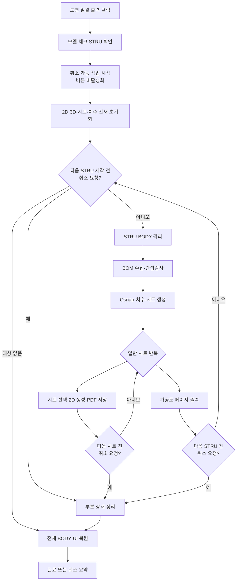

# STRU 도면 일괄 출력

## 1. 개요

체크한 STRU를 순서대로 격리하고 제작도·조립도·설치도·가공도 PDF를 각 STRU 폴더에 생성한다. 처리 오버레이의 **현재 작업 후 취소** 버튼을 누르면 현재 실행 중인 SDK 호출은 정상 완료하고, 다음 STRU·시트·가공도 페이지 경계에서 중단한다.

## 2. 트리거와 사전 조건

| 항목 | 값 |
|---|---|
| 트리거 | `btnExtractDrawingList` 클릭 |
| 모델 | 3D 모델이 열려 있어야 함 |
| 대상 | STRU 목록에서 1개 이상 체크 |
| 저장 위치 | 실행 파일 하위 `Drawings/{STRU 이름}` |
| 재진입 | 일괄 출력 또는 메인 치수 추출 중에는 두 버튼 모두 비활성화 |

## 3. 전체 흐름

## 4. 취소 체크포인트

| 구간 | 체크 시점 | 취소 시 처리 |
|---|---|---|
| STRU 반복 | 각 STRU 시작 전·처리 후 | 다음 STRU로 넘어가지 않음 |
| BOM | 수집 전·후 | 현재 STRU 처리 중단 |
| 간섭검사 | 시작 전, 비동기 완료 대기 | 이미 시작한 SDK 검사는 완료 이벤트까지 기다린 뒤 중단 |
| 시트 생성 | 생성 전·후 | 부분 시트 목록 정리 |
| 일반 도면 | 시트 선택 후, 2D 생성 후, PDF 저장 후 | 저장 완료된 PDF는 유지하고 다음 시트 중단 |
| 가공도 | 각 5부재 페이지 시작 전·전체 호출 후 | 완료된 페이지 PDF는 유지하고 다음 페이지 중단 |

취소는 `Application.DoEvents()`로 버튼 클릭을 수신하는 협력적 방식이다. SDK의 단일 BOM·간섭·2D 변환·PDF 저장 호출 자체를 강제 중단하지 않는다.

## 5. 취소 후 정리와 결과

- 무창 간섭검사 대기열 초기화
- 부분 `drawingSheetList`, 치수·Osnap 목록과 캐시 초기화
- 2D Object/NonObject/Canvas, 3D Note/Measure/ShapeDrawing 제거
- 모든 BODY 가시성 복원
- 일괄 출력·메인 치수 추출 버튼 재활성화
- 이미 저장한 PDF는 삭제하지 않음

취소 요약에는 `처리 완료 STRU/전체 STRU`, 성공·실패·미처리 STRU 수, 실제 저장된 PDF 수를 표시한다.

## 6. 예외 처리

| 조건 | 처리 |
|---|---|
| 개별 STRU 오류 | 실패 목록에 추가하고 다음 STRU 계속 |
| 사용자 취소 | 실패로 집계하지 않고 현재 체크포인트에서 전체 반복 종료 |
| 간섭검사 60초 초과 | 해당 STRU 실패 처리 |
| PDF 저장 오류 | 해당 시트 오류 로그 후 다음 시트 계속 |

## 7. 관련 링크

- [메인 치수 추출](../BOM/메인%20치수%20추출.md)
- [간섭검사 완료 이벤트](../간섭검사/간섭검사%20완료%20이벤트.md)
- [가공도 시트](../가공도/가공도%20시트.md)
- [Form1.Stru.cs 코드 레퍼런스](../../code-reference/form1-stru.md)

## 8. 변경 이력

| 날짜 | 변경 내용 | 작성자 |
|---|---|---|
| 2026-07-23 | 처리 오버레이에 현재 작업 후 취소 버튼을 추가하고 STRU·간섭검사·일반 시트·가공도 페이지 체크포인트, 부분 상태 정리, 부분 PDF 결과 요약을 연결 | Codex |
