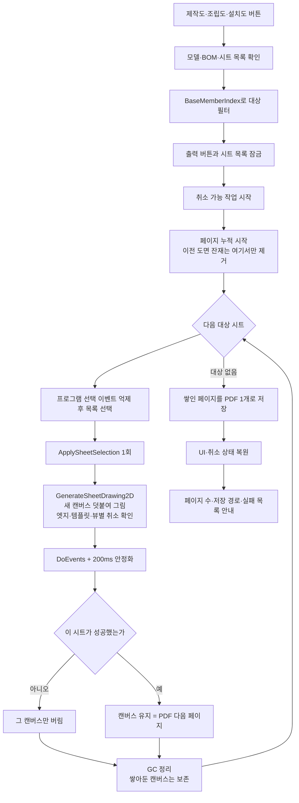

# 도면 종류별 PDF 출력

## 1. 개요

`치수 추출`로 만들어진 도면 시트 목록에서 제작도·조립도·설치도 중 사용자가 누른 종류만 골라 **PDF 한 개로** 저장한다. 도면 시트를 새로 만들거나 간섭검사를 다시 실행하지 않으며, 가공도는 기존 전용 출력 엔진을 그대로 사용한다.

도면이 몇 장이든 파일은 항상 한 개다. 도면 한 장이 PDF 한 페이지가 되며, 페이지 순서는 도면 목록에 보이는 순서를 따른다.

도면정보 탭 하단 버튼은 `가공도`, `2D 출력`, `PDF 출력`, `도면 일괄 출력`, `제작도`, `조립도`, `설치도`로 구성한다.

## 2. 트리거와 종류 판정

| 버튼 | 핸들러 | 대상 조건 |
|---|---|---|
| 제작도 | `btnExportFabricationSheets_Click` | `BaseMemberIndex == -1` |
| 조립도 | `btnExportAssemblySheets_Click` | `BaseMemberIndex >= 0` |
| 설치도 | `btnExportInstallationSheets_Click` | `BaseMemberIndex == -2` |
| 가공도 | 기존 `btnMfgDrawingSheet_Click` | 기존 가공도 전용 흐름 유지 |

ListView의 `Sheet N`·`가공도_N` 문자열은 종류 판정에 사용하지 않는다.

## 3. 사전 조건

- 3D 모델이 열려 있어야 한다.
- BOM과 도면 시트 목록이 이미 생성되어 있어야 한다.
- 사용자가 누른 종류의 유효한 시트가 한 장 이상 있어야 한다.

조건을 만족하지 않으면 `치수 추출`을 먼저 실행하라는 안내를 표시하고 종료한다. 단일 부재 구조처럼 조립도 시트가 없는 경우도 오류로 처리하지 않고 대상 시트가 없다고 안내한다.

## 4. 전체 흐름

## 5. 시트 선택과 재진입 방지

프로그램에서 처리 중인 시트를 표시할 때 기존 선택 해제와 새 선택을 `_suppressSheetSelectionHandler` 구간 안에서 수행한다. 억제 플래그는 `finally`에서 반드시 해제하고, 이후 `ApplySheetSelection(sheet)`을 직접 한 번만 호출한다. 따라서 `SelectedIndexChanged` 이벤트와 직접 호출이 겹쳐 시트 준비가 두 번 실행되지 않는다.

출력 중에는 다음 컨트롤의 기존 `Enabled` 값을 보관한 뒤 모두 비활성화한다.

- 제작도·조립도·설치도
- 가공도
- 2D 출력·PDF 출력
- 도면 일괄 출력
- 도면 시트 목록

`Application.DoEvents()` 중에도 다른 출력이나 수동 시트 선택이 현재 렌더 장면에 끼어들 수 없으며, 모든 상태는 `finally`에서 원래 값으로 복원한다.

## 6. 저장 규칙

- 저장 위치: `Application.StartupPath\Drawings`
- 파일명: `{도면종류}_{모델명}_{yyyyMMdd_HHmmss_fff}.pdf` — 도면 장수와 무관하게 **파일 1개**
- 같은 이름이 이미 있으면 뒤에 `_1`, `_2` … 를 붙인다.
- 경로가 240자를 넘으면 진단 로그에 경고를 남긴다 (Windows MAX_PATH 260 임박).

예:

- `제작도_모델명_20260728_101530_123.pdf`
- `조립도_모델명_20260728_101530_123.pdf` — 조립도 11장이면 이 파일 하나에 11페이지
- `설치도_모델명_20260728_101530_123.pdf`

파일명의 기준은 시트별 기준부재명이 아니라 **열려 있는 모델 파일명**이다. 한 파일에 여러 시트가 들어가므로 특정 시트 이름을 파일명에 쓸 수 없다.

## 7. 페이지 누적과 취소·실패 정책

도면 한 장을 그리고 나서 캔버스를 지우지 않고, 그 옆에 새 캔버스를 덧붙여 다음 도면을 그린다. 다 그린 뒤 캔버스 번호를 지정하지 않고 저장하면 쌓인 캔버스 전체가 한 PDF의 페이지가 된다.

- 이전 도면 잔재 제거는 **누적을 시작할 때 한 번만** 한다. 이후에는 캔버스를 지우지 않는다.
- 시트 사이 정리는 GC만 돌린다. 쌓아둔 캔버스는 저장 전까지 보존한다.
- 취소 버튼은 `BeginCancelableOperation()` 이후 오버레이를 표시해 처음부터 보이게 한다.
- 버튼 문구는 `취소`이며, 누른 뒤에는 현재 SDK 호출이 끝나는 즉시 가장 가까운 안전 체크포인트에서 멈춘다.
- 2D 생성은 엣지 생성 전후, 엑셀 템플릿 적용 전후, ISO/Z/X/Y 각 뷰 전후, 최종 렌더 전후에 진행 문구를 갱신하고 취소를 확인한다.
- `OperationCanceledException`은 일반 시트 실패 처리보다 먼저 다시 던져 다음 시트가 실행되지 않게 한다.
- 한 시트가 실패하면 그 시트의 캔버스만 버려 반쪽짜리 페이지가 PDF에 끼지 않게 하고, 실패 목록에 기록한 뒤 다음 시트로 계속한다.
- **취소하거나 도중에 실패해도 그때까지 그린 페이지는 저장한다.** 저장은 `finally`에서 수행하므로 어느 경로로 빠져나와도 실행된다.
- 저장 후에도 캔버스는 지우지 않는다. 결과 확인과 기존 `PDF 출력` 버튼 재사용을 위해 남겨두며, 다음 출력이 누적을 시작할 때 자동으로 초기화된다.
- 취소·실패 정리 과정에서 2D↔3D ViewMode 왕복은 추가하지 않는다.

## 8. 결과 안내

작업 종료 후 다음 내용을 한 번만 표시한다.

- 완료 또는 취소 여부
- `PDF 1개에 도면 N장 저장` — 페이지 수
- 저장된 PDF 전체 경로 (저장된 게 없으면 그 사실을 알림)
- 실패한 시트와 오류 메시지

이미 저장된 PDF는 이후 다른 출력이 실패해도 삭제하지 않는다.

## 9. 관련 링크

- [시트 2D 렌더](./시트%202D%20렌더.md)
- [선택 시트 PDF 내보내기](./시트%20PDF%20출력.md)
- [STRU 도면 일괄 출력](./도면%20일괄%20출력.md)
- [Form1.DrawingSheets.cs 코드 레퍼런스](../../code-reference/form1-drawing-sheets.md)

## 10. 변경 이력

| 날짜 | 변경 내용 | 작성자 |
|---|---|---|
| 2026-07-28 | 관련: GitHub issue #119 — 도면 1장 = PDF 1개에서 **종류별 PDF 1개**로 변경. 캔버스를 지우지 않고 덧붙여 쌓았다가 마지막에 한 번 저장. 취소·실패해도 그때까지의 페이지는 저장. 파일명 기준을 시트별 기준부재명에서 모델명으로 교체 | Claude |
| 2026-07-24 | 관련: T-091, GitHub issue #51 — 엣지 생성·템플릿 적용·ISO/Z/X/Y 뷰·최종 렌더 사이에 취소 체크포인트와 진행 문구를 추가하고, 결과 문구를 `취소` 기준으로 단순화 | Codex |
| 2026-07-24 | 제작도·조립도·설치도 종류별 PDF 출력, 선택 이벤트 억제, 재진입 차단, 취소와 마지막 캔버스 유지 정책 추가 | Codex |
