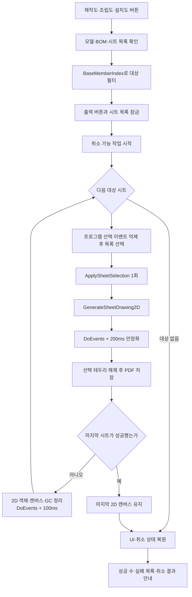

# 도면 종류별 PDF 출력

## 1. 개요

`치수 추출`로 만들어진 도면 시트 목록에서 제작도·조립도·설치도 중 사용자가 누른 종류만 골라 PDF로 연속 저장한다. 도면 시트를 새로 만들거나 간섭검사를 다시 실행하지 않으며, 가공도는 기존 전용 출력 엔진을 그대로 사용한다.

도면정보 탭 하단 버튼은 `가공도`, `2D 출력`, `PDF 출력`, `도면 일괄 출력`, `제작도`, `조립도`, `설치도`로 구성한다.

## 2. 트리거와 종류 판정

| 버튼 | 핸들러 | 대상 조건 |
|---|---|---|
| 제작도 | `btnExportFabricationSheets_Click` | `BaseMemberIndex == -1` |
| 조립도 | `btnExportAssemblySheets_Click` | `BaseMemberIndex >= 0` |
| 설치도 | `btnExportInstallationSheets_Click` | `BaseMemberIndex == -2` |
| 가공도 | 기존 `btnMfgDrawingSheet_Click` | 기존 가공도 전용 흐름 유지 |

ListView의 `Sheet N`·`가공도_N` 문자열은 종류 판정에 사용하지 않는다.

## 3. 사전 조건

- 3D 모델이 열려 있어야 한다.
- BOM과 도면 시트 목록이 이미 생성되어 있어야 한다.
- 사용자가 누른 종류의 유효한 시트가 한 장 이상 있어야 한다.

조건을 만족하지 않으면 `치수 추출`을 먼저 실행하라는 안내를 표시하고 종료한다. 단일 부재 구조처럼 조립도 시트가 없는 경우도 오류로 처리하지 않고 대상 시트가 없다고 안내한다.

## 4. 전체 흐름

## 5. 시트 선택과 재진입 방지

프로그램에서 처리 중인 시트를 표시할 때 기존 선택 해제와 새 선택을 `_suppressSheetSelectionHandler` 구간 안에서 수행한다. 억제 플래그는 `finally`에서 반드시 해제하고, 이후 `ApplySheetSelection(sheet)`을 직접 한 번만 호출한다. 따라서 `SelectedIndexChanged` 이벤트와 직접 호출이 겹쳐 시트 준비가 두 번 실행되지 않는다.

출력 중에는 다음 컨트롤의 기존 `Enabled` 값을 보관한 뒤 모두 비활성화한다.

- 제작도·조립도·설치도
- 가공도
- 2D 출력·PDF 출력
- 도면 일괄 출력
- 도면 시트 목록

`Application.DoEvents()` 중에도 다른 출력이나 수동 시트 선택이 현재 렌더 장면에 끼어들 수 없으며, 모든 상태는 `finally`에서 원래 값으로 복원한다.

## 6. 저장 규칙

- 저장 위치: `Application.StartupPath\Drawings`
- 기본 파일명: `{도면종류}_{기준부재명}_{Sheet N}_{yyyyMMdd_HHmmss_fff}.pdf`
- 기준부재명과 도면 종류가 같으면 기준부재명을 생략한다.

예:

- `제작도_선택노드명_Sheet 1_20260724_101530_123.pdf`
- `조립도_기준부재명_Sheet 2_20260724_101530_123.pdf`
- `설치도_Sheet 4_20260724_101530_123.pdf`

제작도의 기준부재명은 선택된 노드 이름이며, 선택 정보가 없으면 모델 파일명이다. 항상 STRU 이름이라고 가정하지 않는다.

## 7. 취소·실패·마지막 캔버스 정책

- 취소 버튼은 `BeginCancelableOperation()` 이후 오버레이를 표시해 처음부터 보이게 한다.
- `OperationCanceledException`은 일반 시트 실패 처리보다 먼저 다시 던져 다음 시트가 실행되지 않게 한다.
- 한 시트의 일반 예외는 실패 목록에 기록하고 다음 시트로 계속한다.
- 다음 대상이 남아 있으면 성공 여부와 관계없이 현재 2D 캔버스를 정리한다.
- 마지막 대상이 성공하면 결과 확인과 기존 PDF 출력 버튼 재사용을 위해 캔버스를 유지한다.
- 마지막 대상이 실패하거나 작업이 취소되면 현재 캔버스를 정리하고 직전 성공 도면을 다시 렌더링하지 않는다.
- 취소·실패 정리 과정에서 2D↔3D ViewMode 왕복은 추가하지 않는다.

다음 일반 도면 또는 가공도 출력은 진입부의 `Clear2DView()`에서 남아 있는 마지막 캔버스를 자동으로 초기화한다.

## 8. 결과 안내

작업 종료 후 다음 내용을 한 번만 표시한다.

- 완료 또는 현재 작업 후 취소 여부
- 저장된 PDF 수
- 저장 폴더
- 실패한 시트와 오류 메시지

이미 저장된 PDF는 이후 시트 실패나 취소가 발생해도 삭제하지 않는다.

## 9. 관련 링크

- [시트 2D 렌더](./시트%202D%20렌더.md)
- [선택 시트 PDF 내보내기](./시트%20PDF%20출력.md)
- [STRU 도면 일괄 출력](./도면%20일괄%20출력.md)
- [Form1.DrawingSheets.cs 코드 레퍼런스](../../code-reference/form1-drawing-sheets.md)

## 10. 변경 이력

| 날짜 | 변경 내용 | 작성자 |
|---|---|---|
| 2026-07-24 | 제작도·조립도·설치도 종류별 PDF 출력, 선택 이벤트 억제, 재진입 차단, 취소와 마지막 캔버스 유지 정책 추가 | Codex |
