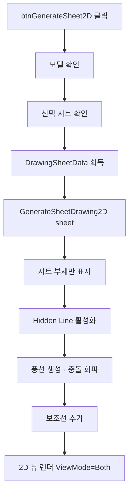

# 선택 시트 2D 도면 생성

## 1. 개요
사용자가 선택한 도면 시트(DrawingSheetData)를 기반으로 Hidden Line 모드 2D 도면을 생성한다. 내부적으로 `GenerateSheetDrawing2D(sheet)`를 호출하며, 이 함수는 `btnGenerate2D`와 **동일한 핵심 로직**을 공유한다.

## 2. 트리거
| 항목 | 값 |
|---|---|
| 유형 | User Action |
| 입력 | `btnGenerateSheet2D` 버튼 클릭 |
| 위치 | 메인 폼 > 도면 시트 탭 |

## 3. 사전 조건
- [ ] 3D 모델 로드됨
- [ ] 도면 시트 목록에서 하나 선택됨
- [ ] 선택 시트의 `MemberIndices.Count > 0`
- [x] **`GenerateSheetDrawing2D(sheet)` 진입부에서 `vizcore3d.Object3D.GenerateEdgeData()` 자체 호출 (2026-05-18 이동)** — 히든라인 ISO 모서리 누락 방지. 수동·자동 모두 보장

## 4. 전체 동작 흐름 (Happy Path)

| # | 단계 | 주체 | 설명 |
|---|---|---|---|
| 1 | 모델 확인 | Form1 | `IsOpen()` → [E01] |
| 2 | 시트 선택 확인 | Form1 | `lvDrawingSheet.SelectedItems.Count == 0` → [E02] |
| 3 | 시트 데이터 추출 | Form1 | `Tag as DrawingSheetData` → [E03] |
| 4 | 위임 호출 | Form1 | `GenerateSheetDrawing2D(sheet)` |
| 5 | 부재 가시성 조정 | SDK | 시트 부재만 Show, 나머지 Hide |
| 6 | Hidden Line | SDK | `SetRenderMode(DASH_LINE)` |
| 7 | 그리드 구조 생성 | SDK | `AddGridStructure(2, 3, 297, 210)` + 마진 10mm → 셀 ≈ 92.3×95 mm |
| 8 | **BOM 테이블 (1,3) 셀 배치** | SDK | `RenderTemplateOnGridStructure(table1, 1, 3)` — 최대 14행, 초과 시 "…+N건 생략" |
| 9 | **tableInfo (2,3) 셀 배치** | SDK | `RenderTemplateOnGridStructure(tableInfo, 2, 3)` — 하단 정렬 |
| 10 | 뷰 4개 렌더링 | Form1 | (1,1)ISO / (1,2)Z / (2,1)Y / (2,2)X → `RenderSheetViewForDrawing` |
| 11 | 풍선 배치 | Form1 | 번호 풍선 생성, `balloonOverrides`로 충돌 회피 |
| 12 | 보조선 추가 | Form1 | 풍선과 부재를 잇는 지시선 |
| 13 | 2D 뷰 전환 | SDK | `ViewMode = Both` |

> 구현 상세는 [코드 레퍼런스](../../code-reference/form1-drawing-sheets.md#GenerateSheetDrawing2D) 참고

## 5. 주요 분기 처리

### [분기 A] 풍선 위치 충돌
| 조건 | 처리 |
|---|---|
| 다른 풍선과 겹침 | `balloonOverrides` Dict에 오프셋 등록 후 재배치 |
| 겹침 없음 | 기본 위치 사용 |

### [분기 B] BOMInfo 재집계
| 조건 | 처리 |
|---|---|
| 시트에 포함된 부재 | `CollectBOMInfo(false, sheet)` 호출 → `lvDrawingBOMInfo` 재표시 |

### [분기 C] BOM 행 수 제한
| 조건 | 처리 |
|---|---|
| `lvDrawingBOMInfo.Items.Count <= 14` | 전체 행을 BOM 테이블에 렌더링 |
| `> 14` | 14행까지 렌더링 + 마지막에 "…" / "+N건 생략" 행 추가 (셀 (1,3) 높이 초과 방지) |

### [분기 D] 엑셀 템플릿 본진 (P2) — `UseExcelTemplate`
| 조건 | 처리 |
|---|---|
| `UseExcelTemplate == true` (디폴트) | `GenerateSheetDrawing2D_WithExcelTemplate(sheet)` 분기. 옛 셀 기반 그리드 대신 엑셀 파일(`사용자템플릿_엑셀_제작도_Rev.01.xlsx`)의 `{Input_N}` / `{View_n}` 슬롯 좌표를 SDK가 파싱 → BOM/도면정보/시트종류 데이터 치환 + 4개 View 영역에 모델·치수 렌더 |
| `UseExcelTemplate == false` | 옛 GridStructure 셀 경로(2×3 그리드 + RenderSheetViewForDrawing × 4) 사용 |

#### D-1. 엑셀 본진(P2) View 영역별 처리 (T-064 P2, 2026-05-14)
각 `viewArea.Index`별로 옛 `RenderSheetViewForDrawing` 패턴을 영역 기반으로 이식:

| viewArea.Index | viewDirection | 어노테이션 | 모델 shrink |
|---|---|---|---|
| 1 | ISO | `CreateIsoBalloonNotes(memberIndices, true)` → `FromScreen` 가시성 필터 → `Add2DNoteFrom3DNote(visibleNoteIds)` → 원형 SnapBox | × 0.70 |
| 2 | Z (Looking Z) | `ShowAllDimensions("Z", true, estScale)` → `shapeDrawingIds` → `Add2DObjectFromShapeDrawing` + `ApplyParallelTextShift` + `Add2DMeasureFrom3DMeasure` | × 0.65 |
| 3 | X (Looking X) | 동일 — `ShowAllDimensions("X", …)` | × 0.70 |
| 4 | Y (Looking Y) | 동일 — `ShowAllDimensions("Y", …)` | × 0.70 |

- **fit + shrink 흐름**: `fitScale = Math.Min(fitW/objW, fitH/objH)` (영역 가득 fit) → `RescaleObject(objScale * fitScale * shrinkFactor)`. shrinkFactor는 위 표 (Z=0.65, X·Y·ISO=0.70 — 사용자 사양 2026-05-14).
- **estScale (보조선 위치 기준)**: 별도 헬퍼 `EstimateFitScaleForViewArea(availW, availH, viewDir, memberIndices)` — 옛 `EstimateFitScaleForCell` 알고리즘을 GridStructure 셀 대신 viewArea로. fitFactor = shrinkFactor와 동일 값 유지 → 보조선 위치와 모델 fit 결과 일치.
- **X 오프셋**: ISO(View_1) · Y(View_4)만 X +10mm, Z(View_2) · X(View_3)는 그대로. Y +15mm는 전 영역 공통 (사용자 사양).

## 6. 예외 / 에러 처리

| ID | 조건 | 동작 | 사용자 피드백 | 결과 상태 |
|---|---|---|---|---|
| E01 | 모델 미로드 | return | MessageBox "먼저 모델을 열어주세요." | 변화 없음 |
| E02 | 시트 미선택 | return | MessageBox "도면 시트를 선택해주세요." | 변화 없음 |
| E03 | `sheet == null` 또는 `MemberIndices.Count == 0` | return | MessageBox "유효한 시트 데이터가 없습니다." | 변화 없음 |
| E04 | 생성 중 예외 | catch (위임 함수 내부) | 부분 렌더링 + 로그 | 2D 캔버스 불완전 |

## 7. 상태 변화 (Before / After)

| 대상 | Before | After |
|---|---|---|
| `vizcore3d.ViewMode` | 3D 또는 이전 | `Both` |
| `vizcore3d.View.RenderMode` | SOLID | DASH_LINE |
| `vizcore3d.Object3D.Visible` | 모든 부재 | 시트 부재만 |
| `balloonOverrides` | 이전 | 현재 시트 기준 |
| `lvDrawingBOMInfo` | 이전 | 시트 부재 그룹 |
| 2D 캔버스 | 빈/이전 | 완성된 도면 |

## 8. 후행 기능 (Chained)
- [시트 PDF 내보내기](./시트 PDF 출력.md)
- [가공도 생성](../가공도/가공도 단일.md) (선택 부재 지정 후)

## 9. 관련 링크
- 코드 구현: [Form1.DrawingSheets.cs:L778](../../code-reference/form1-drawing-sheets.md#btnGenerateSheet2D_Click)
- 공통 함수: [Form1.DrawingSheets.cs#GenerateSheetDrawing2D](../../code-reference/form1-drawing-sheets.md#GenerateSheetDrawing2D)
- 용어집: [Hidden Line](../../_glossary.md#hidden-line-은선), [풍선](../../_glossary.md#풍선-balloon-note)

## 10. 변경 이력
| 날짜 | 변경 내용 | 작성자 |
|---|---|---|
| 2026-04-13 | 초안 작성 | — |
| 2026-04-20 | 템플릿 정규화 (T-006/FB-003): BOM→(1,3) 셀, tableInfo→(2,3) 셀로 이관 (`RenderTemplateOnGridStructure`). BOM 열 너비 합 82→92mm, 최대 14행 제한 + "…+N건 생략" 처리. 이전 `bInfo` 절대좌표 앵커 제거 | Claude |
| 2026-04-20 | T-006 후속: BOM/tableInfo가 흰선 밖으로 나가 FA열 분리되는 문제 → 합 92→81mm 축소. BOM: ITEM 38→19, MATERIAL 8→12, SIZE 8→12. tableInfo: 35/57→32/49 | Claude |
| 2026-04-20 | T-006 재후속: 81도 미세하게 넘침 → 77mm로 추가 축소. BOM: ITEM 19→17, MATERIAL/SIZE 12→11. tableInfo: 32/49→30/47 | Claude |
| 2026-04-21 | T-013 옵션 A 시도: `RenderSheetViewForDrawing`의 `isIsoFullView` 분기에서 objId의 `RescaleObject/MoveObject/GetObjectCenter 보정` 로직 제거. SDK 자동 처리 여부 검증 중. DiagLog로 bgObjId/objId 중심·스케일 실측 기록. 결과에 따라 옵션 B(WorldToScreen) 전환 예정 | Claude |
| 2026-04-21 | T-013 옵션 A 실패 확인 (objId가 원점 0,0에 objScale=0.005로 남아 보이지 않음, SDK 자동 매핑 없음) → **옵션 B 적용**: `vizcore3d.View.WorldToScreen`으로 3D BBox 중심 2개(전체 BOM / 시트 부재)를 캔버스 좌표로 변환해 obj를 bg 내부 원래 위치에 배치. bgFinalScale로 동기 스케일링 포함. DiagLog에 OPT-B 실측 출력 | Claude |
| 2026-04-21 | T-013 옵션 B 스케일 보정: 1차 시도에서 obj가 **캔버스 밖으로 튐** (dScreen.Y=195.97 그대로 더해져 5.90mm 대신 195.97mm 이동). 원인: `WorldToScreen`은 원본 캔버스 좌표(스케일 전) 반환이라 bgObjId가 `RescaleObject(bgFinalScale)`로 축소된 후에는 좌표계 불일치. 수정: `target = bgCanvas + dScreen * bgFinalScale` | Claude |
| 2026-04-21 | T-013 옵션 B 2차 재수정: `bgFinalScale` 단독 곱도 틀림 (실측 offsetRatio.Z=-0.244 → 7.3mm 이동이 정답인데 5.9mm로 계산됨). 원인: `bgFinalScale`은 객체 원본좌표→표시크기 비율이고 `WorldToScreen`은 3D→원본캔버스라 변환 체인 불일치. 수정: bg의 3D BBox 8개 꼭지점을 `WorldToScreen` → 원본 캔버스 BBox 계산 → `ratio = bgCanvasSize / bgScreenBBox` → `target = bgCanvas + dScreen * ratio`. DiagLog 라벨 OPT-B2 | Claude |
| 2026-05-11 | **체인치수 데이터 소스 통일** (사용자 요청): `ExtractInstallationDimensions`(BBox) → `ComputeViewDimensionsForMembers`(Osnap, null 파라미터로 3뷰×2축 6조합 합집합). 작업데이터 탭(`chainDimensionList` / `lvDimension`) = 도면 측 측정 데이터 1:1 일치. 이전엔 BBox 기반과 Osnap 기반이 다른 결과를 만들어 디버깅 시 매칭 어려움 | Claude |
| 2026-05-14 | **T-064 P2 본진 — 엑셀 분기 치수 그리기 이식** (사용자 보고: "도면리스트 뽑기에서 치수 안 그려짐"). `GenerateSheetDrawing2D_WithExcelTemplate` 루프 본문을 옛 `RenderSheetViewForDrawing` 패턴으로 통째로 교체. ISO=`CreateIsoBalloonNotes`+`FromScreen` 가시성 필터+`Add2DNoteFrom3DNote`, X/Y/Z=`ShowAllDimensions`+`Add2DObjectFromShapeDrawing`+`ApplyParallelTextShift`+`Add2DMeasureFrom3DMeasure`. 모델 shrink Z=0.65/X·Y·ISO=0.70 (사용자 사양, 옛 0.70/0.75에서 5% 더 축소). 새 헬퍼 `EstimateFitScaleForViewArea` 추가 — 옛 `EstimateFitScaleForCell`의 viewArea 영역 버전. **영향**: 도면 리스트 뽑기 / 단일 2D 출력 모두 일반 시트(제작도·조립도·설치도)에 치수+풍선 정상 출력, 모델 라벨·보조선 영역 확보. 가공도(`GenerateMfgDrawing2DAll`)는 P3 롤백 옛 경로 유지 — 영향 없음. 관련: T-064 (도면리스트 뽑기), T-038/T-039 (모델 스케일·보조선 길이) | Claude |
| 2026-05-18 | **fix: 수동 2D 출력 ISO 모서리 누락 해소** (사용자 발견). `vizcore3d.Object3D.GenerateEdgeData()` 호출을 자동 경로(`Form1.Stru.cs:389` `btnExtractDrawingList_Click`)에서 `GenerateSheetDrawing2D(sheet)` 진입부(`Form1.DrawingSheets.cs:1300`)로 이동. 수동(`btnGenerateSheet2D_Click`)·자동(`ProcessSingleStruFull`) 두 경로 모두 같은 함수를 거치므로 단일 지점에서 엣지 데이터 갱신 보장 → ISO 방향 튀어나온 모서리 누락 fix. Stru.cs 진입부 호출은 제거 (중복 방지). DRY 적용 — 사용자 제안 "자동에서 빼고 진입부에 넣자". 베이스라인 캡처 시 이 fix 후 모서리 살아나는지 비교 가능 | Claude |
| 2026-05-14 | **T-064 후속 — ISO 풍선 단축 + Y뷰 추가 오른쪽** (사용자 검증 보고 fine-tune). (1) `CreateIsoBalloonNotes` `baseOffsetDist = Math.Max(200f, isoDiag * 0.35f)` → `Math.Max(100f, isoDiag * 0.22f)` — ISO 풍선이 모델에서 떨어진 거리 단축, PDF 시각 압박감 완화. (2) 엑셀 분기 영역 중심 이동 `xOffset` 분기 재구성 — ISO(View_1)=10mm 유지, **Looking Y(View_4)=20mm**(직전 10→20mm 증가, 사용자 사양 "Y뷰 더 오른쪽"), Z(View_2)·X(View_3)=0mm 그대로. Y +15mm 공통은 유지 | Claude |
