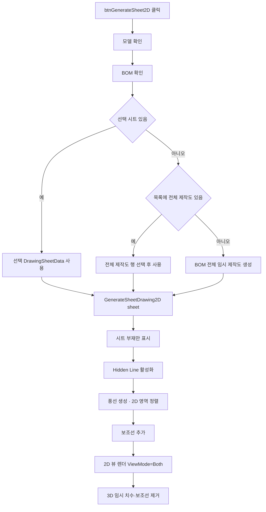

# 도면 시트 2D 도면 생성

## 1. 개요
선택한 도면 시트(`DrawingSheetData`)를 기반으로 Hidden Line 모드 2D 도면을 생성한다. 시트를 선택하지 않았으면 목록의 전체 제작도(`BaseMemberIndex == -1`)를 자동 선택하고, 목록에도 전체 제작도가 없으면 BOM 전체를 담은 임시 제작도를 생성해 출력한다. 내부적으로 `GenerateSheetDrawing2D(sheet)`를 호출하며, 이 함수는 `btnGenerate2D`와 **동일한 핵심 로직**을 공유한다.

엑셀 템플릿 경로는 첫 출력 시 BOM 첫 부재에서 부모 방향으로 최대 10단계를 탐색해 키 이름에 `PNT`가 포함된 STRU UDA의 첫 비어 있지 않은 값을 확정한다. 이 값을 같은 도면 목록의 모든 `DrawingSheetData.PaintCode`에 저장하므로 제작도·조립도·설치도·가공도가 동일한 PAINT CODE를 `{Input_166}`에 사용한다. `null`은 미조회, 빈 문자열은 조회했지만 값 없음으로 구분해 값이 없는 모델도 반복 조회하지 않는다. 복수 후보 키와 각 값은 `[PAINT CODE]` 로그에 남기며, 값이 없으면 기존 공백을 유지해 PAINT CODE 칸의 괘선을 보존한다.

## 2. 트리거
| 항목 | 값 |
|---|---|
| 유형 | User Action |
| 입력 | `btnGenerateSheet2D` 버튼 클릭 |
| 위치 | 메인 폼 > 도면 시트 탭 |

## 3. 사전 조건
- [ ] 3D 모델 로드됨
- [ ] BOM 데이터가 하나 이상 있음
- [ ] 출력 대상 시트의 `MemberIndices.Count > 0`
- [x] 도면 시트 선택은 선택 사항. 미선택이면 전체 제작도를 기본 대상으로 결정
- [x] **`GenerateSheetDrawing2D(sheet)` 진입부에서 `vizcore3d.Object3D.GenerateEdgeData()` 자체 호출 (2026-05-18 이동)** — 히든라인 ISO 모서리 누락 방지. 수동·자동 모두 보장

## 4. 전체 동작 흐름 (Happy Path)

| # | 단계 | 주체 | 설명 |
|---|---|---|---|
| 1 | 모델 확인 | Form1 | `IsOpen()` → [E01] |
| 2 | BOM 확인 | Form1 | `bomList.Count == 0` → [E02] |
| 3 | 출력 대상 결정 | Form1 | 선택 항목이 있으면 기존 `Tag as DrawingSheetData`를 그대로 사용 |
| 4 | 기본 대상 결정 | Form1 | 미선택이면 목록의 `BaseMemberIndex == -1` 행을 자동 선택. 없으면 `CreateFullDrawingSheetData()`로 임시 제작도 생성 |
| 5 | 시트 데이터 검증 | Form1 | `sheet == null` 또는 부재 없음 → [E03] |
| 6 | 위임 호출 | Form1 | `GenerateSheetDrawing2D(sheet)` |
| 7 | 부재 가시성 조정 | SDK | 시트 부재만 Show, 나머지 Hide |
| 8 | Hidden Line | SDK | `SetRenderMode(DASH_LINE)` |
| 9 | 그리드 구조 생성 | SDK | `AddGridStructure(2, 3, 297, 210)` + 마진 10mm → 셀 ≈ 92.3×95 mm |
| 10 | **BOM 테이블 (1,3) 셀 배치** | SDK | `RenderTemplateOnGridStructure(table1, 1, 3)` — 최대 14행, 초과 시 "…+N건 생략" |
| 11 | **tableInfo (2,3) 셀 배치** | SDK | `RenderTemplateOnGridStructure(tableInfo, 2, 3)` — 하단 정렬 |
| 12 | 뷰 4개 렌더링 | Form1 | (1,1)ISO / (1,2)Z / (2,1)Y / (2,2)X → `RenderSheetViewForDrawing` |
| 13 | 풍선 배치 | Form1/SDK | 3D 번호 풍선 생성·가시성 선별 후 ISO 투영 객체에 2D 변환, SDK가 View 내부 모델 표시 범위 기준으로 최종 정렬 |
| 14 | 보조선 추가 | Form1 | 풍선과 부재를 잇는 지시선 |
| 15 | 2D 뷰 전환 | SDK | `ViewMode = Both` |
| 16 | 3D 임시 치수 정리 | Form1 | `finally`에서 `Review.Measure`·`ShapeDrawing` 제거. 이미 복사된 2D 치수는 유지 |

> 구현 상세는 [코드 레퍼런스](../../code-reference/form1-drawing-sheets.md#GenerateSheetDrawing2D) 참고

## 5. 주요 분기 처리

### [기본 대상] 시트 미선택
| 조건 | 처리 |
|---|---|
| 목록에 `BaseMemberIndex == -1` 시트가 있음 | 해당 행을 선택·포커스하고 기존 전체 제작도 데이터 사용 |
| 목록이 비었거나 전체 제작도 행이 없음 | `SheetNumber = 1`, `BaseMemberIndex = -1`, BOM 전체 부재를 담은 임시 제작도 생성. 목록에는 추가하지 않음 |

### [분기 A] 풍선 위치 충돌
| 조건 | 처리 |
|---|---|
| 3D 풍선 후보가 모델·다른 풍선과 겹침 | 기존 ISO 투영 AABB 검사로 초기 위치 조정 |
| 2D 변환 완료 | ISO 실선 투영 객체 선택 → 부재번호 풍선과 연결 이름을 3D 표면 노트에서 2D로 변환 → 선택 해제 → 실제 2D 표시 객체 외곽을 캔버스 20mm 확장한 영역으로 `Set2DViewAlignAreaReviewsPositionByOffset` 최종 정렬. SDK가 각 리뷰의 상하좌우를 자동 선택하며 정확한 우선순위와 개별 방향 지정 옵션은 공개되지 않음 |
| SDK 최종 정렬 실패 | 경고 로그를 남기고 기존 AABB 풍선 위치와 연결 이름의 초기 투영 위치로 출력 계속 |

### [분기 B] BOMInfo 재집계
| 조건 | 처리 |
|---|---|
| 시트에 포함된 부재 | `CollectBOMInfo(false, sheet)` 호출 → 시트 생성 단계의 `PreparedBomRows` 즉시 적용. 임시 시트만 관련 Part를 현장 조회 |

### [분기 C] BOM 행 수 제한
| 조건 | 처리 |
|---|---|
| `lvDrawingBOMInfo.Items.Count <= 14` | 전체 행을 BOM 테이블에 렌더링 |
| `> 14` | 14행까지 렌더링 + 마지막에 "…" / "+N건 생략" 행 추가 (셀 (1,3) 높이 초과 방지) |

### [분기 D] 엑셀 템플릿 본진 (P2) — `UseExcelTemplate`
| 조건 | 처리 |
|---|---|
| `UseExcelTemplate == true` (디폴트) | `GenerateSheetDrawing2D_WithExcelTemplate(sheet)` 분기. 옛 셀 기반 그리드 대신 엑셀 파일(`제작도_도면_1.xlsx`, 2026-07-10 전환)의 `{Input_N}` / `{View_n}` 슬롯 좌표를 SDK가 파싱 → BOM/도면정보/시트종류 데이터 치환 + 4개 View 영역에 모델·치수 렌더 |
| `UseExcelTemplate == false` | 옛 GridStructure 셀 경로(2×3 그리드 + RenderSheetViewForDrawing × 4) 사용 |

#### D-1. 엑셀 본진(P2) View 영역별 처리 (T-064 P2, 2026-05-14)
각 `viewArea.Index`별로 옛 `RenderSheetViewForDrawing` 패턴을 영역 기반으로 이식:

제작도 1번 시트(`BaseMemberIndex == -1`)는 4개 View를 만들기 전에 시트 부재들의 Osnap `LINE`을 훑어 XY 투영 길이가 가장 긴 모서리를 찾는다. 그 방향이 가장 가까운 세계 X/Y축에서 1°를 초과해 틀어졌으면, 해당 방향을 로컬 X축·수평 직교 방향을 로컬 Y축·세계 Z를 로컬 Z축으로 하는 `DrawingReferenceFrame`을 만든다. 각 View마다 `ReferenceAxis.Create → Activate → MoveCamera` 순서로 로컬축 카메라를 적용하고, View 변환이 끝나면 `Reset → Delete`해 다음 View에 상태가 누적되지 않게 한다. 정상 축 모델은 기존 세계축 경로를 그대로 사용하며, 조립도·설치도에는 이 판정을 적용하지 않는다.

참조축 제작도의 X/Y/Z 치수는 같은 Osnap을 로컬 좌표로 변환한 뒤 기존 체인 치수 엔진으로 계산한다. 표시할 때는 로컬 치수축·오프셋축을 월드 벡터로 복원해 `AddCustomDistanceUserAxis`를 사용하므로 모델과 치수·보조선이 같은 축으로 수평/수직 정렬된다. 이때 SDK가 치수 숫자를 월드 사용자축의 ±45° 방향으로 유지하는 현상을 피하기 위해 참조축 2D 경로에만 `AlignDistanceText=false`를 적용하고, 치수 생성 직후 기존 기본값을 복원한다. 정상 제작도와 다른 도면의 `AlignDistanceText=true` 동작은 유지한다. `Review.Measure.Clear()`가 활성 ReferenceAxis도 삭제하므로 참조축 경로의 `ShowAllDimensions`는 호출자에서 이미 수행한 Clear를 반복하지 않는다. 축 생성 실패 시 카메라와 치수 목록을 모두 기존 WorldAxis 방식으로 되돌린다. 진단 로그는 `[DrawingRefAxis] frame/activate/release/치수 Osnap 로컬 변환/UserAxis 치수 문자 화면 정렬/치수 문자 정렬 기본값 복원`이다.

| viewArea.Index | viewDirection | 어노테이션 | 모델 shrink |
|---|---|---|---|
| 1 | ISO | `CreateIsoBalloonNotes(memberIndices, true)` → `FromScreen` 가시성 필터 → **점선/실선 두 겹 캡처 + Match 정합 (아래 항목)** → ISO 객체 선택 후 부재번호 풍선과 제작도 연결 Assembly 이름 또는 설치도 연결 Part당 `A. Assembly / Part` 이름을 모두 `Add2DNoteFrom3DNote`로 변환 → 선택 해제 → 실제 2D 표시 객체 외곽 + 캔버스 20mm 영역 기준 통합 자동 정렬 → 최종 `Render` | × 0.70 |
| 2 | Z (Looking Z) | `ShowAllDimensions("Z", true, estScale)` → **`MarkNonRightAngles("Z")`** → 설치도 Target Body 끝단→Connected Body 모서리 위치 치수 → `shapeDrawingIds` → `Add2DObjectFromShapeDrawing` + `Add2DMeasureFrom3DMeasure` | × 0.65 |
| 3 | X (Looking X) | 동일 — `ShowAllDimensions("X", …)` + `MarkNonRightAngles("X")`; A/A1 접합점 기호 없음 | × 0.70 |
| 4 | Y (Looking Y) | 동일 — `ShowAllDimensions("Y", …)` + `MarkNonRightAngles("Y")`; A/A1 접합점 기호 없음 | × 0.70 |

- **부재-부재 접합 각도 표시 (`MarkNonRightAngles`, 2026-06-23 / 알고리즘 개정 2026-07-06)**: `ShowAllDimensions` 직후 호출해 같은 `Review.Measure`→2D 파이프라인에 각도를 누적시킨다. **서로 다른 두 부재가 접합하는 곳**(간섭검사 Clash 표면접촉=면접합 포착, 또는 osnap 끝점 3mm 근접=노드 일치 → 연결. 접합점=최근접 osnap 점쌍 중점)에서 두 부재 **길이축**의 **실제 3D 사잇각이 90°의 배수(0/90/180/270/360)가 아니면**(=틀어져 만나면) `AddCustom3PointAngle(접합점, A방향점, B방향점)`로 표시한다.
  - **길이축 = 가장 긴 모서리 방향** (2026-07-06): osnap LINE 세그먼트를 방향별(±동일시, 공차 cos 5°)로 길이 합산해 최대 방향 채택. 옛 PCA(점군 분산 주성분)는 사선 끝단·홀 점 쏠림에 몇 도 기울어 실제 90° 접합을 87°로 오검출했음 — 폐기. LINE 모서리가 없는 부재는 각도 대상 제외.
  - **표시 뷰 = 접합 평면과 평행한 뷰 1곳** (2026-07-06): 두 길이축이 만드는 평면의 법선(외적)이 깊이축과 가장 정렬된 뷰에서만 그린다 → 각도가 왜곡 없는 실값으로, 꺾임이 실제 평면으로 보이는 뷰에 표시. (옛 조건 '두 축이 화면에 조금이라도 투영되면'은 기울어진 뷰에도 그렸음 — 폐기)
  - 그 외: 한 부재 *내부* 모서리 각(ㄱ자 꺾임)은 표시하지 않음. 판형(PAD/PLATE) 제외. 연결성은 간섭검사(`clashList`) 표면 접촉 판정, 비면 osnap 근접(3mm) 폴백. 정수 도(度)·파랑, 생성 ID에만 `SetStyle(id, …)`. ISO 미호출. 진단 로그 `[각도축]`(모서리길이축)·`[각도]`(skip 사유·최적 뷰 포함).

- **fit + shrink 흐름**: `fitScale = Math.Min(fitW/objW, fitH/objH)` (영역 가득 fit) → `RescaleObject(objScale * fitScale * shrinkFactor)`. shrinkFactor는 위 표 (Z=0.65, X·Y·ISO=0.70 — 사용자 사양 2026-05-14).
- **ISO 리뷰 최종 정렬 (SDK 1.0.26.723)**: 부재번호 풍선과 제작도·설치도 연결 이름을 모두 3D 표면 노트(`Review.Note.AddNoteSurface`)로 만든 뒤 `Add2DNoteFrom3DNote`로 변환하고, 모든 2D 객체 선택을 해제한 다음 `Set2DViewAlignAreaReviewsPositionByOffset(rectMin, rectMax, 0f)`를 한 번 호출한다. `rectMin/rectMax`는 Crop/Fit/Rescale/Move/Match가 끝난 실제 2D 표시 객체의 `GetObjectCenter`·`GetObjectSize` 값으로 AABB를 구한 뒤 상하좌우를 **캔버스 20mm**씩 확장한다. 모델 크기는 외곽 위치를 찾는 데만 사용하며, 라벨 간격은 모델 크기와 무관한 도면 고정값이다. 조립도(BOM 전체 단일 실선)·제작도·설치도·단일 캡처는 실선 객체를 외곽 기준으로 사용한다. 연결 이름의 지시선 Target은 실제 접합점에 유지되고 Label만 풍선과 같은 영역으로 이동한다. 각 리뷰가 상·하·좌·우 중 어디로 가는지는 SDK 내부 자동 배치이며, 공개 API에는 개별 리뷰 방향을 지정하는 옵션과 정확한 선택 우선순위가 없다. 객체 외곽이 유효하지 않거나 API가 실패하면 경고 로그를 남기고 기존 위치로 계속 출력한다.
- **estScale (보조선 위치 기준)**: 별도 헬퍼 `EstimateFitScaleForViewArea(availW, availH, viewDir, memberIndices)` — 옛 `EstimateFitScaleForCell` 알고리즘을 GridStructure 셀 대신 viewArea로. fitFactor = shrinkFactor와 동일 값 유지 → 보조선 위치와 모델 fit 결과 일치. 설치도는 연결 Part가 아니라 선택 STRU `MemberIndices`만 축척 기준으로 사용한다.
- **보조선 종이 절대 기준**: 오프셋(치수선까지 거리·보조선 길이) = 종이 **1단 7.5mm·2단 15mm**(2026-07-06: 세로 치수 텍스트가 모델에 밀착해 보이는 문제로 5/10에서 가로·세로 통일 1.5배 확대 — 세로만 키우면 통일성이 깨져 전체 확대), **시작 gap(osnap→보조선 시작) = 종이 2mm**(`FabCanvasExtGap`, 2026-07-03 — 옛 모델좌표 고정 10mm는 축척마다 종이 gap이 들쭉날쭉해 폐기, 가공도와 동일 정책). 둘 다 estScale로 역산하므로 추정 오차만큼의 편차는 공유. 3D 미리보기 경로(종이 배율 없음)는 기존 모델좌표 gap 10mm 유지.
- **작은 치수 단 승격 (2026-07-03 사용자 사양)**: 텍스트가 치수선에 안 들어가는 작은 체인 치수(뷰 최대 치수 ÷ 26 이하, 뷰 max > 100mm일 때만)는 텍스트를 옆으로 옮기지(시프트) 않고 **치수선째 2단으로 올려** 그린다. 그런 치수가 있으면 **전체 치수는 3단**으로 밀린다. 옛 텍스트 시프트(`ApplyParallelTextShift`)는 이 방식으로 대체·삭제. 진단 로그 `[SmallDimPromote]`.
- **2단 텍스트 슬라이드 (2026-07-21 사용자 사양)**: 2단에 그려지는 치수(승격 작은 치수 + 기존 2단 체인)는 텍스트를 치수선 방향으로 **종이 절대 2.5mm** 일괄 이동 — 가로 치수=화면 오른쪽, 세로 치수=화면 위(SDK가 치수선 방향 성분만 반영해 세로는 오른쪽 불가). 실기 검증된 뷰 매핑(X뷰 right=+Y·up=+Z / Y뷰 right=−X·up=+Z / Z뷰 right=+X·up=+Y). 상수 `Lvl2TextSlideCanvas=2.5`. 진단 로그 `[TextSlide]`.
- **X 오프셋**: ISO(View_1) · Y(View_4)만 X +10mm, Z(View_2) · X(View_3)는 그대로. Y +15mm는 전 영역 공통 (사용자 사양).
- **Input 슬롯 선초기화 (2026-07-10)**: `data` dict를 1..199 빈 문자열로 선초기화 — 코드가 안 채우는 슬롯의 `{Input_N}` 태그가 도면에 그대로 노출되는 것 방지 (가공도와 동일 패턴). 비-BOM 슬롯: 164=Note 본문, 165~168=PAINT CODE/DP No 구역, 169=TAG NO, 170~199=Rev 이력 표(5행×6열). 코드는 1~3(도면정보)과 BOM만 실값을 채운다. 초기값은 칸 성격에 따라 갈린다(2026-07-21): 비면 지울 칸(BOM·Note·Rev 위 4행)은 빈 문자열, 남길 칸(PAINT/DP/TAG·Rev 첫 기재행)은 공백(`" "`) — 아래 괘선 제거 항목 참조.
- **신 템플릿 전환 + BOM 20행 (2026-07-10)**: 사용자 제작 `제작도_도면_1.xlsx`(297×210 그리드, 1칸=1mm, 제도 교본 여백)로 **코드 참조 전환 완료**. View_1~4(ISO/Z/X/Y) + View_5(North Arrow)/View_6(CLIENT 로고 예약)/View_7(ISO North Arrow) + `{Image}`(CONTRACTOR 로고) + Input_1~199. **BOM은 8열×20행, 슬롯은 열별 20연속**: No=4~23, ITEM=24~43, MATERIAL=44~63, SIZE=64~83, Q'TY=84~103, T/W=104~123, MA=124~143, FA=144~163. 부재가 20개를 넘으면 20행까지만 표시 + `P2 BOM n행 중 20행만 표시` 로그. ⚠️ 구 템플릿(`사용자템플릿_엑셀_제작도.xlsx`, BOM 15행 체계)은 신 번호와 호환되지 않음 — 파일은 참고용으로만 보존, 구 PoC 버튼(`btnExcelTemplatePoC`, Form1.ExcelTemplate.cs)만 구 짝 그대로 사용.
- **ISO 점선 두 겹 표현 (2026-07-21 — 소프트힐스 신 API 3종)**: 조립도(Sheet2+, `BaseMemberIndex ≥ 0`)는 **BOM 테이블 부재 전체를 단일 실선**으로 캡처한다(점선 배경 없음, 프레임 = BOM 전체 fit) — #7 재오픈(2026-07-23, ㉠)으로 "기준부재만 실선 + 나머지 점선"에서 "BOM 전체 실선"으로 확대. 제작도(Sheet1, `-1`)는 시트 부재 실선 + **간섭검사로 붙은 시트 밖 부재를 점선**. 조립도는 점선 배경이 없어 단일 실선 캡처 후 셀 fit·이동만 하며 `Match`는 사용하지 않는다. 제작도는 **시트 부재+연결 부재를 함께 점선 배경으로 캡처** → 시트 부재 노드 기준 CropFit → LONG_DASHED → 점선 fit·이동 → 시트 부재만 실선 캡처 → `Match(실선, 점선)` 순서를 사용한다. 제작도 점선 대상이 없으면 단일 캡처 폴백.
  - **제작도 이웃 Crop**: `CropFit2DViewObjectByNodeIDs(시트부재+이웃점선객체, 시트부재 3D노드, cropOffset)` — SDK 예제처럼 Crop 기준 노드를 대상 2D 객체 안에 포함한 상태에서 호출한다. 긴 연결 부재는 붙은 부위 주변만 남고, 점선으로 함께 들어간 시트 부재는 다음 실선 캡처가 위에서 덮는다. `cropOffset`(여백 비율) = 상수 `IsoNeighborCropOffset`(현 0.5f, 실기 튜닝값 — 0이면 시트 영역에 딱 맞고 클수록 맥락 더 보임). 조립도는 전체를 배경으로 보여줘야 하므로 Crop 안 함.
  - **이웃 산출**: 자동 치수·도면 출력의 간섭검사에서 모델 전체 Body Bounding Box를 첫 실행에 캐시하고, 현재 제작 대상과 3mm 이내인 근접 후보만 전용 그룹 Clash로 검사한다. 결과 Part 인덱스는 내부 연결성 `clashList`와 분리 보관하며, 검사 당시 대상 Body와 현재 시트 Body가 같을 때만 점선 대상으로 사용한다. 풍선은 현행 유지.
  - **연결 어셈블리 이름**: 연결 결과의 Part에서 부모 방향으로 올라가 가장 가까운 `NodeKind.ASSEMBLY` 이름을 선택한다. 같은 Assembly의 여러 Part가 닿아도 이름은 한 번만 표시한다. `Review.Note.AddNoteSurface`의 Target은 실제 Clash `HotPoint` X/Y/Z, 초기 Label은 같은 점에서 월드 X축 ±100mm(`IsoNeighborNoteWorldOffset`) 이동한 위치다. 두 겹 객체의 Crop/fit/Match가 모두 끝난 뒤 연결 부재가 포함된 점선 객체만 선택해 `Add2DNoteFrom3DNote`로 투영하고 즉시 선택 해제하며, 최종 Label은 부재번호 풍선과 같은 실제 2D 객체 외곽 + 캔버스 20mm 영역으로 자동 정렬한다. Assembly를 찾지 못하면 Part 이름, 그것도 없으면 Clash 결과 이름으로 폴백한다. 조립도에는 적용하지 않는다.
  - 실기 판정 로그: `제작도 연결 후보 캐시 완료`(Body 수·캐시 시간)·`제작도 연결 후보 선별`(전체/대상/후보 수)·`제작도 연결 간섭검사 결과`(원본/Part 수·이름)·`P2 ISO 두겹`(match·점선 크기)·`P2 ISO 제작도 시트 밖 간섭 이웃 n개`·`P2 ISO 제작도 이웃 점선 CropFit`(대상 노드 수·offset)·`P2 ISO 제작도 연결 이름 노트`(후보/생성 수)·`P2 ISO 리뷰 영역 정렬`(풍선/연결 이름 수·기준 객체·실제 크기·20mm 영역·SDK offset).
- **설치도 4개 뷰 두 겹 표현·위치 치수 (2026-07-23)**: 설치도(`BaseMemberIndex == -2`)는 ISO뿐 아니라 Z/X/Y에서도 선택 STRU 전체를 실선, 직접 연결된 외부 Part만 LONG_DASHED 점선으로 캡처한다. 점선 캡처에는 Crop 기준인 선택 STRU도 함께 넣고 `CropFit2DViewObjectByNodeIDs(..., sheet.MemberIndices, IsoNeighborCropOffset)`로 STRU 영역+여백만 남긴다. 이어서 점선 객체를 STRU 기준으로 fit하고 같은 스케일로 STRU 실선을 Match하므로 긴 외부 Assembly 전체 때문에 STRU가 작아지지 않는다. ISO에는 연결 Part당 `A. Assembly / Part` 이름을 접합측 모서리에 한 번만 표시하고, Z/X/Y의 A/A1 접합점 기호는 제거한다. 치수는 실제 접촉 Target Body의 가까운 끝단→Connected Body 접합측 모서리만 사용하며 선택 STRU 전체 범위는 출력하지 않는다. 모델 배치·CropFit·Match가 끝난 뒤 실제 2D 객체 배율을 읽어 치수·보조선을 생성하므로 각 뷰의 보조선 오프셋과 gap은 동일한 종이 mm가 된다. 이때 `ShowAllDimensions(viewDir, true, actualScale, keepCamera: true)`로 **캡처 카메라(MINUS 방향+ORIENTATION 회전)를 유지한 채** 측정·보조선을 만든다 — 내부 기본 동작(PLUS 카메라 이동)을 타면 캡처(MINUS)와 치수 2D 변환(PLUS)이 좌우 거울 반전으로 어긋나 치수가 모델 반대편에 찍힌다(2026-07-23 수정). 치수는 끝단↔모서리 벡터의 X/Y/Z 세 축 성분을 모두 만들어 뷰마다 화면에 보이는 성분만 표시하고(주축 성분만 만들면 수직 부재의 평면도가 빈 뷰가 됨), 치수선 baseline은 선택 STRU BBox와 치수 끝점의 합집합 바깥에 놓아 연결 모서리 쪽 보조선이 치수선을 지나치지 않는다. `GetDrawingSheetDimensionsFor2D`가 설치도 `PreparedDimensions`를 유지하므로 공용 Osnap 치수가 덮어쓰지 않으며 3D 미리보기와 PDF가 같은 치수 목록을 사용한다. 상세는 [설치도 Part 끝단-모서리 위치 치수](../치수/설치도%20치수%20추출.md) 참고.
- **표제부 REV 표 첫 기재행 (2026-07-28)**: 데이터 구성 단계에서 공통 헬퍼 `FillRevisionTable`(`Form1.ExcelTemplate.cs`)로 `Input_194~199`를 채운다. 머리글이 엑셀 45행이고 첫 기재행은 바로 위 44행(`194`=REV. / `195`=DATE / `196`=DESCRIPTION / `197`=DRAWN / `198`=CHECKED / `199`=APPROVED)이며, 리비전이 올라가면 43→40행(188·182·176·170)으로 위로 쌓인다. 현재 값은 REV.=`0` 고정, DATE=출력일 `yyyy-mm-dd`이고 DESCRIPTION·DRAWN·CHECKED·APPROVED는 아직 값이 없어 공백 1칸으로 괘선만 남긴다(기본 문구와 작성자·검도자·승인자 입력 수단은 미정). 이 경로를 제작도·조립도·설치도가 공유하므로 3종에 동시 적용되고, 가공도는 `BuildMfgPageData`에서 같은 헬퍼를 부른다.
- **빈 칸 괘선 제거 (2026-07-21, 2026-07-27·28 갱신)**: `ImportExcelWithData` 직후 `RemoveEmptyTemplateBorders(0.1f, RowAndColumn)`(SDK 1.0.26.716) 호출 — 내용 없는 공백 셀의 테두리 선을 SDK가 지운다. 전역 동작(영역 지정 오버로드 없음 — DLL 전수 확인)이므로 **`data`에 키를 넣느냐로 선별**한다. 벤더 안내(2026-07-27)대로 값이 있으면(`""`·`" "` 포함) 치환되어 `{Input}`이 남지 않고, `{Input}`이 만든 TextBox가 있어야 SDK가 괘선을 지운다 → **키 생략 = 제거 대상**(BOM 4~163·Note 164·Rev 위 4행 170~193), **`" "` 대입 = 보존**(PAINT/DP/TAG 165~169). Rev 첫 기재행(194~199)은 2026-07-28부터 REV·출력일 등 실제 값이 들어가므로 별도 위장 없이 괘선이 남는다. Note는 '없으면 통째 미표시' 사양이라 템플릿 정적 라벨("Note : ", AW31)도 COM 제거 — 향후 Note 실데이터를 채울 땐 코드가 접두어 포함. **SDK 한계 실측(벤더 문의 후보)**: ① 빈 행 구간 최하단 경계선(BOM 표 외곽 하단)은 잔존 ② 공유 경계선을 왼쪽 셀 소유로 지워 우측 구역 띠(A/B)의 왼쪽 선이 끊김 ③ 세로 병합(구역 띠)을 셀 단위로 빈칸 판정.

#### D-2. 서로 다른 고정 이미지 배치

엑셀 SDK가 인식하는 이미지 예약어는 `{Image}` 하나뿐이므로 `{Image_2}`, `{Image_3}` 같은 번호형 태그는 사용하지 않는다. 이미지 전용 위치도 `{View_n}` 영역으로 등록하고 코드가 파일별로 배치한다.

| 엑셀 기준 셀 (신 템플릿 `제작도_도면_1.xlsx`) | 슬롯 | 이미지 |
|---|---|---|
| `AT3` | `{Image_1}` | `North_Arrow.png` — SDK 1.0.26.716 다중 이미지 태그, `ImportExcelWithData(…, imageMapping)`의 Key 1 |
| `C3` | `{Image_2}` | `ISO_North_Arrow.png` — imageMapping Key 2 |
| `AW49` | `{View_6}` | CLIENT 로고 예약 (현재 이미지 미지정) |
| `AW53` | `{Image_3}` | CONTRACTOR 로고 (`Logo.png`) — imageMapping Key 3 |

imageMapping Value는 `[일반 이미지, 배경반전 이미지]` 쌍. 옛 `{View_5}/{View_7}` + `PlaceImageInTemplateArea`(RenderTemplate 수동 배치·캘리브레이션) 방식은 2026-07-20 폐기, 옛 `{Image}`+`Set2DViewTemplateMark` 로고 방식도 신 SDK에서 무력화(로고 미표시 실측)되어 2026-07-21 `{Image_3}`로 통합 — 이미지는 전부 Import 단계에서 SDK가 직접 배치. `PlaceImageInTemplateArea` 헬퍼는 CLIENT 로고(View_6) 향후용으로만 보존.

이미지 파일은 빌드 시 실행 폴더로 복사되며, 코드는 실행 폴더를 우선으로 절대경로를 구성한다. 개발 환경에서는 솔루션 루트를 보조 경로로 사용한다.

`PlaceImageInTemplateArea`는 클릭 입력이 필요한 `Set2DViewCreateObjectWithImage`를 사용하지 않는다. `TemplateTableData`의 1×1 이미지 셀을 `RenderTemplate`로 직접 렌더링하고, 영역 폭·높이 안에 들어오도록 종횡비를 유지해 이미지 높이를 계산한다. 파일·영역 누락이나 렌더링 실패는 절대경로와 함께 로그를 남기고 모델 도면 출력은 계속한다.

**RenderTemplate 배치 캘리브레이션 (2026-07-19)**: `RenderTemplate`은 지정 (X,Y) 대비 이미지 좌상단을 X −23.2mm·Y −7.8mm에 그린다(이미지 크기 무관 상수 오프셋, PDF 실측). 구 템플릿(프레임 A1 시작)에선 우연히 티가 안 났지만 신 템플릿(여백 뒤 프레임)에서 화살표가 칸을 벗어나 보임. `RtCalibX/RtCalibY` 상수로 보정 — 앵커(Center/Middle)를 바꾸면 측정 무효. 참고: SDK는 엑셀 내장 그림을 렌더하지 않음(2026-07-19 실험 확인) — 화살표를 템플릿에 그림으로 박는 방식은 불가, 태그+코드 배치가 유일 경로.

## 6. 예외 / 에러 처리

| ID | 조건 | 동작 | 사용자 피드백 | 결과 상태 |
|---|---|---|---|---|
| E01 | 모델 미로드 | return | MessageBox "먼저 모델을 열어주세요." | 변화 없음 |
| E02 | BOM 데이터 없음 | return | MessageBox "BOM 데이터가 없습니다." | 변화 없음 |
| E03 | `sheet == null` 또는 `MemberIndices.Count == 0` | return | MessageBox "유효한 시트 데이터가 없습니다." | 변화 없음 |
| E04 | 생성 중 예외 | catch (위임 함수 내부) + 공통 `finally` | 부분 렌더링 + 로그 | 2D 캔버스는 불완전할 수 있으나 3D 임시 치수는 제거 |
| E05 | ISO 리뷰 영역 정렬 API 예외 | catch 후 기존 위치 유지 | `[P2 ISO 리뷰 영역 정렬 WARN]` 로그 | 나머지 뷰와 PDF 생성 계속 |

## 7. 상태 변화 (Before / After)

| 대상 | Before | After |
|---|---|---|
| `vizcore3d.ViewMode` | 3D 또는 이전 | `Both` |
| `vizcore3d.View.RenderMode` | SOLID | DASH_LINE |
| `vizcore3d.Object3D.Visible` | 모든 부재 | 시트 부재만 |
| `balloonOverrides` | 이전 | 현재 시트 기준 |
| `lvDrawingBOMInfo` | 이전 | 시트 부재 그룹 |
| `lvDrawingSheet` 선택 | 선택 없음 가능 | 목록에 전체 제작도가 있으면 해당 행 선택. 임시 제작도 경로에서는 목록 변화 없음 |
| 2D 캔버스 | 빈/이전 | 완성된 도면 |
| 3D `Review.Measure` / `ShapeDrawing` | 렌더 중 생성 | 완료·예외 모두 비움 |

## 8. 후행 기능 (Chained)
- [시트 PDF 내보내기](./시트%20PDF%20출력.md)
- [가공도 생성](../가공도/가공도%20단일.md) (선택 부재 지정 후)

## 9. 관련 링크
- 코드 구현: [Form1.DrawingSheets.cs:L1131](../../code-reference/form1-drawing-sheets.md#btnGenerateSheet2D_Click)
- 공통 함수: [Form1.DrawingSheets.cs#GenerateSheetDrawing2D](../../code-reference/form1-drawing-sheets.md#GenerateSheetDrawing2D)
- 용어집: [Hidden Line](../../_glossary.md#hidden-line-은선), [풍선](../../_glossary.md#풍선-balloon-note)

## 10. 변경 이력
| 날짜 | 변경 내용 | 작성자 |
|---|---|---|
| 2026-07-28 | **표제부 REV 표 첫 기재행 채우기** (관련: GitHub #64 REV 표 채우기 로직). 데이터 구성 단계에 공통 헬퍼 `FillRevisionTable`/`BuildCurrentRevisionHistory`(`Form1.ExcelTemplate.cs`) 추가 — `Input_194~199`에 REV.=`0`·DATE=출력일을 넣고 나머지 4칸은 공백 1칸으로 괘선만 보존. 미사용 이력행(170~193)은 키를 넣지 않아 기존대로 괘선 제거. 제작도·조립도·설치도가 이 경로를 공유해 3종 동시 적용, 가공도는 `BuildMfgPageData`에서 같은 헬퍼 호출. DESCRIPTION 기본 문구와 작성자·검도자·승인자 입력 수단은 후속 단계 | Claude |
| 2026-07-23 | **조립도 ISO 실선 대상 확대 — 기준부재만 → BOM 전체** (#7 재오픈, ㉠). `GenerateSheetDrawing2D_WithExcelTemplate` ISO 조립도 분기에서 `isoSolidTargets`를 `bomList` 전체로, `isoDashedTargets=null`(점선 배경 제거)·`isoFitByDashed=false`로 변경. 카메라 fit·단일 캡처 Show를 ISO·`isoSolidTargets` 있을 때 실선 대상 전체 기준으로 처리(설치도·제작도 무영향). 점선 없어 `Match` 미사용. X/Y/Z 조립도는 원래 전체 실선이라 무변경. 풍선 현행 유지. 사내 실기 대기 | Claude |
| 2026-07-23 | ISO 부재번호 풍선·연결 이름 영역을 실제 객체 외곽 + 캔버스 20mm로 확대. 개별 연결 이름 상/하 방향 강제는 SDK 직접 지원이 없어 향후 요청으로 분리하고 현재 통합 자동 정렬 유지 | Codex |
| 2026-07-23 | 관련: T-084 (참조축 제작도 UserAxis 치수 문자 회전) — 참조축 2D 치수에만 `AlignDistanceText=false`를 적용해 월드 사용자축 ±45° 문자 회전을 피하고, 치수 생성 후 기존 기본값을 복원. 일반 제작도·조립도·설치도·가공도는 기존 자동 정렬 유지. 실기 실패 시 SDK 문자 각도 API 요청 예정 | Codex |
| 2026-07-23 | 사용자 조정에 따라 ISO 풍선·연결 이름의 실제 2D 객체 외곽 고정 간격을 캔버스 5mm에서 10mm로 확대. `Set2DViewAlignAreaReviewsPositionByOffset`의 SDK offset은 0 유지 | Codex |
| 2026-07-23 | ISO 풍선과 연결 이름의 최종 정렬 기준을 View fit 70%에서 실제 2D 표시 객체 AABB + 캔버스 5mm로 변경. 연결 이름도 3D 표면 노트에서 2D로 변환해 같은 영역 정렬 API의 이동 대상에 포함하고 SDK offset은 0으로 고정 | Codex |
| 2026-07-23 | 45° 기울어진 제작도 1번 시트의 평면·정면·측면이 세계축 기준으로 남던 문제 수정. 시트 부재 중 가장 긴 수평 LINE으로 ReferenceAxis를 만들고 ISO/Z/X/Y 카메라와 로컬 UserAxis 치수를 같은 좌표계로 렌더링. 정상 제작도와 조립도·설치도는 기존 경로 유지 | Codex |
| 2026-07-23 | 제작도·설치도 연결 이름 노트를 부재번호 풍선보다 먼저 생성하고 모델 fit 70% 영역 정렬에 함께 포함. 이름 지시선 Target은 기존 실제 접합점에 유지하고 라벨만 모델 외곽으로 이동 | Codex |
| 2026-07-23 | SDK 1.0.26.723 배포 예제 순서대로 ISO 실선 투영 객체를 선택해 부재번호 풍선을 2D 변환하고 `offset=10px` 최종 정렬. 전체 View를 기준으로 주면 SDK가 셀 바깥으로 밀어 템플릿을 벗어나므로, 실제 모델 중심과 fit 70% 영역을 기준으로 변경. 연결 이름은 정렬 후 생성하며 실패 시 기존 AABB 배치로 계속 출력 | Codex |
| 2026-07-23 | 설치도 X/Y/Z 치수 3건 수정: ① 캡처(MINUS)·치수 2D 변환(PLUS) 카메라 불일치로 치수가 모델 반대편에 찍히던 좌우 거울 반전 — `ShowAllDimensions`에 `keepCamera` 추가해 캡처 카메라 유지 ② 주축 성분만 생성해 평면도가 비던 문제 — 끝단↔모서리 3축 성분 치수로 확장 ③ 연결 모서리가 STRU BBox 밖일 때 보조선이 치수선을 지나치던 오버슛 — baseline BBox를 치수 끝점과 합집합 | Claude |
| 2026-07-23 | 관련: T-082 (모든 도면 PAINT CODE 공용값) — 첫 안전 출력 시점에 STRU PNT 값을 한 번 확정해 같은 목록의 제작도·조립도·설치도·가공도 `DrawingSheetData`에 공통 캐시하고 `Input_166`에 동일 적용 | Codex |
| 2026-07-23 | 관련: T-082 (PAINT CODE STRU PNT 표시) — 제작도 엑셀 데이터 구성 단계에서 기준부재→부모 10단계의 PNT 포함 UDA를 조회해 `Input_166`에 표시. 복수 후보 키·값을 로그로 기록하고 미존재 시 기존 공백·괘선 유지 | Codex |
| 2026-07-23 | 설치도 선택 STRU 전체 범위 치수를 제거해 실제 연결 거리만 출력. X/Y/Z 모델 배치 후 실측 객체 배율로 보조선을 생성해 뷰별 종이 길이를 통일 | Codex |
| 2026-07-22 | 설치도 PDF 치수를 전용 `PreparedDimensions`로 배선해 공용 Osnap 치수 덮어쓰기 제거. 접합 중심·A1/A2 대신 Target Body 가까운 끝단→Connected Body 접합측 모서리 치수를 출력하고 ISO 이름은 연결 Part당 1개로 통합 | Codex |
| 2026-07-22 | 시트 미선택 시 목록의 전체 제작도를 자동 선택해 출력하고, 목록에 전체 제작도가 없으면 BOM 전체 임시 제작도를 생성해 출력하도록 기본 대상 결정 로직 추가. 임시 제작도는 목록에 추가하지 않으며 BOM 없음 경고는 유지 | Codex |
| 2026-07-22 | 설치도 ISO/Z/X/Y 점선 대상을 직접 연결 Part로 축소. 선택 STRU 기준 CropFit·축척·Match를 적용하고 연결 Assembly 전체 범위 치수를 제거 | Codex |
| 2026-07-22 | **X/Y/Z 뷰 멈춤 진짜 원인 확정 — 형상 풍선 수집(죽은 코드) 전체 제거**. 체크포인트 실측으로 치수 등록·보조선까지 통과 확인 후, 형상 풍선 수집의 첫 SDK 호출 `Object3D.UDA.Keys`가 BeginUpdate 스코프 안에서 미반환(멈춤 지점 확정, 신 SDK 1.0.26.716 교체 후 표면화 추정 — 소프트힐스 문의 후보). 수집 결과는 정책상(형상 풍선 가공도 전용) `balloonEntries.Clear()`로 전부 버려지는 죽은 코드라 EBOS·원기둥R·홀·슬롯 수집 블록 통째 삭제 — 멈춤 지점 소거, 동작 변화 0. 예외 시 EndUpdate 누락 복구(updateOpen)도 유지. 잔류 치수 제거 커밋(356cf90)과는 무관 확인 | Claude |
| 2026-07-22 | **X/Y/Z 3D 뷰 클릭 시 앱 멈춤(freeze) 수정** (사용자 보고). `ShowAllDimensions`의 EBOS 풍선 수집이 `GetPartialNode(true,true,true)`로 모델 전체 노드(조선=수십만)를 순회하며 노드마다 UDA 조회 → 치수 그린 뒤 사실상 멈춤. 옛 코드도 `xraySelectedSet`로 결국 선택 부재만 남겼으므로 선택 부재만 직접 순회로 교체(결과 동일). 선택 없는 전체 모델 뷰만 옛 전체 순회 유지. 진단 로그 `[EBOS]`(후보 수·찾음) | Claude |
| 2026-07-22 | 2D 도면의 X/Y/Z 치수를 복사한 뒤 공통 `finally`에서 3D 임시 측정선·보조선을 제거. 다음 모델로 이전 치수가 이월되지 않으며 2D 객체는 유지 | Codex |
| 2026-07-21 | **설치도 연결 표현 추가**. ISO/Z/X/Y 전 뷰에 선택 STRU 실선 + 직접 연결된 외부 Assembly 전체 점선 두 겹을 적용하고, 실제 BODY 접합 영역에 ISO 이름 노트와 A/A1 기호를 표시. 각 뷰는 선택·연결 전체 범위로 fit하며 접합 영역 Osnap 치수를 함께 렌더 | Codex |
| 2026-07-21 | **제작도 연결 어셈블리 이름 표시**. 점선 객체 Crop/fit과 실선 Match 완료 후 점선 객체를 단독 선택하고 `Add2DNoteFromWorldCoordinate`로 실제 Clash 지점을 가리키는 이름 노트 생성. 연결 Part의 가장 가까운 부모 Assembly 이름을 쓰며 Assembly당 1회만 표시, 조립도는 변경 없음 | Codex |
| 2026-07-21 | BOM 표 준비 경로를 시트 선택 때 전체 모델 재수집하는 방식에서 `PreparedBomRows` 즉시 적용 방식으로 갱신 | Codex |
| 2026-07-21 | **CropFit 기준 노드 포함 수정**. 연결 부재만 캡처한 2D 객체에 존재하지 않는 시트 부재 노드를 Crop 기준으로 넘기던 오류 수정. 제작도 점선 배경을 `시트 부재+연결 부재`로 캡처한 뒤 시트 부재 기준 Crop, 이후 시트 부재 실선 오버레이. 조립도 경로는 변경 없음 | Codex |
| 2026-07-21 | **제작도 연결 부재 탐색 최적화**. 모델 전체 정밀 Clash 대신 전체 Body BBox 캐시 → 3mm 근접 후보 선별 → 후보만 전용 Clash. 전용 상대 Part 집합이 현재 제작 시트와 일치할 때만 ISO 점선 대상으로 사용 | Codex |
| 2026-07-21 | **조립도 정상 경로 보존**. 제작도 Crop/Match 순서를 맞추는 과정에서 조립도까지 점선 배치 시점이 실선 캡처 앞으로 이동했던 부분을 원복. 조립도는 기존 `점선 캡처 → 실선 캡처 → 점선 fit → Match` 유지, 제작도만 `Crop → 점선 fit → 실선 캡처 → Match` 적용 | Codex |
| 2026-07-21 | **제작도 주변 부재 점선 미표시 수정**. 원인 1: 기존 간섭검사가 현재 제작 대상 내부만 검사해 시트 밖 이웃 데이터가 없었음 → 자동 경로에 `대상 vs 모델 나머지 Part` 그룹 검사 추가. 원인 2: 제작도만 Match 인자가 반대였음 → 예제 불변 순서 `Crop → LONG_DASHED → 점선 fit → Match(실선, 점선)`으로 통일 | Codex |
| 2026-06-15 | **고정 이미지 미표시 수정**: 이미지 3종을 빌드 출력 폴더에 자동 복사하고 실행 폴더 우선 절대경로로 조회. 클릭 대기형 이미지 생성 API 대신 `TemplateTableData + RenderTemplate`로 각 View 영역 중앙에 직접 렌더링 | Codex |
| 2026-06-23 | **각도 표시 = 부재-부재 접합 각도로 재설계** (사용자 정정). 관련: T-067. 1차 구현(부재 *내부* 모서리 각, ㄱ자 꺾임)은 의도와 달라 폐기 → `MarkNonRightAngles`를 '두 부재가 접합하는 곳에서 길이축 3D 사잇각이 90의 배수가 아니면 표시'로 교체. 연결성·접합점은 osnap 끝점 3mm 근접으로 자체 판정(clashList 비의존), 길이축=osnap 최원점쌍, 판형 제외. 설계·검증 각각 워크플로우(적대 검증으로 과잉수정 기각). 실측 대기: 인자 순서·3D각 vs 투영각 | Claude |
| 2026-06-23 | **비-90° 각도 표시 1차 추가**(폐기됨). 관련: T-067. `ShowAllDimensions` 직후 `MarkNonRightAngles(memberIndices, viewDir)` 호출 — 부재 LINE osnap 세그먼트를 3D 꼭짓점으로 묶어 화면 평면 2축 투영 사잇각을 구하고, 90°의 배수(90/180/270/360)가 아니면 `AddCustom3PointAngle`로 표시. 각도는 같은 `Review.Measure`→2D 파이프라인을 그대로 탄다. 정수 도·파랑, ID 단위 `SetStyle`(전역 미변경). `ApplyParallelTextShift`는 각도(`RK_MEASURE_ANGLE`) 시프트 제외. X/Y/Z 전체 뷰, ISO 제외. ⚠ 첫 빌드 실측: 명백한 예각(예 45°) 한 곳으로 인자 순서(꼭짓점 위치) 확정 필요 | Claude |
| 2026-06-15 | **ISO North Arrow 위치 정정**: `AO38:AW41`의 `{View_6}`은 향후 다른 이미지용 예약 영역으로 유지하고, 기존 `B2:D5`의 `{Image_4}`를 `{View_7}`로 변경해 `ISO_North_Arrow.png`를 배치 | Codex |
| 2026-06-15 | **제작도 고정 이미지 2종 배치**: 템플릿 `AM2:AN6`의 `{Image_3}`를 `{View_5}`, `AO38:AW41`의 `{Image_2}`를 `{View_6}`로 변경. `PlaceImageInTemplateArea`가 `North_Arrow.png`와 `ISO_North_Arrow.png`를 각 영역에 종횡비 유지 fit + 중앙 배치. 기존 임시 `Logo.png` 실측 블록 제거. 이미지 배치 실패는 로그만 남기고 도면 출력 계속 | Codex |
| 2026-04-13 | 초안 작성 | — |
| 2026-04-20 | 템플릿 정규화 (T-006/FB-003): BOM→(1,3) 셀, tableInfo→(2,3) 셀로 이관 (`RenderTemplateOnGridStructure`). BOM 열 너비 합 82→92mm, 최대 14행 제한 + "…+N건 생략" 처리. 이전 `bInfo` 절대좌표 앵커 제거 | Claude |
| 2026-04-20 | T-006 후속: BOM/tableInfo가 흰선 밖으로 나가 FA열 분리되는 문제 → 합 92→81mm 축소. BOM: ITEM 38→19, MATERIAL 8→12, SIZE 8→12. tableInfo: 35/57→32/49 | Claude |
| 2026-04-20 | T-006 재후속: 81도 미세하게 넘침 → 77mm로 추가 축소. BOM: ITEM 19→17, MATERIAL/SIZE 12→11. tableInfo: 32/49→30/47 | Claude |
| 2026-04-21 | T-013 옵션 A 시도: `RenderSheetViewForDrawing`의 `isIsoFullView` 분기에서 objId의 `RescaleObject/MoveObject/GetObjectCenter 보정` 로직 제거. SDK 자동 처리 여부 검증 중. DiagLog로 bgObjId/objId 중심·스케일 실측 기록. 결과에 따라 옵션 B(WorldToScreen) 전환 예정 | Claude |
| 2026-04-21 | T-013 옵션 A 실패 확인 (objId가 원점 0,0에 objScale=0.005로 남아 보이지 않음, SDK 자동 매핑 없음) → **옵션 B 적용**: `vizcore3d.View.WorldToScreen`으로 3D BBox 중심 2개(전체 BOM / 시트 부재)를 캔버스 좌표로 변환해 obj를 bg 내부 원래 위치에 배치. bgFinalScale로 동기 스케일링 포함. DiagLog에 OPT-B 실측 출력 | Claude |
| 2026-04-21 | T-013 옵션 B 스케일 보정: 1차 시도에서 obj가 **캔버스 밖으로 튐** (dScreen.Y=195.97 그대로 더해져 5.90mm 대신 195.97mm 이동). 원인: `WorldToScreen`은 원본 캔버스 좌표(스케일 전) 반환이라 bgObjId가 `RescaleObject(bgFinalScale)`로 축소된 후에는 좌표계 불일치. 수정: `target = bgCanvas + dScreen * bgFinalScale` | Claude |
| 2026-04-21 | T-013 옵션 B 2차 재수정: `bgFinalScale` 단독 곱도 틀림 (실측 offsetRatio.Z=-0.244 → 7.3mm 이동이 정답인데 5.9mm로 계산됨). 원인: `bgFinalScale`은 객체 원본좌표→표시크기 비율이고 `WorldToScreen`은 3D→원본캔버스라 변환 체인 불일치. 수정: bg의 3D BBox 8개 꼭지점을 `WorldToScreen` → 원본 캔버스 BBox 계산 → `ratio = bgCanvasSize / bgScreenBBox` → `target = bgCanvas + dScreen * ratio`. DiagLog 라벨 OPT-B2 | Claude |
| 2026-05-11 | **체인치수 데이터 소스 통일** (사용자 요청): `ExtractInstallationDimensions`(BBox) → `ComputeViewDimensionsForMembers`(Osnap, null 파라미터로 3뷰×2축 6조합 합집합). 작업데이터 탭(`chainDimensionList` / `lvDimension`) = 도면 측 측정 데이터 1:1 일치. 이전엔 BBox 기반과 Osnap 기반이 다른 결과를 만들어 디버깅 시 매칭 어려움 | Claude |
| 2026-05-14 | **T-064 P2 본진 — 엑셀 분기 치수 그리기 이식** (사용자 보고: "도면리스트 뽑기에서 치수 안 그려짐"). `GenerateSheetDrawing2D_WithExcelTemplate` 루프 본문을 옛 `RenderSheetViewForDrawing` 패턴으로 통째로 교체. ISO=`CreateIsoBalloonNotes`+`FromScreen` 가시성 필터+`Add2DNoteFrom3DNote`, X/Y/Z=`ShowAllDimensions`+`Add2DObjectFromShapeDrawing`+`ApplyParallelTextShift`+`Add2DMeasureFrom3DMeasure`. 모델 shrink Z=0.65/X·Y·ISO=0.70 (사용자 사양, 옛 0.70/0.75에서 5% 더 축소). 새 헬퍼 `EstimateFitScaleForViewArea` 추가 — 옛 `EstimateFitScaleForCell`의 viewArea 영역 버전. **영향**: 도면 리스트 뽑기 / 단일 2D 출력 모두 일반 시트(제작도·조립도·설치도)에 치수+풍선 정상 출력, 모델 라벨·보조선 영역 확보. 가공도(`GenerateMfgDrawing2DAll`)는 P3 롤백 옛 경로 유지 — 영향 없음. 관련: T-064 (도면리스트 뽑기), T-038/T-039 (모델 스케일·보조선 길이) | Claude |
| 2026-05-19 | **Step A: ApplySheetSelection 추출** (DRY 본격 적용 첫 commit). `LvDrawingSheet_SelectedIndexChanged` 핸들러 본체 168줄을 `public void ApplySheetSelection(DrawingSheetData sheet)` 메서드로 분리. 핸들러는 thin wrapper(시그니처 + 빈 선택 가드 + sheet 추출 + `ApplySheetSelection(sheet)` 호출)로 축소. 자동 경로(`ProcessSingleStruFull` Form1.Stru.cs L706)는 `lvi.Selected=true + Application.DoEvents + Thread.Sleep(200)` UI 트릭 제거 → 메서드 직접 호출로 전환. 효과: 자동 일괄 출력 시트당 200ms 단축 (N 시트 × 200ms), 이벤트 타이밍 의존 제거, 수동·자동 공통 진입점 명시. `lvi.Selected=true`는 사용자 시각 일관성을 위해 유지 (진행 중 시트 표시). 동작 결과 동일. ⚠️ 자동 경로의 `lvi.Selected=true`로 핸들러 이벤트 추가 트리거 가능성 — 사내 검증에서 중복 호출 시 가드 변수(`_suppressSheetSelChanged`) 추가 예정 | Claude |
| 2026-05-19 | **fix: STRU 리스트 클릭 시 부재 활성화 추가** (사용자 발견·사양). 증상: STRU 리스트 행 클릭 시 카메라 fit만 되고 STRU 부재가 visible=false인 채로 남음 → "활성화 안 됨"으로 느낌. 해결: `PerformFlyToSelectedStru` (Form1.Stru.cs:274~)에 `vizcore3d.Object3D.Show(memberIndices, true)` 1줄 추가 (FlyToObject3d 직전). 다른 부재 가시성은 손대지 않음 (사용자 사양 "최소한 그 부재는 활성화" + 무거움 우려 반영 → 최소 Show 호출). 체크 강조 색상은 `RestoreColorAll/Select` 미호출로 그대로 보존 | Claude |
| 2026-05-19 | **fix: 자동 도면 일괄 출력 진입부 사전 초기화 + 60초 폴링 조건 보강** (사용자 발견·제안). 증상: 수동 작업 후 자동 출력하면 `drawingSheetList` 잔재로 폴링 조건(`Count > beforeSheetCount`) 영원히 미만족 → `간섭검사 60초 타임아웃` 에러. 해결: `btnExtractDrawingList_Click` 진입부에 8개 항목 초기화 — (1)전체 모델 표시 (2)2D 캔버스 `DeleteAllObjectBy2DView` + `DeleteAllNonObjectBy2DView` (3)`Review.Note/Measure/ShapeDrawing.Clear` (4)`drawingSheetList + lvDrawingSheet.Items.Clear` ← **60초 에러 직접 차단** (5)`chainDimensionList + lvDimension.Items.Clear` (6)`lvDrawingBOMInfo.Items.Clear` (7)`xraySelectedNodeIndices.Clear` (8)`_lastCollectedNodeOsnapMap.Clear`. 폴링 종료 조건 `Count > beforeSheetCount` → `Count > 0` 단순화 (진입 초기화로 잔재 0 보장). BeginUpdate/EndUpdate 묶음, 부분 실패 안전망. 자동 출력 = "처음부터 다시" 의미 명확화 | Claude |
| 2026-05-18 | **E1: Osnap 캐시 4경로 전체 적용** (T-032 완성). `_lastCollectedNodeOsnapMap`을 호출자 3곳(L614·L1363·L1698) 모두 전달 + 본체에 하이브리드 fallback 보강(캐시 hit는 빠르게, miss 부재만 `GetOsnapPoint` 보충). 시트당 1~3초 단축, 캐시 신선도 무관 안전. `DiagLog "E1 Osnap cache"`로 hit/miss 비율 측정 | Claude |
| 2026-05-18 | **fix: 수동 2D 출력 ISO 모서리 누락 해소** (사용자 발견). `vizcore3d.Object3D.GenerateEdgeData()` 호출을 자동 경로(`Form1.Stru.cs:389` `btnExtractDrawingList_Click`)에서 `GenerateSheetDrawing2D(sheet)` 진입부(`Form1.DrawingSheets.cs:1300`)로 이동. 수동(`btnGenerateSheet2D_Click`)·자동(`ProcessSingleStruFull`) 두 경로 모두 같은 함수를 거치므로 단일 지점에서 엣지 데이터 갱신 보장 → ISO 방향 튀어나온 모서리 누락 fix. Stru.cs 진입부 호출은 제거 (중복 방지). DRY 적용 — 사용자 제안 "자동에서 빼고 진입부에 넣자". 베이스라인 캡처 시 이 fix 후 모서리 살아나는지 비교 가능 | Claude |
| 2026-05-14 | **T-064 후속 — ISO 풍선 단축 + Y뷰 추가 오른쪽** (사용자 검증 보고 fine-tune). (1) `CreateIsoBalloonNotes` `baseOffsetDist = Math.Max(200f, isoDiag * 0.35f)` → `Math.Max(100f, isoDiag * 0.22f)` — ISO 풍선이 모델에서 떨어진 거리 단축, PDF 시각 압박감 완화. (2) 엑셀 분기 영역 중심 이동 `xOffset` 분기 재구성 — ISO(View_1)=10mm 유지, **Looking Y(View_4)=20mm**(직전 10→20mm 증가, 사용자 사양 "Y뷰 더 오른쪽"), Z(View_2)·X(View_3)=0mm 그대로. Y +15mm 공통은 유지 | Claude |
| 2026-07-03 | **제작도 보조선 시작 gap 종이 절대 2mm 통일** (사용자 사양 "모델 크기와 상관없게"). 옛 모델좌표 고정 10mm는 축척마다 종이 gap이 달라졌음. `FabCanvasExtGap=2mm`를 `ShowAllDimensions`의 2D 출력 분기(canvasScaleOverride>0)에서 estScale로 역산해 `DrawDimension`의 `extGapOverride`로 전달. 3D 미리보기 경로는 모델좌표 10mm 유지. 가공도(`MfgCanvasExtGap=2`)와 동일 정책 | Claude |
| 2026-07-06 | **작은 치수 단 승격 — 텍스트 시프트 폐기** (사용자 사양). 텍스트가 안 들어가는 작은 체인 치수(뷰 최대/26, max>100mm)는 치수선째 2단으로 승격, 전체 치수는 3단으로. `ApplyParallelTextShift`(v6~v12 텍스트 시프트) 호출 2곳 제거 + 함수 삭제(-146줄). 가공도(`DrawMfgDimsAtScale` Level 승격)도 동일 규칙 | Claude |
| 2026-07-06 | **접합 각도 알고리즘 개정** (사용자 검증 보고 — 90°가 87°로 오검출 + 각도가 엉뚱한 뷰에 표시). ① 길이축을 PCA → **가장 긴 모서리 방향**(osnap LINE 길이 합산 최대, ±동일시 cos 5°)으로 교체 — 사선 끝단·홀 쏠림에 안 휘둘림. ② 표시 뷰를 '투영되면 아무 뷰나' → **접합 평면 법선이 깊이축과 가장 정렬된 뷰 1곳**으로 교체 — 왜곡 없는 실값 각도, 꺾임이 보이는 평면에 표시 | Claude |
| 2026-07-06 | **보조선 오프셋 1.5배 통일 확대 (5/10 → 7.5/15mm)** — 세로 치수 텍스트(치수선 왼쪽=모델 쪽이 회사 표준)가 5mm 틈에 끼어 모델에 밀착해 보이는 문제. 세로만 키우면 가로와 통일성이 깨져 가로·세로 함께 1.5배 (사용자 결정 "일단 조금만"). SDK 수정 요청은 표준(왼쪽 배치)과 충돌해 보류. 가공도(6/6→9/9)도 동일 배율 | Claude |
| 2026-07-06 | **2단 치수 텍스트 슬라이드 5mm** (사용자 사양 "2단은 전부 오른쪽으로 도면 기준 5mm") — 2단 치수 텍스트를 치수선 방향으로 종이 5mm 이동(가로=오른쪽/세로=위, 옛 시프트 v6~v12 실기 검증 뷰 매핑 재사용). `DrawDimension`에 `textSlideModel` 파라미터, 가공도(Level 1)도 동일(부호는 카메라 투영 헬퍼) | Claude |
| 2026-07-10 | **신 템플릿(제작도_도면_1.xlsx) 플레이스홀더 삽입 + Input 슬롯 선초기화(1..159)** — 297×210(1mm/칸) 사용자 제작 템플릿에 View_1~7·{Image}·Input_1~159 태그 배치(BOM 4~123 기존 컨벤션 유지, Rev 표 130~159 신규). 코드는 미치환 태그 노출 방지 선초기화만 추가, 템플릿 전환은 대기 | Claude |
| 2026-07-10 | **BOM 20행 확장 + 신 템플릿 전환** (사용자 결정 "확장하자, 슬롯 체계도 20행 기준으로"). ① 템플릿 하단 5행(16~20행)에 태그 삽입 + 전 슬롯 열별 20연속으로 재번호(No=4~23 … FA=144~163, Note/PAINT/TAG/Rev=164~199, Input 1~199 각 1회 검증). ② 코드: BOM 매핑 한도 15→20행·컬럼 베이스 재배열·선초기화 1..199·20행 초과 시 잘림 로그, 엑셀 경로를 `제작도_도면_1.xlsx`로 전환, `Set2DViewTemplateMark(Logo.png)` 등록 추가(신 템플릿 `{Image}` 슬롯이 미등록이면 태그 글자 노출). 구 템플릿(15행 체계)은 신 번호와 비호환 — 구 PoC 버튼 짝으로만 보존 | Claude |
| 2026-07-12 | **템플릿 적용을 JSON 사전변환으로 (2D 출력 멈춤 해소)** (사용자 검증 보고 "2D 출력 시 멈춤"). 신 템플릿이 6만 셀이라 `ImportExcelWithData`+`GetViewAreasFromExcel`가 출력마다 큰 엑셀을 파싱 → 수십 초 UI 블록. 4단계를 `TryApplyTemplateFromJson`(세션 1회 `ConvertExcelToJson`(inputData=null, 태그 보존) → `{Input_N}` 텍스트 치환 → `ApplyTemplateFromJson`, 엑셀 파싱 없음) 우선 + 실패 시 `ImportExcelWithData` 자동 폴백으로 교체. 5단계 View 영역은 `GetViewAreasCached`로 세션 1회 파싱. JSON에 태그 보존 여부는 런타임 자가 검증(`[TplJson] hasTags=`). 헬퍼는 `Form1.ExcelTemplate.cs` 공용, 가공도와 공유. 사내 실기 검증 대기 | Claude |
| 2026-07-21 | **제작도 이웃 점선 CropFit 추가** (issue #7 갱신 — 잘림 허용 → 붙은 부위 주변만 남김). 제작도 이웃 점선 캡처 직후 `CropFit2DViewObjectByNodeIDs(점선객체, 시트부재 3D노드, IsoNeighborCropOffset=0.5f)`로 시트 부재 영역+여백만 남기고 잘라냄 (조립도는 배경 전체라 미적용). 여백 비율은 실기 튜닝 상수. 로그 `CropFit` 추가 | Claude |
| 2026-07-21 | **ISO 점선 두 겹 표현 — `Match2DObjectsTo3DObjectPosition` 적용** (issue #7, 소프트힐스 예제 구조). 조립도: 전체−기준 LONG_DASHED 배경 + 기준부재만 실선(전체 fit 프레임) / 제작도: 시트 실선 + 간섭 시트 밖 이웃 점선(시트 fit, 0개면 단일 캡처 폴백 + `GetClashNeighborPartsOutsideSheet` 신설). 엑셀 본진(P2) ISO 분기에 두 겹 캡처 신설, 옛 그리드 경로의 T-013 수동 정렬(WorldToScreen·8꼭지점 보정 133줄)은 Match 호출 7줄로 대체 + DASHED_DOUBLEDOTTED→LONG_DASHED·전경을 기준부재만으로 통일. 캡처는 검증된 은선판 유지(예제의 은선 없는 캡처판은 크래시 조합이라 회피). 사내 실기 검증 대기 | Claude |
| 2026-07-21 | **괘선 제거 3차 — 칸별 정책 확정** (사용자 사양). Note(164)는 비면 통째 미표시(템플릿 정적 라벨 'Note : '도 COM 제거, 실데이터 채울 땐 코드가 접두어 포함), Rev 표는 헤더 바로 위 1행(194~199)만 남기고 위 4행(170~193)은 BOM처럼 제거, PAINT/DP/TAG(165~169)는 유지. 2차 실기에서 공백 위장 검증 + CONTRACTOR 로고 복귀 확인. SDK 한계 3건(표 하단 잔존선·공유 경계선 소실·병합 무시 셀 단위 판정)은 벤더 문의 후보 | Claude |
| 2026-07-21 | **괘선 제거 2차 — 비-BOM 슬롯 공백 위장** (사용자 보고: BOM 외 빈 Input 칸 괘선까지 전부 소실). API에 영역 지정 옵션이 없음(DLL 전수 스캔으로 확인) → 선초기화를 BOM(4~163)만 빈 문자열, 나머지는 공백(`" "`)으로 변경해 SDK 빈칸 판정을 선별 회피. 가공도는 부재명(195~199)도 빈 문자열 유지(빈 밴드 제거 대상). 공백 인정 여부 실기 확인 대기 | Claude |
| 2026-07-21 | **빈 칸 괘선 제거 — `RemoveEmptyTemplateBorders` 적용** (사용자 요청: BOM 빈 행이 그대로 노출됨). 템플릿 적용 직후 SDK 신 API(1.0.26.716, tol 0.1f·RowAndColumn — 벤더 예제 패턴)로 내용 없는 공백 셀 테두리 제거. 가공도 페이지 루프도 동일 적용. 전역 동작이라 Rev 표 등 다른 빈 칸 괘선 소실 가능성은 실기 확인 | Claude |
| 2026-07-21 | **CONTRACTOR 로고 {Image_3} 통합** — Image_N 전환 후 PDF 실측에서 로고 미표시 발견(옛 `{Image}`+`Set2DViewTemplateMark`가 신 SDK에서 무력화). 두 템플릿 AW53 태그 `{Image}`→`{Image_3}`, imageMapping에 Key 3(Logo.png) 추가, Set2DViewTemplateMark 등록 블록 제거(제작도·가공도). 화살표 배치는 PDF 검증 — N 화살표 제 칸 정착 확인 | Claude |
| 2026-07-20 | **북쪽 화살표를 {Image_N} 태그로 전환** (SDK 1.0.26.716 다중 이미지 신규 API, 사용자 지시). 템플릿: `{View_5}`(AT3)→`{Image_1}`, `{View_7}`(C3)→`{Image_2}`. 코드: `ImportExcelWithData(경로, data, imageMapping)` 3인자(신 SDK는 구 2인자 시그니처 제거 — 전 호출부 4곳 일괄 갱신), 수동 배치(`PlaceImageInTemplateArea` View_5/7) 폐기. ⚠ SDK 1.0.26.716은 각 PC lib\ DLL 교체 필요(구 DLL로는 컴파일 불가) | Claude |
| 2026-07-19 | **북쪽 화살표 배치 캘리브레이션** (사용자 보고 "화살표 둘 다 지정 칸 어긋남"). 진단: `GetViewAreasFromExcel` 좌표는 태그 칸과 소수점까지 일치(수학 검증) — 어긋남은 `RenderTemplate`이 지정 좌표 대비 이미지 좌상단을 X−23.2·Y−7.8mm에 그리는 상수 오프셋. 엑셀 내장 그림 렌더 실험은 실패(SDK 미지원 확인). `PlaceImageInTemplateArea`에 `RtCalibX/RtCalibY` 보정 + 이미지 폭 기준 중앙 정렬 + 보정후 좌표 로그 | Claude |
| 2026-07-19 | **JSON 사전변환·View 영역 캐시 제거 + 소형 템플릿 확정** (크래시 대장정 종결). 실측: `ConvertExcelToJson` 290초 + 태그 미보존 → JSON 접근법 폐기. openpyxl 저장 xlsx는 모델 캡처에서 네이티브 크래시(격리 테스트로 확정) → 사용자가 엑셀로 손수 재제작한 소형 템플릿(A1:BS57, ~4천 셀)만 사용, **템플릿은 엑셀에서만 수정**. 소형이라 `ImportExcelWithData` 수백 ms → JSON·캐시 불필요. `GetViewAreasCached` 세션 캐시는 앱 켠 채 템플릿 수정 시 옛 좌표 재사용 버그(화살표가 수정 전 자리에 배치)를 일으켜 제거 — View 영역은 매 출력 파싱(수 ms). 진단 스위치(`UseLegacyTemplateForCrashDiag`)·PoC(`RunTemplateJsonPoc`)도 제거. 화살표 위치·크기 = `{View_5}`/`{View_7}` 태그 병합 칸이 결정(로그 좌표 수학 검증) | Claude |
