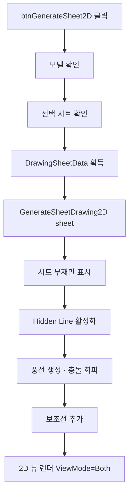

# 선택 시트 2D 도면 생성

## 1. 개요
사용자가 선택한 도면 시트(DrawingSheetData)를 기반으로 Hidden Line 모드 2D 도면을 생성한다. 내부적으로 `GenerateSheetDrawing2D(sheet)`를 호출하며, 이 함수는 `btnGenerate2D`와 **동일한 핵심 로직**을 공유한다.

## 2. 트리거
| 항목 | 값 |
|---|---|
| 유형 | User Action |
| 입력 | `btnGenerateSheet2D` 버튼 클릭 |
| 위치 | 메인 폼 > 도면 시트 탭 |

## 3. 사전 조건
- [ ] 3D 모델 로드됨
- [ ] 도면 시트 목록에서 하나 선택됨
- [ ] 선택 시트의 `MemberIndices.Count > 0`
- [x] **`GenerateSheetDrawing2D(sheet)` 진입부에서 `vizcore3d.Object3D.GenerateEdgeData()` 자체 호출 (2026-05-18 이동)** — 히든라인 ISO 모서리 누락 방지. 수동·자동 모두 보장

## 4. 전체 동작 흐름 (Happy Path)

| # | 단계 | 주체 | 설명 |
|---|---|---|---|
| 1 | 모델 확인 | Form1 | `IsOpen()` → [E01] |
| 2 | 시트 선택 확인 | Form1 | `lvDrawingSheet.SelectedItems.Count == 0` → [E02] |
| 3 | 시트 데이터 추출 | Form1 | `Tag as DrawingSheetData` → [E03] |
| 4 | 위임 호출 | Form1 | `GenerateSheetDrawing2D(sheet)` |
| 5 | 부재 가시성 조정 | SDK | 시트 부재만 Show, 나머지 Hide |
| 6 | Hidden Line | SDK | `SetRenderMode(DASH_LINE)` |
| 7 | 그리드 구조 생성 | SDK | `AddGridStructure(2, 3, 297, 210)` + 마진 10mm → 셀 ≈ 92.3×95 mm |
| 8 | **BOM 테이블 (1,3) 셀 배치** | SDK | `RenderTemplateOnGridStructure(table1, 1, 3)` — 최대 14행, 초과 시 "…+N건 생략" |
| 9 | **tableInfo (2,3) 셀 배치** | SDK | `RenderTemplateOnGridStructure(tableInfo, 2, 3)` — 하단 정렬 |
| 10 | 뷰 4개 렌더링 | Form1 | (1,1)ISO / (1,2)Z / (2,1)Y / (2,2)X → `RenderSheetViewForDrawing` |
| 11 | 풍선 배치 | Form1 | 번호 풍선 생성, `balloonOverrides`로 충돌 회피 |
| 12 | 보조선 추가 | Form1 | 풍선과 부재를 잇는 지시선 |
| 13 | 2D 뷰 전환 | SDK | `ViewMode = Both` |

> 구현 상세는 [코드 레퍼런스](../../code-reference/form1-drawing-sheets.md#GenerateSheetDrawing2D) 참고

## 5. 주요 분기 처리

### [분기 A] 풍선 위치 충돌
| 조건 | 처리 |
|---|---|
| 다른 풍선과 겹침 | `balloonOverrides` Dict에 오프셋 등록 후 재배치 |
| 겹침 없음 | 기본 위치 사용 |

### [분기 B] BOMInfo 재집계
| 조건 | 처리 |
|---|---|
| 시트에 포함된 부재 | `CollectBOMInfo(false, sheet)` 호출 → `lvDrawingBOMInfo` 재표시 |

### [분기 C] BOM 행 수 제한
| 조건 | 처리 |
|---|---|
| `lvDrawingBOMInfo.Items.Count <= 14` | 전체 행을 BOM 테이블에 렌더링 |
| `> 14` | 14행까지 렌더링 + 마지막에 "…" / "+N건 생략" 행 추가 (셀 (1,3) 높이 초과 방지) |

### [분기 D] 엑셀 템플릿 본진 (P2) — `UseExcelTemplate`
| 조건 | 처리 |
|---|---|
| `UseExcelTemplate == true` (디폴트) | `GenerateSheetDrawing2D_WithExcelTemplate(sheet)` 분기. 옛 셀 기반 그리드 대신 엑셀 파일(`사용자템플릿_엑셀_제작도_Rev.01.xlsx`)의 `{Input_N}` / `{View_n}` 슬롯 좌표를 SDK가 파싱 → BOM/도면정보/시트종류 데이터 치환 + 4개 View 영역에 모델·치수 렌더 |
| `UseExcelTemplate == false` | 옛 GridStructure 셀 경로(2×3 그리드 + RenderSheetViewForDrawing × 4) 사용 |

#### D-1. 엑셀 본진(P2) View 영역별 처리 (T-064 P2, 2026-05-14)
각 `viewArea.Index`별로 옛 `RenderSheetViewForDrawing` 패턴을 영역 기반으로 이식:

| viewArea.Index | viewDirection | 어노테이션 | 모델 shrink |
|---|---|---|---|
| 1 | ISO | `CreateIsoBalloonNotes(memberIndices, true)` → `FromScreen` 가시성 필터 → `Add2DNoteFrom3DNote(visibleNoteIds)` → 원형 SnapBox | × 0.70 |
| 2 | Z (Looking Z) | `ShowAllDimensions("Z", true, estScale)` → **`MarkNonRightAngles("Z")`** → `shapeDrawingIds` → `Add2DObjectFromShapeDrawing` + `Add2DMeasureFrom3DMeasure` | × 0.65 |
| 3 | X (Looking X) | 동일 — `ShowAllDimensions("X", …)` + `MarkNonRightAngles("X")` | × 0.70 |
| 4 | Y (Looking Y) | 동일 — `ShowAllDimensions("Y", …)` + `MarkNonRightAngles("Y")` | × 0.70 |

- **부재-부재 접합 각도 표시 (`MarkNonRightAngles`, 2026-06-23)**: `ShowAllDimensions` 직후 호출해 같은 `Review.Measure`→2D 파이프라인에 각도를 누적시킨다. **서로 다른 두 부재가 접합하는 곳**(간섭검사 Clash 표면접촉=면접합 포착, 또는 osnap 끝점 3mm 근접=노드 일치 → 연결. 접합점=최근접 osnap 점쌍 중점)에서 두 부재 **길이축**(osnap 점군의 PCA 주성분 — 최원점쌍은 박스형에서 대각선이라 부적합)의 **실제 3D 사잇각이 90°의 배수(0/90/180/270/360)가 아니면**(=틀어져 만나면) `AddCustom3PointAngle(접합점, A방향점, B방향점)`로 표시한다. **한 부재 *내부* 모서리 각(ㄱ자 꺾임)은 표시하지 않는다.** 판형(PAD/PLATE)은 길이방향이 모호해 제외. 깊이축에 평행해 화면상 점이 되는 뷰에서는 생략. 연결성은 간섭검사(`clashList`) **표면 접촉**으로 판정(구조 부재는 면끼리 붙어 중심선 osnap이 부재 폭만큼 벌어지므로 끝점 근접만으론 면접합을 놓침). `clashList`가 비면 osnap 근접으로 폴백. 정수 도(度)·파랑, 생성 ID에만 `SetStyle(id, …)`. ISO 미호출. ⚠ 실측 확정: AddCustom3PointAngle 인자 순서(예각 모델)·표시값이 3D각인지 투영각인지(코드가 `[각도]` 로그에 둘 다 기록). ⚠ 사용자 검증 보고(2026-07-06): 실제 90° 접합이 87°로 오검출(PCA 길이축이 사선 끝단에 휘어짐) + 각도가 꺾임이 실제 평면으로 보이는 뷰에 안 나옴 — 개선 방안 논의 중.

- **fit + shrink 흐름**: `fitScale = Math.Min(fitW/objW, fitH/objH)` (영역 가득 fit) → `RescaleObject(objScale * fitScale * shrinkFactor)`. shrinkFactor는 위 표 (Z=0.65, X·Y·ISO=0.70 — 사용자 사양 2026-05-14).
- **estScale (보조선 위치 기준)**: 별도 헬퍼 `EstimateFitScaleForViewArea(availW, availH, viewDir, memberIndices)` — 옛 `EstimateFitScaleForCell` 알고리즘을 GridStructure 셀 대신 viewArea로. fitFactor = shrinkFactor와 동일 값 유지 → 보조선 위치와 모델 fit 결과 일치.
- **보조선 종이 절대 기준**: 오프셋(치수선까지 거리·보조선 길이) = 종이 1단 5mm·2단 10mm, **시작 gap(osnap→보조선 시작) = 종이 2mm**(`FabCanvasExtGap`, 2026-07-03 — 옛 모델좌표 고정 10mm는 축척마다 종이 gap이 들쭉날쭉해 폐기, 가공도와 동일 정책). 둘 다 estScale로 역산하므로 추정 오차만큼의 편차는 공유. 3D 미리보기 경로(종이 배율 없음)는 기존 모델좌표 gap 10mm 유지.
- **작은 치수 단 승격 (2026-07-03 사용자 사양)**: 텍스트가 치수선에 안 들어가는 작은 체인 치수(뷰 최대 치수 ÷ 26 이하, 뷰 max > 100mm일 때만)는 텍스트를 옆으로 옮기지(시프트) 않고 **치수선째 2단으로 올려** 그린다. 그런 치수가 있으면 **전체 치수는 3단**으로 밀린다. 옛 텍스트 시프트(`ApplyParallelTextShift`)는 이 방식으로 대체·삭제. 진단 로그 `[SmallDimPromote]`.
- **X 오프셋**: ISO(View_1) · Y(View_4)만 X +10mm, Z(View_2) · X(View_3)는 그대로. Y +15mm는 전 영역 공통 (사용자 사양).

#### D-2. 서로 다른 고정 이미지 배치

엑셀 SDK가 인식하는 이미지 예약어는 `{Image}` 하나뿐이므로 `{Image_2}`, `{Image_3}` 같은 번호형 태그는 사용하지 않는다. 이미지 전용 위치도 `{View_n}` 영역으로 등록하고 코드가 파일별로 배치한다.

| 엑셀 영역 | 슬롯 | 이미지 |
|---|---|---|
| `AM2:AN6` | `{View_5}` | `North_Arrow.png` |
| `AO38:AW41` | `{View_6}` | 예약 영역 (현재 이미지 미지정) |
| `B2:D5` | `{View_7}` | `ISO_North_Arrow.png` |

이미지 파일은 빌드 시 실행 폴더로 복사되며, 코드는 실행 폴더를 우선으로 절대경로를 구성한다. 개발 환경에서는 솔루션 루트를 보조 경로로 사용한다.

`PlaceImageInTemplateArea`는 클릭 입력이 필요한 `Set2DViewCreateObjectWithImage`를 사용하지 않는다. `TemplateTableData`의 1×1 이미지 셀을 영역 중앙 좌표에 `RenderTemplate`로 직접 렌더링하고, 영역 폭·높이 안에 들어오도록 종횡비를 유지해 이미지 높이를 계산한다. 파일·영역 누락이나 렌더링 실패는 절대경로와 함께 로그를 남기고 모델 도면 출력은 계속한다.

## 6. 예외 / 에러 처리

| ID | 조건 | 동작 | 사용자 피드백 | 결과 상태 |
|---|---|---|---|---|
| E01 | 모델 미로드 | return | MessageBox "먼저 모델을 열어주세요." | 변화 없음 |
| E02 | 시트 미선택 | return | MessageBox "도면 시트를 선택해주세요." | 변화 없음 |
| E03 | `sheet == null` 또는 `MemberIndices.Count == 0` | return | MessageBox "유효한 시트 데이터가 없습니다." | 변화 없음 |
| E04 | 생성 중 예외 | catch (위임 함수 내부) | 부분 렌더링 + 로그 | 2D 캔버스 불완전 |

## 7. 상태 변화 (Before / After)

| 대상 | Before | After |
|---|---|---|
| `vizcore3d.ViewMode` | 3D 또는 이전 | `Both` |
| `vizcore3d.View.RenderMode` | SOLID | DASH_LINE |
| `vizcore3d.Object3D.Visible` | 모든 부재 | 시트 부재만 |
| `balloonOverrides` | 이전 | 현재 시트 기준 |
| `lvDrawingBOMInfo` | 이전 | 시트 부재 그룹 |
| 2D 캔버스 | 빈/이전 | 완성된 도면 |

## 8. 후행 기능 (Chained)
- [시트 PDF 내보내기](./시트 PDF 출력.md)
- [가공도 생성](../가공도/가공도 단일.md) (선택 부재 지정 후)

## 9. 관련 링크
- 코드 구현: [Form1.DrawingSheets.cs:L778](../../code-reference/form1-drawing-sheets.md#btnGenerateSheet2D_Click)
- 공통 함수: [Form1.DrawingSheets.cs#GenerateSheetDrawing2D](../../code-reference/form1-drawing-sheets.md#GenerateSheetDrawing2D)
- 용어집: [Hidden Line](../../_glossary.md#hidden-line-은선), [풍선](../../_glossary.md#풍선-balloon-note)

## 10. 변경 이력
| 날짜 | 변경 내용 | 작성자 |
|---|---|---|
| 2026-06-15 | **고정 이미지 미표시 수정**: 이미지 3종을 빌드 출력 폴더에 자동 복사하고 실행 폴더 우선 절대경로로 조회. 클릭 대기형 이미지 생성 API 대신 `TemplateTableData + RenderTemplate`로 각 View 영역 중앙에 직접 렌더링 | Codex |
| 2026-06-23 | **각도 표시 = 부재-부재 접합 각도로 재설계** (사용자 정정). 관련: T-067. 1차 구현(부재 *내부* 모서리 각, ㄱ자 꺾임)은 의도와 달라 폐기 → `MarkNonRightAngles`를 '두 부재가 접합하는 곳에서 길이축 3D 사잇각이 90의 배수가 아니면 표시'로 교체. 연결성·접합점은 osnap 끝점 3mm 근접으로 자체 판정(clashList 비의존), 길이축=osnap 최원점쌍, 판형 제외. 설계·검증 각각 워크플로우(적대 검증으로 과잉수정 기각). 실측 대기: 인자 순서·3D각 vs 투영각 | Claude |
| 2026-06-23 | **비-90° 각도 표시 1차 추가**(폐기됨). 관련: T-067. `ShowAllDimensions` 직후 `MarkNonRightAngles(memberIndices, viewDir)` 호출 — 부재 LINE osnap 세그먼트를 3D 꼭짓점으로 묶어 화면 평면 2축 투영 사잇각을 구하고, 90°의 배수(90/180/270/360)가 아니면 `AddCustom3PointAngle`로 표시. 각도는 같은 `Review.Measure`→2D 파이프라인을 그대로 탄다. 정수 도·파랑, ID 단위 `SetStyle`(전역 미변경). `ApplyParallelTextShift`는 각도(`RK_MEASURE_ANGLE`) 시프트 제외. X/Y/Z 전체 뷰, ISO 제외. ⚠ 첫 빌드 실측: 명백한 예각(예 45°) 한 곳으로 인자 순서(꼭짓점 위치) 확정 필요 | Claude |
| 2026-06-15 | **ISO North Arrow 위치 정정**: `AO38:AW41`의 `{View_6}`은 향후 다른 이미지용 예약 영역으로 유지하고, 기존 `B2:D5`의 `{Image_4}`를 `{View_7}`로 변경해 `ISO_North_Arrow.png`를 배치 | Codex |
| 2026-06-15 | **제작도 고정 이미지 2종 배치**: 템플릿 `AM2:AN6`의 `{Image_3}`를 `{View_5}`, `AO38:AW41`의 `{Image_2}`를 `{View_6}`로 변경. `PlaceImageInTemplateArea`가 `North_Arrow.png`와 `ISO_North_Arrow.png`를 각 영역에 종횡비 유지 fit + 중앙 배치. 기존 임시 `Logo.png` 실측 블록 제거. 이미지 배치 실패는 로그만 남기고 도면 출력 계속 | Codex |
| 2026-04-13 | 초안 작성 | — |
| 2026-04-20 | 템플릿 정규화 (T-006/FB-003): BOM→(1,3) 셀, tableInfo→(2,3) 셀로 이관 (`RenderTemplateOnGridStructure`). BOM 열 너비 합 82→92mm, 최대 14행 제한 + "…+N건 생략" 처리. 이전 `bInfo` 절대좌표 앵커 제거 | Claude |
| 2026-04-20 | T-006 후속: BOM/tableInfo가 흰선 밖으로 나가 FA열 분리되는 문제 → 합 92→81mm 축소. BOM: ITEM 38→19, MATERIAL 8→12, SIZE 8→12. tableInfo: 35/57→32/49 | Claude |
| 2026-04-20 | T-006 재후속: 81도 미세하게 넘침 → 77mm로 추가 축소. BOM: ITEM 19→17, MATERIAL/SIZE 12→11. tableInfo: 32/49→30/47 | Claude |
| 2026-04-21 | T-013 옵션 A 시도: `RenderSheetViewForDrawing`의 `isIsoFullView` 분기에서 objId의 `RescaleObject/MoveObject/GetObjectCenter 보정` 로직 제거. SDK 자동 처리 여부 검증 중. DiagLog로 bgObjId/objId 중심·스케일 실측 기록. 결과에 따라 옵션 B(WorldToScreen) 전환 예정 | Claude |
| 2026-04-21 | T-013 옵션 A 실패 확인 (objId가 원점 0,0에 objScale=0.005로 남아 보이지 않음, SDK 자동 매핑 없음) → **옵션 B 적용**: `vizcore3d.View.WorldToScreen`으로 3D BBox 중심 2개(전체 BOM / 시트 부재)를 캔버스 좌표로 변환해 obj를 bg 내부 원래 위치에 배치. bgFinalScale로 동기 스케일링 포함. DiagLog에 OPT-B 실측 출력 | Claude |
| 2026-04-21 | T-013 옵션 B 스케일 보정: 1차 시도에서 obj가 **캔버스 밖으로 튐** (dScreen.Y=195.97 그대로 더해져 5.90mm 대신 195.97mm 이동). 원인: `WorldToScreen`은 원본 캔버스 좌표(스케일 전) 반환이라 bgObjId가 `RescaleObject(bgFinalScale)`로 축소된 후에는 좌표계 불일치. 수정: `target = bgCanvas + dScreen * bgFinalScale` | Claude |
| 2026-04-21 | T-013 옵션 B 2차 재수정: `bgFinalScale` 단독 곱도 틀림 (실측 offsetRatio.Z=-0.244 → 7.3mm 이동이 정답인데 5.9mm로 계산됨). 원인: `bgFinalScale`은 객체 원본좌표→표시크기 비율이고 `WorldToScreen`은 3D→원본캔버스라 변환 체인 불일치. 수정: bg의 3D BBox 8개 꼭지점을 `WorldToScreen` → 원본 캔버스 BBox 계산 → `ratio = bgCanvasSize / bgScreenBBox` → `target = bgCanvas + dScreen * ratio`. DiagLog 라벨 OPT-B2 | Claude |
| 2026-05-11 | **체인치수 데이터 소스 통일** (사용자 요청): `ExtractInstallationDimensions`(BBox) → `ComputeViewDimensionsForMembers`(Osnap, null 파라미터로 3뷰×2축 6조합 합집합). 작업데이터 탭(`chainDimensionList` / `lvDimension`) = 도면 측 측정 데이터 1:1 일치. 이전엔 BBox 기반과 Osnap 기반이 다른 결과를 만들어 디버깅 시 매칭 어려움 | Claude |
| 2026-05-14 | **T-064 P2 본진 — 엑셀 분기 치수 그리기 이식** (사용자 보고: "도면리스트 뽑기에서 치수 안 그려짐"). `GenerateSheetDrawing2D_WithExcelTemplate` 루프 본문을 옛 `RenderSheetViewForDrawing` 패턴으로 통째로 교체. ISO=`CreateIsoBalloonNotes`+`FromScreen` 가시성 필터+`Add2DNoteFrom3DNote`, X/Y/Z=`ShowAllDimensions`+`Add2DObjectFromShapeDrawing`+`ApplyParallelTextShift`+`Add2DMeasureFrom3DMeasure`. 모델 shrink Z=0.65/X·Y·ISO=0.70 (사용자 사양, 옛 0.70/0.75에서 5% 더 축소). 새 헬퍼 `EstimateFitScaleForViewArea` 추가 — 옛 `EstimateFitScaleForCell`의 viewArea 영역 버전. **영향**: 도면 리스트 뽑기 / 단일 2D 출력 모두 일반 시트(제작도·조립도·설치도)에 치수+풍선 정상 출력, 모델 라벨·보조선 영역 확보. 가공도(`GenerateMfgDrawing2DAll`)는 P3 롤백 옛 경로 유지 — 영향 없음. 관련: T-064 (도면리스트 뽑기), T-038/T-039 (모델 스케일·보조선 길이) | Claude |
| 2026-05-19 | **Step A: ApplySheetSelection 추출** (DRY 본격 적용 첫 commit). `LvDrawingSheet_SelectedIndexChanged` 핸들러 본체 168줄을 `public void ApplySheetSelection(DrawingSheetData sheet)` 메서드로 분리. 핸들러는 thin wrapper(시그니처 + 빈 선택 가드 + sheet 추출 + `ApplySheetSelection(sheet)` 호출)로 축소. 자동 경로(`ProcessSingleStruFull` Form1.Stru.cs L706)는 `lvi.Selected=true + Application.DoEvents + Thread.Sleep(200)` UI 트릭 제거 → 메서드 직접 호출로 전환. 효과: 자동 일괄 출력 시트당 200ms 단축 (N 시트 × 200ms), 이벤트 타이밍 의존 제거, 수동·자동 공통 진입점 명시. `lvi.Selected=true`는 사용자 시각 일관성을 위해 유지 (진행 중 시트 표시). 동작 결과 동일. ⚠️ 자동 경로의 `lvi.Selected=true`로 핸들러 이벤트 추가 트리거 가능성 — 사내 검증에서 중복 호출 시 가드 변수(`_suppressSheetSelChanged`) 추가 예정 | Claude |
| 2026-05-19 | **fix: STRU 리스트 클릭 시 부재 활성화 추가** (사용자 발견·사양). 증상: STRU 리스트 행 클릭 시 카메라 fit만 되고 STRU 부재가 visible=false인 채로 남음 → "활성화 안 됨"으로 느낌. 해결: `PerformFlyToSelectedStru` (Form1.Stru.cs:274~)에 `vizcore3d.Object3D.Show(memberIndices, true)` 1줄 추가 (FlyToObject3d 직전). 다른 부재 가시성은 손대지 않음 (사용자 사양 "최소한 그 부재는 활성화" + 무거움 우려 반영 → 최소 Show 호출). 체크 강조 색상은 `RestoreColorAll/Select` 미호출로 그대로 보존 | Claude |
| 2026-05-19 | **fix: 자동 도면 일괄 출력 진입부 사전 초기화 + 60초 폴링 조건 보강** (사용자 발견·제안). 증상: 수동 작업 후 자동 출력하면 `drawingSheetList` 잔재로 폴링 조건(`Count > beforeSheetCount`) 영원히 미만족 → `간섭검사 60초 타임아웃` 에러. 해결: `btnExtractDrawingList_Click` 진입부에 8개 항목 초기화 — (1)전체 모델 표시 (2)2D 캔버스 `DeleteAllObjectBy2DView` + `DeleteAllNonObjectBy2DView` (3)`Review.Note/Measure/ShapeDrawing.Clear` (4)`drawingSheetList + lvDrawingSheet.Items.Clear` ← **60초 에러 직접 차단** (5)`chainDimensionList + lvDimension.Items.Clear` (6)`lvDrawingBOMInfo.Items.Clear` (7)`xraySelectedNodeIndices.Clear` (8)`_lastCollectedNodeOsnapMap.Clear`. 폴링 종료 조건 `Count > beforeSheetCount` → `Count > 0` 단순화 (진입 초기화로 잔재 0 보장). BeginUpdate/EndUpdate 묶음, 부분 실패 안전망. 자동 출력 = "처음부터 다시" 의미 명확화 | Claude |
| 2026-05-18 | **E1: Osnap 캐시 4경로 전체 적용** (T-032 완성). `_lastCollectedNodeOsnapMap`을 호출자 3곳(L614·L1363·L1698) 모두 전달 + 본체에 하이브리드 fallback 보강(캐시 hit는 빠르게, miss 부재만 `GetOsnapPoint` 보충). 시트당 1~3초 단축, 캐시 신선도 무관 안전. `DiagLog "E1 Osnap cache"`로 hit/miss 비율 측정 | Claude |
| 2026-05-18 | **fix: 수동 2D 출력 ISO 모서리 누락 해소** (사용자 발견). `vizcore3d.Object3D.GenerateEdgeData()` 호출을 자동 경로(`Form1.Stru.cs:389` `btnExtractDrawingList_Click`)에서 `GenerateSheetDrawing2D(sheet)` 진입부(`Form1.DrawingSheets.cs:1300`)로 이동. 수동(`btnGenerateSheet2D_Click`)·자동(`ProcessSingleStruFull`) 두 경로 모두 같은 함수를 거치므로 단일 지점에서 엣지 데이터 갱신 보장 → ISO 방향 튀어나온 모서리 누락 fix. Stru.cs 진입부 호출은 제거 (중복 방지). DRY 적용 — 사용자 제안 "자동에서 빼고 진입부에 넣자". 베이스라인 캡처 시 이 fix 후 모서리 살아나는지 비교 가능 | Claude |
| 2026-05-14 | **T-064 후속 — ISO 풍선 단축 + Y뷰 추가 오른쪽** (사용자 검증 보고 fine-tune). (1) `CreateIsoBalloonNotes` `baseOffsetDist = Math.Max(200f, isoDiag * 0.35f)` → `Math.Max(100f, isoDiag * 0.22f)` — ISO 풍선이 모델에서 떨어진 거리 단축, PDF 시각 압박감 완화. (2) 엑셀 분기 영역 중심 이동 `xOffset` 분기 재구성 — ISO(View_1)=10mm 유지, **Looking Y(View_4)=20mm**(직전 10→20mm 증가, 사용자 사양 "Y뷰 더 오른쪽"), Z(View_2)·X(View_3)=0mm 그대로. Y +15mm 공통은 유지 | Claude |
| 2026-07-03 | **제작도 보조선 시작 gap 종이 절대 2mm 통일** (사용자 사양 "모델 크기와 상관없게"). 옛 모델좌표 고정 10mm는 축척마다 종이 gap이 달라졌음. `FabCanvasExtGap=2mm`를 `ShowAllDimensions`의 2D 출력 분기(canvasScaleOverride>0)에서 estScale로 역산해 `DrawDimension`의 `extGapOverride`로 전달. 3D 미리보기 경로는 모델좌표 10mm 유지. 가공도(`MfgCanvasExtGap=2`)와 동일 정책 | Claude |
| 2026-07-06 | **작은 치수 단 승격 — 텍스트 시프트 폐기** (사용자 사양). 텍스트가 안 들어가는 작은 체인 치수(뷰 최대/26, max>100mm)는 치수선째 2단으로 승격, 전체 치수는 3단으로. `ApplyParallelTextShift`(v6~v12 텍스트 시프트) 호출 2곳 제거 + 함수 삭제(-146줄). 가공도(`DrawMfgDimsAtScale` Level 승격)도 동일 규칙 | Claude |
