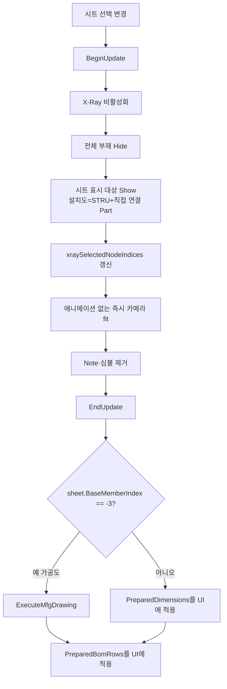

# 도면 시트 선택 시 X-Ray 표시

## 1. 개요
`lvDrawingSheet` 선택이 변경되면 해당 시트 부재만 표시한다. 단, 설치도는 선택 STRU와 직접 연결된 외부 Part만 함께 표시한다. Assembly 정보는 접합 이름 문맥으로만 유지한다. 일반 시트와 설치도는 목록 생성 전에 준비한 치수·BOM 데이터를 즉시 적용하고, 가공도만 부재별 3D 장면 생성을 수행한다.

## 2. 트리거
| 항목 | 값 |
|---|---|
| 유형 | Event Callback |
| 입력 | `lvDrawingSheet.SelectedIndexChanged` |
| 위치 | 메인 폼 > 도면 시트 리스트 |

## 3. 사전 조건
- [ ] 도면 시트 목록 채워짐 ([SHT-001](./시트 자동 생성.md))

## 4. 전체 동작 흐름 (Happy Path)

| # | 단계 | 주체 | 설명 |
|---|---|---|---|
| 1 | 선택 확인 | Form1 | 없으면 return |
| 2 | BeginUpdate | SDK | — |
| 3 | X-Ray 해제 | SDK | `XRay.Enable = false` + Clear |
| 4 | 전체 부재 Hide | SDK | `Object3DKind.ALL`을 숨겨 이전 설치도의 외부 연결 Part 잔존까지 제거 |
| 5 | 시트 표시 대상 Show | SDK | 일반 시트는 `MemberIndices`, 설치도는 `MemberIndices + InstallationContextIndices` |
| 6 | 실루엣 유지 | SDK | Green |
| 7 | xray 인덱스 저장 | Form1 | 글로벌 뷰 버튼용 |
| 8 | 카메라 이동 | SDK | `View.EnableAnimation = false` 후 `FlyToObject3d(MemberIndices, 1.2f)` — 중간 이동 화면 없이 즉시 fit |
| 9 | 심볼/풍선 제거 | SDK | `Clash.ClearResultSymbol()`, `Review.Note.Clear()` |
| 10 | **기준부재 선택상태** (T-022) | SDK | `Object3D.Select(DESELECT_ALL)` → 기준부재 하나만 `Select(indices, true, false)` → 3D View에서 빨간색 하이라이트. Sheet 1(-1)·설치도(-2)는 생략, 가공도(-3)는 `MemberIndices[0]`, Sheet 2+는 `BaseMemberIndex` |
| 11 | EndUpdate | SDK | — |
| 12 | 치수 분기 | Form1 | [분기 A]. 일반·설치 시트는 `PreparedDimensions` 적용만 수행 |
| 13 | BOM 정보 적용 | Form1 | `PreparedBomRows`와 `PreparedBomNodeGroupMap`을 ListView·공유 맵에 복사. 전체 모델/SDK 재조회 없음 |
| 14 | 구간별 성능 로그 | Form1 | 장면 전환·치수 적용·BOM 적용·전체 시간을 각각 기록 |

## 5. 주요 분기 처리

### [분기 A] 시트 유형 (T-028 재작성 + T-030 렌더 정책)
| 조건 | 처리 |
|---|---|
| `sheet.BaseMemberIndex == -3` (가공도) | `ExecuteMfgDrawing(sheet.MemberIndices[0])` — T-031로 은선(DASH_LINE) → 실선(SMOOTH) |
| `sheet.BaseMemberIndex == -2` (설치도) | 선택 STRU와 직접 연결된 외부 Part만 표시하고, 목록 생성 때 Target Body 가까운 끝단→Connected Body 접합측 모서리 기준으로 계산한 `PreparedDimensions`만 적용. 선택 STRU·연결 Assembly 전체 범위와 접합 중심·A1/A2 치수는 생성하지 않는다. 예외적인 미준비 시트만 `ExtractInstallationDimensions(sheet)` fallback |
| 그 외 (Sheet 1 전체, Sheet 2+ 개별 기준부재) | 목록 생성 때 Osnap 공용 엔진으로 계산한 `PreparedDimensions`를 적용. Sheet 1은 메인 치수 추출 결과 자체를 재사용한다. 예외적인 미준비 시트만 현장에서 계산 후 캐시. `Review.Measure.Clear()` + `ShapeDrawing.Clear()`로 3D 뷰는 깨끗하게 마감 |

## 6. 예외 / 에러 처리
| ID | 조건 | 동작 | 사용자 피드백 | 결과 상태 |
|---|---|---|---|---|
| E01 | 예외 | catch | Debug.WriteLine만 | 부분 표시 가능 |

## 7. 상태 변화
| 대상 | Before | After |
|---|---|---|
| 부재 가시성 | 전체 또는 이전 | 일반=시트 부재, 설치도=선택 STRU+직접 연결 Part |
| `xraySelectedNodeIndices` | 이전 | 실제 표시 대상 인덱스 복제 |
| `chainDimensionList` | 이전 | 시트의 `PreparedDimensions` 적용 |
| `lvDimension` | 이전 | 재표시 |
| `lvDrawingBOMInfo` | 이전 | 시트 기준 그룹 |
| 카메라 | 이전 | 시트 부재 확대 |
| **3D View 선택상태** (T-022) | 이전 선택 | **기준부재만 빨간 하이라이트** (Sheet 1·설치도는 선택 없음) |
| `selectedAttributeNodeIndex` | 이전 | 기준부재 인덱스 (연쇄: `Object3D_OnObject3DSelected` → `UpdateAttributeTable`) |

## 8. 후행 기능 (Chained)
- [시트 ISO/축 뷰](./ISO 도면.md)
- [시트 2D 생성](./시트 2D 렌더.md)

## 9. 관련 링크
- 코드 구현: [Form1.DrawingSheets.cs:L608](../../code-reference/form1-drawing-sheets.md#LvDrawingSheet_SelectedIndexChanged)

## 10. 변경 이력
| 날짜 | 변경 내용 | 작성자 |
|---|---|---|
| 2026-07-23 | 설치도 `PreparedDimensions`에서 선택 STRU 전체 범위를 제거하고 실제 연결 거리만 적용 | Codex |
| 2026-07-22 | 설치도 준비 치수를 Target Body 가까운 끝단→Connected Body 접합측 모서리 위치 치수로 교체하고 3D 미리보기·PDF 공용 목록으로 사용 | Codex |
| 2026-07-22 | 설치도 표시 대상을 외부 연결 Assembly 전체에서 직접 연결 Part로 축소하고 연결 Assembly 전체 범위 치수를 제거 | Codex |
| 2026-07-21 | 설치도 선택 시 전체 모델을 먼저 숨긴 뒤 선택 STRU와 직접 연결된 외부 Assembly 전체를 함께 표시하고, 실제 접합 영역·Osnap 기반 준비 치수를 적용하도록 변경 | Codex |
| 2026-07-21 | 일반·설치 시트 선택 경로에서 치수 재계산과 `CollectBOMInfo` 전체 모델 재조회를 제거. 시트 자동 생성 단계에서 준비한 `PreparedDimensions`·`PreparedBomRows`를 즉시 적용하고 카메라 애니메이션을 비활성화. 장면/치수/BOM/전체 시간을 한 로그에 기록 | Codex |
| 2026-04-13 | 초안 작성 | — |
| 2026-04-22 | T-022: 시트의 "기준부재"를 3D View에서 `Object3D.Select`로 빨간 하이라이트. `DESELECT_ALL` 선행으로 이전 선택 누적 방지. 가공도(`MemberIndices[0]`) / Sheet 2+(`BaseMemberIndex`) 구분, Sheet 1·설치도는 생략. 단계 10 추가, 상태 변화 2행 추가 | Claude |
| 2026-04-22 | **T-028**: 시트 유형별 치수 분기 3종 재작성. 가공도(-3)는 `ExecuteMfgDrawing`, 설치도(-2)는 `ExtractInstallationDimensions`(BBox 유지), 그 외는 `ComputeViewDimensionsForMembers`(2D 출력·글로벌 버튼과 동일 Osnap 엔진). 분기 A 재기술 | Claude |
| 2026-04-22 | **T-030**: 일반 시트 분기에서 `ShowAllDimensions()` 호출 제거, `Review.Measure.Clear()` + `ShapeDrawing.Clear()` 추가로 3D 뷰를 "치수 없는 깨끗한 상태"로 마감 (T-029 정책 확장). `chainDimensionList`·`lvDimension`은 계속 채워 2D 출력·글로벌 뷰 버튼에서 재사용. 분기 A 재기술, `DiagLog T-030 시트 선택 자동 치수` 추가 | Claude |
| 2026-04-23 | **T-036 재조정**: 가공도 시트(-3) 선택 시 공통부 `FlyToObject3d(sheet.MemberIndices, 1.2f)` **스킵** — `ExecuteMfgDrawing`이 자체 `MoveCamera(X/Y/Z_PLUS)` + `FitToView`로 정면 뷰를 세팅하는데, 이전 카메라 방향(예: 글로벌 ISO 상태)이 잔존한 채 `FlyToObject3d`가 먼저 호출되면 "45도 대각 ISO 뷰 느낌"으로 보이던 문제 해결. 일반 시트·설치도는 기존대로 `FlyToObject3d` 호출 | Claude |
| 2026-04-23 | **T-036 3차**: 핸들러 말미 `CollectBOMInfo(false)` 직후에 **카메라 스냅샷 복원** 블록 추가 — 가공도 시트(-3) + `_mfgDrawingCameraSnapshot != null`일 때 `vizcore3d.View.SetCameraData(snapshot, false)`. `ExecuteMfgDrawing`의 Z 최장축 90° 회전을 외부 `FitToView`가 0.5초 뒤 리셋하던 현상을 방어. `DiagLog T-036 카메라 스냅샷 복원: sheet#=...` 기록 | Claude |
| 2026-04-24 | **T-036 4차 3단계**: 3차 적용 후에도 사용자 재테스트에서 Z 케이스가 세로로 출력. `sdk-verifier`로 `CameraData` 명세 재확인 결과 **ScreenAxisRotation은 CameraData에 포함되지 않고 별도 상태로 관리됨** (XML L2552-2606). 즉 `SetCameraData`만으로는 화면축 회전 복원 불가. 복원 블록을 다음과 같이 강화: **(1)** `SetCameraData(snapshot, false)` 직후 `Application.DoEvents()`로 commit 보장, **(2)** `_mfgDrawingZ90Applied` true면 `RotateCameraByScreenAxis(0, 0, 90)` 재호출, **(3)** `_mfgDrawingR180Applied` true면 `(0, 0, 180)` 재호출. `LockZAxis = false` 매번 세팅. DiagLog에 `Z90=True/False R180=True/False` 추가. 카메라 위치/줌 보존(SetCameraData 역할)과 화면축 회전 보존(재호출 역할)을 분리해 책임 명확화 | Claude |
| 2026-04-24 | **T-036 4차 4단계 (시각 정돈)**: 3단계 적용 후 회전은 정상 동작하지만 사용자가 "카메라가 먼저 이동하고 그 뒤에 가로로 회전되는 두 단계가 보임" 보고. 원인: `SetCameraData` → `DoEvents` → `RotateCameraByScreenAxis`가 각각 화면 갱신을 트리거 → 중간 상태(이동 완료, 회전 전) 노출. **수정**: 복원 블록 전체를 **`vizcore3d.BeginUpdate() / EndUpdate()`로 감싸** SDK 렌더링을 일시 보류. EndUpdate 시점에 최종 상태(이동+회전 모두 적용된 상태)만 한 번에 표시. `DoEvents` 호출은 BeginUpdate 안에서 무의미하므로 제거. 예외 시 EndUpdate 누락 방지를 위해 catch 블록에도 try { EndUpdate } 안전망 추가 | Claude |
| 2026-04-24 | **T-036 4차 5단계 (SetCameraData 제거)**: 4단계 적용 후에도 첫 1~2번 클릭의 Z 케이스에서 "카메라 이동 후 회전" 2단계 시각 잔존 보고. 가설: **`SetCameraData`가 `ScreenAxisRotation`을 동기적으로 리셋하면서 paint를 트리거**하여 `BeginUpdate`로도 막을 수 없음. 사용자 의도는 "회전된 상태로 한 번에 나타남". **분석**: T-036 4차 1단계에서 R180 직후 FitToView 제거, 1차에서 가공도 분기 FlyToObject3d 스킵 → ExecuteMfgDrawing 이후 외부에서 카메라를 이동시키는 경로가 **모두 제거됨**. 따라서 `SetCameraData` 호출 자체가 불필요. **수정**: 복원 블록에서 `SetCameraData` 제거. ScreenAxisRotation 회전만 재적용. 조건도 `_mfgDrawingZ90Applied \|\| _mfgDrawingR180Applied`로 단순화 (snapshot null 체크 불필요). DiagLog도 "카메라 회전 재적용"으로 라벨 변경해 의도 명확화. `_mfgDrawingCameraSnapshot` 필드는 향후 외부 카메라 변경이 재발했을 때 다시 사용할 수 있도록 보존만 (현재는 미사용) | Claude |
| 2026-05-11 | **체인치수 데이터 소스 영향** (사용자 요청, 간접): 설치도 분기(-2)에서 호출하는 `ExtractInstallationDimensions`에서 "개별 부재 전체 길이" 블록 제거 — 비인접 점 쌍처럼 보이는 부작용 해소. 핸들러 분기 자체는 변경 없음, 결과 chainDimensionList 항목 수 감소만. 일반 시트(분기 C)의 ComputeView는 이전과 동일 | Claude |
