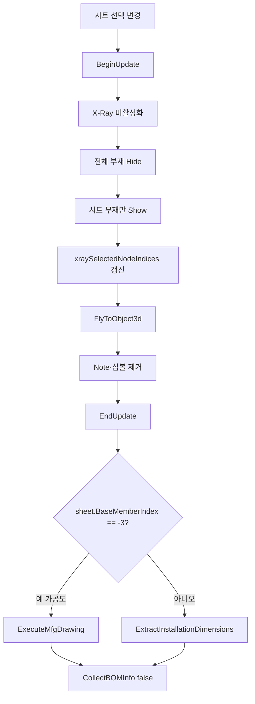

# 도면 시트 선택 시 X-Ray 표시

## 1. 개요
`lvDrawingSheet` 선택이 변경되면 해당 시트 부재만 표시하고, 시트 유형에 따라 **가공도 실행** 또는 **설치도 치수 추출**로 분기한다. 종료 시 BOM 정보도 자동 재집계.

## 2. 트리거
| 항목 | 값 |
|---|---|
| 유형 | Event Callback |
| 입력 | `lvDrawingSheet.SelectedIndexChanged` |
| 위치 | 메인 폼 > 도면 시트 리스트 |

## 3. 사전 조건
- [ ] 도면 시트 목록 채워짐 ([SHT-001](./시트 자동 생성.md))

## 4. 전체 동작 흐름 (Happy Path)

| # | 단계 | 주체 | 설명 |
|---|---|---|---|
| 1 | 선택 확인 | Form1 | 없으면 return |
| 2 | BeginUpdate | SDK | — |
| 3 | X-Ray 해제 | SDK | `XRay.Enable = false` + Clear |
| 4 | 전체 부재 Hide | SDK | `bomList`의 모든 Index를 `Show(false)` |
| 5 | 시트 부재 Show | SDK | `Show(sheet.MemberIndices, true)` |
| 6 | 실루엣 유지 | SDK | Green |
| 7 | xray 인덱스 저장 | Form1 | 글로벌 뷰 버튼용 |
| 8 | 카메라 이동 | SDK | `FlyToObject3d(MemberIndices, 1.2f)` |
| 9 | 심볼/풍선 제거 | SDK | `Clash.ClearResultSymbol()`, `Review.Note.Clear()` |
| 10 | **기준부재 선택상태** (T-022) | SDK | `Object3D.Select(DESELECT_ALL)` → 기준부재 하나만 `Select(indices, true, false)` → 3D View에서 빨간색 하이라이트. Sheet 1(-1)·설치도(-2)는 생략, 가공도(-3)는 `MemberIndices[0]`, Sheet 2+는 `BaseMemberIndex` |
| 11 | EndUpdate | SDK | — |
| 12 | 치수 분기 | Form1 | [분기 A] |
| 13 | BOM 정보 재집계 | Form1 | `CollectBOMInfo(false)` — 알람 없음 |

## 5. 주요 분기 처리

### [분기 A] 시트 유형 (T-028 재작성 + T-030 렌더 정책)
| 조건 | 처리 |
|---|---|
| `sheet.BaseMemberIndex == -3` (가공도) | `ExecuteMfgDrawing(sheet.MemberIndices[0])` — T-031로 은선(DASH_LINE) → 실선(SMOOTH) |
| `sheet.BaseMemberIndex == -2` (설치도) | `ExtractInstallationDimensions(sheet.MemberIndices)` — **BBox 기반 유지**. 부재 간 간격·전체 조립 치수 표현용. 3D 뷰 치수는 자체적으로 미렌더(chainDimensionList만 채움). 추후 옵션 A(완전 폐기)로 전환 가능 |
| 그 외 (Sheet 1 전체, Sheet 2+ 개별 기준부재) | **공용 엔진 사용** — `chainDimensionList = ComputeViewDimensionsForMembers(sheet.MemberIndices, null, 0.5f)` + `lvDimension` 갱신. **T-030부터 `ShowAllDimensions()` 호출 제거 + `Review.Measure.Clear()` + `ShapeDrawing.Clear()`로 3D 뷰 깨끗하게 마감**. 사용자가 글로벌 X/Y/Z 뷰 버튼을 눌러야 해당 뷰 치수가 3D에 등장 (T-029 정책과 일관) |

## 6. 예외 / 에러 처리
| ID | 조건 | 동작 | 사용자 피드백 | 결과 상태 |
|---|---|---|---|---|
| E01 | 예외 | catch | Debug.WriteLine만 | 부분 표시 가능 |

## 7. 상태 변화
| 대상 | Before | After |
|---|---|---|
| 부재 가시성 | 전체 또는 이전 | 시트 부재만 |
| `xraySelectedNodeIndices` | 이전 | `sheet.MemberIndices` 복제 |
| `chainDimensionList` | 이전 | 시트 기준 재계산 |
| `lvDimension` | 이전 | 재표시 |
| `lvDrawingBOMInfo` | 이전 | 시트 기준 그룹 |
| 카메라 | 이전 | 시트 부재 확대 |
| **3D View 선택상태** (T-022) | 이전 선택 | **기준부재만 빨간 하이라이트** (Sheet 1·설치도는 선택 없음) |
| `selectedAttributeNodeIndex` | 이전 | 기준부재 인덱스 (연쇄: `Object3D_OnObject3DSelected` → `UpdateAttributeTable`) |

## 8. 후행 기능 (Chained)
- [시트 ISO/축 뷰](./ISO 도면.md)
- [시트 2D 생성](./시트 2D 렌더.md)

## 9. 관련 링크
- 코드 구현: [Form1.DrawingSheets.cs:L425](../../code-reference/form1-drawing-sheets.md#LvDrawingSheet_SelectedIndexChanged)

## 10. 변경 이력
| 날짜 | 변경 내용 | 작성자 |
|---|---|---|
| 2026-04-13 | 초안 작성 | — |
| 2026-04-22 | T-022: 시트의 "기준부재"를 3D View에서 `Object3D.Select`로 빨간 하이라이트. `DESELECT_ALL` 선행으로 이전 선택 누적 방지. 가공도(`MemberIndices[0]`) / Sheet 2+(`BaseMemberIndex`) 구분, Sheet 1·설치도는 생략. 단계 10 추가, 상태 변화 2행 추가 | Claude |
| 2026-04-22 | **T-028**: 시트 유형별 치수 분기 3종 재작성. 가공도(-3)는 `ExecuteMfgDrawing`, 설치도(-2)는 `ExtractInstallationDimensions`(BBox 유지), 그 외는 `ComputeViewDimensionsForMembers`(2D 출력·글로벌 버튼과 동일 Osnap 엔진). 분기 A 재기술 | Claude |
| 2026-04-22 | **T-030**: 일반 시트 분기에서 `ShowAllDimensions()` 호출 제거, `Review.Measure.Clear()` + `ShapeDrawing.Clear()` 추가로 3D 뷰를 "치수 없는 깨끗한 상태"로 마감 (T-029 정책 확장). `chainDimensionList`·`lvDimension`은 계속 채워 2D 출력·글로벌 뷰 버튼에서 재사용. 분기 A 재기술, `DiagLog T-030 시트 선택 자동 치수` 추가 | Claude |
| 2026-04-23 | **T-036 재조정**: 가공도 시트(-3) 선택 시 공통부 `FlyToObject3d(sheet.MemberIndices, 1.2f)` **스킵** — `ExecuteMfgDrawing`이 자체 `MoveCamera(X/Y/Z_PLUS)` + `FitToView`로 정면 뷰를 세팅하는데, 이전 카메라 방향(예: 글로벌 ISO 상태)이 잔존한 채 `FlyToObject3d`가 먼저 호출되면 "45도 대각 ISO 뷰 느낌"으로 보이던 문제 해결. 일반 시트·설치도는 기존대로 `FlyToObject3d` 호출 | Claude |
| 2026-04-23 | **T-036 3차**: 핸들러 말미 `CollectBOMInfo(false)` 직후에 **카메라 스냅샷 복원** 블록 추가 — 가공도 시트(-3) + `_mfgDrawingCameraSnapshot != null`일 때 `vizcore3d.View.SetCameraData(snapshot, false)`. `ExecuteMfgDrawing`의 Z 최장축 90° 회전을 외부 `FitToView`가 0.5초 뒤 리셋하던 현상을 방어. `DiagLog T-036 카메라 스냅샷 복원: sheet#=...` 기록 | Claude |
| 2026-04-24 | **T-036 4차 3단계**: 3차 적용 후에도 사용자 재테스트에서 Z 케이스가 세로로 출력. `sdk-verifier`로 `CameraData` 명세 재확인 결과 **ScreenAxisRotation은 CameraData에 포함되지 않고 별도 상태로 관리됨** (XML L2552-2606). 즉 `SetCameraData`만으로는 화면축 회전 복원 불가. 복원 블록을 다음과 같이 강화: **(1)** `SetCameraData(snapshot, false)` 직후 `Application.DoEvents()`로 commit 보장, **(2)** `_mfgDrawingZ90Applied` true면 `RotateCameraByScreenAxis(0, 0, 90)` 재호출, **(3)** `_mfgDrawingR180Applied` true면 `(0, 0, 180)` 재호출. `LockZAxis = false` 매번 세팅. DiagLog에 `Z90=True/False R180=True/False` 추가. 카메라 위치/줌 보존(SetCameraData 역할)과 화면축 회전 보존(재호출 역할)을 분리해 책임 명확화 | Claude |
| 2026-04-24 | **T-036 4차 4단계 (시각 정돈)**: 3단계 적용 후 회전은 정상 동작하지만 사용자가 "카메라가 먼저 이동하고 그 뒤에 가로로 회전되는 두 단계가 보임" 보고. 원인: `SetCameraData` → `DoEvents` → `RotateCameraByScreenAxis`가 각각 화면 갱신을 트리거 → 중간 상태(이동 완료, 회전 전) 노출. **수정**: 복원 블록 전체를 **`vizcore3d.BeginUpdate() / EndUpdate()`로 감싸** SDK 렌더링을 일시 보류. EndUpdate 시점에 최종 상태(이동+회전 모두 적용된 상태)만 한 번에 표시. `DoEvents` 호출은 BeginUpdate 안에서 무의미하므로 제거. 예외 시 EndUpdate 누락 방지를 위해 catch 블록에도 try { EndUpdate } 안전망 추가 | Claude |
| 2026-04-24 | **T-036 4차 5단계 (SetCameraData 제거)**: 4단계 적용 후에도 첫 1~2번 클릭의 Z 케이스에서 "카메라 이동 후 회전" 2단계 시각 잔존 보고. 가설: **`SetCameraData`가 `ScreenAxisRotation`을 동기적으로 리셋하면서 paint를 트리거**하여 `BeginUpdate`로도 막을 수 없음. 사용자 의도는 "회전된 상태로 한 번에 나타남". **분석**: T-036 4차 1단계에서 R180 직후 FitToView 제거, 1차에서 가공도 분기 FlyToObject3d 스킵 → ExecuteMfgDrawing 이후 외부에서 카메라를 이동시키는 경로가 **모두 제거됨**. 따라서 `SetCameraData` 호출 자체가 불필요. **수정**: 복원 블록에서 `SetCameraData` 제거. ScreenAxisRotation 회전만 재적용. 조건도 `_mfgDrawingZ90Applied \|\| _mfgDrawingR180Applied`로 단순화 (snapshot null 체크 불필요). DiagLog도 "카메라 회전 재적용"으로 라벨 변경해 의도 명확화. `_mfgDrawingCameraSnapshot` 필드는 향후 외부 카메라 변경이 재발했을 때 다시 사용할 수 있도록 보존만 (현재는 미사용) | Claude |
| 2026-05-11 | **체인치수 데이터 소스 영향** (사용자 요청, 간접): 설치도 분기(-2)에서 호출하는 `ExtractInstallationDimensions`에서 "개별 부재 전체 길이" 블록 제거 — 비인접 점 쌍처럼 보이는 부작용 해소. 핸들러 분기 자체는 변경 없음, 결과 chainDimensionList 항목 수 감소만. 일반 시트(분기 C)의 ComputeView는 이전과 동일 | Claude |
