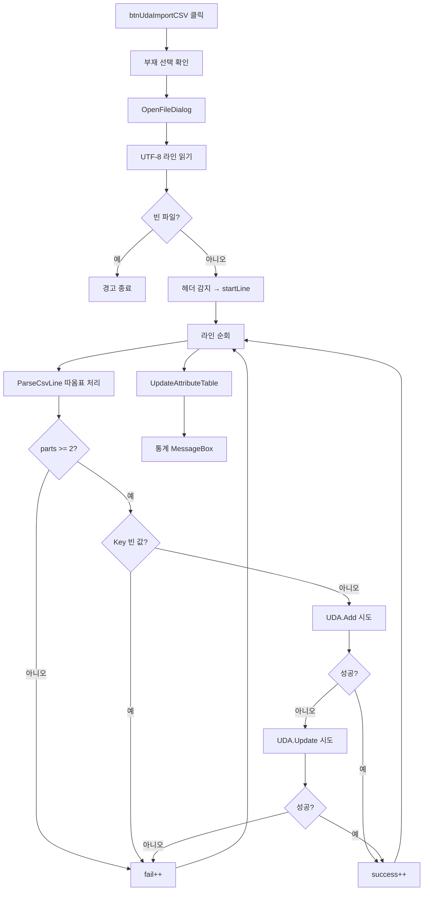

# UDA CSV 일괄 가져오기

## 1. 개요
CSV 파일(Key,Value 형식)을 읽어 선택된 부재에 UDA를 일괄 Add/Update한다. 헤더 행 자동 감지 + 따옴표 처리 + 성공/실패 통계.

## 2. 트리거
| 항목 | 값 |
|---|---|
| 유형 | User Action |
| 입력 | `btnUdaImportCSV` 클릭 |
| 위치 | 메인 폼 > 부재 정보 탭 |

## 3. 사전 조건
- [ ] 부재 선택됨 (`selectedAttributeNodeIndex >= 0`)
- [ ] 유효한 CSV 파일 (UTF-8)

## 4. 전체 동작 흐름 (Happy Path)

| # | 단계 | 주체 | 설명 |
|---|---|---|---|
| 1 | 선택 확인 | Form1 | → [E01] |
| 2 | 파일 선택 | UI | `OpenFileDialog` CSV 필터 |
| 3 | 라인 읽기 | Form1 | `File.ReadAllLines(path, UTF-8)` |
| 4 | 빈 검증 | Form1 | → [E02] |
| 5 | 헤더 감지 | Form1 | 첫 줄에 "key"/"value"/"속성" 포함 → `startLine=1` |
| 6 | 라인 순회 | Form1 | `startLine..Length` |
| 7 | 공백 라인 건너뜀 | Form1 | `Trim()` == "" |
| 8 | CSV 파싱 | Form1 | `ParseCsvLine(line)` — 쉼표 + 따옴표 상태 관리 |
| 9 | 컬럼 검증 | Form1 | `parts.Length < 2` → fail |
| 10 | Key 검증 | Form1 | 빈 키 → fail |
| 11 | Add 시도 | SDK | `UDA.Add(node, key, value, true)` |
| 12 | Fallback Update | SDK | Add 실패 시 `UDA.Update` 시도 |
| 13 | 테이블 갱신 | Form1 | `UpdateAttributeTable` |
| 14 | 결과 통계 | UI | MessageBox 성공/실패 + 오류 샘플 10개 |

## 5. 주요 분기 처리

### [분기 A] 헤더 인식
| 조건 | 처리 |
|---|---|
| 첫 줄에 "key"/"value"/"속성" 포함 | 건너뜀 (startLine=1) |
| 아님 | 첫 줄부터 데이터로 간주 |

### [분기 B] Add/Update Fallback
| 단계 | 결과 |
|---|---|
| Add 성공 | `successCount++` |
| Add 실패 + Update 성공 | `successCount++` (이미 존재하는 키) |
| 둘 다 실패 | `failCount++`, 오류 메시지 기록 |

## 6. 예외 / 에러 처리
| ID | 조건 | 동작 | 사용자 피드백 | 결과 상태 |
|---|---|---|---|---|
| E01 | 부재 미선택 | return | MessageBox "부재를 먼저 선택하세요." | 변화 없음 |
| E02 | 빈 CSV | return | MessageBox "CSV 파일이 비어있습니다." | 변화 없음 |
| E03 | 특정 라인 실패 | 계속 | `errors` 리스트에 추가 | 부분 반영 (성공한 라인만) |
| E04 | 파일 읽기 예외 | catch | MessageBox "CSV 파일 읽기 오류: {msg}" | 변화 없음 |

## 7. 상태 변화
| 대상 | Before | After |
|---|---|---|
| SDK UDA(node) | 이전 | CSV 라인만큼 Add/Update |
| `dgvAttributes` | 이전 | 갱신됨 |

## 8. 후행 기능 (Chained)
- [속성 CSV 내보내기](./CSV 내보내기.md) — 백업/공유

## 9. 관련 링크
- 코드 구현: [Form1.Attribute.cs:L485](../../code-reference/form1-attribute.md#btnUdaImportCSV_Click), [ParseCsvLine](../../code-reference/form1-attribute.md#ParseCsvLine)

## 10. 변경 이력
| 날짜 | 변경 내용 | 작성자 |
|---|---|---|
| 2026-04-13 | 초안 작성 | — |
