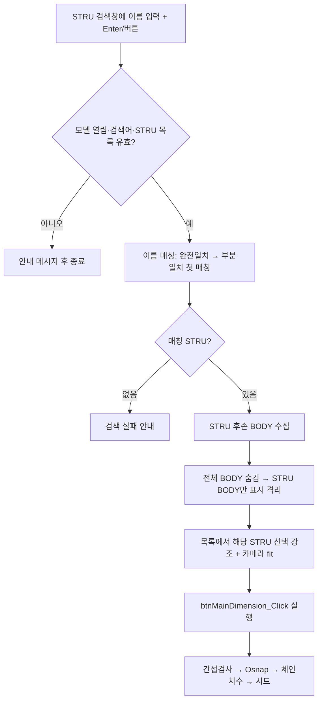

# STRU 검색 치수 추출

## 1. 개요

STRU 목록 하단의 검색 입력창에 STRU 이름을 입력하고 Enter(또는 "치수 추출" 버튼)를 누르면, 해당 STRU를 찾아 그 STRU의 BODY만 남기고 격리한 뒤 기존 치수 추출 파이프라인(`btnMainDimension_Click`)을 실행한다. STRU 목록에서 일일이 찾아 선택·격리하는 단계를 생략한다. (Issue #36)

검색창은 코드로 생성해 `groupBoxStru` 하단(Dock=Bottom)에 붙이며(Designer 미사용), 자동완성 소스는 STRU 목록(`PopulateStruCheckList`)과 함께 갱신한다.

## 2. 흐름

## 3. 상태 변화

- 가시성: 전체 BODY 숨김 후 검색된 STRU의 BODY만 표시 (격리 유지 — 이후 "전체 보기"로 복원)
- `clbStruList.SelectedIndex`: 매칭된 STRU로 설정 (선택 핸들러가 show+fit)
- `txtStruSearch.AutoCompleteCustomSource`: STRU 목록 갱신 시 함께 채워짐
- 이후 `btnMainDimension_Click` 경로가 `bomList`·`chainDimensionList`·`drawingSheetList` 등을 그 STRU 기준으로 갱신

## 4. 관련 링크

- 재사용 엔진: 메인 치수 추출(`btnMainDimension_Click`, `Form1.BOM.cs`) — 현재 보이는 부재 기준 간섭검사→Osnap→체인치수→시트
- [현재 뷰 기반 체인 치수 추출](./현재%20뷰%20기반%20체인%20치수%20추출.md)
- Issue #36 (STRU 이름 입력 → 즉시 치수 추출 입력창)

## 5. 변경 이력

| 날짜 | 변경 내용 | 작성자 |
|---|---|---|
| 2026-07-23 | STRU 이름 검색 → 격리 → 치수 추출 입력창 신설 (#36) | Claude |
