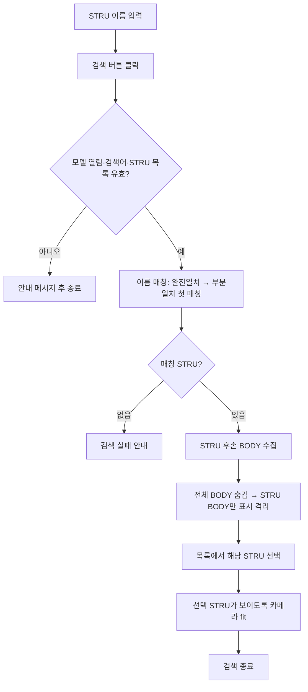

# STRU 검색

## 1. 개요

STRU 목록 하단의 검색 입력창에 STRU 이름을 입력하고 **"검색" 버튼을 클릭하면** 해당 STRU의 BODY만 남겨 격리하고, 목록 선택과 카메라 맞춤까지 수행한다. Enter 입력만으로는 검색하지 않으며, 검색 뒤 치수 추출도 자동 실행하지 않는다.

치수 추출은 사용자가 기존 **"치수 추출"** 기능을 별도로 실행한다. 검색된 STRU의 격리 상태가 유지되므로 이후 치수 추출을 실행하면 현재 보이는 STRU가 대상이 된다.

검색창은 코드로 생성해 `groupBoxStru` 하단(`Dock=Bottom`)에 붙이며(Designer 미사용), 자동완성 소스는 STRU 목록(`PopulateStruCheckList`)과 함께 갱신한다. 검색창을 STRU 목록 위로 이동하는 UI 변경은 이 기능 범위에 포함하지 않는다.

## 2. 흐름

## 3. 상태 변화

- 가시성: 전체 BODY 숨김 후 검색된 STRU의 BODY만 표시 (격리 유지 — 이후 "전체 보기"로 복원)
- `clbStruList.SelectedIndex`: 매칭된 STRU로 설정하고 선택 핸들러가 show+fit
- 같은 STRU를 다시 검색해 선택 변경 이벤트가 발생하지 않을 때는 `PerformFlyToSelectedStru`를 직접 호출해 카메라 fit 보장
- `txtStruSearch.AutoCompleteCustomSource`: STRU 목록 갱신 시 함께 채워짐
- Enter 키: 검색 이벤트를 연결하지 않으므로 입력만으로 검색하지 않음
- 검색만으로 `bomList`·`chainDimensionList`·`drawingSheetList`를 갱신하지 않음
- 치수 추출: 검색과 분리되어 있으며 사용자가 기존 치수 추출 기능을 별도로 실행

## 4. 관련 링크

- 별도 실행 기능: 메인 치수 추출(`btnMainDimension_Click`, `Form1.BOM.cs`) — 현재 보이는 부재 기준 간섭검사→Osnap→체인치수→시트
- [현재 뷰 기반 체인 치수 추출](./현재%20뷰%20기반%20체인%20치수%20추출.md)
- Issue #36 (STRU 이름 입력창 최초 구현)
- Issue #48 (검색 버튼 전용 실행 및 치수 추출 분리)

## 5. 변경 이력

| 날짜 | 변경 내용 | 작성자 |
|---|---|---|
| 2026-07-24 | Enter 자동 실행과 검색 후 치수 추출을 제거하고 "검색" 버튼 전용 격리·선택·fit으로 분리 (#48) | Codex |
| 2026-07-23 | STRU 이름 검색 → 격리 → 치수 추출 입력창 신설 (#36) | Claude |
