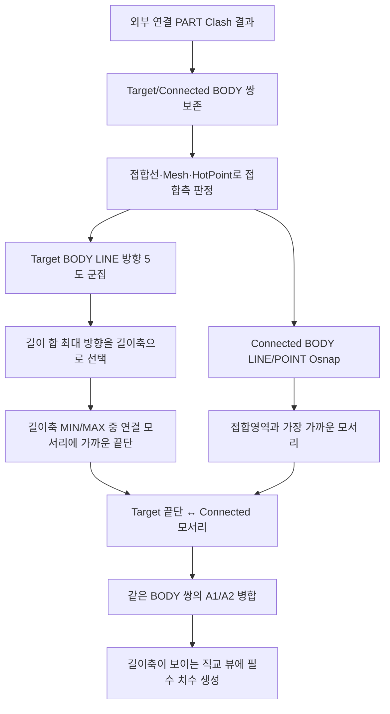

# 설치도 Part 끝단-모서리 위치 치수

## 1. 개요

설치도는 선택한 STRU 전체를 실선으로, 그 STRU에 직접 연결된 외부 Part만 점선으로 표시한다. Assembly 정보는 ISO 이름 문맥으로만 사용한다. 설치 위치의 필수 치수는 다음 두 실제 형상점을 잇는다.

- 기준 STRU측 실제 접촉 Body의 길이축 가까운 끝단 Osnap
- 외부 연결 Body에서 실제 접합영역에 가장 가까운 모서리 Osnap

접합선·접합 Mesh·HotPoint는 두 Body와 접합측 모서리를 판정하는 내부 자료로만 사용한다. 접합 중심이나 A1/A2는 치수 끝점 또는 직교 뷰 기호로 표시하지 않는다. `CIRCLE` Osnap은 설치 위치 기준에서 제외한다.

## 2. 데이터 준비 흐름

| 단계 | 처리 |
|---|---|
| 연결 후보 | `fabricationNeighborClashList`의 선택 STRU Part ↔ 외부 Part 쌍만 사용 |
| BODY 탐색 | Part 하위 BODY를 구하고 BBox가 실제로 맞닿는 조합만 정밀 조회 |
| 실제 접합 | `GeometryUtility.GetObjectCollisionLine`·`GetJunctionMesh`로 접합측을 특정하되 중심은 출력하지 않음 |
| 길이축 | Target Body LINE 방향을 ±동일·5도 이내로 묶고 선 길이 합이 가장 큰 방향 사용 |
| 기준 끝단 | Target Body Osnap을 길이축에 투영한 MIN/MAX 중 연결 모서리에 가까운 쪽. 같은 끝단면에서는 연결 모서리와 수직거리가 가까운 점 선택 |
| 연결 모서리 | Connected Body LINE/POINT Osnap 중 접합영역까지 최소 3D 거리가 가장 짧은 점. 동률은 기준 끝단과 가까운 점 선택 |
| 영역 병합 | 같은 Target Body ↔ Connected Body의 여러 접합영역은 위치 치수 하나로 통합 |
| fallback | LINE/POINT가 없을 때만 해당 Body BBox 끝단·모서리를 사용하고 `[설치위치]` 로그에 기록 |

## 3. 뷰별 축 기준

| 뷰 | 화면 평면 | 주축 | 보조축 | 표시 치수 |
|---|---|---|---|---|
| X 보기 | YZ | Z | Y | 길이축이 Z 또는 Y이면 끝단↔모서리 위치 치수 |
| Y 보기 | XZ | Z | X | 길이축이 Z 또는 X이면 끝단↔모서리 위치 치수 |
| Z 보기(평면도) | XY | Y | X | 길이축이 Y 또는 X이면 끝단↔모서리 위치 치수 |

선택 STRU 전체 범위 치수는 생성하지 않는다. 위치 치수는 Target Body 길이축과 가장 가까운 전역 X/Y/Z축을 사용하며 그 축이 화면에 보이는 두 직교 뷰에만 생성한다. 0.5mm 이하이거나 깊이 방향으로만 차이가 나는 뷰에는 표시하지 않는다.

## 4. 표시 규칙

- 직접 연결 Part는 이름 순으로 `A`, `B`, `C`를 부여한다.
- 같은 Part의 여러 접합영역은 A1/A2로 나누지 않고 동일 라벨·동일 Body 쌍 위치 치수로 병합한다.
- ISO에는 `A. Assembly 이름 / Part 이름`을 선택된 연결 Part 모서리에 한 번만 표시한다.
- X/Y/Z에는 접합점 기호를 표시하지 않고 실제 끝단↔모서리 치수만 표시한다.
- 설치 치수는 `IsRequired=true`로 스마트 치수 필터의 개수 제한·겹침 제거보다 우선한다.
- 2D/PDF는 모델·점선 CropFit·Match가 끝난 뒤 `GetObjectScale`로 얻은 실제 배율을 `ShowAllDimensions`에 전달한다. 보조선 오프셋과 시작 gap은 이 배율로 종이 mm를 역산하므로 뷰별 모델 크기와 무관하게 같은 도면 길이를 사용한다.
- 설치도 치수 baseline과 배율 기준 BBox는 외부 연결 Part 전체가 아니라 선택 STRU `MemberIndices`로 고정한다.

## 5. 예외와 fallback

| 조건 | 처리 |
|---|---|
| 설치 시트와 Clash 검사 대상 BODY가 다름 | 오래된 연결 결과를 사용하지 않고 로그 후 연결 표시 생략 |
| Target BODY LINE Osnap 없음 | Target Body BBox 최장축과 끝단으로 fallback |
| Connected BODY LINE/POINT Osnap 없음 | Connected Body BBox 접합측 모서리로 fallback |
| 실제 접합선·Mesh 없음 | Clash HotPoint는 접합측 모서리 선별 자료로만 사용 |
| 외부 연결 Part 없음 | 선택 STRU만 표시하고 설치 위치 치수는 생성하지 않음 |

## 6. 상태 변화

| 대상 | 결과 |
|---|---|
| `DrawingSheetData.InstallationConnections` | BODY 쌍, Assembly/Part 이름, 내부 접합영역 점, 연결 Part 단위 A/B/C 라벨 저장 |
| `DrawingSheetData.InstallationContextIndices` | 점선으로 표시할 직접 연결 외부 Part 인덱스 저장 |
| `PreparedDimensions` | Target Body 끝단→Connected Body 모서리 필수 치수만 저장 |
| `chainDimensionList`, `lvDimension` | 설치 시트 선택 시 준비 치수를 그대로 적용 |

## 7. 관련 링크

- [도면 시트 자동 생성](../도면시트/시트 자동 생성.md)
- [선택 시트 2D 도면 생성](../도면시트/시트 2D 렌더.md)
- [Osnap 선별 기준](../../표현-로직-장표/Osnap-선별기준.html)
- [Form1.GlobalViews.cs 코드 레퍼런스](../../code-reference/form1-global-views.md#ExtractInstallationDimensions)

## 8. 변경 이력

| 날짜 | 변경 내용 | 작성자 |
|---|---|---|
| 2026-07-23 | 선택 STRU 전체 범위 치수를 제거하고 실제 연결 거리만 유지. 설치도 2D는 최종 모델 배치 후 실측 배율로 치수·보조선을 생성해 뷰별 종이 길이 편차 제거 | Codex |
| 2026-07-22 | 접합 중심·A1/A2 체인을 폐기하고 실제 접촉 Target Body의 가까운 끝단→Connected Body 접합측 모서리 위치 치수로 교체. 같은 Body 쌍 영역 병합, ISO Part당 이름 1개, 직교 뷰 접합 기호 제거 | Codex |
| 2026-07-22 | 설치도 점선 대상을 연결 Assembly 전체에서 직접 연결 Part로 축소하고, 연결 Assembly 전체 범위 치수를 제거. 선택 STRU 전체 범위와 연결 Part 끝단↔접합 영역 체인만 유지 | Codex |
| 2026-07-21 | 설치도를 BBox 경계 체인에서 선택 STRU·연결 Assembly 전체 Osnap 범위 + 실제 BODY 접합선/Mesh 영역 치수로 교체. 다중 접합 영역 A1/A2 분리, LINE/POINT 전용, 근접 HotPoint fallback 추가 | Codex |
| 2026-04-13 | 초안 작성 | — |
