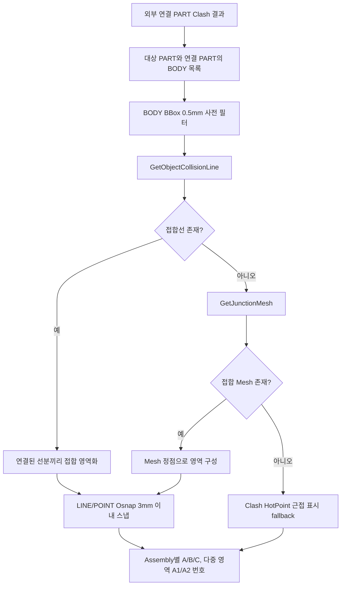

# 설치도 연결 영역 Osnap 치수

## 1. 개요

설치도는 선택한 STRU 전체와 그 STRU에 직접 연결된 외부 Assembly 전체를 함께 표시한다. 치수는 단순 BBox 경계가 아니라 다음 두 기준을 결합한다.

- 선택 STRU 및 연결 Assembly 각각의 `LINE` 시작·끝점과 `POINT` 중심 Osnap에서 주축·보조축 MIN/MAX를 선택한다.
- Clash로 좁힌 Part 쌍의 하위 BODY 조합에서 실제 접합선 또는 접합 Mesh를 구하고, 그 영역의 양 끝을 가까운 Osnap에 스냅한다.

`CIRCLE` Osnap은 설치 위치 치수에서 제외한다.

## 2. 데이터 준비 흐름

| 단계 | 처리 |
|---|---|
| 연결 후보 | `fabricationNeighborClashList`의 선택 STRU Part ↔ 외부 Part 쌍만 사용 |
| BODY 탐색 | Part 하위 BODY를 구하고 BBox가 실제로 맞닿는 조합만 정밀 조회 |
| 실제 접합 | `GeometryUtility.GetObjectCollisionLine(bodyA, bodyB)`의 모든 Start/End 사용 |
| 면접촉 보강 | 접합선이 없으면 `GetJunctionMesh(bodyA, bodyB, false)` 사용 |
| 영역 분리 | 선분 끝점이 1mm 이내로 이어진 것만 같은 영역으로 묶음. 떨어진 영역은 별도 항목 |
| Osnap 보정 | 접합 영역 점을 BODY의 LINE/POINT Osnap에 3mm 이내이면 스냅 |
| 근접 fallback | Clearance/Proximity처럼 실제 접합 형상이 없을 때만 HotPoint 1점을 사용하고 로그 기록 |

## 3. 뷰별 축 기준

| 뷰 | 화면 평면 | 주축 | 보조축 | 표시 치수 |
|---|---|---|---|---|
| X 보기 | YZ | Z | Y | 각 Assembly의 Z/Y 전체 범위 + 연결 Part 끝단↔접합 영역 체인 |
| Y 보기 | XZ | Z | X | 각 Assembly의 Z/X 전체 범위 + 연결 Part 끝단↔접합 영역 체인 |
| Z 보기(평면도) | XY | Y | X | 각 Assembly의 Y/X 전체 범위 + 연결 Part 끝단↔접합 영역 체인 |

각 접합 영역의 축별 체인은 `연결 Part MIN → 접합 시작 → 접합 끝 → 연결 Part MAX`를 정렬한 뒤, 서로 다른 인접점 사이의 거리로 만든다. 한 뷰에서 접합선이 점으로 겹쳐 보이면 접합 시작·끝이 병합되고 Part 끝단에서 그 접합점까지의 위치 치수만 남는다.

## 4. 표시 규칙

- 연결 Assembly는 이름 순으로 `A`, `B`, `C`를 부여한다.
- 같은 Assembly에 공간적으로 분리된 접합 영역이 둘 이상이면 `A1`, `A2`처럼 분리한다.
- ISO에는 `A. Assembly 이름 / Part 이름`을 실제 접합 중심에 지시선으로 표시한다.
- X/Y/Z에는 접합 위치에 `A`, `A1` 같은 짧은 기호를 표시하고 같은 기호의 치수를 연결한다.
- 설치 치수는 `IsRequired=true`로 스마트 치수 필터의 개수 제한·겹침 제거보다 우선한다.

## 5. 예외와 fallback

| 조건 | 처리 |
|---|---|
| 설치 시트와 Clash 검사 대상 BODY가 다름 | 오래된 연결 결과를 사용하지 않고 로그 후 연결 표시 생략 |
| BODY Osnap 없음 | 해당 전체 범위만 BBox 꼭짓점으로 fallback하고 로그 기록 |
| 실제 접합선·Mesh 없음 | Clash HotPoint를 근접점으로만 표시. 실제 접촉 영역으로 간주하지 않음 |
| 외부 연결 Assembly 없음 | 선택 STRU만 표시하고 설치 치수는 STRU 전체 범위만 생성 |

## 6. 상태 변화

| 대상 | 결과 |
|---|---|
| `DrawingSheetData.InstallationConnections` | BODY 쌍, Assembly/Part 이름, 영역 점, A/A1 라벨 저장 |
| `DrawingSheetData.InstallationContextIndices` | 직접 연결된 외부 Assembly 인덱스 저장 |
| `PreparedDimensions` | STRU/Assembly 전체 범위와 접합 위치 필수 치수 저장 |
| `chainDimensionList`, `lvDimension` | 설치 시트 선택 시 준비 치수를 그대로 적용 |

## 7. 관련 링크

- [도면 시트 자동 생성](../도면시트/시트 자동 생성.md)
- [선택 시트 2D 도면 생성](../도면시트/시트 2D 렌더.md)
- [Osnap 선별 기준](../../표현-로직-장표/Osnap-선별기준.html)
- [Form1.GlobalViews.cs 코드 레퍼런스](../../code-reference/form1-global-views.md#ExtractInstallationDimensions)

## 8. 변경 이력

| 날짜 | 변경 내용 | 작성자 |
|---|---|---|
| 2026-07-21 | 설치도를 BBox 경계 체인에서 선택 STRU·연결 Assembly 전체 Osnap 범위 + 실제 BODY 접합선/Mesh 영역 치수로 교체. 다중 접합 영역 A1/A2 분리, LINE/POINT 전용, 근접 HotPoint fallback 추가 | Codex |
| 2026-04-13 | 초안 작성 | — |
