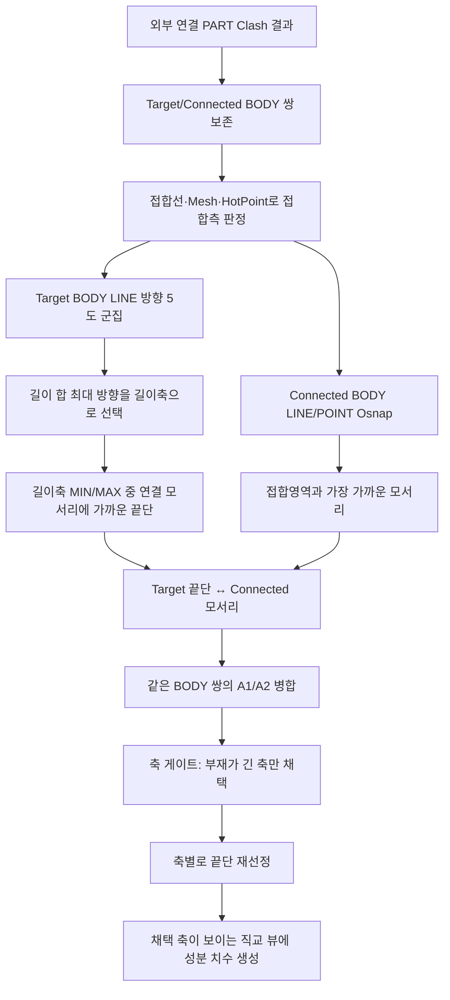

# 설치도 Part 끝단-모서리 위치 치수

## 1. 개요

설치도는 선택한 STRU 전체를 실선으로, 그 STRU에 직접 연결된 외부 Part만 점선으로 표시한다. Assembly 정보는 ISO 이름 문맥으로만 사용한다. 설치 위치의 필수 치수는 다음 두 실제 형상점을 잇는다.

- 기준 STRU측 실제 접촉 Body의 길이축 가까운 끝단 Osnap
- 외부 연결 Body에서 실제 접합영역에 가장 가까운 모서리 Osnap

접합선·접합 Mesh·HotPoint는 두 Body와 접합측 모서리를 판정하는 내부 자료로만 사용한다. 접합 중심이나 A1/A2는 치수 끝점 또는 직교 뷰 기호로 표시하지 않는다. `CIRCLE` Osnap은 설치 위치 기준에서 제외한다.

## 2. 데이터 준비 흐름

| 단계 | 처리 |
|---|---|
| 연결 후보 | `fabricationNeighborClashList`의 선택 STRU Part ↔ 외부 Part 쌍만 사용 |
| BODY 탐색 | Part 하위 BODY를 구하고 BBox가 실제로 맞닿는 조합만 정밀 조회 |
| 실제 접합 | `GeometryUtility.GetObjectCollisionLine`·`GetJunctionMesh`로 접합측을 특정하되 중심은 출력하지 않음 |
| 길이축 | Target Body LINE 방향을 ±동일·5도 이내로 묶고 선 길이 합이 가장 큰 방향 사용 |
| 기준 끝단 | Target Body Osnap을 길이축에 투영한 MIN/MAX 중 연결 모서리에 가까운 쪽. 같은 끝단면에서는 연결 모서리와 수직거리가 가까운 점 선택 |
| 연결 모서리 | Connected Body LINE/POINT Osnap 중 접합영역까지 최소 3D 거리가 가장 짧은 점. 동률은 기준 끝단과 가까운 점 선택 |
| 영역 병합 | 같은 Target Body ↔ Connected Body의 여러 접합영역은 위치 치수 하나로 통합 |
| fallback | LINE/POINT가 없을 때만 해당 Body BBox 끝단·모서리를 사용하고 `[설치위치]` 로그에 기록 |

## 3. 접합 형태 기반 축 선택과 뷰별 표시

설치도 위치 치수의 목적은 **연결부재가 기준부재의 어느 위치에 붙는지** 보여주는 것이다. **[2026-07-23 재설계]** 크기 임계값(비율·최소치·상한)을 모두 없애고, 실제 **접합선(`GetObjectCollisionLine`)** 기하만으로 결정한다. 접합선은 두 부재가 물리적으로 맞닿는 교선이라 정의상 기준부재 표면 위에 있어, 위치가 항상 부재 범위 안이다 → 도면 이탈이 구조적으로 불가능 → 임계값이 필요 없다.

**위치 기준 = 접합측 모서리** (`BuildInstallationPlacementAnchor`): 위치를 연결부재 osnap이 아니라 접합선까지 잰다. 접합점 자체가 기준부재 위라 위치가 부재를 벗어날 수 없다(옛 osnap 방식은 큰 연결부재면 부재 밖 950까지 잡혀 도면 이탈 → 1.25배 상한으로 막던 것 폐기). 접합이 그 축으로 **구간**일 때(예: 100mm 걸쳐 붙음) 한가운데(centroid)까지 재면 의미가 없으므로, 접합 구간의 양 끝 중 **부재 끝단에 가까운 쪽 = 연결부재가 닿기 시작하는 모서리**(`ConnectionCoord`)까지 잰다. 이로써 실기 검증값(막대 30·판재 29)이 복원된다. (끝단·덮음 판정은 접합 centroid로, 실제 치수 끝점은 접합 모서리로 분리.)

**축 선택 = 접합 덮음(coverage)**: 각 축에서 `coverage = 접합 extent / 부재 extent`를 재고,
- `coverage ≥ InstallationContactCrossCoverage(0.5)` → 연결부재가 그 축으로 부재를 **가로지름(관통)** → 특정 위치가 없음(전체에 걸침) → 치수 생략.
- `coverage < 0.5` → 한 지점에 **국소적**으로 붙음 → 위치 치수 표시.

즉 "부재가 얼마나 긴가"(임의 크기)가 아니라 "연결부재가 그 축에서 한 점에 붙나, 전체를 가로지르나"(기하학적 사실)로 판정한다. 파이프가 막대 50mm 단면을 100% 가로지르면 그 축은 생략되고, 막대 길이 30 지점에 국소적으로 붙은 길이축만 남는다. 판재는 길이·폭 둘 다 국소적이라 둘 다 나오고, 두께 축은 접합이 면 전체를 덮어(coverage≈1) 생략된다. 채택 축마다 그 축 기준으로 끝단을 재선정한다(`SelectInstallationTargetEndForAxis`). `[설치치수축]` 로그에 부재·접합 extent, 각 축 덮음%, 위치축/가로지름제외를 남긴다.

**성분 축정렬 투영** (`ComputeInstallationDimensions`): 각 성분 치수 끝점을 그 축으로만 벌어지게 투영한다(나머지 두 좌표는 기준 끝단 공유). 투영을 안 하면 보조선이 부재를 가로질러 큰 공백이 생긴다.

**뷰 배정** (`viewAxes`): 각 성분을 그 축이 **화면 평면에 있는**(=화면에 실제 길이로 보이는) 직교 뷰에만 배정한다 — X 성분은 -Y·평면도, Z 성분은 -X·-Y 등. 그 축을 정면으로 마주보는 뷰(X 성분 ↔ -X 뷰)는 축이 깊이 방향이라 치수의 두 끝점이 화면상 겹쳐 **보조선이 하나로 합쳐지고 치수가 뭉개진다**(2026-07-23 실기 PDF로 확인). 그래서 그 뷰에는 배정하지 않는다.

> ⚠ **-X 뷰에 형강 길이 치수는 넣을 수 없다**: -X·-Y가 화면상 둘 다 형강을 길게 보여줘도, 실은 형강을 90° 돌려 본 것이라 -Y는 길이가 좌우(화면 평면)로 보이고 -X는 길이가 화면 속(깊이)으로 들어간다. "형강 끝→Tray" 거리는 길이 방향 치수라 -Y·평면도에만 나오고 -X에는 물리적으로 못 그린다. (세 뷰 모두 배정을 시도했다 -X에서 겹친 보조선으로 잘못 그려져 폐기 — 2026-07-23.)

성분이 `InstallationMinComponent(3mm)` 이하(끝단에 사실상 붙은 위치)면 그리지 않는다. 이 3mm와 접합 덮음 0.5만 남은 상수이며, 둘 다 크기 튜닝값이 아니라 "거의 0인가 / 절반 넘게 덮나"라는 자연 분기점이다.

## 4. 표시 규칙

- 직접 연결 Part는 이름 순으로 `A`, `B`, `C`를 부여한다.
- 같은 Part의 여러 접합영역은 A1/A2로 나누지 않고 동일 라벨·동일 Body 쌍 위치 치수로 병합한다.
- ISO에는 `A. Assembly 이름 / Part 이름`을 선택된 연결 Part 모서리에 한 번만 표시한다.
- X/Y/Z에는 접합점 기호를 표시하지 않고 실제 끝단↔모서리 치수만 표시한다.
- 설치 치수는 `IsRequired=true`로 스마트 치수 필터의 개수 제한·겹침 제거보다 우선한다.
- 2D/PDF는 모델·점선 CropFit·Match가 끝난 뒤 `GetObjectScale`로 얻은 실제 배율을 `ShowAllDimensions`에 전달한다. 보조선 오프셋과 시작 gap은 이 배율로 종이 mm를 역산하므로 뷰별 모델 크기와 무관하게 같은 도면 길이를 사용한다.
- 2D/PDF는 `keepCamera: true`로 **캡처 시점 카메라를 유지한 채** 측정·보조선을 만든다 (2026-07-23). 템플릿 캡처는 MINUS 카메라인데 `ShowAllDimensions` 기본 동작이 PLUS로 카메라를 옮기면 이후 2D 변환이 모델 캡처와 좌우 거울 반전으로 어긋나 치수가 모델 반대편(부재 관통 쪽)에 찍힌다.
- 배율 기준 BBox는 외부 연결 Part 전체가 아니라 선택 STRU `MemberIndices`로 고정한다. 치수선 위치(baseline)는 STRU BBox와 치수 끝점의 **합집합** 바깥에 놓는다 (2026-07-23) — 연결 모서리가 STRU BBox 밖에 있을 때 치수선이 두 끝점 사이에 놓여 모서리 쪽 보조선이 치수선을 지나쳐 그려지던 문제 방지.

## 5. 예외와 fallback

| 조건 | 처리 |
|---|---|
| 설치 시트와 Clash 검사 대상 BODY가 다름 | 오래된 연결 결과를 사용하지 않고 로그 후 연결 표시 생략 |
| Target BODY LINE Osnap 없음 | Target Body BBox 최장축과 끝단으로 fallback |
| Connected BODY LINE/POINT Osnap 없음 | Connected Body BBox 접합측 모서리로 fallback |
| 실제 접합선·Mesh 없음 | Clash HotPoint는 접합측 모서리 선별 자료로만 사용 |
| 외부 연결 Part 없음 | 선택 STRU만 표시하고 설치 위치 치수는 생성하지 않음 |

## 6. 상태 변화

| 대상 | 결과 |
|---|---|
| `DrawingSheetData.InstallationConnections` | BODY 쌍, Assembly/Part 이름, 내부 접합영역 점, 연결 Part 단위 A/B/C 라벨 저장 |
| `DrawingSheetData.InstallationContextIndices` | 점선으로 표시할 직접 연결 외부 Part 인덱스 저장 |
| `PreparedDimensions` | 채택된 긴 축마다 Target Body 축별 끝단→Connected Body 모서리 성분 치수만 저장 |
| `InstallationPlacementAnchor.AxisComponents` | 축 게이트가 채택한 축과 축별 재선정 끝단 목록 (주축 성분 + 폭 방향 등) |
| `chainDimensionList`, `lvDimension` | 설치 시트 선택 시 준비 치수를 그대로 적용 |

## 7. 관련 링크

- [도면 시트 자동 생성](../도면시트/시트%20자동%20생성.md)
- [선택 시트 2D 도면 생성](../도면시트/시트%202D%20렌더.md)
- [Osnap 선별 기준 (장표)](../../장표/11-룰북-Osnap.html)
- [Form1.GlobalViews.cs 코드 레퍼런스](../../code-reference/form1-global-views.md#ExtractInstallationDimensions)

## 8. 변경 이력

| 날짜 | 변경 내용 | 작성자 |
|---|---|---|
| 2026-07-23 | (세 뷰 배정 시도 → 폐기) 위치 치수를 세 뷰 모두 배정했더니 -X 뷰에서 형강 길이축(X)이 깊이 방향이라 보조선이 겹쳐 치수가 뭉개짐(실기 PDF). 2뷰 배정으로 복원 — 길이 치수는 길이가 화면에 보이는 -Y·평면도에만, -X(끝면 방향)엔 물리적으로 불가 | Claude |
| 2026-07-23 | **접합측 모서리 위치**(issue #12 실기): 접합이 구간(예: 100mm)일 때 한가운데(centroid)까지 재서 의미 없던 것(79·81)을, 접합 구간 양 끝 중 부재 끝단에 가까운 모서리(`ConnectionCoord`)까지로 — 실기값 29·31 복원. 끝단·덮음 판정은 centroid, 치수 끝점은 모서리로 분리 | Claude |
| 2026-07-23 | **접합 기하 기반 재설계**(issue #12): 크기 임계값 3개(비율 0.25·최소 30mm·상한 1.25) 전면 폐기. ① 위치 기준을 연결부재 osnap → 접합선 대표점(기준부재 위)으로 바꿔 위치가 부재를 벗어나는 것을 구조적으로 차단(상한 불필요). ② 축 선택을 크기 대신 접합 덮음(coverage=접합/부재 extent, 0.5 기준)으로 — 관통 축 생략·국소 축 표시. 남은 상수는 3mm(거의 0)·0.5(절반)뿐이며 크기 튜닝값 아님 | Claude |
| 2026-07-23 | (폐기됨) **성분 상한 도입** 실기 3차: 성분값이 부재 extent×1.25 초과 시 제외 — 같은 날 접합 기하 재설계로 대체. 임계값 방식이라 예외 소지 있다는 피드백 반영 | Claude |
| 2026-07-23 | **실기 피드백 2건**(issue #12): ① 성분 끝점을 그 축으로만 벌어지게 투영 — 두 점이 여러 축에서 벌어져(예: X 147·Z 30) 보조선이 부재를 가로지르고 큰 공백이 생기던 것 해소. ② 축 게이트 ratio 0.15→0.25 — 50×50×320 막대의 50mm 단면축이 통과해 연결부재 옆거리(147)가 잡히던 것 배제(막대는 길이축만, 판형은 폭 유지) | Claude |
| 2026-07-23 | **축 게이트 도입** (issue #12): 위치 치수를 부재가 유의미하게 긴 축(extent ≥ 최대×비율 且 ≥30mm, 주축 무조건)에만 생성. 채택 축마다 끝단 재선정(`SelectInstallationTargetEndForAxis`). 판 두께·법선 축을 배제해 겹쳐 보이던 1mm 어셈블리 틈 치수·불필요 수평 성분 제거, 판형 부재 평면도 폭 방향 위치 치수는 유지. 미소 성분 가드 0.5→3mm. 직전 3축 무조건 생성을 대체 | Claude |
| 2026-07-23 | (대체됨) 직교 뷰 치수를 주축 1성분에서 끝단↔모서리 X/Y/Z 3축 성분으로 확장 — 1mm 틈까지 치수화되는 과잉으로 같은 날 축 게이트로 교체. 2D 변환 시 캡처 카메라 유지(`keepCamera`)로 좌우 거울 반전 수정, 치수선 baseline을 STRU BBox·치수 끝점 합집합으로 확장(오버슛 제거)한 부분은 유지 | Claude |
| 2026-07-23 | 선택 STRU 전체 범위 치수를 제거하고 실제 연결 거리만 유지. 설치도 2D는 최종 모델 배치 후 실측 배율로 치수·보조선을 생성해 뷰별 종이 길이 편차 제거 | Codex |
| 2026-07-22 | 접합 중심·A1/A2 체인을 폐기하고 실제 접촉 Target Body의 가까운 끝단→Connected Body 접합측 모서리 위치 치수로 교체. 같은 Body 쌍 영역 병합, ISO Part당 이름 1개, 직교 뷰 접합 기호 제거 | Codex |
| 2026-07-22 | 설치도 점선 대상을 연결 Assembly 전체에서 직접 연결 Part로 축소하고, 연결 Assembly 전체 범위 치수를 제거. 선택 STRU 전체 범위와 연결 Part 끝단↔접합 영역 체인만 유지 | Codex |
| 2026-07-21 | 설치도를 BBox 경계 체인에서 선택 STRU·연결 Assembly 전체 Osnap 범위 + 실제 BODY 접합선/Mesh 영역 치수로 교체. 다중 접합 영역 A1/A2 분리, LINE/POINT 전용, 근접 HotPoint fallback 추가 | Codex |
| 2026-04-13 | 초안 작성 | — |
