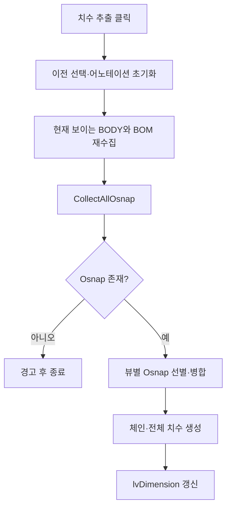

# 현재 뷰 기반 체인 치수 추출

## 1. 개요

치수 추출 버튼을 누르면 현재 3D 뷰에 보이는 BODY를 다시 수집하고, LINE 시작·끝점과 POINT 중심 Osnap으로 X/Y/Z 체인 치수를 만든다. 설치 시트의 자동 접합 위치 치수와는 별도 사용자 작업이다.

## 2. 흐름

## 3. 상태 변화

- `xraySelectedNodeIndices`: 현재 보이는 BODY와 관련 Part로 갱신
- `_lastCollectedNodeOsnapMap`: BODY별 Osnap 캐시 갱신
- `chainDimensionList`, `lvDimension`: 현재 가시 부재 기준 치수로 교체

## 4. 관련 링크

- [설치도 연결 영역 Osnap 치수](./설치도 치수 추출.md)
- [Form1.Dimensions.cs 코드 레퍼런스](../../code-reference/form1-dimensions.md#btnExtractDimension_Click)

## 5. 변경 이력

| 날짜 | 변경 내용 | 작성자 |
|---|---|---|
| 2026-07-21 | 설치도 자동 치수 문서와 현재 뷰 수동 치수 추출 문서를 분리 | Codex |
