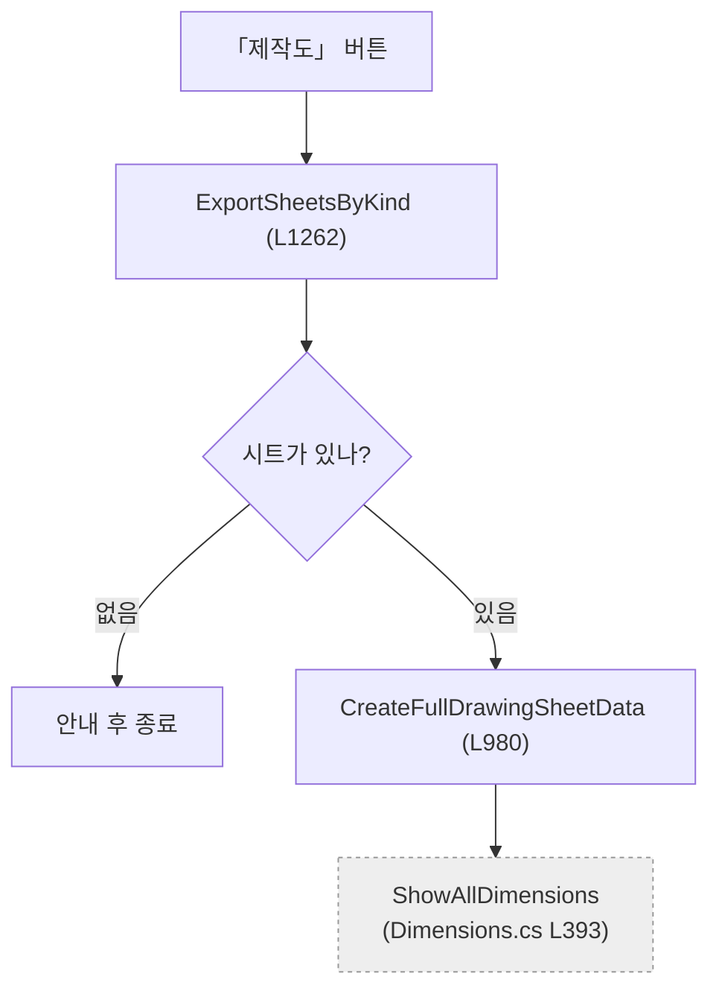

# Codex 작업지시 — 코드 정독 5개 파일

> 이 파일 하나만 읽고 시작하면 됩니다. 2026-08-22 작성.

---

# 0. 맥락 — 먼저 이것부터

## 이게 무슨 프로그램인가

**3D 구조 모델을 읽어서 2D 도면을 자동으로 만드는** Windows 데스크톱 프로그램입니다.
사람이 CAD에서 손으로 그리던 도면(제작도·조립도·설치도·가공도)을 버튼 몇 번으로 뽑는 것이 목표입니다.

전형적인 사용 흐름은 이렇습니다.

```
모델 파일 열기
   ↓
「치수 추출」 버튼 한 번  ──┐
   ↓                      │  이 안이 전부 자동
부재 목록(BOM) 수집        │
간섭 검사 → 연결성 판정     │
특징점(Osnap) 수집         │
체인 치수 계산             │
시트 자동 분할 (BFS)      ─┘
   ↓
시트별 2D 생성 → PDF 출력
```

**버튼 하나가 이 사슬 전체를 이어갑니다.** 그래서 어느 한 단계의 계산이 틀리면 뒤가 전부 틀립니다.
전체 흐름도는 `docs/_pipeline.md` 에 있습니다 (세부는 낡았으니 큰 그림만).

## 기술 구성

- **C# / .NET Framework / WinForms.** 창 하나, 탭 3개, 버튼 37개
- 3D는 전부 **VIZCore3D.NET** 이라는 외부 상용 SDK가 담당합니다 — 모델 로드, 노드 탐색, 간섭 검사, 2D 투영, PDF 출력
  - DLL은 `lib/`, **API 문서는 레포 루트 `VIZCore3D.NET.xml`**
- 🔑 **우리 코드는 "SDK를 어떤 순서로, 어떤 값으로 부를지" 를 정하는 층입니다.**
  도면 규칙·좌표 계산·배치 판단이 우리 몫이고, 실제 그리기는 SDK가 합니다.
  **SDK가 못 하는 일을 우회한 흔적이 코드 곳곳에 있습니다 — 그게 이번 정독의 핵심 관심사입니다.**

## 규모

**20,578줄** / `Form1.*.cs` 15개 파일 / **전부 하나의 `partial class Form1`**
개발자 한 명이 만들었고, 지금 그 사람이 자기 코드를 다시 읽는 중입니다.

## 왜 지금 정독하나

1. **문서가 낡아서 코드가 유일한 진실이 됐습니다.** 문서 75개 중 60개가 7월 이후 멈췄고,
   **화면에 없는 버튼을 설명하는 문서가 이미 8건** 확인됐습니다
2. **2026-08-27 코드 리뷰 발표**가 있습니다
3. 이후 리팩토링·기능 확장의 기준선이 필요합니다

## 발표에서 답해야 하는 질문 둘

| | |
|---|---|
| ① | 이 프로그램은 **어떤 구조**로 되어 있는가 |
| ② 🔴 | **왜 이만큼의 코드가 필요한가** |

②가 진짜 질문입니다. *"SDK API를 제대로 쓰면 1만 줄 이내로 될 일 아니냐"* 는 지적이 있었고,
실제로 도면 계열만 12,451줄입니다. **어디가 반드시 필요한 계산이고 어디가 군살인지 판정해야 합니다.**

## 🎯 그래서 목적은 이 셋입니다

| | |
|---|---|
| **플로우차트** | 버튼 → 무엇이 → 어떤 순서로 |
| **아키텍처** | 층 구조 · 의존 관계 · 경계 |
| **리팩토링 방안** | 다시 짠다면 무엇을 어디로 |

🔴 **버그 찾기가 아닙니다.** 오류가 보이면 적되 그건 부산물입니다.
**2절(플로우차트)** · **5절(알고리즘 — 지켜야 할 자산)** · **6절(다시 짠다면)** 이 문서의 본체입니다.

## 읽는 사람을 생각하세요

발표 청중은 이 코드를 모릅니다. 개발자가 아닐 수도 있습니다.

| ❌ 이렇게 쓰지 마세요 | ✅ 이렇게 쓰세요 |
|---|---|
| `DetectClash()`가 `Clash.AddClashTest()`를 호출한 뒤 이벤트를 대기한다 | 부재끼리 실제로 닿아 있는지 **SDK에 검사를 맡기고**, 결과가 돌아오면 "이 부재들이 한 덩어리인가"를 판정한다 |

**"무엇을 하면 무엇이 되는가"** 로 쓰고, 함수 이름은 근거로 괄호에 넣으세요.

## 협업 구조

Claude Code와 **병행**합니다. 같은 레포, 같은 작업 트리.

| | 담당 | 줄 |
|---|---|---|
| Claude Code | 도면 계열 (DrawingSheets · MfgDrawing · Dimensions · Drawing2D) + 골격 | 12,451 + α |
| **Codex (당신)** | Clash · GlobalViews · Stru · BOM · Attribute | **5,369** |

파일로 나눠서 겹치지 않습니다. **커밋은 Claude Code가 몰아서 합니다** (같은 작업 트리라 동시 커밋 시 충돌).

## 믿어도 되는 문서 / 아닌 문서

| 문서 | |
|---|---|
| **`docs/_glossary.md`** | ✅ **먼저 읽으세요.** 용어 정의라 코드가 바뀌어도 안 낡습니다. Node/Part/Body, UDA, Osnap, BOM, Clash, 체인 치수, PAD/PLATE, 풍선, 보조선 — **모르면 코드가 안 읽힙니다** |
| `docs/기술 노트/` 5개 | ✅ 사람이 정한 **사양**. 치수 보조선 굵기·Osnap 임계값 등 "왜 이 값인가"의 근거 |
| `docs/_pipeline.md` | 🟡 **큰 그림만.** 세부는 낡았습니다 — 흐름도가 `btnMfgDrawing_Click`을 가리키는데 그 버튼은 이미 없습니다 |
| `docs/code-reference/` · `docs/기능/` | 🔴 **보지 마세요.** 폐기 예정이고 틀린 내용이 섞여 있습니다 |
| `docs/사용자-매뉴얼/` | 사용자용. 이번 작업과 무관 |

---

# 1. 임무

담당 코드 파일 **5개**를 읽고, 각각에 대해 **설명서 1개**를 씁니다. 총 5개 문서.

**"이 코드가 지금 어떻게 되어 있는가"를 정확히 적는 것**이 목적입니다.
낡은 문서를 고치는 게 아니라 **코드만 보고 처음부터 새로 씁니다.**

---

## 2. 먼저 읽을 것 (순서대로)

| | 무엇을 얻나 |
|---|---|
| `docs/코드분석/README.md` | 전체 그림 · 폴더 구성 |
| `docs/코드분석/자동생성/버튼별 코드 위치.md` | **어느 버튼이 어느 파일 몇 줄로 가는지** |
| `docs/코드분석/자동생성/파일 구조.md` | 파일끼리 어떻게 엮이는지 · 공유 상태 |
| `docs/코드분석/자동생성/함수 목록.md` | 메서드 330개의 크기·호출자·SDK API |
| **`docs/코드분석/파일별/Form1.md`** | 🔑 **완성 예시. 이 수준·이 형식으로 쓰면 됩니다** |

`자동생성/` 3개는 코드에서 기계로 뽑은 것입니다. **grep으로 다시 찾지 마세요 — 거기 다 있습니다.**

## 3. 담당 파일 5개

| 파일 | 줄 | 화면 버튼 |
|---|---|---|
| `A2Z/Form1.Clash.cs` | 1,411 | `Clash`(L1113) · `BOM 수집`(L21) |
| `A2Z/Form1.GlobalViews.cs` | 1,163 | `ISO`(L17) · `X축`(L25) · `Y축`(L33) · `Z축`(L41) — **넷 다 4줄, 전부 `ApplyGlobalView` 호출** |
| `A2Z/Form1.Stru.cs` | 1,110 | `도면 일괄 출력`(L499, **274줄**) · `전체 선택/해제`(L342) |
| `A2Z/Form1.BOM.cs` | 1,067 | `파일 열기`(L173) · `치수 추출`(L345) · `초기화`(L255) · `BOM`(L1053) |
| `A2Z/Form1.Attribute.cs` | 618 | `UDA 추가/편집/삭제` · `CSV 입력/출력` · `선택 해제` (6개) |

**합계 5,369줄.** 나머지 12,451줄(DrawingSheets·MfgDrawing·Dimensions·Drawing2D)은 Claude Code가 맡습니다.

### 추천 순서

1. **`GlobalViews`** — 제일 단순합니다. 버튼 4개가 전부 4줄이고 한 함수로 모입니다. 여기서 **이 프로그램의 공통 뼈대**(모델을 어떻게 잡고, 카메라를 어떻게 돌리고, 화면을 어떻게 갱신하는지)를 먼저 익히세요. 나머지 4개가 그 변주로 읽힙니다
2. `Attribute` → 3. `Clash` → 4. `BOM` → 5. **`Stru`** (`도면 일괄 출력` 274줄이 제일 무겁습니다)

## 4. 산출물

```
docs/코드분석/파일별/Form1.Clash.md
docs/코드분석/파일별/Form1.GlobalViews.md
docs/코드분석/파일별/Form1.Stru.md
docs/코드분석/파일별/Form1.BOM.md
docs/코드분석/파일별/Form1.Attribute.md
```

**파일명은 코드 파일과 1:1입니다** (`Form1.Clash.cs` → `Form1.Clash.md`). 다른 이름 쓰지 마세요.

분량은 코드 길이에 비례하지 않습니다. `Form1.cs` 467줄 → 문서 200줄이었습니다. **흐름과 계산만 남기고 나머지는 줄 번호로 넘기세요.**

---

## 5. 쓰는 틀 — 6절 고정


도구가 달라도 같은 틀이어야 나중에 합칠 수 있습니다.

> 🎯 **목적은 버그 찾기가 아닙니다.** 플로우차트 · 아키텍처 · **리팩토링 방안**을 만드는 것이 목적입니다.
> 오류가 보이면 적되, 그건 부산물입니다. **"다시 짠다면 어떻게 할 것인가"** 가 결론이어야 합니다.

| 절 | 내용 |
|---|---|
| 1 | **진입점** — 사용자가 무엇을 하면 여기가 도는가 (버튼·메뉴 이름 + 핸들러명) |
| 2 | **실행 흐름** — 🔴 **mermaid 플로우차트 필수** + 번호 단계에 `메서드명 (줄번호)` |
| 3 | **상태** — 읽는 필드 / 쓰는 필드. `Form1.cs` 공유 필드는 ⚠ 표시 |
| 4 | **의존** — SDK API / 다른 파일. **떼어낼 때 무엇이 걸리는지가 여기서 나온다** |
| 5 | **알고리즘** — 자명하지 않은 계산. **지켜야 할 자산이다. 리팩토링해도 이건 살아남아야 한다** |
| 6 | **책임과 결합 — 다시 짠다면** — 🔴 이 파일의 결론 |

### 2절 플로우차트

버튼 하나당 하나씩 그리지 말고, **그 파일의 대표 흐름 1~2개**만 그립니다.
갈래(조건 분기)와 **다른 파일로 넘어가는 지점**이 보여야 합니다.

````markdown

````

**다른 파일로 넘어가는 노드는 회색 점선**으로 표시하세요 (`classDef other`). 리팩토링 경계가 거기입니다.

### 6절 — 다시 짠다면

네 가지를 순서대로 적습니다.

| | |
|---|---|
| **① 이 파일이 지는 책임** | 목록으로. **2개 이상이면 그 자체가 발견입니다** |
| **② 떼어낼 수 있는 것** | 무엇을 · 어디로 · 근거(무엇에도 안 묶여 있는가) |
| **③ 못 떼는 것과 이유** | `Form1` 공유 상태 · SDK 형식 · UI 컨트롤 중 무엇에 묶였나 |
| **④ 지울 것** | 죽은 코드 · 중복 · 안 쓰는 분기 |

추측은 `(추정)`, 확인 못 한 건 `(미확인)`을 붙입니다.

> 📌 **전체 리팩토링 계획은 여기 쓰지 않습니다.** 파일 하나만 보고 정할 수 없습니다.
> 13개가 다 모이면 `docs/코드분석/판정/리팩토링 방안.md` 한 곳에서 결정합니다.
> 파일별 6절은 그 **입력**입니다.

---

## 6. 절대 규칙

1. **코드를 고치지 않습니다.** `A2Z/**` 는 읽기 전용입니다
2. **`docs/코드분석/파일별/` 의 담당 5개 파일만 씁니다.** 다른 문서·다른 폴더는 건드리지 않습니다
3. **`자동생성/` 을 손으로 고치지 않습니다.** 틀린 게 보이면 **쓰고 있는 문서의 6절(의심)** 에 적으세요
4. **git 커밋·push 하지 않습니다.** Claude Code가 몰아서 합니다 (같은 작업 트리라 동시 커밋 시 충돌)
5. 🔴 **SDK API를 추측하지 않습니다.** `VIZCore3D.NET.xml`(레포 루트)에서 확인하고, 못 찾으면 `(미확인)`을 붙입니다
6. **옛 문서를 보지 마세요** — `docs/code-reference/` · `docs/기능/`. 낡았고 틀린 게 섞여 있습니다. 코드부터 읽고, 다 쓴 뒤에 대조용으로만 여세요

---

## 7. 미리 알아둘 것

**① 파일은 나뉘어 있지만 클래스는 하나입니다.**
12개 파일이 전부 `partial class Form1`입니다. 컴파일하면 클래스 한 개라, **어느 파일에서든 모든 필드에 접근됩니다.** 파일 경계는 접근 제어가 아닙니다.

**② `Form1.cs`가 허브입니다.**
남이 **423회** 부릅니다. `vizcore3d`(826회) · `bomList`(96회) 같은 공유 상태가 전부 거기 있고, `DiagLog`·`ShowBusyOverlay`·`BeginCancelableOperation` 같은 공용 기능도 거기 있습니다. → `파일별/Form1.md` 참고

**③ 취소는 즉시 되지 않습니다.**
무거운 작업이 UI 스레드에서 그대로 돕니다. SDK 호출 하나는 못 끊고, `ProcessCancelableUiCheckpoint` 지점에서만 멈춥니다. `Stru`의 `도면 일괄 출력`이 이 구조를 씁니다.

**④ 이벤트 배선이 세 곳에 흩어져 있습니다.**

| 어디 | 예 |
|---|---|
| `Form1.Designer.cs` | `+= new System.EventHandler(this.X)` — 자동 생성 |
| `Form1.cs` 생성자 | `lvBOM.DoubleClick += LvBOM_DoubleClick;` — 목록류 |
| **해당 파일** | `Form1.Stru.cs:236` — 코드로 만든 컨트롤에 직접 |

**⑤ 죽은 핸들러가 이미 8개 확인됐습니다.**
`Dimensions`의 `btnShowAxisX/Y/Z_Click`·`btnShowISO_Click`, `DrawingSheets`의 `btnDrawingISO/AxisX/AxisY/AxisZ_Click`. 어디에도 배선돼 있지 않습니다. **전부 축·ISO 뷰 전환이고, 살아 있는 건 `GlobalViews`의 `ApplyGlobalView` 쪽입니다.**

> 👉 **`GlobalViews`가 담당이니 확인해주세요.** 옛 구현이 두 군데 껍데기로 남은 것으로 보입니다. `ApplyGlobalView`가 그 둘을 대체한 게 맞는지, 기능 차이는 없는지.

**⑥ SDK 우회 사례가 이미 하나 나왔습니다.**
`Form1.DrawingSheets.cs:2020~2044` — 배율 지정 줌 API가 없어서 **가짜 마우스 휠 이벤트를 7번 보내 3배 확대**합니다. 담당 파일에도 이런 우회가 있는지 눈여겨보세요. **5절에 쓸 가장 값진 재료입니다.**

---

## 8. 막혔을 때

| 상황 | 어떻게 |
|---|---|
| 이 메서드 어디 있지? | `자동생성/함수 목록.md` — 파일·줄·크기가 다 있습니다 |
| 이 필드 누가 쓰지? | `자동생성/파일 구조.md` 2절 |
| 이 SDK API 뭐 하는 거지? | 레포 루트 `VIZCore3D.NET.xml` |
| 남의 담당 파일 내용이 필요함 | **파고들지 말고 문서 6절(의심)에 "확인 필요"로 적으세요.** Claude Code가 통합 때 채웁니다 |
| 코드만 봐선 의도를 모르겠음 | 주석을 보세요. 주석 비율이 12~30%로 높고, 이슈 번호·날짜·실기 결과가 자주 적혀 있습니다 |

## 9. 완료 판정

파일 하나를 끝냈다고 하려면:

- [ ] 6절이 전부 있다 (빈 절은 "해당 없음"이라고 적기)
- [ ] **2절에 mermaid 플로우차트가 있다** — 다른 파일로 넘어가는 노드는 회색 점선
- [ ] **6절에 ①책임 ②뗄 것 ③못 뗄 것 ④지울 것이 다 있다**
- [ ] 2절의 모든 단계에 줄 번호가 붙어 있다
- [ ] 담당 파일의 **모든 버튼**이 1절에 들어 있다
- [ ] 5절에 **최소 한 개**의 실제 계산이 설명돼 있다 (없으면 왜 없는지 적기)
- [ ] 추측한 곳에 `(추정)` 또는 `(미확인)`이 붙어 있다
- [ ] 코드를 고치지 않았다 (`git status`로 `A2Z/` 변경 없음 확인)

5개가 다 끝나면 **"5개 완료"** 라고만 알려주세요. 검토·통합·커밋은 Claude Code가 합니다.
