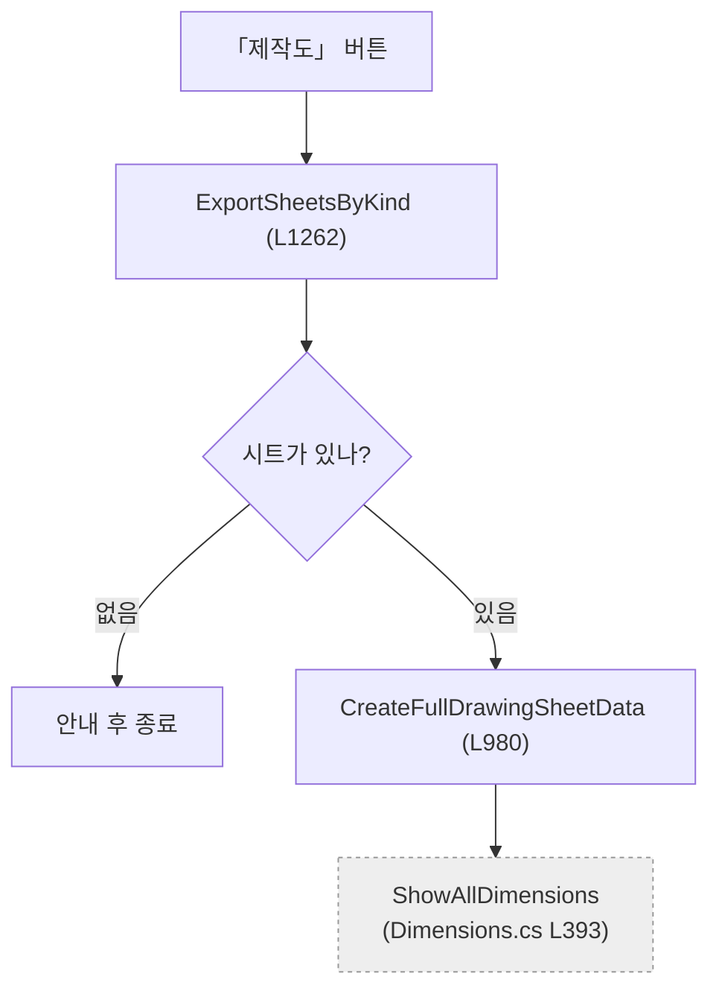

# 코드분석 — 현행 정본

> 📌 **"이 프로그램이 지금 어떻게 되어 있는가"는 이 폴더가 정본입니다.**
> 다른 폴더의 코드 설명 문서(`docs/code-reference/`, `docs/기능/`)는 **폐기 예정**입니다.
> 착수 2026-08-22.

---

## 왜 새로 만들었나

`docs/code-reference/` 11개와 `docs/기능/` 63개가 같은 일을 하고 있었는데 **낡았습니다.**

| | |
|---|---|
| 8월에 바뀐 코드 파일 | **10개** |
| 7월 이후 안 바뀐 문서 | **60개 / 75개 (80%)** |

`CLAUDE.md R1`이 "코드 고치면 문서도 고쳐라"를 강제하고 저장할 때마다 훅이 리마인더까지 띄웠는데도 이렇게 됐습니다. **사람이 손으로 유지해야 하는 문서는 반드시 낡습니다.**

실제 피해가 확인됐습니다 — `form1-dimensions.md`가 `btnShowAxisX_Click` 등 **4개를 "버튼"이라고 설명하고 있는데, 그 버튼은 화면에 없습니다.** 코드베이스 어디에서도 호출되지 않는 죽은 코드입니다. 줄 번호가 맞아서 읽으면 그럴듯하고, 그래서 더 위험합니다.

## 그래서 문서를 성격으로 갈랐습니다

| 성격 | 어디 | 처리 |
|---|---|---|
| **코드에서 다시 뽑을 수 있는 것** | 이 폴더 `자동생성/` | 🤖 스크립트가 만듦 |
| **읽어야만 알 수 있는 것** | 이 폴더 `파일별/` · `알고리즘/` | ✍ 손으로 씀 |
| **사람이 정한 사양** | `docs/기술 노트/` | ✅ 그대로 둠 |
| **개념·용어** | `docs/_glossary.md` | ✅ 그대로 둠 — 코드가 바뀌어도 안 낡는다 |
| **전체 흐름 개괄** | `docs/_pipeline.md` | 🟡 큰 그림은 유효하나 세부는 낡음 (`btnMfgDrawing_Click`은 없는 버튼). 정독 끝나고 갱신 |
| **왜 그렇게 됐나 (이력)** | `docs/tracking-archive/` | 📦 이력으로 보존 |
| **사용자용 매뉴얼** | `docs/사용자-매뉴얼/` | 별개. 손 안 댐 |

---

## 폴더 구성

```
docs/코드분석/
  README.md          ← 지금 이 파일
  generate.py        ← 자동생성/ 을 다시 뽑는 스크립트
  verify.py          ← 문서가 코드와 어긋나지 않는지 검사

  자동생성/           🤖 손으로 고치지 말 것
    버튼별 코드 위치.md
    함수 목록.md
    파일 구조.md

  Codex 작업지시.md  ← Codex는 이 파일 하나만 읽고 시작

  파일별/             ✍ 코드 파일 하나당 문서 하나 (Form1.Dimensions.cs → Form1.Dimensions.md)
  알고리즘/           ✍ 자명하지 않은 계산의 정의
  판정/               ✍ 리팩토링 방안 · 죽은 코드 · 줄 수 근거
  장표/               ✍ 발표 자료
```

### `자동생성/` 이 안 낡는 이유

코드가 바뀌면 **이 한 줄만 다시 돌립니다.**

```bash
python docs/코드분석/generate.py
```

지금까지 문서가 썩은 이유가 정확히 이것 — 손으로 유지해야 했기 때문입니다. 기계가 뽑을 수 있는 건 기계에 맡깁니다.

---

## 읽는 순서

코드를 처음 보거나 오랜만에 볼 때 **위에서부터** 읽으세요. 파일 순서로 읽지 말고 **버튼 순서로** 읽습니다.

1. **[`자동생성/버튼별 코드 위치.md`](./자동생성/버튼별%20코드%20위치.md)**
   화면에서 아는 버튼이 어느 파일 몇 줄로 가는지. **코드를 한 줄도 안 읽고 여기서 시작합니다.**
2. **[`파일별/Form1.md`](./파일별/Form1.md)**
   모든 파일이 함께 쓰는 상태와 공용 기능. 여기서 **뼈대**를 익히면 나머지가 변주로 읽힙니다.
3. **가장 작은 기능 하나를 끝까지** — 예: `X축` 버튼 → `ApplyGlobalView`
4. **심장 하나를 끝까지** — `가공도` 또는 `2D 생성`
5. 나머지는 `파일별/` 에서 필요한 것만

옆에 두고 보는 것:

- **[`자동생성/파일 구조.md`](./자동생성/파일%20구조.md)** — 파일끼리 어떻게 엮이는지
- **[`자동생성/함수 목록.md`](./자동생성/함수%20목록.md)** — "이 함수 다른 데서도 부르나?" 궁금할 때

---

## `파일별/` 문서는 이 틀로 씁니다

도구가 달라도 같은 틀이어야 나중에 합칠 수 있습니다.

> 🎯 **목적은 버그 찾기가 아닙니다.** 플로우차트 · 아키텍처 · **리팩토링 방안**을 만드는 것이 목적입니다.
> 오류가 보이면 적되, 그건 부산물입니다. **"다시 짠다면 어떻게 할 것인가"** 가 결론이어야 합니다.

| 절 | 내용 |
|---|---|
| 1 | **진입점** — 사용자가 무엇을 하면 여기가 도는가 (버튼·메뉴 이름 + 핸들러명) |
| 2 | **실행 흐름** — 🔴 **mermaid 플로우차트 필수** + 번호 단계에 `메서드명 (줄번호)` |
| 3 | **상태** — 읽는 필드 / 쓰는 필드. `Form1.cs` 공유 필드는 ⚠ 표시 |
| 4 | **의존** — SDK API / 다른 파일. **떼어낼 때 무엇이 걸리는지가 여기서 나온다** |
| 5 | **알고리즘** — 자명하지 않은 계산. **지켜야 할 자산이다. 리팩토링해도 이건 살아남아야 한다** |
| 6 | **책임과 결합 — 다시 짠다면** — 🔴 이 파일의 결론 |

### 2절 플로우차트

버튼 하나당 하나씩 그리지 말고, **그 파일의 대표 흐름 1~2개**만 그립니다.
갈래(조건 분기)와 **다른 파일로 넘어가는 지점**이 보여야 합니다.

````markdown

````

**다른 파일로 넘어가는 노드는 회색 점선**으로 표시하세요 (`classDef other`). 리팩토링 경계가 거기입니다.

### 6절 — 다시 짠다면

네 가지를 순서대로 적습니다.

| | |
|---|---|
| **① 이 파일이 지는 책임** | 목록으로. **2개 이상이면 그 자체가 발견입니다** |
| **② 떼어낼 수 있는 것** | 무엇을 · 어디로 · 근거(무엇에도 안 묶여 있는가) |
| **③ 못 떼는 것과 이유** | `Form1` 공유 상태 · SDK 형식 · UI 컨트롤 중 무엇에 묶였나 |
| **④ 지울 것** | 죽은 코드 · 중복 · 안 쓰는 분기 |

추측은 `(추정)`, 확인 못 한 건 `(미확인)`을 붙입니다.

> 📌 **전체 리팩토링 계획은 여기 쓰지 않습니다.** 파일 하나만 보고 정할 수 없습니다.
> 13개가 다 모이면 [`판정/리팩토링 방안.md`](./판정/리팩토링%20방안.md) 한 곳에서 결정합니다.
> 파일별 6절은 그 **입력**입니다.

### 쓰는 순서 — 옛 문서를 나중에 봅니다

```
1. 옛 문서(docs/code-reference/·docs/기능/)를 보지 않는다   ← 틀린 서술에 끌려가지 않으려고
2. 코드를 읽고 새로 쓴다
3. 다 쓴 뒤에 옛 문서를 열어 "빠뜨린 게 있나"만 대조한다
```

**3번을 마지막에 두는 게 핵심입니다.** 먼저 읽으면 검증이 되고, 나중에 읽으면 보강이 됩니다.

---

## 검증 — 3층

문서가 코드와 어긋나면 **낡은 문서를 새로 만든 셈**이 된다. 그래서 검증을 세 층으로 나눈다.

### 1층 · 기계 — `verify.py`

```bash
python docs/코드분석/verify.py            # 전부
python docs/코드분석/verify.py Form1.BOM   # 하나만
```

| 검사 | |
|---|---|
| 줄번호 | 문서의 `` `메서드` (L123) `` 가 실제 선언 위치와 맞나 (±2줄) |
| 파일:줄 | 참조한 줄 번호가 그 파일 길이를 넘지 않나 |
| SDK API | `vizcore3d.….Xxx(` 의 `Xxx` 가 `VIZCore3D.NET.xml` 에 있나 |
| 링크 | 상대 링크의 대상 파일이 있나 |
| 틀 | mermaid 플로우차트 · 6절 제목 · ①②③④ · 부록이 있나 |

**원칙은 "오탐을 내느니 놓친다"** 다. 지적이 시끄러우면 아무도 안 본다.
지역변수·파일명·범위 표기(`L56~62`)·호출 지점 언급은 판단하지 않고 건너뛴다.

> 사람이 볼 필요가 없는 것만 여기서 잡는다. 문서를 고치기 전에 **실제 코드를 먼저 볼 것** — 코드가 바뀌어 문서가 밀린 것일 수 있다.

### 2층 · 교차 — 상대가 쓴 문서를 상대가 아닌 쪽이 본다

**전수 재독은 낭비다.** 1~4절은 기계가 잡으므로 **5절과 6절만** 본다.

| 볼 것 | 어떻게 |
|---|---|
| **5절 알고리즘** | 수식·임계값이 코드와 맞나. 숫자는 `grep` 으로 바로 확인된다 |
| **6절 ②떼어낼 수 있다** | 정말 그런가. **놓친 공유 상태 참조가 없나** → `자동생성/파일 구조.md` 2절과 대조 |
| **6절 ③못 뗀다** | 정말 못 떼나. 주입·반환값으로 풀리는 걸 구조적 한계로 적지 않았나 |
| **2절 플로우차트** | 빠진 갈래가 있나. 특히 **예외·취소·조기 return** |

🔴 **검증 결과를 상대 문서에 직접 쓰지 않는다.** `판정/교차검증.md` 에 모은다.
"한 파일은 한 도구만" 규칙을 지키기 위해서다. 고치는 건 그 문서의 담당자가 한다.

형식은 이렇게 한 줄씩.

```
| 대상 문서 | 절 | 지적 | 근거(파일:줄) | 판정 |
|---|---|---|---|---|
| Form1.BOM.md | 5절 | 임계값 3.0mm 이 아니라 3.0f 상수 없음 | Form1.BOM.cs:412 | 확인 필요 |
```

**판정은 상대가 아니라 담당자가 내린다.** 지적한 쪽은 근거만 댄다.

### 3층 · 통합 — 13개를 모아서

파일 하나씩 볼 때는 안 보이는 것들이다. Claude Code가 맡는다.

- 같은 메서드를 두 문서가 **다르게 설명**하지 않나
- 6절의 "뗄 수 있다"들이 서로 **충돌**하지 않나 (A는 B로 옮기자, B는 A로 옮기자)
- 파일 경계를 넘는 흐름에 **구멍**이 없나 (한쪽은 "여기서 넘어간다", 받는 쪽엔 그 진입점이 없다)

결과가 `판정/리팩토링 방안.md` 가 된다.

## 작업 규칙 (Claude Code · Codex 공통)

1. **코드는 읽기만 합니다.** `A2Z/**` 를 고치지 않습니다
2. **한 파일은 한 도구만** 씁니다. 남의 담당 문서를 건드리지 않습니다
3. **커밋은 Claude Code가 몰아서** 합니다 (같은 작업 트리라 동시 커밋 시 충돌)
4. **SDK API는 추측하지 않습니다.** `VIZCore3D.NET.xml`에서 확인하고, 못 찾으면 `(미확인)`을 붙입니다 → `CLAUDE.md` R10
5. `자동생성/` 은 손으로 고치지 않습니다
6. **문서를 쓴 뒤 `python docs/코드분석/verify.py` 를 돌립니다.** 지적 0건이 되어야 완료입니다

## 담당

| | 파일 | 줄 |
|---|---|---|
| **Claude Code** | DrawingSheets · MfgDrawing · Dimensions · Drawing2D · **Form1** · ExcelTemplate · Models · License | 12,451 + 골격 |
| **Codex** | Clash · GlobalViews · Stru · BOM · Attribute | 5,369 |

Codex 쪽 지시는 [`Codex 작업지시.md`](./Codex%20작업지시.md) 한 파일에 다 있습니다.

---

## 진행 현황

| | 상태 |
|---|---|
| `자동생성/` 3개 | ✅ 2026-08-22 |
| `파일별/Form1.md` | ✅ 2026-08-22 |
| `파일별/Form1.License.md` | ✅ 2026-08-22 |
| `파일별/Form1.ExcelTemplate.md` | ✅ 2026-08-22 |
| `파일별/Models.md` | ✅ 2026-08-22 (`Models.cs` + `Models/MfgViewPose.cs` 합침) |
| `파일별/` 나머지 9개 | ⬜ — Claude 4개(DrawingSheets·MfgDrawing·Dimensions·Drawing2D) · Codex 5개 |
| `알고리즘/` | ⬜ |
| `판정/리팩토링 방안.md` | ⬜ — **파일별 13개가 다 모인 뒤** |
| `판정/죽은 코드.md` | ⬜ |
| `장표/` | ⬜ |
| 옛 문서 75개 정리 | ⬜ **맨 마지막** — 위가 다 끝난 뒤 |

## 최종 산출물 3종

정독이 끝나면 이것들이 나와야 합니다. **파일별 13개는 재료이지 결과가 아닙니다.**

| | 어디 | 무엇 |
|---|---|---|
| **플로우차트** | `파일별/` 각 2절 + `장표/` | 버튼 → 무엇이 → 어떤 순서로 |
| **아키텍처** | `자동생성/파일 구조.md` + `장표/` | 층 구조 · 의존 관계 · 경계 |
| **리팩토링 방안** | `판정/리팩토링 방안.md` | 무엇을 어디로 · 순서 · 위험 |

## 지나가며 나온 것

> 아래는 **부산물**입니다. 목적이 아닙니다.


| | |
|---|---|
| 🔴 | **죽은 핸들러 8개** — 어디에도 배선돼 있지 않음. `Dimensions`의 `btnShowAxisX/Y/Z_Click`·`btnShowISO_Click`, `DrawingSheets`의 `btnDrawingISO/AxisX/AxisY/AxisZ_Click`. 지금 화면의 축·ISO 버튼은 `GlobalViews`로 간다. `docs/기능/치수/` 문서 4개가 죽은 쪽을 설명 중 |
| 🔴🔒 | **사내 라이선스 서버 IP·포트가 공개 저장소에 있다** — `60.100.164.177:8901`. `Form1.License.cs:21` · `STATUS.md` · `issues.json` 3곳 = **총 5곳**. 저장소가 PUBLIC이라 커밋 이력에도 남는다. **사용자 결정 대기** |
| 🔴 | **줌인이 가짜 마우스 휠** — `Form1.DrawingSheets.cs:2020~2044`. 배율 지정 줌 API가 없어 `WM_MOUSEWHEEL` 7회로 3배 확대. SDK에 대체 API가 있는지 확인 필요 |
| 🟠 | **취소가 즉시 안 되는 구조** — 무거운 작업이 UI 스레드에서 돌고 SDK 호출은 못 끊음. 다음 체크포인트에서만 중단 |
| 🟠 | **진단 로그·진행창이 `Form1.cs`에 얹혀 있음** — 독립 기능이라 분리 가능. 빼면 `Form1`이 423회 불리는 이유의 상당 부분이 사라짐 |
| 🟠 | **라이선스 인증 실패 시 "켜졌지만 안 되는" 상태로 남는다** — `BOM.cs:144`의 `return`이 나머지 초기화를 전부 건너뛴다. 오류 창은 한 번 뜨고 사라지고 재시도 수단이 없다 |
| 🟠 | **독립 타입 26개 중 13개만 모델 파일에 있다** — 나머지는 `Form1.*.cs` 안에 흩어짐 |
| 🟠 | **엑셀 빈 칸 처리에 `""`와 `" "`의 차이가 문서 두 곳에서 다르게 읽힌다** — 실기 확인 필요 |
| 🟢 | **SDK 우회 2건 추가 발견** — ① 빈 칸 괘선을 값 유무로 간접 제어(`KeepBorder`) ② 최종 배율을 미리 못 얻어 치수를 지연 목록에 쌓았다 나중에 그림(`MfgPendingDim`). **"왜 이만큼의 코드가 필요한가"의 재료** |
